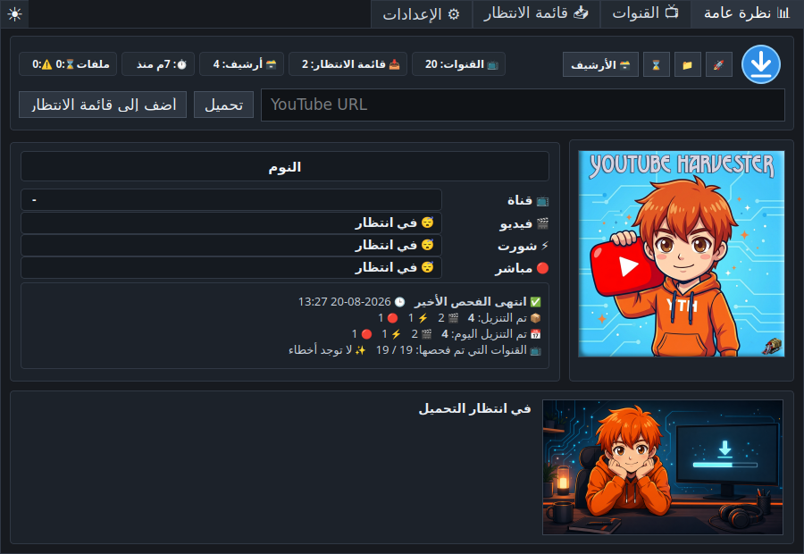
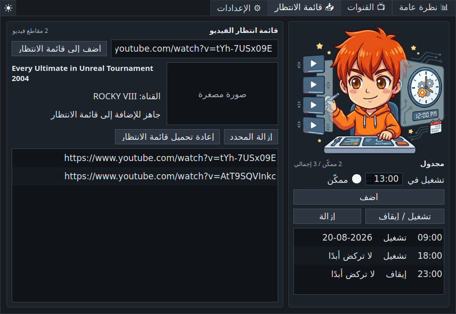
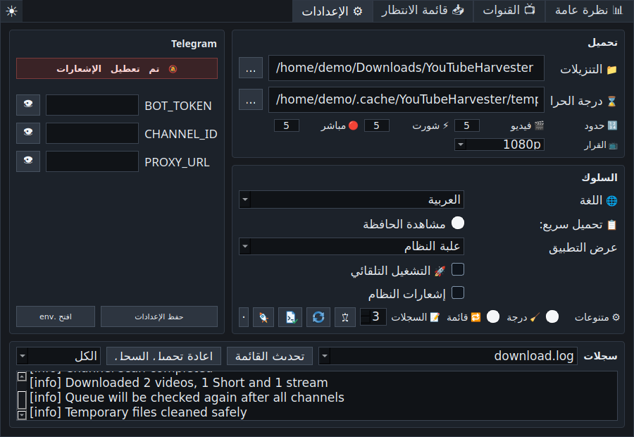

# YouTube Harvester 1.1.0

<p align="center">
  
</p>

<p align="center">
  <a href="README.md">🇺🇸 🇬🇧 English</a> ·
  <a href="README.ru.md">🇷🇺 Русский</a> ·
  <a href="README.uk.md">🇺🇦 Українська</a> ·
  <a href="README.fr.md">🇫🇷 Français</a> ·
  <a href="README.es.md">🇪🇸 Español</a> ·
  <a href="README.hi.md">🇮🇳 हिन्दी</a> ·
  <a href="README.zh.md">🇨🇳 中文</a> ·
  <a href="README.ar.md">🇸🇦 العربية</a>
</p>

<p align="center" dir="rtl">
  برنامج متعدد اللغات لتنزيل YouTube على Linux وWindows، مع مراقبة القنوات
  وقائمة انتظار يدوية وتنزيل سريع وجدولة وأرشيف وإرسال اختياري إلى Telegram.
</p>



## نبذة عن البرنامج

يتابع **YouTube Harvester** قنوات YouTube المحددة وينزّل الفيديوهات الجديدة
وShorts والبث المباشر بواسطة `yt-dlp`. ويمكنه أيضًا معالجة روابط منفردة،
والاحتفاظ بأرشيف محلي، وعرض تقارير التنزيل، وإرسال الإشعارات أو الملفات إلى
Telegram.

يستخدم الإصدار `1.1.0` محرك Python على Linux وWindows. بقي محرك Bash القديم في
المصدر فقط كشيفرة قديمة معطلة.

## الميزات الرئيسية

- نظرة مباشرة على تقدم القنوات ونوع الوسائط ومرحلة التنزيل والسرعة والوقت
  المتبقي والحجم والأحداث وإجماليات الجلسة واليوم.
- بطاقات قنوات بصورها الأصلية المحفوظة في الذاكرة المؤقتة ومفاتيح منفصلة
  للفيديوهات وShorts والبث المباشر.
- فحص اختياري للمحتوى المدفوع بثلاث حالات: غير معروف، تم العثور على members-only،
  أو لم يُعثر عليه أثناء الفحص.
- حقل URL في صفحة النظرة العامة للتنزيل الفوري أو الإضافة إلى قائمة الانتظار.
- قائمة فيديوهات تعرض العنوان والقناة والصورة المصغرة، وتتحقق من التكرار
  والأرشيف، وتدعم إعادة المحاولة والمعالجة الثانية بعد فحص جميع القنوات.
- نافذة تنزيل سريع تقرأ رابط الحافظة وتعرض البيانات وتختار الدقة، مع تنزيل فوري
  وإضافة إلى القائمة وخيار Telegram محفوظ.
- اختصار عام قابل للتعديل، والقيمة الافتراضية `Ctrl+Shift+Alt+Y`.
- مراقبة اختيارية للحافظة وفتح التنزيل السريع عند ظهور رابط YouTube صالح.
- مجدول للتشغيل التلقائي في ساعات محددة.
- أرشيف مفصل يضم النوع والقناة والعنوان والتاريخ ورابط YouTube والملف المحلي
  والمجلد وحذف السجل.
- سجلات بمرشحات الكل والمهم والأخطاء.
- فحص إصدار `yt-dlp` وتشخيص النظام وX11/Wayland وعلبة النظام والاختصار والأدوات
  والمسارات والذاكرة المؤقتة وإذن الكتابة ومساحة القرص.
- سمات داكنة وفاتحة ومطابقة للنظام.
- بدء التشغيل في علبة النظام فقط، أو شريط المهام فقط، أو كليهما.
- إيقاف آمن وتنظيف محمي للملفات المؤقتة وأسماء آمنة لـWindows ومعالجة UTF-8
  الصحيحة في سجلات وأرشيف Windows.
- الإنجليزية افتراضيًا، مع الروسية والأوكرانية والفرنسية والإسبانية والهندية
  والصينية والعربية.

## لقطات الشاشة

| النظرة العامة | القنوات |
| --- | --- |
|  |  |

| قائمة الانتظار والمجدول | الإعدادات والسجلات |
| --- | --- |
|  |  |

## التنزيلات

تُنشر الحزم في
[GitHub Releases](https://github.com/LiberVixer/YouTubeHarvester/releases).

Linux: `YouTubeHarvester_1.1.0_linux_all.deb` و
`YouTubeHarvester_1.1.0_source.tar.gz` و`SHA256SUMS-linux.txt`.

Windows: `YouTubeHarvester_1.1.0_windows_setup.exe` و
`YouTubeHarvester_1.1.0_windows_x64.msi` و
`YouTubeHarvester_1.1.0_windows_portable.zip` و`SHA256SUMS-windows.txt`.

تتضمن حزم Windows الأدوات `yt-dlp` و`ffmpeg.exe` و`ffprobe.exe` و`deno.exe`.

## التثبيت على Linux

```bash
sudo apt install ./YouTubeHarvester_1.1.0_linux_all.deb
yt-harvester
```

مسارات المستخدم:

- البيانات: `~/.local/share/yt-harvester`
- الإعدادات: `~/.config/yt-harvester`
- الذاكرة المؤقتة: `~/.cache/yt-harvester`
- Telegram: `~/.config/yt-harvester/.env`
- الملفات المؤقتة: `~/temp/YTH`
- التنزيلات: `~/Downloads/YouTubeHarvester`

## التثبيت على Windows

اختر Setup EXE أو MSI أو ملف ZIP المحمول من صفحة الإصدار. هذه الحزم مستقلة ولا
تحتاج إلى تثبيت Python أوFFmpeg أوDeno بشكل منفصل. يستخدم التشغيل التلقائي
المسار `HKCU\Software\Microsoft\Windows\CurrentVersion\Run`.

## التشغيل من المصدر

Linux:

```bash
sudo apt install python3 python3-pyqt5 python3-pynput yt-dlp ffmpeg curl
sudo apt install wl-clipboard  # موصى به لـ Wayland
cp .env.example .env
./start_tray.sh
```

Windows:

```powershell
py -3 -m venv .venv
.\.venv\Scripts\python -m pip install -r requirements.txt
.\start_tray_windows.bat
```

استخدم [دليل بناء Windows دون اتصال](docs/windows-offline-build.md) عند ضعف
اتصال الإنترنت.

## خيارات التشغيل

```bash
yt-harvester
yt-harvester --quick-download
yt-harvester --start-tray
yt-harvester --start-window
yt-harvester --start-both
```

يفتح `--quick-download` نافذة التنزيل السريع ويمرر الطلب إلى النسخة العاملة.
تحدد الخيارات الأخرى علبة النظام أو شريط المهام أو كليهما. الخيارات الداخلية:
`--run-yt-dlp ...` و`--run-script <script.py> ...`.

## التنزيل السريع وX11 وWayland

يستخدم Windows اختصارًا عامًا أصليًا، ويستخدم Linux/X11 مكتبة `pynput`.
يمنع Wayland عادة تسجيل المفاتيح العامة مباشرة، لذلك يستطيع البرنامج إنشاء
اختصار نظام Cinnamon/GNOME لتشغيل `yt-harvester --quick-download`. تُقرأ حافظة
Wayland عبر `wl-paste` عند تثبيت `wl-clipboard`.

## القنوات وقائمة الانتظار

تُفحص أقسام القناة المفعلة بالتتابع مع توقف قصير بعد كل نتيجة مكتملة. يُبحث عن
members-only أثناء الفحص الصريح للقنوات إذا كان الخيار مفعّلًا. وإذا ظهر فيديو
للأعضاء أثناء الفحص العادي، تتحدث حالة القناة ويظهر الحدث ضمن المهم دون خطأ
أحمر.

تُعالج قائمة الانتظار في البداية ثم مرة أخرى بعد جميع القنوات. تُتخطى الروابط
المكررة والفيديوهات المؤرشفة، ويمكن إعادة العنصر الفاشل للمحاولة لاحقًا.

## Telegram

يمكن تعطيل Telegram بالكامل. لاستخدامه، املأ الواجهة أو ملف `.env`:

```bash
BOT_TOKEN=your-telegram-bot-token
CHANNEL_ID=your-telegram-channel-id
PROXY_URL=127.0.0.1:9050
```

الوكيل اختياري. لا يؤدي فشل Telegram إلى حذف فيديو حُفظ محليًا بنجاح.

## بناء الإصدار

```bash
packaging/build_release.sh 1.1.0 1.1.0
```

```powershell
powershell -ExecutionPolicy Bypass -File .\packaging\windows\build_release.ps1 `
  -Version 1.1.0 -MsiVersion 1.1.0
```

## الاستخدام المسؤول

لا يرتبط YouTube Harvester بـYouTube أوGoogle أوTelegram أو`yt-dlp`. نزّل فقط
المحتوى الذي تملكه أو لديك إذن به أو يمكنك حفظه قانونيًا للاستخدام الشخصي.
التزم [بشروط YouTube](https://www.youtube.com/t/terms) وحقوق النشر وقوانين بلدك،
وحافظ على سرية بيانات Telegram.

المكونات الخارجية: [`yt-dlp`](https://github.com/yt-dlp/yt-dlp) وPyQt5/Qt
وFFmpeg/FFprobe وDeno و`curl` وTelegram Bot API و`pynput`، ولكل منها ترخيصه.

## شكر وتقدير

شكر خاص إلى Dmitry **'Minion' Pororiliy** على مساعدته القيّمة في الاختبار
التجريبي لإصدار Windows.

أُضيف Harvester من **Command & Conquer: Red Alert** إلى شعار البرنامج. 🙂

راجع [سجل التغييرات العربي](CHANGELOG.ar.md) للتاريخ الكامل.
