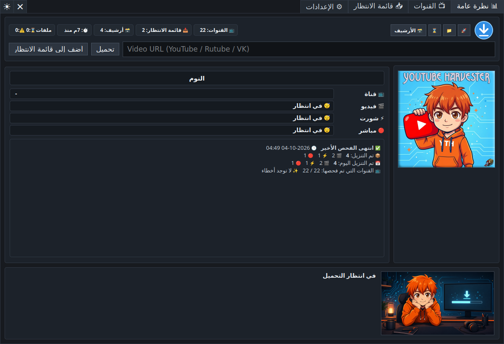
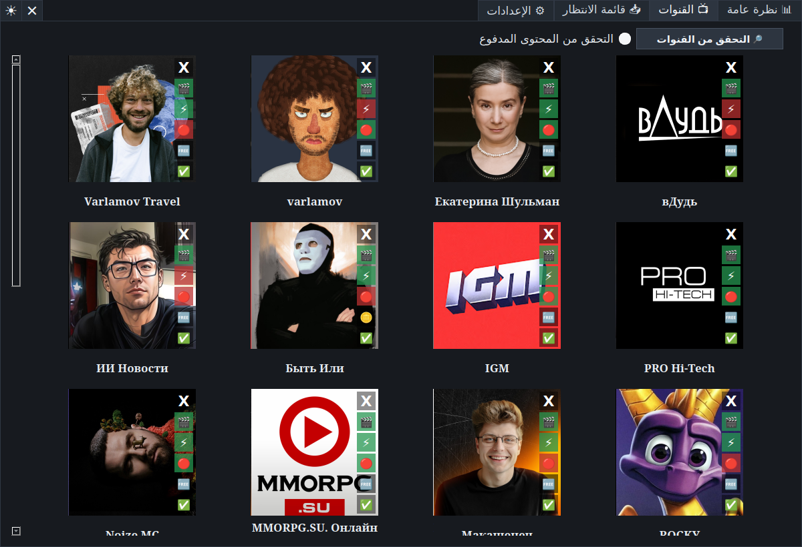
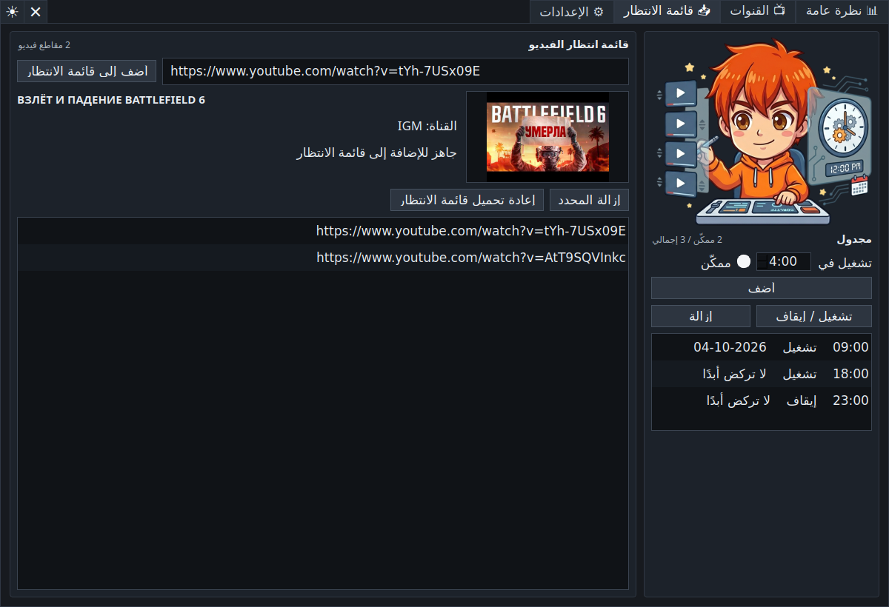
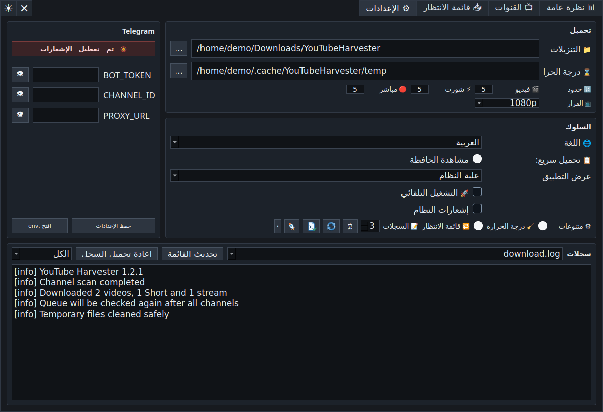
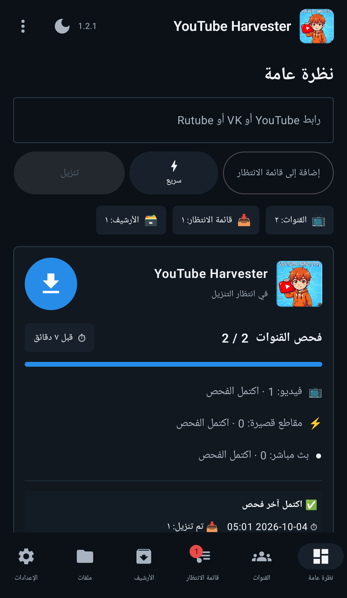
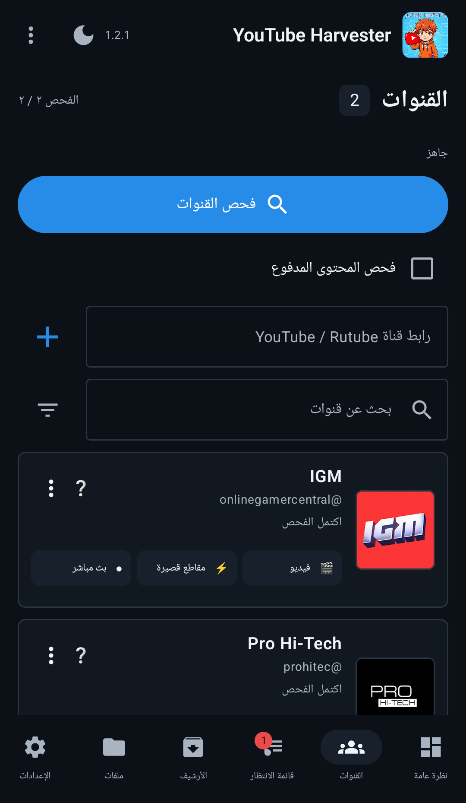
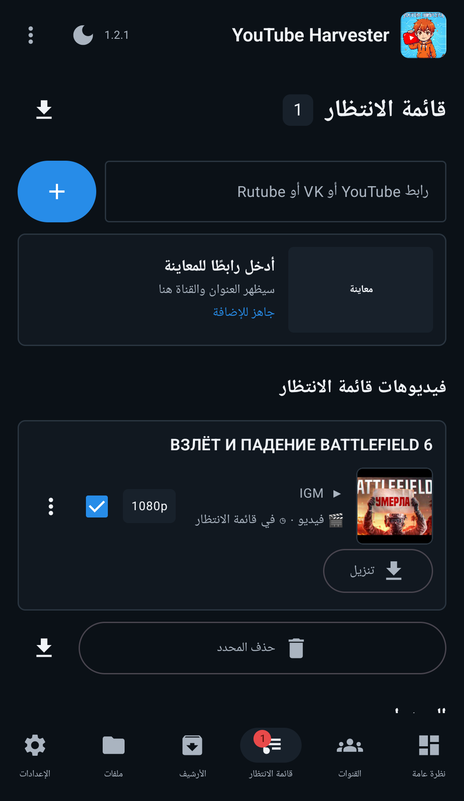
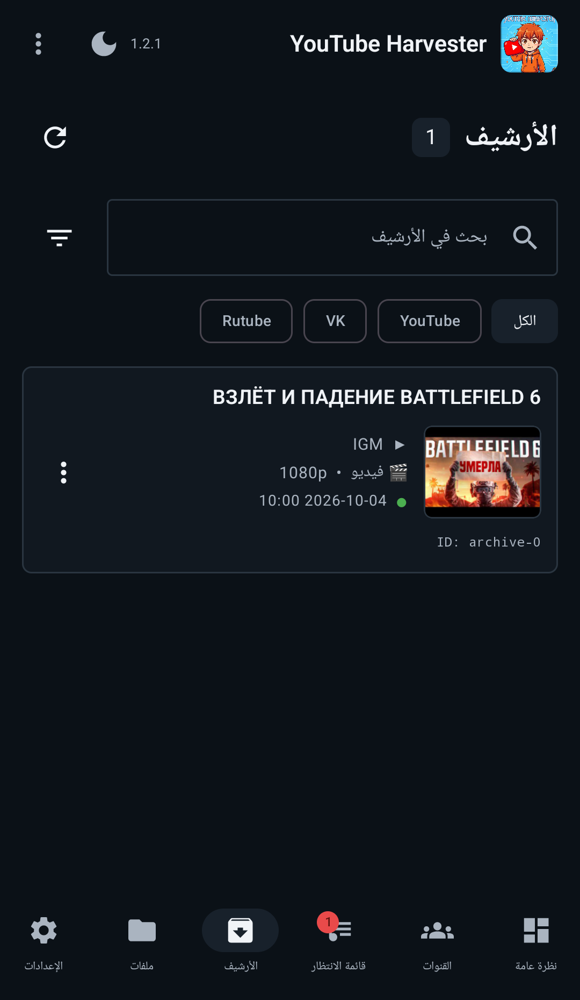
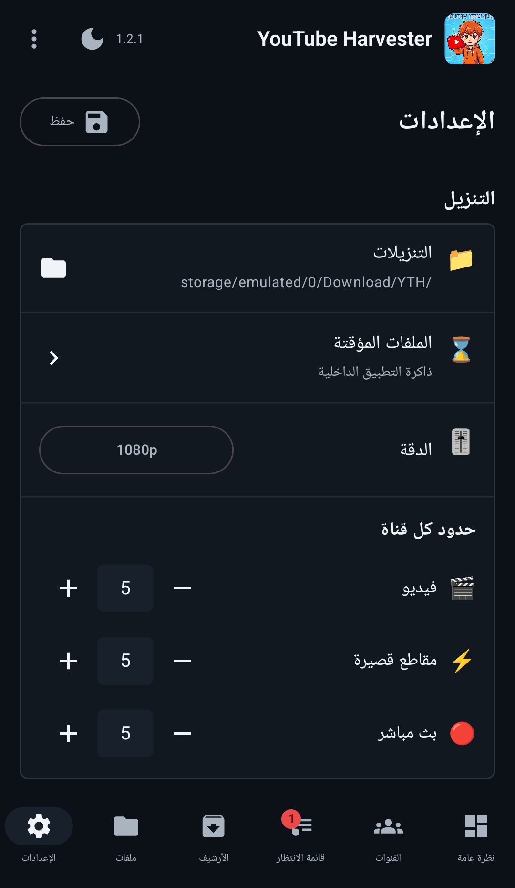

# YouTube Harvester 1.2.1

<p align="center">
  
</p>

<p align="center">
  <a href="README.md">🇺🇸 🇬🇧 English</a> ·
  <a href="README.ru.md">🇷🇺 Русский</a> ·
  <a href="README.uk.md">🇺🇦 Українська</a> ·
  <a href="README.be.md">🇧🇾 Беларуская</a> ·
  <a href="README.fr.md">🇫🇷 Français</a> ·
  <a href="README.es.md">🇪🇸 Español</a> ·
  <a href="README.hi.md">🇮🇳 हिन्दी</a> ·
  <a href="README.zh.md">🇨🇳 中文</a> ·
  <a href="README.ja.md">🇯🇵 日本語</a> ·
  <a href="README.ar.md">🇸🇦 العربية</a>
</p>

<p dir="rtl">
برنامج متعدد اللغات لـ **Linux وWindows وAndroid**: متابعة قنوات YouTube وRutube، تنزيل فيديوهات منفردة من YouTube/Rutube/VK، قائمة انتظار وأرشيف وجدولة، وإرسال اختياري للملفات أو الإشعارات إلى Telegram.
</p>

## الإصدار 1.2.1

تحديث الوثائق: **2026-10-04**.

المصادر والحزم المحلية الحالية هي **1.2.1** دون beta/prerelease. Android يستخدم `versionCode 120100`؛ النسخ الداخلية تحتفظ بـ `-debug`. أعيد بناء Windows من المصادر الحالية نفسها المستخدمة في Linux، بما فيها Rutube والتعافي بعد قطع التنزيل.

**إعداد للإصدار وليس إعلان نشر.** بُنيت مثبتات الحاسوب وأربعة APK اختبار محليًا. قبول الإصدار العام لـ Android لم يكتمل؛ APK الاختبار تحتفظ بشهادة التطوير. حذف beta من الرقم لا يجعلها إصدارات عامة.

Linux وWindows يستخدمان محرك Python/yt-dlp نفسه؛ محرك Bash القديم محفوظ كشيفرة قديمة معطلة فقط.

[التحقق من الإصدار](docs/version-1.2.1-20261003.md) · [إعداد 1.2.1](docs/releases/1.2.1.md).

## ميزات نسخة الحاسوب

- نظرة مباشرة على تقدم القنوات ونوع الوسائط ومرحلة التنزيل والسرعة والوقت
  المتبقي والحجم والأحداث وإجماليات الجلسة واليوم.
- بطاقات قنوات بصورها الأصلية المحفوظة في الذاكرة المؤقتة ومفاتيح منفصلة
  للفيديوهات وShorts والبث المباشر.
- فحص اختياري للمحتوى المدفوع بثلاث حالات: غير معروف، تم العثور على members-only،
  أو لم يُعثر عليه أثناء الفحص.
- حقل URL في صفحة النظرة العامة للتنزيل الفوري أو الإضافة إلى قائمة الانتظار.
- قائمة فيديوهات تعرض العنوان والقناة والصورة المصغرة، وتتحقق من التكرار
  والأرشيف، وتدعم إعادة المحاولة والمعالجة الثانية بعد فحص جميع القنوات.
- نافذة تنزيل سريع تقرأ رابط الحافظة وتعرض البيانات وتختار الدقة وعدة مسارات
  صوت وترجمة، مع تنزيل فوري وإضافة إلى القائمة وخيار Telegram محفوظ.
- اختصار عام قابل للتعديل، والقيمة الافتراضية `Ctrl+Shift+Alt+Y`.
- مراقبة اختيارية للحافظة وفتح التنزيل السريع عند ظهور رابط مدعوم من YouTube
  أو Rutube أو VK.
- مجدول للتشغيل التلقائي في ساعات محددة.
- أرشيف مفصل يضم النوع والقناة والعنوان والتاريخ ورابط المصدر ونسخ الجودة
  والمسارات والملف المحلي والمجلد وحذف السجل.
- سجلات بمرشحات الكل والمهم والأخطاء.
- تحديث موثوق للتطبيق من إصدارات GitHub الرسمية للنسخ المثبتة والمحمولة وحزم Linux.
- فحص `yt-dlp` وتحديثه بأمان من الواجهة، مع تشخيص النظام وX11/Wayland وعلبة النظام والاختصار والأدوات
  والمسارات والذاكرة المؤقتة وإذن الكتابة ومساحة القرص.
- سمات داكنة وفاتحة ومطابقة للنظام.
- بدء التشغيل في علبة النظام فقط، أو شريط المهام فقط، أو كليهما.
- إيقاف آمن وتنظيف محمي للملفات المؤقتة وأسماء آمنة لـWindows ومعالجة UTF-8
  الصحيحة في سجلات وأرشيف Windows.
- الإنجليزية افتراضيًا، مع الروسية والأوكرانية والبيلاروسية والفرنسية
  والإسبانية والهندية والصينية واليابانية والعربية.

## المصادر وتسلسل العمل

- **قنوات YouTube:** فيديوهات وShorts وبث مباشر، مفاتيح وحدود مستقلة؛ روابط handle/channel/user/custom.
- **قنوات Rutube:** `/channel/ID/` و`/u/name/`، ومنها صفحات الفيديوهات/Shorts. تحويل الأسماء إلى ID لمنع التكرار؛ تخزين الاسم والصورة مؤقتًا.
- **برامج Rutube:** `/metainfo/tv/ID/`، عنوان وملصق خاصان، فيديوهات فقط؛ أحدث N عناصر من الجديد إلى القديم.
- **الفيديوهات المنفردة:** YouTube وRutube وVK/VK Video عبر الحقل اليدوي أو القائمة أو التنزيل السريع. لا متابعة لقنوات VK ولا قوائم Rutube عشوائية.

فحص البث والمحتوى المدفوع معطل في Rutube. اكتشاف المدفوع في YouTube يبلغ عن الإتاحة، ولا يتجاوز القيود أو يضمن تنزيل فيديو محجوب. قائمة القناة تتيح تعليم أحدث العناصر كمعالجة دون تنزيل.

الدورة الكاملة: القائمة اليدوية، ثم الأقسام المفعلة وتنزيلها بالتتابع، ثم القائمة مجددًا. تُتخطى العناصر المؤرشفة والمكررة. فحص تبويب القنوات يتحقق من الأقسام؛ الدورة تبدأ من النظرة العامة أو المجدول. الأرشيف يحفظ اختلافات الجودة والمسارات.

إيقاف تنزيل الحاسوب لا يمنع بدء التنزيل التالي. تنظيف مؤقت محمي وإعادة المحاولة محفوظان؛ لا تحذف المؤقتات أثناء التنزيل. عند فشل المصدر/VPN/الوكيل افحص الاتصال والسجلات أولًا. تظل قيود المنطقة والحساب والبروتوكول مطبقة.

## Android

تطبيق أصلي Kotlin/Jetpack Compose لـ **Android 8.0+ (API 26)**؛ ABI: `arm64-v8a` و`armeabi-v7a` و`x86_64` و`x86`.

- النظرة العامة والقنوات والانتظار والأرشيف والإعدادات وفتح مجلد التنزيل؛ عشر لغات، سمات داكنة/فاتحة/نظام، وعربية RTL.
- فئات المصادر نفسها، بما فيها قنوات وبرامج Rutube؛ حدود وتعليم حديث وجدولة وبيانات وصور.
- تنزيل URL المدخل فورًا؛ زر السريع يقرأ الحافظة فقط عند النقر الصريح. المشاركة تفتح الخيارات، والاختصار يفتح النظرة العامة؛ مراقبة الحافظة اختيارية والتطبيق في المقدمة فقط.
- دقة وعدة مسارات صوت وترجمة، مهام محفوظة، إيقاف مؤقت/استئناف/إلغاء/إعادة، إشعارات وforeground-service. الاستئناف يحتفظ بالمهمة والملفات الجزئية؛ استمرار البايتات يتوقف على المصدر.
- تعافي WorkManager وتقارير وإجماليات يومية واستعادة بعد الإقلاع، MediaStore/SAF، ملفات الأرشيف وسجلات وتشخيص. افتح التطبيق بعد إيقاف Android القسري؛ قيود بطارية الشركة قد تؤثر في الخلفية.
- Telegram ببيانات اعتماد محمية بـ Android Keystore. `.ythbackup` مشفر بكلمة مرور ينقل السجلات والإعدادات، **لا الفيديوهات أو المؤقتات**. الاستيراد يتطلب قاعدة فارغة؛ الملفات المنقولة تحتاج إعادة ربط مجلدات مع تحقق.
- تحديث APK يتحقق من SHA-256 والحزمة وversionCode أعلى والشهادة المثبتة قبل مثبت Android. `yt-dlp` يحدث **مع التطبيق** وليس باستبدال منفصل للمحرك.

**VK على Android:** تنزيل الفيديوهات المنفردة VK/VK Video مدعوم؛ تحقق تنزيل VK عام فعليًا على LDPlayer بتاريخ 2026-09-14. لا متابعة لقنوات VK. الفيديوهات الخاصة أو المقيدة قد تكون غير متاحة.

[دليل Android](android/README.md) · [تعليمات نقل البيانات](android/DATA-TRANSFER.ru.md).

## حالة إصدار Android

قبل النشر: إكمال التوقيع الدائم ونسخة مستقلة للمفتاح، مصادر runtime الأصلية المطابقة وتراخيصها ومراجعة الأمان، قبول الترحيل على المرشح الموقع بعينه، اختبارات ARM وAndroid القديم المدعوم وAndroid 15+ boot/resume وصفحات 16 KB وTalkBack. ثم تحقق APK النهائية والتغليف.

**لا تزل تطبيق الاختبار لتغيير الشهادة.** جُرب النقل المشفر في حزمة QA معزولة، وليس بديلًا عن قبول المرشح العام النهائي.

[جاهزية الإصدار](android/RELEASE-READINESS.ru.md).

## لقطات الشاشة

| النظرة العامة | القنوات |
| --- | --- |
|  |  |

| قائمة الانتظار والمجدول | الإعدادات والسجلات |
| --- | --- |
|  |  |

### Android

Android 1.2.1، السمة الداكنة. بيانات توضيحية.

| النظرة العامة | القنوات |
| --- | --- |
|  |  |

| قائمة الانتظار | الأرشيف |
| --- | --- |
|  |  |

**الإعدادات**



[فهرس اللقطات ومصدرها](docs/screenshots/README.md).

## التنزيلات

ملفات الحاسوب المحلية في `dist/release/`. بعد النشر تتاح عبر [GitHub Releases](https://github.com/LiberVixer/YouTubeHarvester/releases)؛ هذا README لا يدعي أن 1.2.1 منشور بالفعل.

| المنصة | الملفات |
| --- | --- |
| Linux | `YouTubeHarvester_1.2.1_linux_all.deb`, `YouTubeHarvester_1.2.1_source.tar.gz`, `SHA256SUMS-linux.txt` |
| Windows x64 | `YouTubeHarvester_1.2.1_windows_setup.exe`, `YouTubeHarvester_1.2.1_windows_x64.msi`, `YouTubeHarvester_1.2.1_windows_portable.zip`, `SHA256SUMS-windows.txt` |

APK اختبار خاصة: `android/YouTubeHarvester-1.2.1-<ABI>.apk`، **ليست ملفات إصدار عام**. تغليف Android العام يحتاج مصادر التطبيق/runtime وBUILD-INFO وSHA256SUMS أيضًا.

## التثبيت على Linux

```bash
sudo apt install ./YouTubeHarvester_1.2.1_linux_all.deb
yt-harvester
```

مسارات المستخدم:

- البيانات: `~/.local/share/yt-harvester`
- الإعدادات: `~/.config/yt-harvester`
- الذاكرة المؤقتة: `~/.cache/yt-harvester`
- Telegram: `~/.config/yt-harvester/.env`
- الملفات المؤقتة: `~/temp/YTH`
- التنزيلات: `~/Downloads/YouTubeHarvester`

`.deb` يستخدم حزم التوزيعة Python/Qt/yt-dlp/FFmpeg/curl دون تحديث صامت. الإصدارات قد تختلف عن بيئة التطوير وWindows. Deno مقترح وغير مضمن؛ دعم YouTube الكامل يحتاج runtime JavaScript متوافقًا.

## التثبيت على Windows

استخدم x64 Setup EXE/MSI أو فك portable ZIP وشغل `YouTubeHarvester.exe`. Python وyt-dlp وFFmpeg/FFprobe وDeno مضمنة. البيانات/الكاش: `%LOCALAPPDATA%\YouTubeHarvester`؛ الإعدادات: `%APPDATA%\YouTubeHarvester`؛ المؤقتات: `%TEMP%\YTH`. بدء التشغيل يستخدم مفتاح المستخدم `HKCU\Software\Microsoft\Windows\CurrentVersion\Run`.

## تثبيت Android وتحديثه

للاختبار المصرح اختر ABI الصحيح وحدث بالشهادة نفسها دون إزالة التطبيق أو مسح البيانات. اسمح فقط بمصدر تثبيت موثوق، والإشعارات عند الحاجة، واختر المجلد. الافتراضي `Download/YTH` أو مجلد SAF. APK بتوقيع مختلف لا يستطيع استبدال نسخة الاختبار الحالية.

## التشغيل من المصدر

Linux يستخدم `.venv` إن وجد؛ `YTD_PYTHON` يختار مفسرًا آخر. البيئات المقفلة مختبرة بـ Python 3.12. FFmpeg/FFprobe وruntime JavaScript خارجيان؛ السكربت أدناه يجلب Deno/FFmpeg بعد التحقق من البصمات.

اجلب الأدوات فقط إن كانت غائبة: السكربت يرفض استبدال المجلدات الموجودة. احتفظ بـ `.env` الحالي وأدخل Telegram في التطبيق أو ملفك. لا تنشر الملف.

Linux:

```bash
sudo apt install python3 python3-venv python3-pyqt5 python3-pynput python3-dbus ffmpeg curl
python3 -m venv .venv
.venv/bin/python -m pip install -r requirements-linux-lock.txt
.venv/bin/python scripts/fetch_desktop_tools.py --platform linux --output tools/linux
cp -n .env.example .env
./start_tray.sh
```

مصادر Windows تحتاج FFmpeg/FFprobe وDeno أيضًا؛ البناء يستخدم الأدوات المحلية المثبتة الإصدار أو ينزلها ويتحقق منها.

Windows:

```powershell
py -3.12 -m venv .venv
.\.venv\Scripts\python -m pip install -r requirements-windows-lock.txt
.\.venv\Scripts\python scripts/fetch_desktop_tools.py --platform windows --output tools/windows
.\start_tray_windows.bat
```

[التشغيل من المصدر Windows (offline)](docs/windows-offline-build.md).

## خيارات التشغيل

```bash
yt-harvester
yt-harvester --quick-download
yt-harvester --show-main
yt-harvester --start-tray
yt-harvester --start-window
yt-harvester --start-both
```

يفتح `--quick-download` نافذة التنزيل السريع ويمرر الطلب إلى النسخة العاملة.
يعرض `--show-main` النافذة الرئيسية لتلك النسخة. تحدد الخيارات الأخرى علبة
النظام أو شريط المهام أو كليهما. الخيارات الداخلية:
`--run-yt-dlp ...` و`--run-script <script.py> ...`.

## التنزيل السريع وX11 وWayland

يستخدم Windows اختصارًا عامًا أصليًا، ويستخدم Linux/X11 مكتبة `pynput`.
يمنع Wayland عادة تسجيل المفاتيح العامة مباشرة، لذلك يستطيع البرنامج إنشاء
اختصار نظام Cinnamon/GNOME لتشغيل `yt-harvester --quick-download`. تُقرأ حافظة
Wayland عبر `wl-paste` عند تثبيت `wl-clipboard`.

## Telegram

يمكن تعطيل Telegram بالكامل. لاستخدامه، املأ الواجهة أو ملف `.env`:

```bash
BOT_TOKEN=your-telegram-bot-token
CHANNEL_ID=your-telegram-channel-id
PROXY_URL=127.0.0.1:9050
```

الوكيل اختياري. لا يؤدي فشل Telegram إلى حذف فيديو حُفظ محليًا بنجاح.

## المكونات المثبتة الإصدار

هذه إصدارات المشروع المراجعة، لا ضمان لكل نسخة مثبتة ولا ادعاء بأحدث upstream. تبعيات الحاسوب: `requirements-linux-lock.txt` و`requirements-windows-lock.txt`. Android: `android/runtime.properties` و`android/gradle/verification-metadata.xml`.

| المكون | تطوير الحاسوب / Windows | Android |
| --- | --- | --- |
| yt-dlp | 2026.08.19 | 2026.08.19 |
| FFmpeg / FFprobe | 9.0.2 | 7.1.1 |
| Deno / QuickJS | Deno 2.9.7 | QuickJS 2026-06-04 |
| PyQt5 / Compose BOM | PyQt5 5.15.11 | Compose 2026.09.00 |
| Qt runtime | Linux 5.15.19 / Windows 5.15.2 | - |
| Room / WorkManager | - | 2.8.5 / 2.12.0 |
| Coil | - | 3.6.3 |
| PyInstaller / AGP / Gradle | PyInstaller 6.22.3 | AGP 9.4.1 / Gradle 9.8.0 |
| Kotlin Compose compiler / KSP | - | 2.4.20 / 2.3.12 |

Android يحتفظ بـ Python 3.12.11 وOpenSSL 3.5.2 وFFmpeg 7.1.1 upstream؛ إعادة بناء متوافقة ومراجعة مصادر مطابقة ما زالتا مطلوبتين. QuickJS 2026-06-04 وWebP/SharpYUV 1.6.0 أعيد بناؤهما لأربعة ABI بمحاذاة 16 KB. التحقق الساكن لا يغني عن جهاز 16 KB.

[سجل تحديث المكونات](docs/component-update-20261003.md) · [إعادة بناء المكونات الأصلية](android/native/README.md).

## بناء الإصدار

وسوم الحاسوب `v*`؛ Android `android-v<versionName>` ومسار مستقل. التوقيع العام يحتاج الشهادة الدائمة المعتمدة ومصادر runtime المطابقة المراجعة. لا تنشر المفاتيح أو كلمات المرور أو الرموز أو APK غير الموقعة/الخاصة.

Linux:

```bash
packaging/build_release.sh 1.2.1 1.2.1
```

Windows:

```powershell
powershell -ExecutionPolicy Bypass -File .\packaging\windows\build_release.ps1 `
  -Version 1.2.1 -MsiVersion 1.2.1
```

Android (JDK 17, Android SDK, Gradle Wrapper):

```bash
cd android
./gradlew testDebugUnitTest assembleDebug
python3 -m unittest discover -s scripts -p 'test_*.py' -v
```

[قواعد نشر Android وتوقيعه](android/RELEASING.md)

## التحقق والحدود

أحدث الاختبارات المحلية: **88 Python للحاسوب** و**35 Python لـ Android** و**149 JVM لـ Android**، وتصوير 50 شاشة Android بنجاح. توحيد النسخة مر أيضًا بـ **80 اختبار Windows** (تخطي اثنين POSIX) و**36 اختبار LDPlayer مختارًا**، Android 14/API 34 x86_64.

تحققت أدوات الحاسوب وتنزيل/remux محلي حقيقي H.264/AAC. أربعة APK اجتازت بيان/شهادة/ZIP ومحاذاة 64 بت المطبقة. لا تثبت هذه الجولات تشغيل ARM أو الخلفية على كل جهاز أو تثبيت/إزالة مثبتات Windows الجديدة. تحديث الوثائق لا يعيد بناء النسخ المثبتة أو ينشرها.

[خطة اختبارات Android](android/TEST-PLAN.ru.md).

## التراخيص والاستخدام المسؤول

**وحدة Android مرخصة GPL-3.0-only** بموافقة المالك: [LICENSE](android/LICENSE) و[NOTICE](android/NOTICE) و[القرار](android/legal/README.md). لا تتغير تراخيص الحاسوب أو الأطراف الثالثة. حزمة مصادر runtime المطابقة الكاملة مطلوبة للنشر العام.

لا ارتباط مع YouTube أو Google أو Rutube أو VK أو Telegram أو yt-dlp. نزّل فقط المحتوى الذي يحق لك الحصول عليه واحترم شروط المصادر والقوانين. احتفظ بالاعتمادات وكلمات مرور النسخ الخاصة بسرية.

## شكر وتقدير

شكر خاص إلى Dmitry **'Minion' Pororiliy** على مساعدته القيّمة في الاختبار
التجريبي لإصدار Windows.

أُضيف Harvester من **Command & Conquer: Red Alert** إلى شعار البرنامج. 🙂

راجع [سجل التغييرات العربي](CHANGELOG.ar.md) للتاريخ الكامل.
