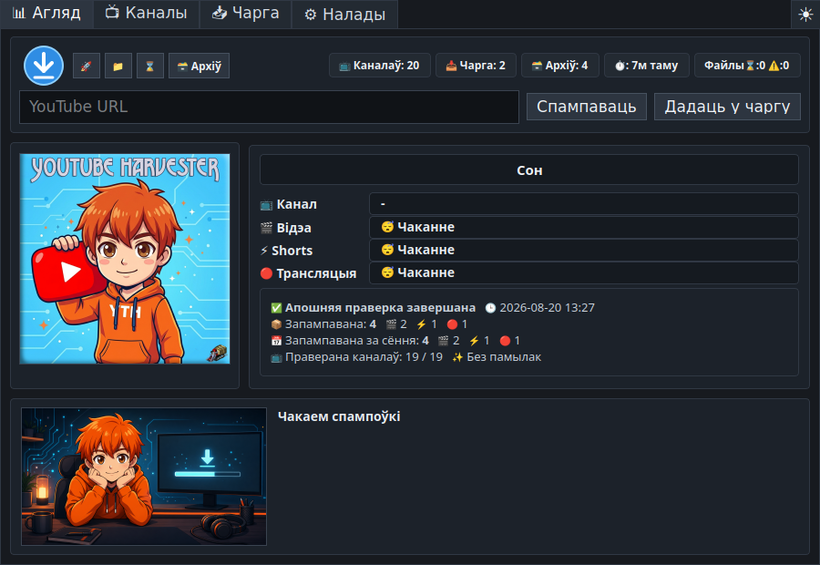
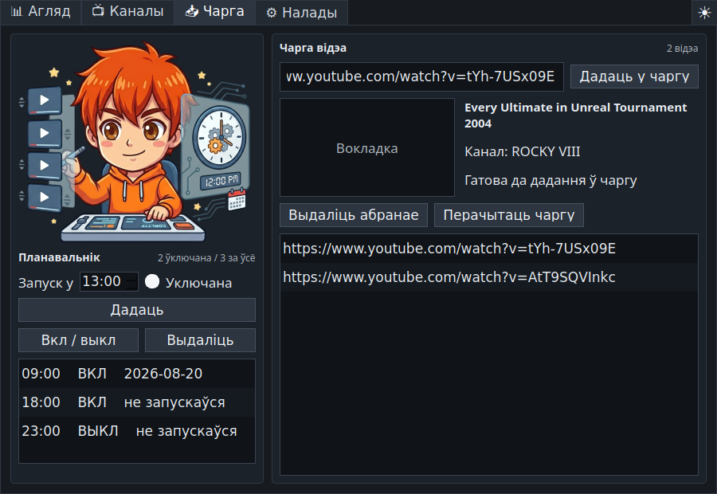
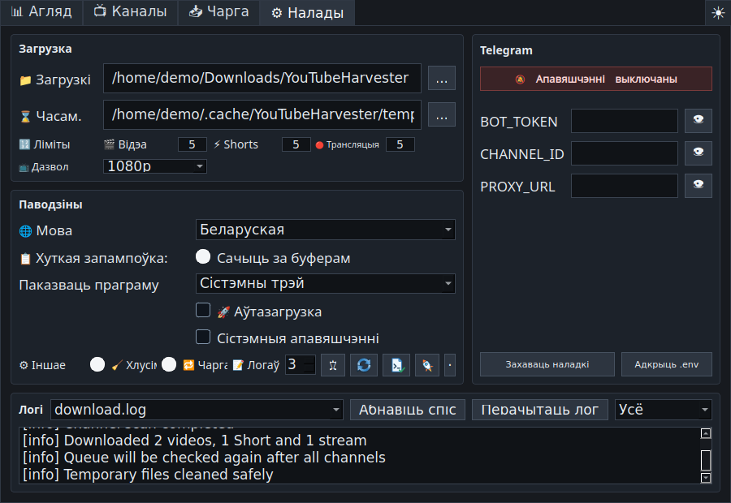

# YouTube Harvester 1.1.3

<p align="center">
  
</p>

<p align="center">
  <a href="README.md">🇺🇸 🇬🇧 English</a> ·
  <a href="README.ru.md">🇷🇺 Русский</a> ·
  <a href="README.uk.md">🇺🇦 Українська</a> ·
  <a href="README.be.md">🇧🇾 Беларуская</a> ·
  <a href="README.fr.md">🇫🇷 Français</a> ·
  <a href="README.es.md">🇪🇸 Español</a> ·
  <a href="README.hi.md">🇮🇳 हिन्दी</a> ·
  <a href="README.zh.md">🇨🇳 中文</a> ·
  <a href="README.ja.md">🇯🇵 日本語</a> ·
  <a href="README.ar.md">🇸🇦 العربية</a>
</p>

<p align="center">
  Шматмоўная праграма для спампоўвання YouTube у Linux і Windows: назіранне
  за каналамі, ручная чарга, хуткае спампоўванне, расклад, архіў і
  неабавязковая адпраўка ў Telegram.
</p>

> **UPD 2:** Хуткае спампоўванне ўбудоўвае некалькі аўдыядарожак і субцітраў
> у адно відэа. Архіў адрознівае варыянты паводле якасці і дарожак, памылка
> асобных субцітраў не адмяняе спампоўванне, дададзена японская лакалізацыя.

> **UPD 3:** Версія 1.1.3 дадае праверанае абнаўленне праграмы з афіцыйных
> рэлізаў GitHub, поўную беларускую лакалізацыю і дакументацыю. Убудаваны
> загрузчык абноўлены да `yt-dlp 2026.08.19`, а аднаўленне пасля часовых
> памылак YouTube HTTP 403 стала надзейнейшым.



## Што робіць праграма

**YouTube Harvester** назірае за выбранымі YouTube-каналамі і спампоўвае новыя
відэа, Shorts і трансляцыі праз `yt-dlp`. Можна дадаваць асобныя спасылкі,
весці лакальны архіў, праглядаць справаздачы і адпраўляць апавяшчэнні або файлы
ў Telegram.

Версія `1.1.3` выкарыстоўвае Python-рухавік у Linux і Windows. Стары
Bash-рухавік застаўся ў зыходным кодзе толькі як адключаны састарэлы кампанент.

## Асноўныя магчымасці

- Жывы агляд прагрэсу каналаў, тыпу медыя, этапу спампоўвання, хуткасці,
  астатняга часу, памеру, апошніх падзей і вынікаў сеанса ды дня.
- Карткі каналаў з арыгінальнымі кэшаванымі выявамі і асобнымі пераключальнікамі
  для відэа, Shorts і трансляцый.
- Неабавязковая праверка платнага кантэнту са станамі: невядома, знойдзены
  members-only або members-only не знойдзены падчас праверкі.
- Ручное поле URL на ўкладцы «Агляд» для неадкладнага спампоўвання або
  дадання ў чаргу.
- Чарга з назвай, каналам, мініяцюрай, праверкай дублікатаў і архіва,
  паўторнымі спробамі і другім праходам пасля праверкі ўсіх каналаў.
- Акно хуткага спампоўвання з URL з буфера, метаданымі, выбарам раздзяляльнасці,
  некалькіх аўдыядарожак і субцітраў, неадкладным спампоўваннем, чаргой і
  захаваным параметрам Telegram.
- Наладжвальная глабальная гарачая клавіша; стандартна `Ctrl+Shift+Alt+Y`.
- Назіранне за буферам абмену з адкрыццём хуткага спампоўвання для сапраўднага
  YouTube URL.
- Планіроўшчык аўтаматычных запускаў у выбраныя гадзіны.
- Падрабязны архіў з тыпам, каналам, назвай, датай, спасылкай YouTube,
  варыянтамі якасці і дарожак, лакальным файлам, папкай і выдаленнем запісу.
- Журналы з фільтрамі «Усё», «Важнае» і «Памылкі».
- Праверанае абнаўленне праграмы з афіцыйных рэлізаў GitHub для ўсталяванай,
  партатыўнай і Linux-версіі.
- Бяспечная праверка і абнаўленне `yt-dlp` з інтэрфейса, а таксама дыягностыка
  АС, X11/Wayland, трэя, гарачай клавішы, інструментаў, шляхоў, кэша, доступу
  да запісу і вольнага месца.
- Цёмная, светлая і сістэмная тэмы.
- Запуск толькі ў сістэмным трэі, толькі на панэлі задач або ў абодвух месцах.
- Бяспечны прыпынак, абароненая ачыстка часовых файлаў, бяспечныя для Windows
  імёны і карэктны UTF-8 у журналах і архіве.
- Англійская мова стандартна; даступныя таксама руская, украінская,
  беларуская, французская, іспанская, хіндзі, кітайская, японская і арабская.

## Здымкі экрана

| Агляд | Каналы |
| --- | --- |
|  |  |

| Чарга і планіроўшчык | Налады і журналы |
| --- | --- |
|  |  |

## Спампоўкі

Гатовыя пакеты публікуюцца ў
[GitHub Releases](https://github.com/LiberVixer/YouTubeHarvester/releases).

Linux:

- `YouTubeHarvester_1.1.3_linux_all.deb`
- `YouTubeHarvester_1.1.3_source.tar.gz`
- `SHA256SUMS-linux.txt`

Windows:

- `YouTubeHarvester_1.1.3_windows_setup.exe` — звычайны ўсталёўшчык.
- `YouTubeHarvester_1.1.3_windows_x64.msi` — пакет MSI для x64.
- `YouTubeHarvester_1.1.3_windows_portable.zip` — партатыўная зборка.
- `SHA256SUMS-windows.txt`

У Windows-пакеты ўключаны `yt-dlp`, `ffmpeg.exe`, `ffprobe.exe` і `deno.exe`.

## Усталяванне ў Linux

```bash
sudo apt install ./YouTubeHarvester_1.1.3_linux_all.deb
```

Запусціце праграму з меню або камандай:

```bash
yt-harvester
```

Пакет `.deb` выкарыстоўвае стандартныя карыстальніцкія шляхі:

- даныя: `~/.local/share/yt-harvester`
- налады: `~/.config/yt-harvester`
- кэш: `~/.cache/yt-harvester`
- налады Telegram: `~/.config/yt-harvester/.env`
- стандартная часовая папка: `~/temp/YTH`
- стандартная папка спамповак: `~/Downloads/YouTubeHarvester`

## Усталяванне ў Windows

Выберыце Setup EXE, MSI або партатыўны ZIP у рэлізе. Усталяваныя і партатыўныя
зборкі аўтаномныя: асобна ўсталёўваць Python, FFmpeg або Deno не трэба.

Аўтазапуск выкарыстоўвае ключ рэестра бягучага карыстальніка:

```text
HKCU\Software\Microsoft\Windows\CurrentVersion\Run
```

## Запуск з зыходнага кода

Linux:

```bash
sudo apt install python3 python3-pyqt5 python3-pynput yt-dlp ffmpeg curl
# Рэкамендуецца для назірання за буферам у Wayland:
sudo apt install wl-clipboard
cp .env.example .env
./start_tray.sh
```

Windows:

```powershell
py -3 -m venv .venv
.\.venv\Scripts\python -m pip install -r requirements.txt
.\start_tray_windows.bat
```

Для нестабільнага інтэрнэту глядзіце
[інструкцыю па афлайн-зборцы Windows](docs/windows-offline-build.md).

## Ключы запуску

```bash
yt-harvester
yt-harvester --quick-download
yt-harvester --show-main
yt-harvester --start-tray
yt-harvester --start-window
yt-harvester --start-both
```

- `--quick-download` адкрывае хуткае спампоўванне і перадае запыт ужо
  запушчанаму асобніку.
- `--show-main` адкрывае або падымае галоўнае акно запушчанага асобніка.
- `--start-tray` запускае праграму толькі ў сістэмным трэі.
- `--start-window` запускае звычайнае акно на панэлі задач.
- `--start-both` уключае адначасова трэй і панэль задач.

Унутраныя ключы пакетных зборак: `--run-yt-dlp ...` і
`--run-script <script.py> ...`.

## Хуткае спампоўванне, X11 і Wayland

Windows выкарыстоўвае ўласную глабальную гарачую клавішу. Linux/X11
выкарыстоўвае `pynput`. Wayland звычайна забараняе праграмам рэгістраваць
глабальныя клавішы, таму YouTube Harvester можа стварыць сістэмны ярлык
Cinnamon/GNOME для каманды `yt-harvester --quick-download`.

Хуткае спампоўванне заўсёды даступнае з меню трэя і ўкладкі «Агляд».
Назіранне за буферам у Wayland працуе праз `wl-paste`, калі ўсталяваны
`wl-clipboard`.

## Каналы і чарга

Праграма паслядоўна правярае ўключаныя раздзелы канала і пасля кожнага
завершанага раздзела робіць кароткую паўзу, каб вынік быў бачны. Пошук платнага
кантэнту выконваецца толькі падчас асобнай праверкі каналаў, калі ён уключаны.
Калі members-only сустракаецца падчас звычайнай спампоўкі, статус канала ўсё
роўна абнаўляецца, а недаступны элемент паказваецца як важная падзея без
чырвонай памылкі.

Чарга апрацоўваецца перад праверкай каналаў і паўторна пасля яе. Запісы, якія
ўжо ёсць у архіве, і дублікаты прапускаюцца. Няўдалую задачу можна вярнуць для
паўторнай спробы.

## Telegram

Дастаўку ў Telegram можна цалкам адключыць. Пры ўключэнні наладзьце яе ў
інтэрфейсе або файле `.env`:

```bash
BOT_TOKEN=your-telegram-bot-token
CHANNEL_ID=your-telegram-channel-id
PROXY_URL=127.0.0.1:9050
```

`PROXY_URL` неабавязковы. Памылка Telegram ніколі не выдаляе паспяхова
захаванае лакальнае відэа.

## Зборка рэліза

Linux:

```bash
packaging/build_release.sh 1.1.3 1.1.3
```

Windows:

```powershell
powershell -ExecutionPolicy Bypass -File .\packaging\windows\build_release.ps1 `
  -Version 1.1.3 -MsiVersion 1.1.3
```

GitHub Actions збірае Linux- і Windows-артэфакты для тэгаў `v*`.

## Адказнае выкарыстанне

YouTube Harvester не звязаны з YouTube, Google, Telegram або `yt-dlp`.
Спампоўвайце толькі матэрыялы, на якія ў вас ёсць правы, дазвол аўтара або
законныя падставы для асабістага выкарыстання. Выконвайце
[Умовы выкарыстання YouTube](https://www.youtube.com/t/terms), аўтарскае права
і законы сваёй краіны. Захоўвайце ў сакрэце ўліковыя даныя Telegram.

Знешнія кампаненты: [`yt-dlp`](https://github.com/yt-dlp/yt-dlp), PyQt5/Qt,
FFmpeg/FFprobe, Deno, `curl`, Telegram Bot API і `pynput`. Кожны кампанент мае
ўласную ліцэнзію і ўмовы.

## Падзяка

Асаблівая падзяка Дзмітрыю **'Minion' Погорилому** за неацэнную дапамогу ў
бэта-тэсціраванні Windows-версіі.

Harvester з **Command & Conquer: Red Alert** дададзены на лагатып праграмы. 🙂

Поўная гісторыя змяненняў знаходзіцца ў
[беларускай гісторыі змяненняў](CHANGELOG.be.md).
