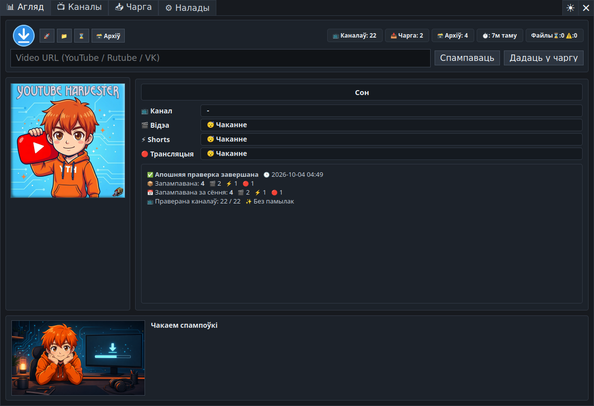
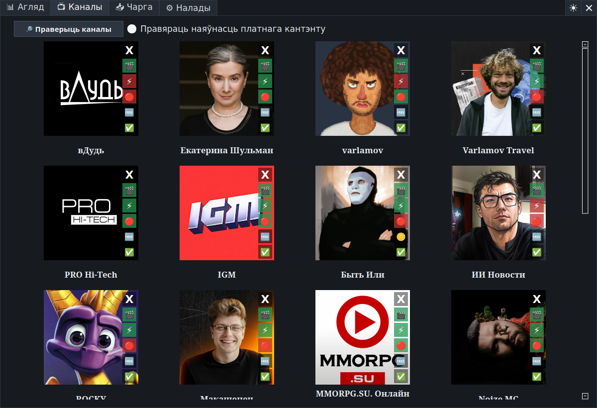
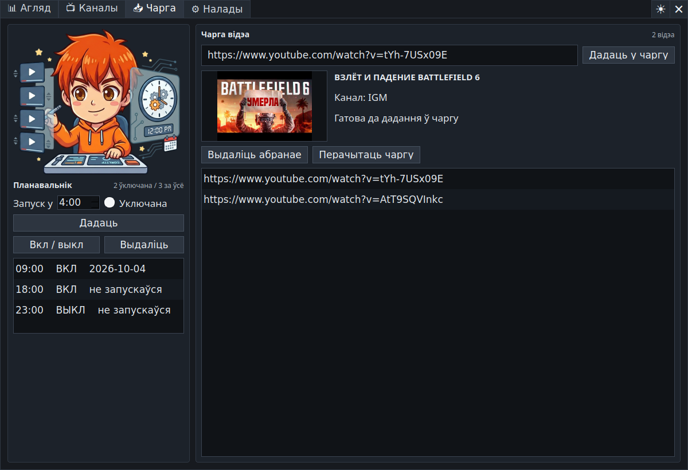
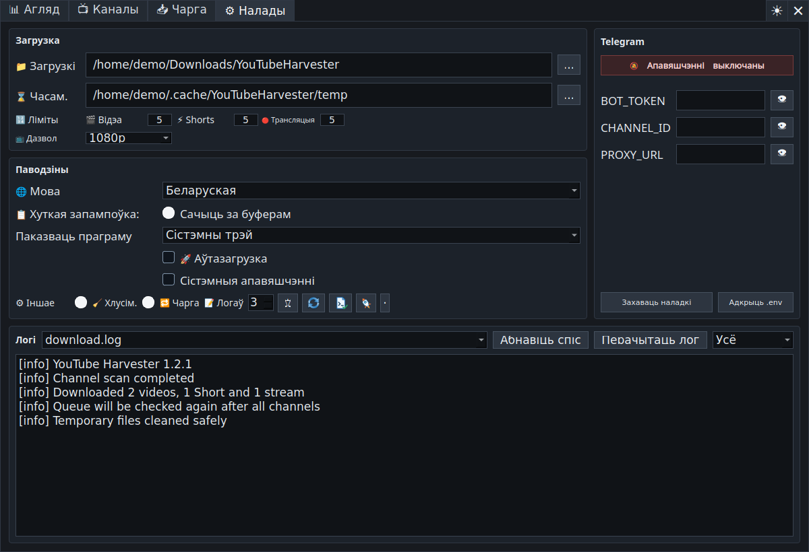
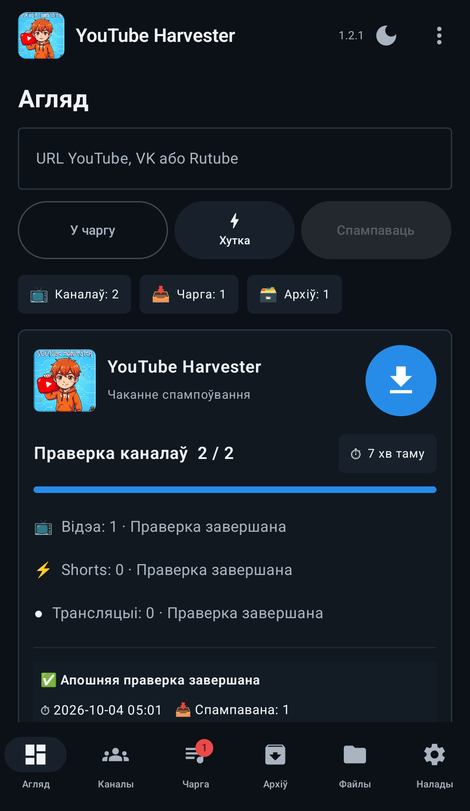
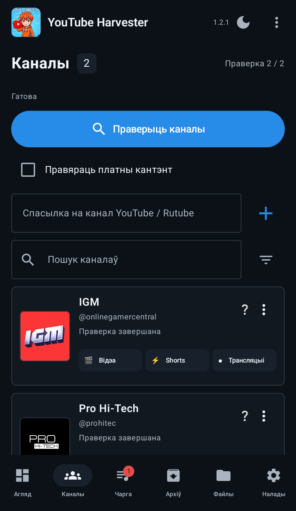
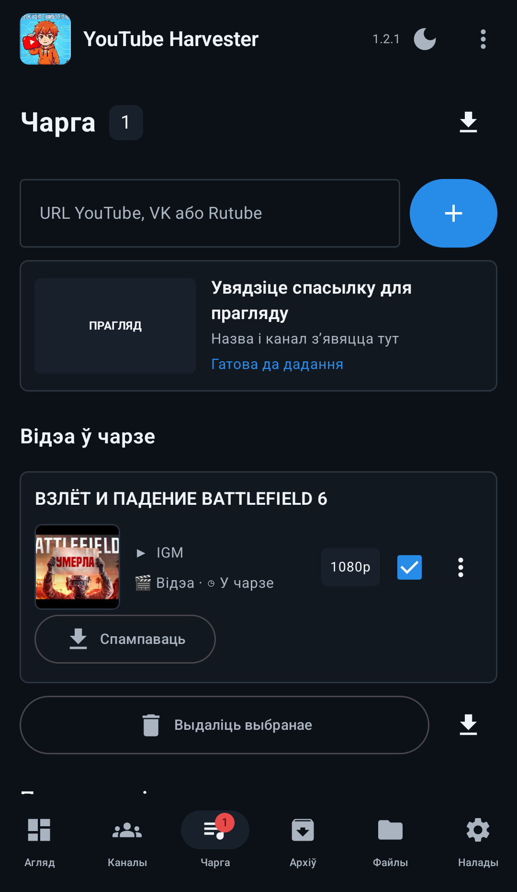
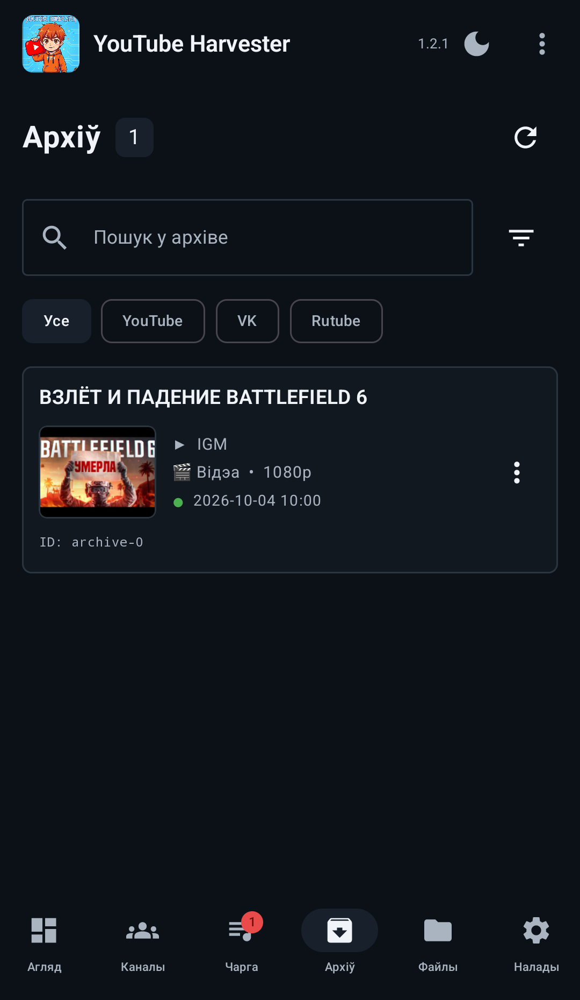
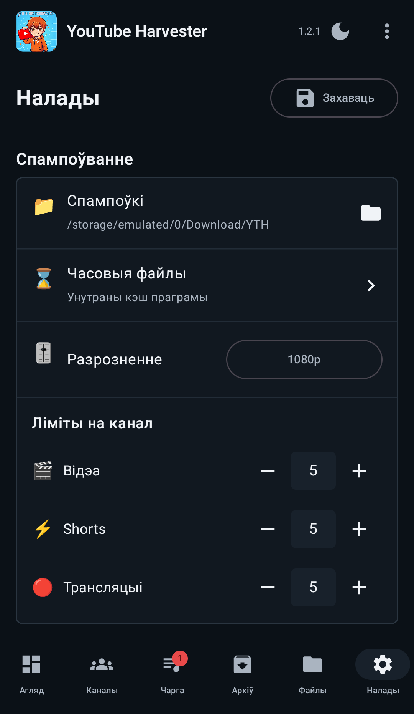

# YouTube Harvester 1.2.1

<p align="center">
  
</p>

<p align="center">
  <a href="README.md">🇺🇸 🇬🇧 English</a> ·
  <a href="README.ru.md">🇷🇺 Русский</a> ·
  <a href="README.uk.md">🇺🇦 Українська</a> ·
  <a href="README.be.md">🇧🇾 Беларуская</a> ·
  <a href="README.fr.md">🇫🇷 Français</a> ·
  <a href="README.es.md">🇪🇸 Español</a> ·
  <a href="README.hi.md">🇮🇳 हिन्दी</a> ·
  <a href="README.zh.md">🇨🇳 中文</a> ·
  <a href="README.ja.md">🇯🇵 日本語</a> ·
  <a href="README.ar.md">🇸🇦 العربية</a>
</p>

Шматмоўная праграма для **Linux, Windows і Android**: назіранне за каналамі YouTube і Rutube, спампоўванне асобных відэа YouTube/Rutube/VK, чарга, архіў, расклад і неабавязковая адпраўка файлаў або паведамленняў у Telegram.

## Версія 1.2.1

Дакументацыя абноўлена: **2026-10-04**.

Актуальныя зыходнікі і лакальныя зборкі маюць **1.2.1** без beta/prerelease. Android: `versionCode 120100`; унутраныя debug-зборкі захоўваюць `-debug`. Windows перасабраны з тых жа зыходнікаў для ПК, што і Linux, з Rutube і аднаўленнем пасля перапынення спампоўвання.

**Гэта падрыхтоўка рэліза, не абвестка публікацыі.** Усталёўшчыкі ПК і чатыры тэставыя Android APK сабраны лакальна. Прыёмка публічнага Android-рэліза не завершана; тэставыя APK захоўваюць development-сертыфікат. Адсутнасць beta ў нумары не робіць іх публічнымі зборкамі.

Linux і Windows выкарыстоўваюць агульны Python/yt-dlp-рухавік; стары Bash пакінуты толькі як адключаны састарэлы код.

[Праверка версіі](docs/version-1.2.1-20261003.md) · [Падрыхтоўка 1.2.1](docs/releases/1.2.1.md).

## Магчымасці версіі для ПК

- Жывы агляд прагрэсу каналаў, тыпу медыя, этапу спампоўвання, хуткасці,
  астатняга часу, памеру, апошніх падзей і вынікаў сеанса ды дня.
- Карткі каналаў з арыгінальнымі кэшаванымі выявамі і асобнымі пераключальнікамі
  для відэа, Shorts і трансляцый.
- Неабавязковая праверка платнага кантэнту са станамі: невядома, знойдзены
  members-only або members-only не знойдзены падчас праверкі.
- Ручное поле URL на ўкладцы «Агляд» для неадкладнага спампоўвання або
  дадання ў чаргу.
- Чарга з назвай, каналам, мініяцюрай, праверкай дублікатаў і архіва,
  паўторнымі спробамі і другім праходам пасля праверкі ўсіх каналаў.
- Акно хуткага спампоўвання з URL з буфера, метаданымі, выбарам раздзяляльнасці,
  некалькіх аўдыядарожак і субцітраў, неадкладным спампоўваннем, чаргой і
  захаваным параметрам Telegram.
- Наладжвальная глабальная гарачая клавіша; стандартна `Ctrl+Shift+Alt+Y`.
- Назіранне за буферам абмену з адкрыццём хуткага спампоўвання для
  падтрымліваемай спасылкі YouTube, Rutube або VK.
- Планіроўшчык аўтаматычных запускаў у выбраныя гадзіны.
- Падрабязны архіў з тыпам, каналам, назвай, датай, спасылкай на крыніцу,
  варыянтамі якасці і дарожак, лакальным файлам, папкай і выдаленнем запісу.
- Журналы з фільтрамі «Усё», «Важнае» і «Памылкі».
- Праверанае абнаўленне праграмы з афіцыйных рэлізаў GitHub для ўсталяванай,
  партатыўнай і Linux-версіі.
- Бяспечная праверка і абнаўленне `yt-dlp` з інтэрфейса, а таксама дыягностыка
  АС, X11/Wayland, трэя, гарачай клавішы, інструментаў, шляхоў, кэша, доступу
  да запісу і вольнага месца.
- Цёмная, светлая і сістэмная тэмы.
- Запуск толькі ў сістэмным трэі, толькі на панэлі задач або ў абодвух месцах.
- Бяспечны прыпынак, абароненая ачыстка часовых файлаў, бяспечныя для Windows
  імёны і карэктны UTF-8 у журналах і архіве.
- Англійская мова стандартна; даступныя таксама руская, украінская,
  беларуская, французская, іспанская, хіндзі, кітайская, японская і арабская.

## Крыніцы і парадак працы

- **Каналы YouTube:** Відэа, Shorts і Трансляцыі з асобнымі пераключальнікамі і лімітамі; адрасы handle, channel, user і custom URL.
- **Каналы Rutube:** `/channel/ID/` і `/u/name/`, уключаючы Відэа/Shorts. Імянныя адрасы прыводзяцца да ID супраць дубляў; назвы і выявы кэшуюцца.
- **Шоу Rutube:** `/metainfo/tv/ID/`, уласная назва і постар, толькі Відэа; апошнія N запісаў ад новых да старых.
- **Асобныя відэа:** YouTube, Rutube і VK/VK Video у ручным полі, чарзе і хуткім спампоўванні. Каналы VK і адвольныя плэйлісты Rutube не падтрымліваюцца.

Праверка трансляцый і платнага кантэнту Rutube адключана. Выяўленне платнага кантэнту YouTube паведамляе пра даступнасць, не абыходзіць абмежаванні і не гарантуе спампоўванне закрытага відэа. Меню канала дазваляе пазначыць апошнія запісы апрацаванымі без спампоўвання.

Поўны цыкл: ручная чарга, уключаныя раздзелы каналаў з паслядоўным спампоўваннем, паўторная чарга. Архіўныя запісы і дублі прапускаюцца. Праверка ў «Каналах» правярае раздзелы; поўны цыкл запускаецца з «Агляду» або паводле раскладу. Архіў захоўвае варыянты якасці і дарожак.

Спыненне спампоўвання на ПК больш не блакуе новы запуск. Захаваны абароненая ачыстка temp і паўторы; не выдаляйце часовыя файлы падчас працы. Пры збоі крыніцы, VPN ці проксі спачатку праверце злучэнне і логі. Рэгіянальныя, уліковыя і пратакольныя абмежаванні застаюцца.

## Android

Натыўны Kotlin/Jetpack Compose для **Android 8.0+ (API 26)**. ABI: `arm64-v8a`, `armeabi-v7a`, `x86_64`, `x86`.

- Агляд, Каналы, Чарга, Архіў, Налады і адкрыццё папкі спамповак; дзесяць моў, цёмная/светлая/сістэмная тэмы, арабская RTL.
- Тыя ж катэгорыі крыніц, каналы і шоу Rutube; ліміты, пазначэнне апошніх запісаў, расклад, метаданыя і выявы.
- Неадкладнае спампоўванне ўведзенага URL; «Хутка» ў Аглядзе чытае спасылку з буфера толькі пры відавочным націсканні. «Падзяліцца» адкрывае параметры. Ярлык адкрывае Агляд; назіранне за буферам толькі ў адкрытай праграме.
- Раздзяляльнасць, некалькі аўдыядарожак і субтытраў, захаваныя заданні, паўза/працяг/адмена/паўтор, паведамленні і foreground-service. Працяг захоўвае заданне і частковыя файлы; дакачванне байтаў залежыць ад крыніцы.
- WorkManager аднаўляе цыкл; справаздачы, дзённыя вынікі, аднаўленне пасля перазагрузкі, MediaStore/SAF, файлы архіва, логі і дыягностыка. Пасля прымусовага спынення Android адкрыйце праграму; абмежаванні батарэі вытворцы могуць уплываць на фон.
- Telegram з абаронай рэквізітаў Android Keystore. Парольны `.ythbackup` пераносіць запісы/налады, **не відэа і temp**. Імпарт патрабуе пустой базы; файлы трэба праверана перапрывязаць да папак.
- Абнаўленне APK правярае SHA-256, пакет, большы versionCode і ўсталяваны сертыфікат перад сістэмным усталёўшчыкам. Убудаваны `yt-dlp` абнаўляецца **разам з праграмай**, не асобнай заменай.

**VK у Android:** асобныя відэа VK/VK Video падтрымліваюцца; рэальнае спампоўванне публічнага VK-відэа праверана на LDPlayer 2026-09-14. Назірання за каналамі VK няма. Закрытыя ці абмежаваныя відэа могуць быць недаступныя.

[Дакументацыя Android](android/README.md) · [Інструкцыя пераносу](android/DATA-TRANSFER.ru.md).

## Статус рэліза Android

Да публікацыі: завяршыць праверкі пастаяннага подпісу і незалежнай копіі ключа; падрыхтаваць адпаведныя зыходнікі runtime, ліцэнзіі і аўдыт бяспекі; прыняць міграцыю на дакладным падпісаным кандыдаце; праверыць ARM, стары падтрыманы Android, Android 15+ boot/resume, 16-КБ старонкі і TalkBack. Потым праверыць фінальныя APK і ўпакоўку.

**Не выдаляйце ўсталяваную тэставую версію** для змены сертыфіката. Шыфраваны перанос правераны ў асобным QA-пакеце, не ў фінальным публічным кандыдаце.

[Гатоўнасць рэліза](android/RELEASE-READINESS.ru.md).

## Здымкі экрана

| Агляд | Каналы |
| --- | --- |
|  |  |

| Чарга і планіроўшчык | Налады і журналы |
| --- | --- |
|  |  |

### Android

Android 1.2.1, цёмная тэма. Дэманстрацыйныя даныя.

| Агляд | Каналы |
| --- | --- |
|  |  |

| Чарга | Архіў |
| --- | --- |
|  |  |

**Налады**



[Каталог і паходжанне здымкаў](docs/screenshots/README.md).

## Спампоўкі

Лакальныя файлы для ПК: `dist/release/`. Пасля публікацыі спампоўкі даступныя ў [GitHub Releases](https://github.com/LiberVixer/YouTubeHarvester/releases); гэты README не сцвярджае, што 1.2.1 ужо апублікавана.

| Платформа | Файлы |
| --- | --- |
| Linux | `YouTubeHarvester_1.2.1_linux_all.deb`, `YouTubeHarvester_1.2.1_source.tar.gz`, `SHA256SUMS-linux.txt` |
| Windows x64 | `YouTubeHarvester_1.2.1_windows_setup.exe`, `YouTubeHarvester_1.2.1_windows_x64.msi`, `YouTubeHarvester_1.2.1_windows_portable.zip`, `SHA256SUMS-windows.txt` |

Прыватныя тэставыя APK: `android/YouTubeHarvester-1.2.1-<ABI>.apk`. Гэта **не публічныя рэлізныя файлы**. Публічная ўпакоўка Android патрабуе зыходнікі праграмы/runtime, BUILD-INFO і SHA256SUMS.

## Усталяванне ў Linux

```bash
sudo apt install ./YouTubeHarvester_1.2.1_linux_all.deb
```

Запусціце праграму з меню або камандай:

```bash
yt-harvester
```

Пакет `.deb` выкарыстоўвае стандартныя карыстальніцкія шляхі:

- даныя: `~/.local/share/yt-harvester`
- налады: `~/.config/yt-harvester`
- кэш: `~/.cache/yt-harvester`
- налады Telegram: `~/.config/yt-harvester/.env`
- стандартная часовая папка: `~/temp/YTH`
- стандартная папка спамповак: `~/Downloads/YouTubeHarvester`

`.deb` выкарыстоўвае Python/Qt/yt-dlp/FFmpeg/curl дыстрыбутыва і не абнаўляе іх таемна. Версіі могуць адрознівацца ад распрацоўкі і Windows. Deno рэкамендаваны, не ўбудаваны; поўнай падтрымцы YouTube патрэбны сумяшчальны JavaScript runtime.

## Усталяванне ў Windows

Выкарыстайце x64 Setup EXE ці MSI або распакуйце portable ZIP і запусціце `YouTubeHarvester.exe`. Python, yt-dlp, FFmpeg/FFprobe і Deno ўбудаваны. Даныя/кэш: `%LOCALAPPDATA%\YouTubeHarvester`; налады: `%APPDATA%\YouTubeHarvester`; temp: `%TEMP%\YTH`. Аўтазапуск: ключ карыстальніка `HKCU\Software\Microsoft\Windows\CurrentVersion\Run`.

## Усталяванне і абнаўленне Android

Для ўзгодненага тэставання выберыце APK пад ABI прылады і абнаўляйце з тым жа сертыфікатам, без выдалення ці ачысткі даных. Дазваляйце ўсталяванне толькі даверанай крыніцы; пры патрэбе дайце паведамленні і выберыце папку. Тыпова `Download/YTH` ці папка SAF. APK з іншым подпісам не перапіша тэставую праграму.

## Запуск з зыходнага кода

Linux выкарыстоўвае наяўнае `.venv`; `YTD_PYTHON` выбірае іншы інтэрпрэтатар. Замацаваныя асяроддзі правераны з Python 3.12. FFmpeg/FFprobe і JavaScript runtime знешнія; скрыпт ніжэй атрымлівае Deno/FFmpeg з праверкай хэшаў.

Атрымлівайце інструменты толькі пры іх адсутнасці: скрыпт не перапісвае існыя папкі. Захоўвайце ўласны `.env`; наладзьце Telegram у праграме ці сваім файле. Не публікуйце яго.

Linux:

```bash
sudo apt install python3 python3-venv python3-pyqt5 python3-pynput python3-dbus ffmpeg curl
python3 -m venv .venv
.venv/bin/python -m pip install -r requirements-linux-lock.txt
.venv/bin/python scripts/fetch_desktop_tools.py --platform linux --output tools/linux
cp -n .env.example .env
./start_tray.sh
```

Зыходнікам Windows таксама патрэбныя FFmpeg/FFprobe і Deno; зборшчык выкарыстоўвае замацаваныя лакальныя інструменты або спампоўвае і правярае іх.

Windows:

```powershell
py -3.12 -m venv .venv
.\.venv\Scripts\python -m pip install -r requirements-windows-lock.txt
.\.venv\Scripts\python scripts/fetch_desktop_tools.py --platform windows --output tools/windows
.\start_tray_windows.bat
```

[Запуск з зыходнага кода Windows (offline)](docs/windows-offline-build.md).

## Ключы запуску

```bash
yt-harvester
yt-harvester --quick-download
yt-harvester --show-main
yt-harvester --start-tray
yt-harvester --start-window
yt-harvester --start-both
```

- `--quick-download` адкрывае хуткае спампоўванне і перадае запыт ужо
  запушчанаму асобніку.
- `--show-main` адкрывае або падымае галоўнае акно запушчанага асобніка.
- `--start-tray` запускае праграму толькі ў сістэмным трэі.
- `--start-window` запускае звычайнае акно на панэлі задач.
- `--start-both` уключае адначасова трэй і панэль задач.

Унутраныя ключы пакетных зборак: `--run-yt-dlp ...` і
`--run-script <script.py> ...`.

## Хуткае спампоўванне, X11 і Wayland

Windows выкарыстоўвае ўласную глабальную гарачую клавішу. Linux/X11
выкарыстоўвае `pynput`. Wayland звычайна забараняе праграмам рэгістраваць
глабальныя клавішы, таму YouTube Harvester можа стварыць сістэмны ярлык
Cinnamon/GNOME для каманды `yt-harvester --quick-download`.

Хуткае спампоўванне заўсёды даступнае з меню трэя і ўкладкі «Агляд».
Назіранне за буферам у Wayland працуе праз `wl-paste`, калі ўсталяваны
`wl-clipboard`.

## Telegram

Дастаўку ў Telegram можна цалкам адключыць. Пры ўключэнні наладзьце яе ў
інтэрфейсе або файле `.env`:

```bash
BOT_TOKEN=your-telegram-bot-token
CHANNEL_ID=your-telegram-channel-id
PROXY_URL=127.0.0.1:9050
```

`PROXY_URL` неабавязковы. Памылка Telegram ніколі не выдаляе паспяхова
захаванае лакальнае відэа.

## Замацаваныя кампаненты

Гэта правераныя версіі праекта, не гарантыя для кожнай копіі і не сцверджанне пра найноўшыя upstream-рэлізы. Залежнасці ПК: `requirements-linux-lock.txt`, `requirements-windows-lock.txt`. Версіі/хэшы Android: `android/runtime.properties`, `android/gradle/verification-metadata.xml`.

| Кампанент | Распрацоўка ПК / Windows | Android |
| --- | --- | --- |
| yt-dlp | 2026.08.19 | 2026.08.19 |
| FFmpeg / FFprobe | 9.0.2 | 7.1.1 |
| Deno / QuickJS | Deno 2.9.7 | QuickJS 2026-06-04 |
| PyQt5 / Compose BOM | PyQt5 5.15.11 | Compose 2026.09.00 |
| Qt runtime | Linux 5.15.19 / Windows 5.15.2 | - |
| Room / WorkManager | - | 2.8.5 / 2.12.0 |
| Coil | - | 3.6.3 |
| PyInstaller / AGP / Gradle | PyInstaller 6.22.3 | AGP 9.4.1 / Gradle 9.8.0 |
| Kotlin Compose compiler / KSP | - | 2.4.20 / 2.3.12 |

Android захоўвае upstream Python 3.12.11, OpenSSL 3.5.2 і FFmpeg 7.1.1; сумяшчальныя перазборкі і праверка зыходнікаў яшчэ патрэбныя. QuickJS 2026-06-04 і WebP/SharpYUV 1.6.0 перасабраны для чатырох ABI з выраўноўваннем 16 КБ. Статычная праверка не замяняе 16-КБ прыладу.

[Абнаўленне кампанентаў](docs/component-update-20261003.md) · [Перазборка native](android/native/README.md).

## Зборка рэліза

Тэгі ПК: `v*`; Android: `android-v<versionName>`, асобны workflow. Публічны подпіс патрабуе зацверджанага пастаяннага сертыфіката і правераных зыходнікаў runtime. Не ўключайце ключы, паролі, токены і непадпісаныя/прыватныя тэставыя APK у публічныя файлы.

Linux:

```bash
packaging/build_release.sh 1.2.1 1.2.1
```

Windows:

```powershell
powershell -ExecutionPolicy Bypass -File .\packaging\windows\build_release.ps1 `
  -Version 1.2.1 -MsiVersion 1.2.1
```

Android (JDK 17, Android SDK, Gradle Wrapper):

```bash
cd android
./gradlew testDebugUnitTest assembleDebug
python3 -m unittest discover -s scripts -p 'test_*.py' -v
```

[Правілы рэліза і подпісу Android](android/RELEASING.md)

## Праверкі і абмежаванні

Апошнія лакальныя праверкі: **89 Python-тэстаў ПК**, **39 Python-тэстаў Android**, **149 JVM-тэстаў Android**, паспяховая здымка 50 Android-экранаў. Пры выраўноўванні версіі таксама прайшлі **80 Windows-тэстаў** (два POSIX прапушчаны) і **36 выбраных LDPlayer-тэстаў**, Android 14/API 34 x86_64.

Правераны інструменты ПК і рэальнае лакальнае H.264/AAC спампоўванне/рэмультыплексаванне. Чатыры APK прайшлі праверкі маніфеста/сертыфіката/ZIP і адпаведнага 64-бітнага выраўноўвання. ARM, фон на ўсіх прыладах і ўсталяванне/выдаленне новых Windows-усталёўшчыкаў не пацверджаны гэтымі прагонамі. Дакументацыя не перазбірае і не публікуе ўсталяваныя копіі.

[План тэстаў Android](android/TEST-PLAN.ru.md).

## Ліцэнзіі і адказнае выкарыстанне

**Android-модуль: GPL-3.0-only**, зацверджана ўладальнікам: [LICENSE](android/LICENSE), [NOTICE](android/NOTICE), [рашэнне](android/legal/README.md). Ліцэнзіі ПК і старонніх кампанентаў не змяняюцца. Поўны адпаведны зыходны камплект runtime абавязковы для публічнага Android-рэліза.

Праграма не звязана з YouTube, Google, Rutube, VK, Telegram або yt-dlp. Спампоўвайце толькі дазволены вам кантэнт, выконвайце ўмовы крыніцы і законы. Не раскрывайце рэквізіты і паролі копій.

## Падзяка

Асаблівая падзяка Дзмітрыю **'Minion' Погорилому** за неацэнную дапамогу ў
бэта-тэсціраванні Windows-версіі.

Harvester з **Command & Conquer: Red Alert** дададзены на лагатып праграмы. 🙂

Поўная гісторыя змяненняў знаходзіцца ў
[беларускай гісторыі змяненняў](CHANGELOG.be.md).
