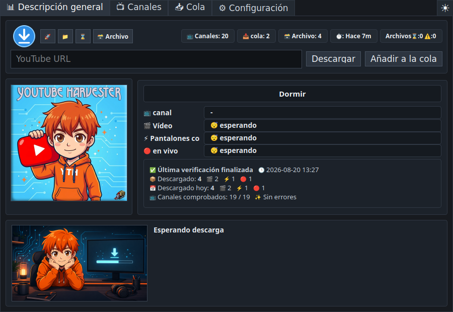
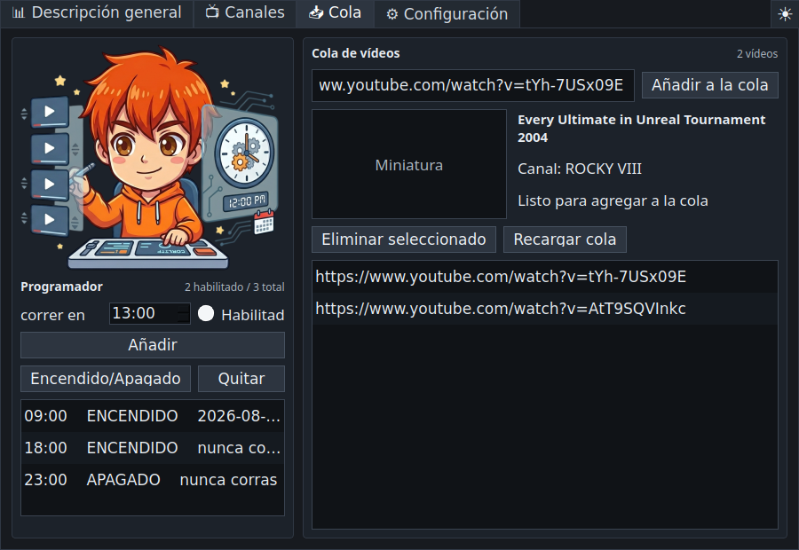
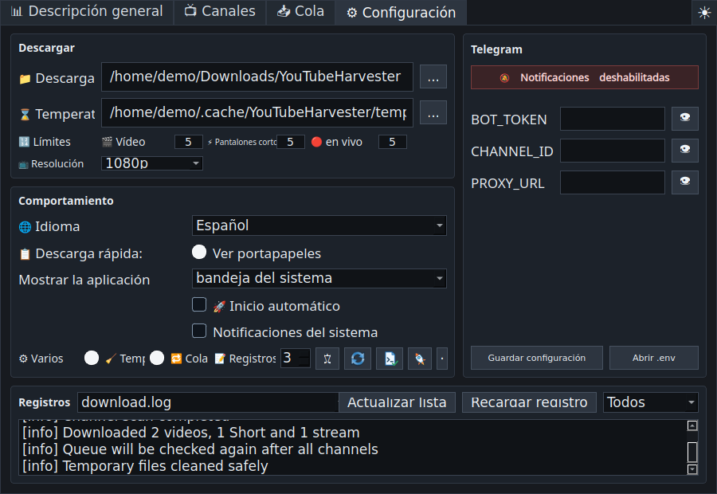

# YouTube Harvester 1.1.0

<p align="center">
  
</p>

<p align="center">
  <a href="README.md">🇺🇸 🇬🇧 English</a> ·
  <a href="README.ru.md">🇷🇺 Русский</a> ·
  <a href="README.uk.md">🇺🇦 Українська</a> ·
  <a href="README.fr.md">🇫🇷 Français</a> ·
  <a href="README.es.md">🇪🇸 Español</a> ·
  <a href="README.hi.md">🇮🇳 हिन्दी</a> ·
  <a href="README.zh.md">🇨🇳 中文</a> ·
  <a href="README.ar.md">🇸🇦 العربية</a>
</p>

<p align="center">
  Descargador multilingüe de YouTube para Linux y Windows, con seguimiento de
  canales, cola manual, descarga rápida, programación, archivo y envío opcional
  a Telegram.
</p>



## Descripción

**YouTube Harvester** vigila los canales seleccionados y descarga sus nuevos
vídeos, Shorts y emisiones con `yt-dlp`. También admite enlaces individuales,
mantiene un archivo local, muestra informes y puede enviar notificaciones o
archivos a Telegram.

La versión `1.1.0` usa el motor Python tanto en Linux como en Windows. El antiguo
motor Bash permanece en el código fuente únicamente como código heredado y
desactivado.

## Funciones principales

- Vista en directo del progreso de canales, tipo de contenido, etapa de
  descarga, velocidad, tiempo restante, tamaño, eventos y totales diarios.
- Tarjetas con las imágenes originales en caché de cada canal e interruptores
  separados para Vídeos, Shorts y Emisiones.
- Comprobación opcional de contenido de pago con tres estados: desconocido,
  members-only encontrado o no encontrado durante la comprobación.
- Campo URL en la pestaña principal para descargar inmediatamente o añadir a la
  cola.
- Cola con título, canal, miniatura, control de duplicados y archivo, reintentos
  y una segunda pasada después de revisar todos los canales.
- Ventana de Descarga rápida con URL del portapapeles, metadatos, resolución,
  descarga inmediata, cola y casilla persistente de Telegram.
- Atajo global configurable; el valor predeterminado es `Ctrl+Shift+Alt+Y`.
- Vigilancia opcional del portapapeles para enlaces válidos de YouTube.
- Programador de ejecuciones automáticas por hora.
- Archivo detallado con tipo, canal, título, fecha, enlace de YouTube, archivo
  local, carpeta y eliminación de registros.
- Registros con filtros Todos, Importante y Errores.
- Comprobación de versión de `yt-dlp` y diagnóstico de sistema, X11/Wayland,
  bandeja, atajo, herramientas, rutas, caché, escritura y espacio libre.
- Temas oscuro, claro y del sistema.
- Inicio solo en bandeja, solo en barra de tareas o en ambos lugares.
- Parada segura, limpieza temporal protegida, nombres compatibles con Windows y
  UTF-8 correcto en registros y archivos.
- Inglés por defecto, además de ruso, ucraniano, francés, español, hindi, chino
  y árabe.

## Capturas de pantalla

| Descripción general | Canales |
| --- | --- |
|  |  |

| Cola y programador | Configuración y registros |
| --- | --- |
|  |  |

## Descargas

Los paquetes se publican en
[GitHub Releases](https://github.com/LiberVixer/YouTubeHarvester/releases).

Linux: `YouTubeHarvester_1.1.0_linux_all.deb`,
`YouTubeHarvester_1.1.0_source.tar.gz` y `SHA256SUMS-linux.txt`.

Windows: `YouTubeHarvester_1.1.0_windows_setup.exe`,
`YouTubeHarvester_1.1.0_windows_x64.msi`,
`YouTubeHarvester_1.1.0_windows_portable.zip` y `SHA256SUMS-windows.txt`.

Las compilaciones para Windows incluyen `yt-dlp`, `ffmpeg.exe`, `ffprobe.exe` y
`deno.exe`.

## Instalación en Linux

```bash
sudo apt install ./YouTubeHarvester_1.1.0_linux_all.deb
yt-harvester
```

Rutas del usuario:

- datos: `~/.local/share/yt-harvester`
- configuración: `~/.config/yt-harvester`
- caché: `~/.cache/yt-harvester`
- Telegram: `~/.config/yt-harvester/.env`
- temporales: `~/temp/YTH`
- descargas: `~/Downloads/YouTubeHarvester`

## Instalación en Windows

Elige Setup EXE, MSI o ZIP portable. Las tres compilaciones son autónomas y no
requieren instalar Python, FFmpeg o Deno por separado. El inicio automático usa
`HKCU\Software\Microsoft\Windows\CurrentVersion\Run`.

## Ejecución desde el código fuente

Linux:

```bash
sudo apt install python3 python3-pyqt5 python3-pynput yt-dlp ffmpeg curl
sudo apt install wl-clipboard  # recomendado para Wayland
cp .env.example .env
./start_tray.sh
```

Windows:

```powershell
py -3 -m venv .venv
.\.venv\Scripts\python -m pip install -r requirements.txt
.\start_tray_windows.bat
```

Consulta la [guía de compilación sin conexión](docs/windows-offline-build.md)
cuando la conexión a Internet no sea estable.

## Opciones de inicio

```bash
yt-harvester
yt-harvester --quick-download
yt-harvester --start-tray
yt-harvester --start-window
yt-harvester --start-both
```

`--quick-download` abre la descarga rápida y entrega la petición a la instancia
que ya esté ejecutándose. Las demás opciones seleccionan bandeja, barra de
tareas o ambas. Opciones internas: `--run-yt-dlp ...` y
`--run-script <script.py> ...`.

## Descarga rápida, X11 y Wayland

Windows usa un atajo global nativo y Linux/X11 utiliza `pynput`. Wayland suele
bloquear el registro directo de teclas globales, por lo que la aplicación puede
crear un atajo del sistema Cinnamon/GNOME para
`yt-harvester --quick-download`. En Wayland, el portapapeles se lee mediante
`wl-paste` cuando está instalado `wl-clipboard`.

## Canales y cola

Las secciones activas se revisan en orden con una breve pausa después de cada
resultado. La búsqueda members-only se realiza durante la comprobación manual
de canales si la opción está activa. Si aparece un vídeo para miembros durante
un escaneo normal, el estado del canal también se actualiza y se muestra como
evento importante sin una alarma roja.

La cola se procesa al principio y de nuevo después de todos los canales. Se
omiten duplicados y vídeos ya archivados; los fallos pueden volver a la cola.

## Telegram

Telegram se puede desactivar por completo. Para usarlo, configura la interfaz o
`.env`:

```bash
BOT_TOKEN=your-telegram-bot-token
CHANNEL_ID=your-telegram-channel-id
PROXY_URL=127.0.0.1:9050
```

El proxy es opcional. Un error de Telegram nunca elimina un vídeo guardado
localmente.

## Compilación

```bash
packaging/build_release.sh 1.1.0 1.1.0
```

```powershell
powershell -ExecutionPolicy Bypass -File .\packaging\windows\build_release.ps1 `
  -Version 1.1.0 -MsiVersion 1.1.0
```

## Uso responsable

YouTube Harvester no está afiliado con YouTube, Google, Telegram ni `yt-dlp`.
Descarga únicamente contenido propio, autorizado o que puedas guardar
legalmente para uso personal. Respeta las
[Condiciones de YouTube](https://www.youtube.com/t/terms), los derechos de autor
y las leyes de tu país. Mantén privadas las credenciales de Telegram.

Componentes externos: [`yt-dlp`](https://github.com/yt-dlp/yt-dlp), PyQt5/Qt,
FFmpeg/FFprobe, Deno, `curl`, Telegram Bot API y `pynput`, cada uno con su propia
licencia.

## Agradecimientos

Un agradecimiento especial a Dmitry **'Minion' Pororiliy** por su ayuda
inestimable en las pruebas beta de la versión para Windows.

Se añadió al logotipo del programa un Harvester de
**Command & Conquer: Red Alert**. 🙂

Consulta el [registro de cambios en español](CHANGELOG.es.md).
