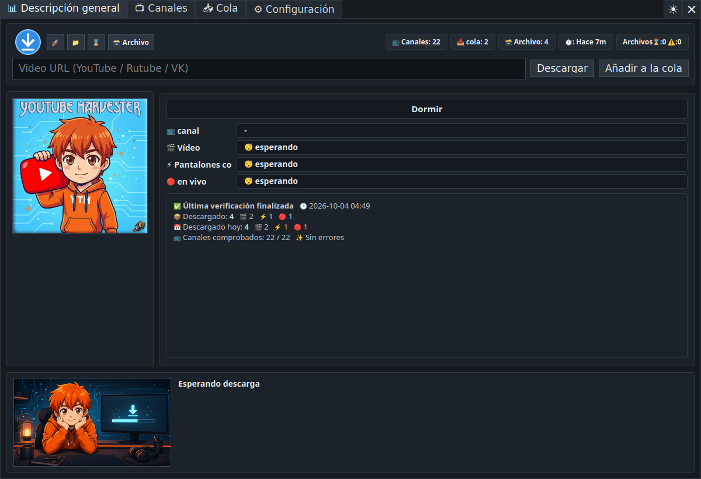
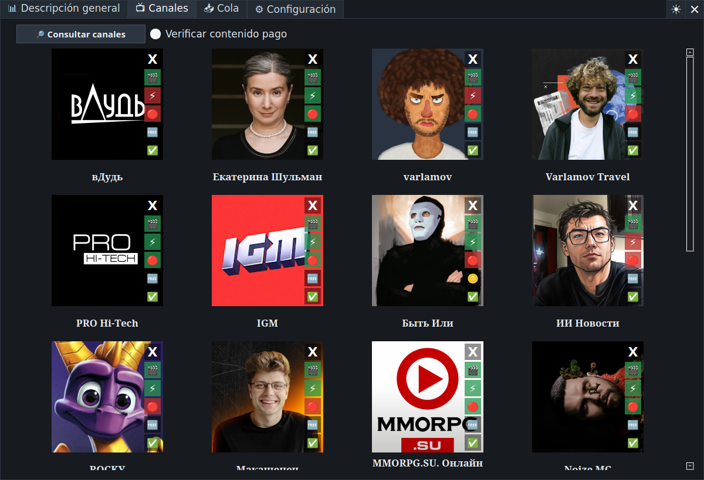
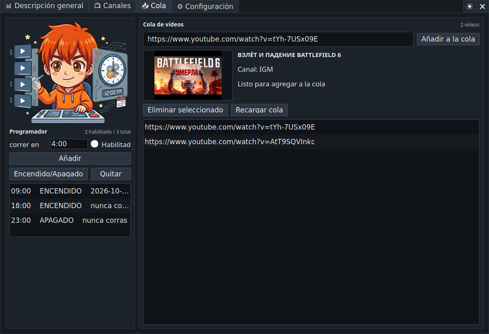
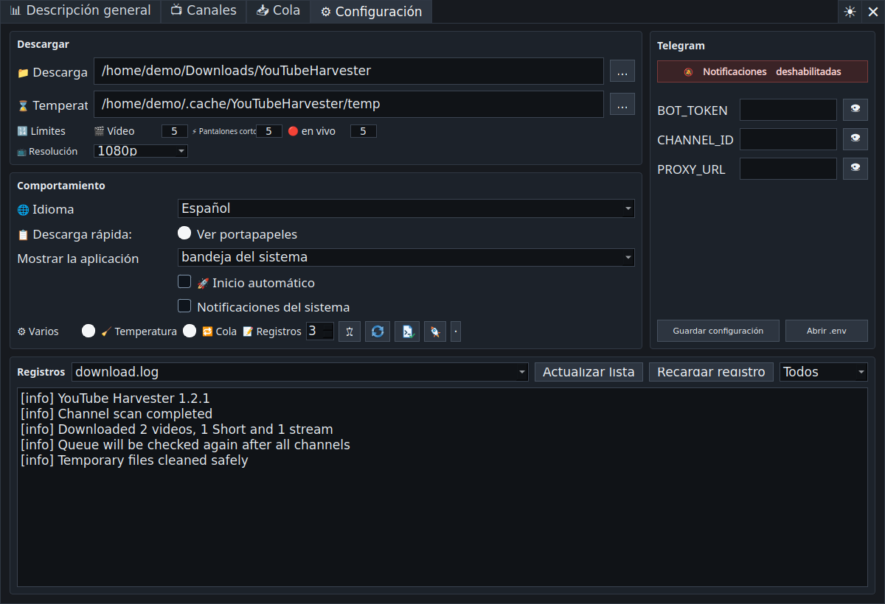
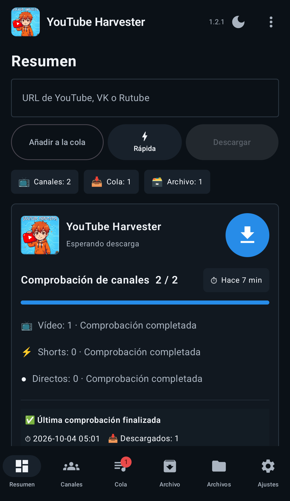
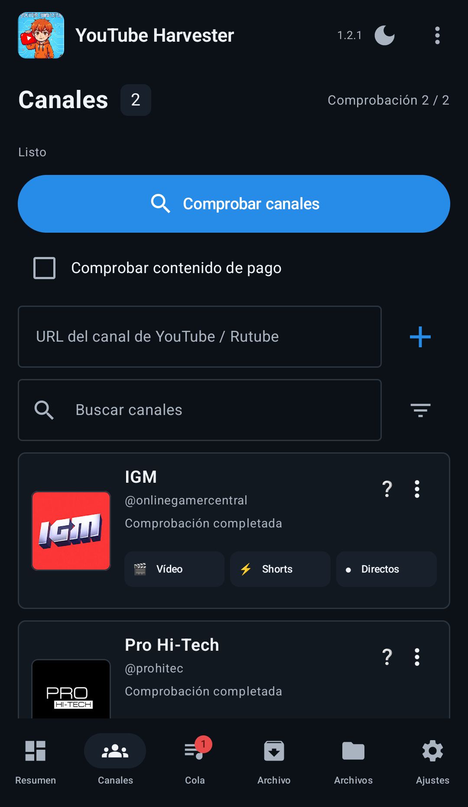
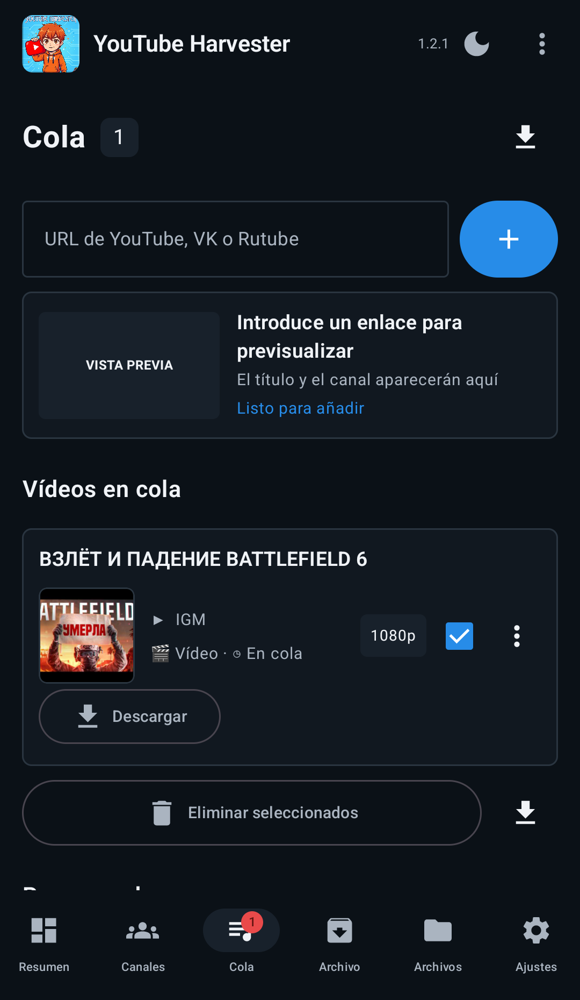
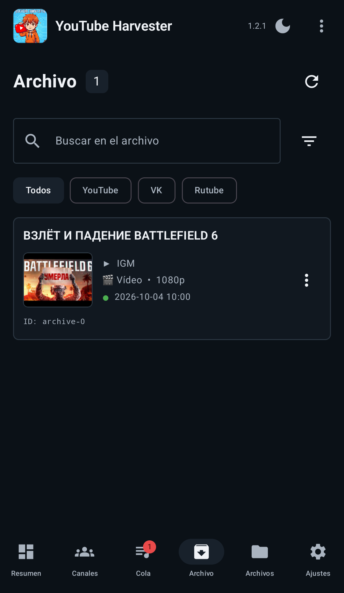
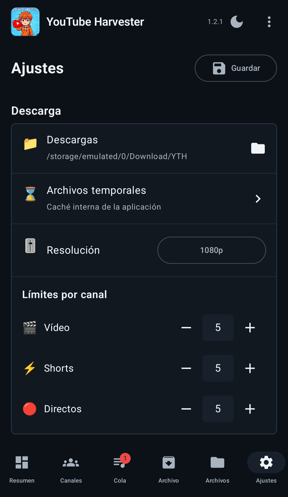

# YouTube Harvester 1.2.1

<p align="center">
  
</p>

<p align="center">
  <a href="README.md">🇺🇸 🇬🇧 English</a> ·
  <a href="README.ru.md">🇷🇺 Русский</a> ·
  <a href="README.uk.md">🇺🇦 Українська</a> ·
  <a href="README.be.md">🇧🇾 Беларуская</a> ·
  <a href="README.fr.md">🇫🇷 Français</a> ·
  <a href="README.es.md">🇪🇸 Español</a> ·
  <a href="README.hi.md">🇮🇳 हिन्दी</a> ·
  <a href="README.zh.md">🇨🇳 中文</a> ·
  <a href="README.ja.md">🇯🇵 日本語</a> ·
  <a href="README.ar.md">🇸🇦 العربية</a>
</p>

Descargador multilingüe para **Linux, Windows y Android**: seguimiento de canales YouTube/Rutube, vídeos individuales YouTube/Rutube/VK, cola, archivo, programación y envío opcional a Telegram.

## Versión 1.2.1

Documentación actualizada: **2026-10-04**.

Código y paquetes locales: **1.2.1**, sin beta/prerelease. Android usa `versionCode 120100`; las compilaciones internas conservan `-debug`. Windows se recompiló con el mismo código actual de Linux, incluyendo Rutube y recuperación tras interrupciones.

**Preparación, no anuncio de publicación.** Se han construido localmente instaladores de escritorio y cuatro APK de prueba. La aceptación pública de Android sigue pendiente; los APK de prueba conservan el certificado de desarrollo. Quitar beta del número no los convierte en versiones públicas.

Linux y Windows comparten el motor Python/yt-dlp; el Bash antiguo queda solo como código heredado desactivado.

[Verificación de versiones](docs/version-1.2.1-20261003.md) · [Preparación de 1.2.1](docs/releases/1.2.1.md).

## Funciones de Escritorio

- Vista en directo del progreso de canales, tipo de contenido, etapa de
  descarga, velocidad, tiempo restante, tamaño, eventos y totales diarios.
- Tarjetas con las imágenes originales en caché de cada canal e interruptores
  separados para Vídeos, Shorts y Emisiones.
- Comprobación opcional de contenido de pago con tres estados: desconocido,
  members-only encontrado o no encontrado durante la comprobación.
- Campo URL en la pestaña principal para descargar inmediatamente o añadir a la
  cola.
- Cola con título, canal, miniatura, control de duplicados y archivo, reintentos
  y una segunda pasada después de revisar todos los canales.
- Ventana de Descarga rápida con URL del portapapeles, metadatos, resolución,
  varias pistas de audio y subtítulos, descarga inmediata, cola y casilla
  persistente de Telegram.
- Atajo global configurable; el valor predeterminado es `Ctrl+Shift+Alt+Y`.
- Vigilancia opcional del portapapeles para enlaces compatibles de YouTube,
  Rutube o VK.
- Programador de ejecuciones automáticas por hora.
- Archivo detallado con tipo, canal, título, fecha, enlace de origen, variantes
  de calidad y pistas, archivo local, carpeta y eliminación de registros.
- Registros con filtros Todos, Importante y Errores.
- Actualización verificada de la aplicación desde versiones oficiales de
  GitHub para instalaciones, versiones portátiles y paquetes Linux.
- Comprobación y actualización segura de `yt-dlp` desde la interfaz, con diagnóstico de sistema, X11/Wayland,
  bandeja, atajo, herramientas, rutas, caché, escritura y espacio libre.
- Temas oscuro, claro y del sistema.
- Inicio solo en bandeja, solo en barra de tareas o en ambos lugares.
- Parada segura, limpieza temporal protegida, nombres compatibles con Windows y
  UTF-8 correcto en registros y archivos.
- Inglés por defecto, además de ruso, ucraniano, bielorruso, francés, español,
  hindi, chino, japonés y árabe.

## Fuentes y Procesamiento

- **Canales YouTube:** vídeos, Shorts y directos, interruptores/límites separados; direcciones handle/channel/user/custom.
- **Canales Rutube:** `/channel/ID/` y `/u/name/`, incluidos Vídeos/Shorts. Alias resueltos para evitar duplicados; nombres e imágenes en caché.
- **Programas Rutube:** `/metainfo/tv/ID/`, título/póster propios, solo Vídeos; las últimas N entradas, de nuevas a antiguas.
- **Vídeos individuales:** YouTube, Rutube y VK/VK Video por campo manual, cola o descarga rápida. Sin seguimiento de canales VK ni listas Rutube arbitrarias.

Rutube no permite aquí comprobar directos ni contenido de pago. La detección de pago en YouTube informa de disponibilidad, no evita restricciones ni garantiza descargas. El menú del canal puede marcar entradas recientes como procesadas sin descargarlas.

Ciclo: cola manual, secciones activadas con descargas secuenciales, cola de nuevo. Se omiten duplicados y elementos archivados. La comprobación de Canales valida secciones; el ciclo completo empieza en Resumen o por programación. El archivo conserva variantes de calidad/pistas.

Detener una descarga de escritorio ya no bloquea el próximo inicio. Limpieza protegida y reintentos conservados; no borre temporales durante una descarga. Ante fallo de fuente/VPN/proxy, revise conexión y registros. Permanecen las restricciones de región, cuenta y protocolo.

## Android

Aplicación nativa Kotlin/Jetpack Compose para **Android 8.0+ (API 26)**; ABI `arm64-v8a`, `armeabi-v7a`, `x86_64`, `x86`.

- Resumen, Canales, Cola, Archivo, Ajustes y acceso a carpeta; diez idiomas, temas oscuro/claro/sistema, árabe RTL.
- Mismas categorías de fuentes, incluidos canales/programas Rutube; límites, marcado, programación, metadatos e imágenes.
- Descarga inmediata del URL; Rápida en Resumen lee el portapapeles solo al pulsar explícitamente. Compartir abre opciones. El acceso directo abre Resumen; vigilancia opcional del portapapeles solo con la app en primer plano.
- Resolución, varias pistas de audio/subtítulos, tareas persistentes, pausa/reanudación/cancelación/reintento, notificaciones y foreground-service. Reanudar conserva tarea/temporales; la continuidad de bytes depende de la fuente.
- Recuperación WorkManager, informes/totales diarios, reinicio, MediaStore/SAF, archivos, registros/diagnóstico. Tras forzar detención en Android, reabra la app; restricciones de batería del fabricante pueden limitar el fondo.
- Telegram con credenciales protegidas por Android Keystore. `.ythbackup` con contraseña transfiere registros/ajustes, **no vídeos ni temporales**. Importación exige base vacía; los archivos movidos requieren revincular carpetas con verificación.
- Actualizador APK verifica SHA-256, paquete, versionCode superior y certificado instalado antes del instalador Android. `yt-dlp` se actualiza **junto con la aplicación**, no por separado.

**VK en Android:** descarga de vídeos individuales VK/VK Video; una descarga pública se verificó en LDPlayer el 2026-09-14. Sin seguimiento de canales VK. Los vídeos privados o restringidos pueden no estar disponibles.

[Guía Android](android/README.md) · [Transferencia de datos](android/DATA-TRANSFER.ru.md).

## Estado del Lanzamiento Android

Antes de publicar: completar firma permanente/copia independiente de clave, fuentes nativas correspondientes/licencias/auditoría de seguridad, migración en el candidato firmado exacto, ARM, Android antiguo compatible, Android 15+ boot/resume, páginas 16 KB y TalkBack. Después verificar APK finales y empaquetado.

**No desinstale la app de prueba para cambiar el certificado.** La transferencia cifrada se probó en un paquete QA aislado, no sustituye la aceptación del candidato público final.

[Preparación del lanzamiento](android/RELEASE-READINESS.ru.md).

## Capturas de pantalla

| Descripción general | Canales |
| --- | --- |
|  |  |

| Cola y programador | Configuración y registros |
| --- | --- |
|  |  |

### Android

Android 1.2.1, tema oscuro. Datos de demostración.

| Descripción general | Canales |
| --- | --- |
|  |  |

| Cola | Archivo |
| --- | --- |
|  |  |

**Configuración**



[Catálogo y procedencia de capturas](docs/screenshots/README.md).

## Descargas

Archivos de escritorio preparados localmente: `dist/release/`. Tras publicación, [GitHub Releases](https://github.com/LiberVixer/YouTubeHarvester/releases) ofrece las descargas; este README no afirma que 1.2.1 ya esté publicada.

| Plataforma | Archivos |
| --- | --- |
| Linux | `YouTubeHarvester_1.2.1_linux_all.deb`, `YouTubeHarvester_1.2.1_source.tar.gz`, `SHA256SUMS-linux.txt` |
| Windows x64 | `YouTubeHarvester_1.2.1_windows_setup.exe`, `YouTubeHarvester_1.2.1_windows_x64.msi`, `YouTubeHarvester_1.2.1_windows_portable.zip`, `SHA256SUMS-windows.txt` |

APK privados de prueba: `android/YouTubeHarvester-1.2.1-<ABI>.apk`, **no artefactos públicos**. Publicar Android exige también código app/runtime, BUILD-INFO y SHA256SUMS.

## Instalación en Linux

```bash
sudo apt install ./YouTubeHarvester_1.2.1_linux_all.deb
yt-harvester
```

Rutas del usuario:

- datos: `~/.local/share/yt-harvester`
- configuración: `~/.config/yt-harvester`
- caché: `~/.cache/yt-harvester`
- Telegram: `~/.config/yt-harvester/.env`
- temporales: `~/temp/YTH`
- descargas: `~/Downloads/YouTubeHarvester`

El `.deb` usa Python/Qt/yt-dlp/FFmpeg/curl de la distribución, sin actualizarlos silenciosamente. Sus versiones pueden diferir de desarrollo/Windows. Deno se recomienda, no está incluido; aporte runtime JavaScript compatible para YouTube.

## Instalación en Windows

Setup EXE/MSI x64, o extraiga ZIP portable y ejecute `YouTubeHarvester.exe`. Python, yt-dlp, FFmpeg/FFprobe y Deno incluidos. Datos/caché: `%LOCALAPPDATA%\YouTubeHarvester`; ajustes: `%APPDATA%\YouTubeHarvester`; temporales: `%TEMP%\YTH`. Autoinicio: clave del usuario `HKCU\Software\Microsoft\Windows\CurrentVersion\Run`.

## Instalar y Actualizar Android

Para pruebas autorizadas, elija ABI y actualice con el mismo certificado, sin desinstalar ni borrar datos. Autorice solo una fuente de instalación fiable, notificaciones si procede y carpeta destino. Por defecto `Download/YTH` o carpeta SAF. Un APK con otra firma no puede sobrescribir la instalación de prueba.

## Ejecución desde el código fuente

Linux usa `.venv` si existe; `YTD_PYTHON` elige intérprete. Entornos fijados verificados con Python 3.12. FFmpeg/FFprobe y runtime JavaScript externos; el script siguiente obtiene Deno/FFmpeg con comprobación de hashes.

Obtenga herramientas solo si faltan: el script rechaza sobrescribir directorios existentes. Conserve su `.env` y configure Telegram en la app o su archivo. No publique ese archivo.

Linux:

```bash
sudo apt install python3 python3-venv python3-pyqt5 python3-pynput python3-dbus ffmpeg curl
python3 -m venv .venv
.venv/bin/python -m pip install -r requirements-linux-lock.txt
.venv/bin/python scripts/fetch_desktop_tools.py --platform linux --output tools/linux
cp -n .env.example .env
./start_tray.sh
```

Las fuentes Windows también requieren FFmpeg/FFprobe y Deno; el constructor usa herramientas locales fijadas o las descarga y verifica.

Windows:

```powershell
py -3.12 -m venv .venv
.\.venv\Scripts\python -m pip install -r requirements-windows-lock.txt
.\.venv\Scripts\python scripts/fetch_desktop_tools.py --platform windows --output tools/windows
.\start_tray_windows.bat
```

[Ejecución desde el código fuente Windows (offline)](docs/windows-offline-build.md).

## Opciones de inicio

```bash
yt-harvester
yt-harvester --quick-download
yt-harvester --show-main
yt-harvester --start-tray
yt-harvester --start-window
yt-harvester --start-both
```

`--quick-download` abre la descarga rápida y entrega la petición a la instancia
que ya esté ejecutándose. `--show-main` muestra su ventana principal. Las demás
opciones seleccionan bandeja, barra de
tareas o ambas. Opciones internas: `--run-yt-dlp ...` y
`--run-script <script.py> ...`.

## Descarga rápida, X11 y Wayland

Windows usa un atajo global nativo y Linux/X11 utiliza `pynput`. Wayland suele
bloquear el registro directo de teclas globales, por lo que la aplicación puede
crear un atajo del sistema Cinnamon/GNOME para
`yt-harvester --quick-download`. En Wayland, el portapapeles se lee mediante
`wl-paste` cuando está instalado `wl-clipboard`.

## Telegram

Telegram se puede desactivar por completo. Para usarlo, configura la interfaz o
`.env`:

```bash
BOT_TOKEN=your-telegram-bot-token
CHANNEL_ID=your-telegram-channel-id
PROXY_URL=127.0.0.1:9050
```

El proxy es opcional. Un error de Telegram nunca elimina un vídeo guardado
localmente.

## Componentes Fijados

Versiones revisadas del proyecto, no garantía para todas las instalaciones ni afirmación de últimas versiones upstream. Dependencias PC: `requirements-linux-lock.txt`, `requirements-windows-lock.txt`. Android: `android/runtime.properties`, `android/gradle/verification-metadata.xml`.

| Componente | Desarrollo PC / Windows | Android |
| --- | --- | --- |
| yt-dlp | 2026.08.19 | 2026.08.19 |
| FFmpeg / FFprobe | 9.0.2 | 7.1.1 |
| Deno / QuickJS | Deno 2.9.7 | QuickJS 2026-06-04 |
| PyQt5 / Compose BOM | PyQt5 5.15.11 | Compose 2026.09.00 |
| Qt runtime | Linux 5.15.19 / Windows 5.15.2 | - |
| Room / WorkManager | - | 2.8.5 / 2.12.0 |
| Coil | - | 3.6.3 |
| PyInstaller / AGP / Gradle | PyInstaller 6.22.3 | AGP 9.4.1 / Gradle 9.8.0 |
| Kotlin Compose compiler / KSP | - | 2.4.20 / 2.3.12 |

Android conserva Python 3.12.11, OpenSSL 3.5.2 y FFmpeg 7.1.1 upstream; recompilación compatible y fuentes correspondientes pendientes. QuickJS 2026-06-04 y WebP/SharpYUV 1.6.0 recompilados para cuatro ABI con alineación 16 KB. Validación estática no sustituye dispositivo 16 KB.

[Actualización de componentes](docs/component-update-20261003.md) · [Reconstrucción nativa](android/native/README.md).

## Compilación

Etiquetas PC `v*`; Android `android-v<versionName>`, flujo separado. La firma pública requiere certificado permanente aprobado y fuentes runtime correspondientes verificadas. Nunca publique claves, contraseñas, tokens ni APK sin firma/privados.

Linux:

```bash
packaging/build_release.sh 1.2.1 1.2.1
```

Windows:

```powershell
powershell -ExecutionPolicy Bypass -File .\packaging\windows\build_release.ps1 `
  -Version 1.2.1 -MsiVersion 1.2.1
```

Android (JDK 17, Android SDK, Gradle Wrapper):

```bash
cd android
./gradlew testDebugUnitTest assembleDebug
python3 -m unittest discover -s scripts -p 'test_*.py' -v
```

[Publicación y firma Android](android/RELEASING.md)

## Verificación y Límites

Últimas pruebas locales: **89 Python de escritorio**, **39 Python Android**, **149 JVM Android**, 50 capturas Android correctas. La alineación validó también **80 pruebas Windows** (dos POSIX omitidas) y **36 pruebas LDPlayer seleccionadas**, Android 14/API 34 x86_64.

Herramientas PC y descarga/remux local H.264/AAC verificados. Cuatro APK comprobados por manifiesto/certificado/ZIP y alineación nativa aplicable de 64 bits. No acredita ARM, fondo en todos los dispositivos ni instalación/desinstalación de nuevos instaladores Windows. Documentar no recompila ni publica copias instaladas.

[Plan de pruebas Android](android/TEST-PLAN.ru.md).

## Licencias y Uso Responsable

El **módulo Android es GPL-3.0-only**, aprobado por el propietario: [LICENSE](android/LICENSE), [NOTICE](android/NOTICE), [decisión](android/legal/README.md). No cambia licencias de escritorio ni de terceros. Las fuentes runtime correspondientes completas siguen siendo obligatorias para publicar Android.

Sin afiliación con YouTube, Google, Rutube, VK, Telegram ni yt-dlp. Descargue solo contenido autorizado, respete términos y leyes aplicables. Proteja credenciales y contraseñas.

## Agradecimientos

Un agradecimiento especial a Dmitry **'Minion' Pororiliy** por su ayuda
inestimable en las pruebas beta de la versión para Windows.

Se añadió al logotipo del programa un Harvester de
**Command & Conquer: Red Alert**. 🙂

Consulta el [registro de cambios en español](CHANGELOG.es.md).
