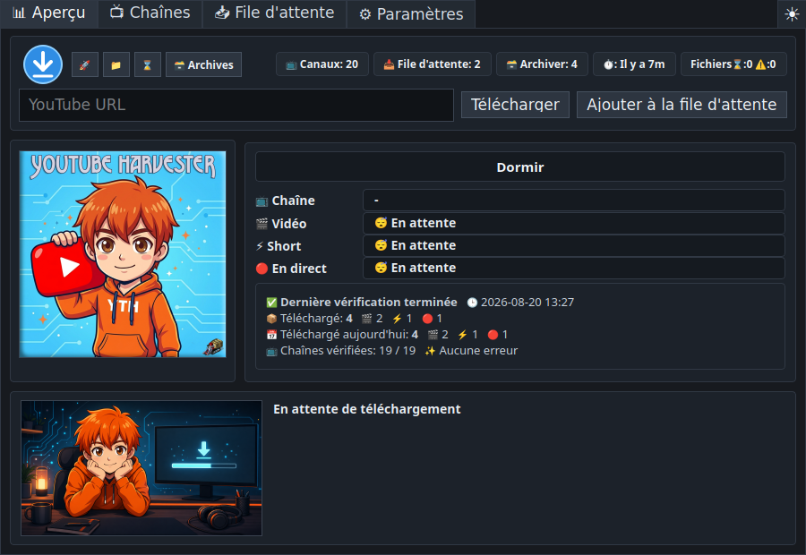
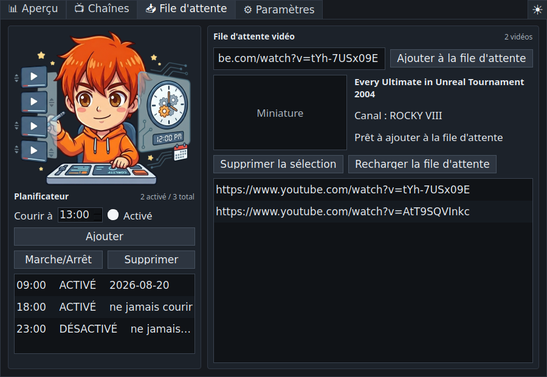
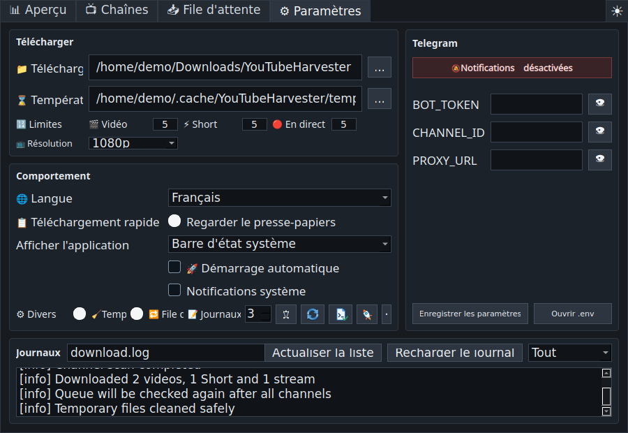

# YouTube Harvester 1.1.2

<p align="center">
  
</p>

<p align="center">
  <a href="README.md">🇺🇸 🇬🇧 English</a> ·
  <a href="README.ru.md">🇷🇺 Русский</a> ·
  <a href="README.uk.md">🇺🇦 Українська</a> ·
  <a href="README.fr.md">🇫🇷 Français</a> ·
  <a href="README.es.md">🇪🇸 Español</a> ·
  <a href="README.hi.md">🇮🇳 हिन्दी</a> ·
  <a href="README.zh.md">🇨🇳 中文</a> ·
  <a href="README.ja.md">🇯🇵 日本語</a> ·
  <a href="README.ar.md">🇸🇦 العربية</a>
</p>

<p align="center">
  Un téléchargeur YouTube multilingue pour Linux et Windows, avec surveillance
  des chaînes, file manuelle, téléchargement rapide, planification, archives et
  envoi Telegram facultatif.
</p>

> **UPD 2 :** Le téléchargement rapide intègre désormais plusieurs pistes
> audio et sous-titres dans une même vidéo. L'archive distingue les variantes
> par qualité et pistes, l'échec d'un sous-titre n'annule plus le téléchargement
> et la localisation japonaise complète a été ajoutée.



## Présentation

**YouTube Harvester** surveille les chaînes YouTube sélectionnées et télécharge
leurs nouvelles vidéos, leurs Shorts et leurs directs avec `yt-dlp`. Il accepte
aussi des liens individuels, conserve une archive locale, affiche des rapports
et peut envoyer des notifications ou des fichiers vers Telegram.

La version `1.1.2` utilise le moteur Python sous Linux et Windows. L'ancien
moteur Bash reste dans les sources uniquement comme code historique désactivé.

## Fonctions principales

- Vue d'ensemble en direct : progression des chaînes, type de média, étape du
  téléchargement, vitesse, durée restante, taille, événements et bilans.
- Fiches de chaînes avec leurs images originales en cache et interrupteurs
  séparés pour les vidéos, Shorts et directs.
- Recherche facultative de contenu payant avec trois états : inconnu,
  members-only trouvé, ou aucun contenu members-only trouvé pendant le contrôle.
- Champ URL dans l'onglet Aperçu pour télécharger immédiatement ou ajouter à la
  file.
- File vidéo avec titre, chaîne, miniature, détection des doublons et archives,
  nouvelle tentative et second passage après toutes les chaînes.
- Fenêtre Téléchargement rapide avec URL du presse-papiers, métadonnées,
  résolution, plusieurs pistes audio et sous-titres, téléchargement immédiat,
  file et case Telegram persistante.
- Raccourci global configurable, `Ctrl+Shift+Alt+Y` par défaut.
- Surveillance facultative du presse-papiers pour les URL YouTube valides.
- Planificateur d'exécutions automatiques par heure.
- Archive détaillée avec type, chaîne, titre, date, lien YouTube, variantes de
  qualité et de pistes, fichier local, dossier et suppression d'entrée.
- Journaux filtrables par Tout, Important et Erreurs.
- Contrôle de version de `yt-dlp` et diagnostic du système, X11/Wayland, zone de
  notification, raccourci, outils, chemins, cache, écriture et espace disque.
- Thèmes sombre, clair et système.
- Démarrage dans la zone de notification, la barre des tâches ou les deux.
- Arrêt sûr, nettoyage temporaire protégé, noms compatibles Windows et UTF-8
  fiable dans les journaux et archives Windows.
- Anglais par défaut, avec russe, ukrainien, français, espagnol, hindi, chinois,
  japonais et arabe.

## Captures d'écran

| Aperçu | Chaînes |
| --- | --- |
|  |  |

| File et planificateur | Paramètres et journaux |
| --- | --- |
|  |  |

## Téléchargements

Les paquets sont publiés dans
[GitHub Releases](https://github.com/LiberVixer/YouTubeHarvester/releases).

Linux : `YouTubeHarvester_1.1.2_linux_all.deb`,
`YouTubeHarvester_1.1.2_source.tar.gz` et `SHA256SUMS-linux.txt`.

Windows : `YouTubeHarvester_1.1.2_windows_setup.exe`,
`YouTubeHarvester_1.1.2_windows_x64.msi`,
`YouTubeHarvester_1.1.2_windows_portable.zip` et `SHA256SUMS-windows.txt`.

Les versions Windows incluent `yt-dlp`, `ffmpeg.exe`, `ffprobe.exe` et
`deno.exe`.

## Installation sous Linux

```bash
sudo apt install ./YouTubeHarvester_1.1.2_linux_all.deb
yt-harvester
```

Emplacements utilisateur :

- données : `~/.local/share/yt-harvester`
- paramètres : `~/.config/yt-harvester`
- cache : `~/.cache/yt-harvester`
- Telegram : `~/.config/yt-harvester/.env`
- fichiers temporaires : `~/temp/YTH`
- téléchargements : `~/Downloads/YouTubeHarvester`

## Installation sous Windows

Choisissez le Setup EXE, le MSI ou le ZIP portable. Ces versions sont
autonomes : Python, FFmpeg et Deno ne doivent pas être installés séparément.
Le démarrage automatique utilise
`HKCU\Software\Microsoft\Windows\CurrentVersion\Run`.

## Exécution depuis les sources

Linux :

```bash
sudo apt install python3 python3-pyqt5 python3-pynput yt-dlp ffmpeg curl
sudo apt install wl-clipboard  # recommandé pour Wayland
cp .env.example .env
./start_tray.sh
```

Windows :

```powershell
py -3 -m venv .venv
.\.venv\Scripts\python -m pip install -r requirements.txt
.\start_tray_windows.bat
```

Consultez le [guide de compilation Windows hors ligne](docs/windows-offline-build.md)
si la connexion Internet est instable.

## Options de lancement

```bash
yt-harvester
yt-harvester --quick-download
yt-harvester --start-tray
yt-harvester --start-window
yt-harvester --start-both
```

`--quick-download` ouvre la fenêtre rapide et transmet la demande à l'instance
déjà active. Les autres options choisissent la zone de notification, la barre
des tâches ou les deux. Options internes : `--run-yt-dlp ...` et
`--run-script <script.py> ...`.

## Téléchargement rapide, X11 et Wayland

Windows emploie un raccourci global natif et Linux/X11 utilise `pynput`.
Wayland bloque généralement l'enregistrement direct des touches globales ;
l'application peut donc créer un raccourci système Cinnamon/GNOME exécutant
`yt-harvester --quick-download`. Le presse-papiers Wayland est lu avec
`wl-paste` lorsque `wl-clipboard` est installé.

## Chaînes et file d'attente

Les sections activées sont contrôlées l'une après l'autre, avec une courte pause
après chaque résultat. La recherche members-only est faite pendant un contrôle
explicite des chaînes si l'option est activée. Si une vidéo réservée aux membres
apparaît pendant un scan normal, l'état de la chaîne est tout de même mis à jour
et l'événement est classé comme important sans erreur rouge.

La file est traitée au début, puis une seconde fois après toutes les chaînes.
Les doublons et vidéos déjà archivées sont ignorés. Un élément en échec peut
être replacé dans la file.

## Telegram

Telegram peut être entièrement désactivé. Sinon, configurez l'interface ou
`.env` :

```bash
BOT_TOKEN=your-telegram-bot-token
CHANNEL_ID=your-telegram-channel-id
PROXY_URL=127.0.0.1:9050
```

Le proxy est facultatif. Une panne Telegram ne supprime jamais une vidéo déjà
enregistrée localement.

## Compilation

```bash
packaging/build_release.sh 1.1.2 1.1.2
```

```powershell
powershell -ExecutionPolicy Bypass -File .\packaging\windows\build_release.ps1 `
  -Version 1.1.2 -MsiVersion 1.1.2
```

## Utilisation responsable

YouTube Harvester n'est affilié ni à YouTube, Google, Telegram ou `yt-dlp`.
Téléchargez uniquement les contenus que vous possédez, pour lesquels vous avez
une autorisation ou que vous pouvez légalement conserver pour un usage privé.
Respectez les [Conditions d'utilisation de YouTube](https://www.youtube.com/t/terms),
le droit d'auteur et les lois de votre pays. Gardez les identifiants Telegram
confidentiels.

Composants externes : [`yt-dlp`](https://github.com/yt-dlp/yt-dlp), PyQt5/Qt,
FFmpeg/FFprobe, Deno, `curl`, Telegram Bot API et `pynput`, chacun avec sa propre
licence.

## Remerciements

Un grand merci à Dmitry **'Minion' Pororiliy** pour son aide inestimable lors
des tests bêta de la version Windows.

Un Harvester de **Command & Conquer: Red Alert** a été ajouté au logo du
programme. 🙂

Consultez le [journal des modifications français](CHANGELOG.fr.md).
