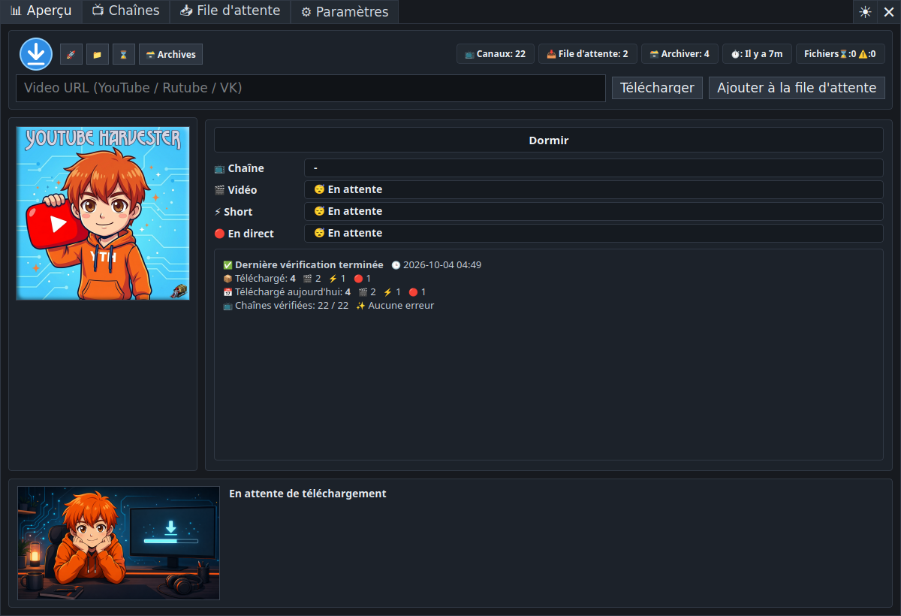
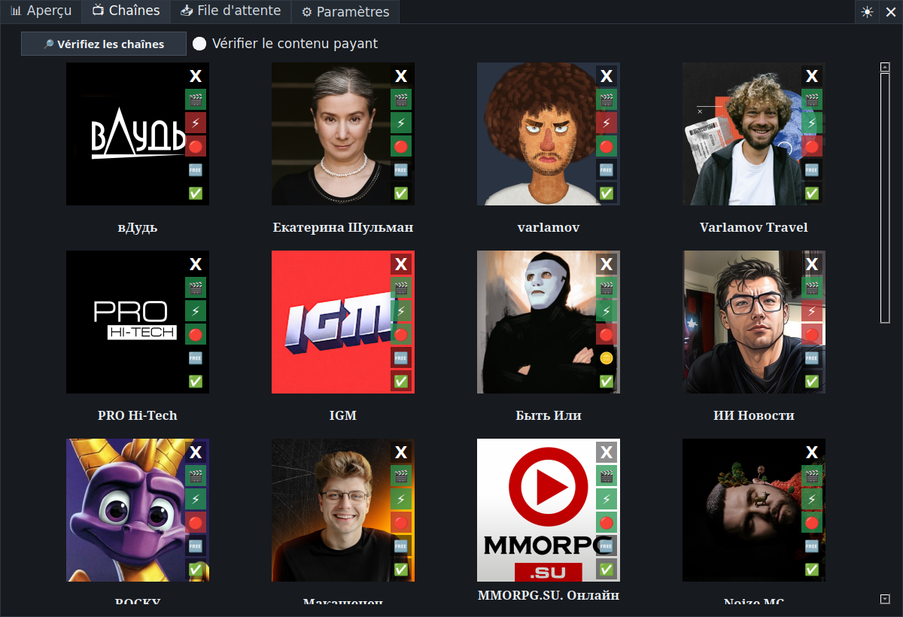
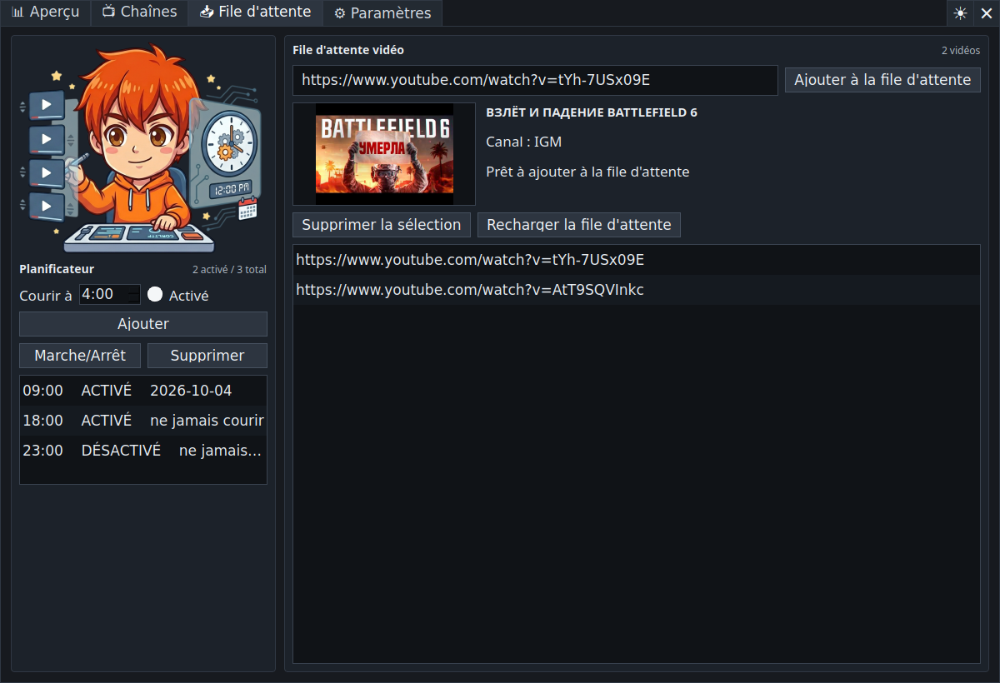
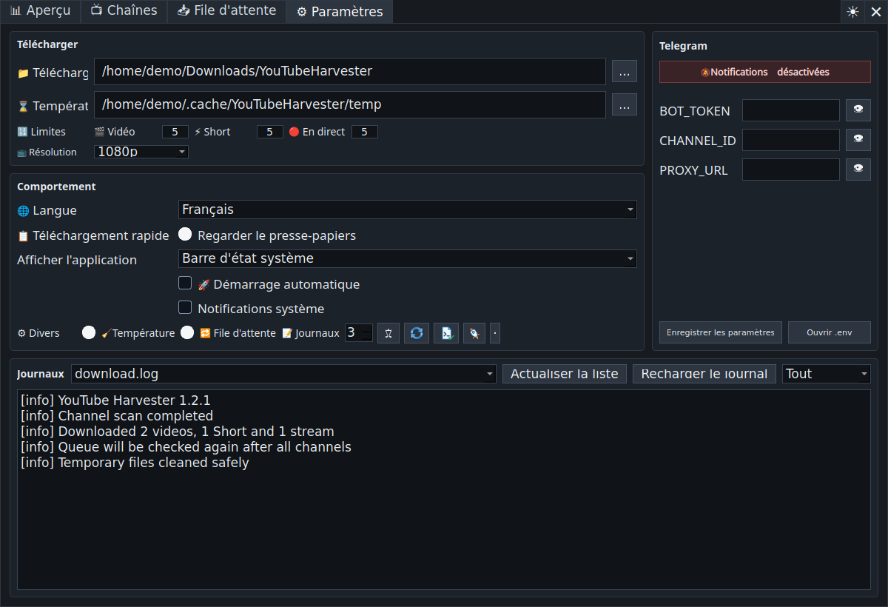
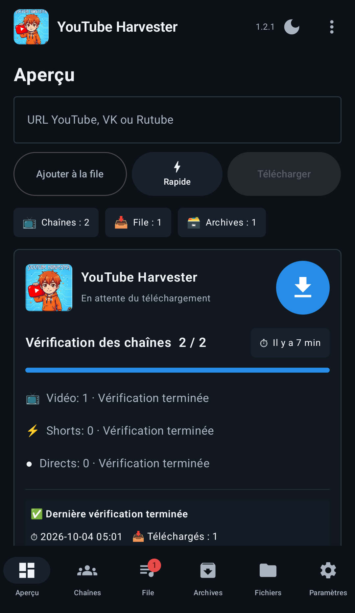
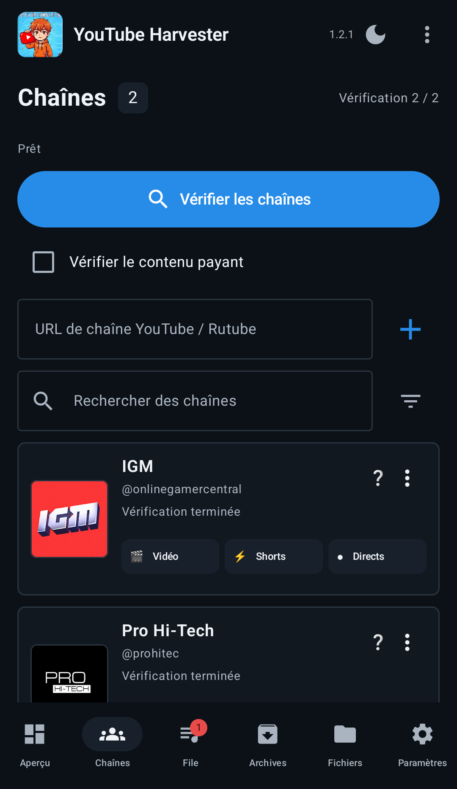
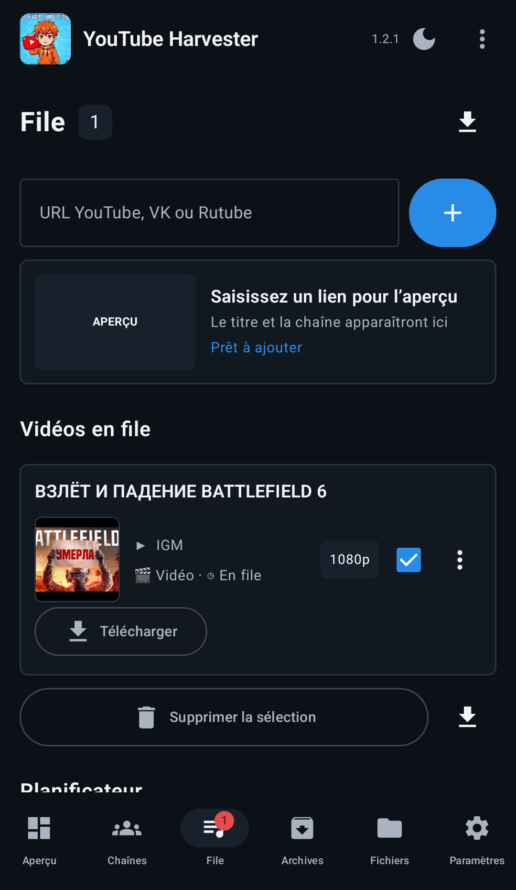
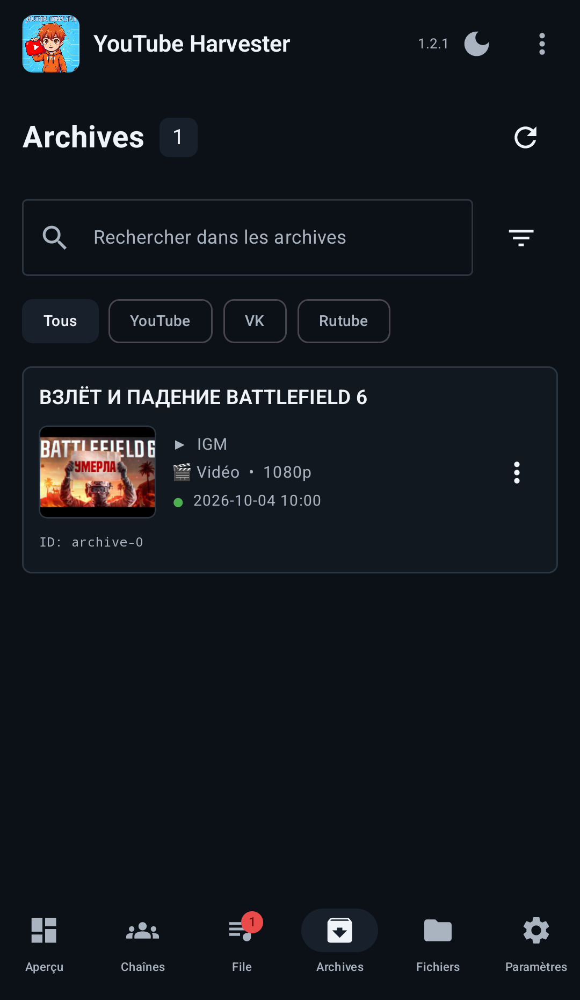
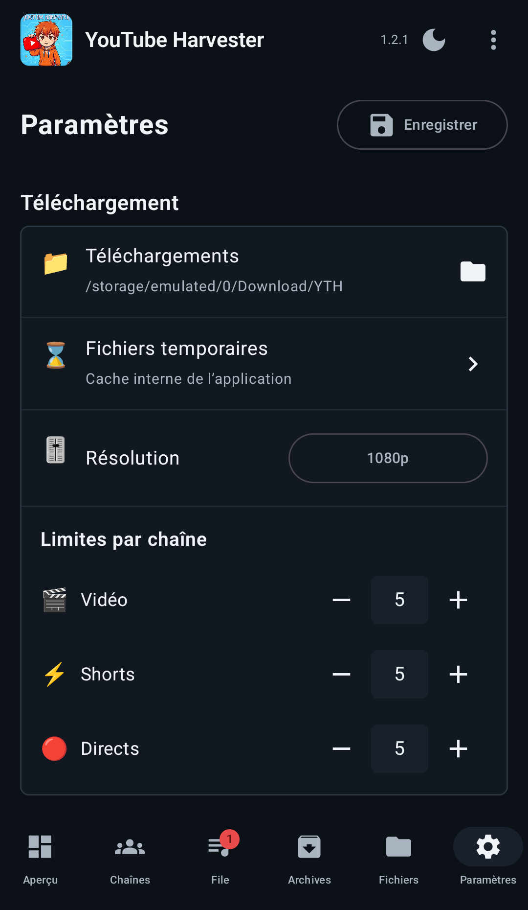

# YouTube Harvester 1.2.1

<p align="center">
  
</p>

<p align="center">
  <a href="README.md">🇺🇸 🇬🇧 English</a> ·
  <a href="README.ru.md">🇷🇺 Русский</a> ·
  <a href="README.uk.md">🇺🇦 Українська</a> ·
  <a href="README.be.md">🇧🇾 Беларуская</a> ·
  <a href="README.fr.md">🇫🇷 Français</a> ·
  <a href="README.es.md">🇪🇸 Español</a> ·
  <a href="README.hi.md">🇮🇳 हिन्दी</a> ·
  <a href="README.zh.md">🇨🇳 中文</a> ·
  <a href="README.ja.md">🇯🇵 日本語</a> ·
  <a href="README.ar.md">🇸🇦 العربية</a>
</p>

Téléchargeur multilingue pour **Linux, Windows et Android** : suivi des chaînes YouTube/Rutube, vidéos individuelles YouTube/Rutube/VK, file, archives, programmation et envoi facultatif vers Telegram.

## Version 1.2.1

Documentation actualisée : **2026-10-04**.

Les sources et paquets locaux utilisent **1.2.1**, sans beta/prerelease. Android : `versionCode 120100` ; les builds internes conservent `-debug`. Windows a été recompilé depuis les mêmes sources actuelles que Linux, avec Rutube et la reprise après interruption.

**Préparation, pas annonce de publication.** Les installateurs PC et quatre APK de test sont construits localement. La validation publique Android reste inachevée ; les APK de test gardent le certificat de développement. Retirer beta du numéro ne les transforme pas en versions publiques.

Linux et Windows partagent le moteur Python/yt-dlp ; l'ancien Bash reste uniquement du code historique désactivé.

[Vérification des versions](docs/version-1.2.1-20261003.md) · [Préparation de 1.2.1](docs/releases/1.2.1.md).

## Fonctions Sur PC

- Vue d'ensemble en direct : progression des chaînes, type de média, étape du
  téléchargement, vitesse, durée restante, taille, événements et bilans.
- Fiches de chaînes avec leurs images originales en cache et interrupteurs
  séparés pour les vidéos, Shorts et directs.
- Recherche facultative de contenu payant avec trois états : inconnu,
  members-only trouvé, ou aucun contenu members-only trouvé pendant le contrôle.
- Champ URL dans l'onglet Aperçu pour télécharger immédiatement ou ajouter à la
  file.
- File vidéo avec titre, chaîne, miniature, détection des doublons et archives,
  nouvelle tentative et second passage après toutes les chaînes.
- Fenêtre Téléchargement rapide avec URL du presse-papiers, métadonnées,
  résolution, plusieurs pistes audio et sous-titres, téléchargement immédiat,
  file et case Telegram persistante.
- Raccourci global configurable, `Ctrl+Shift+Alt+Y` par défaut.
- Surveillance facultative du presse-papiers pour les URL YouTube, Rutube ou
  VK prises en charge.
- Planificateur d'exécutions automatiques par heure.
- Archive détaillée avec type, chaîne, titre, date, lien source, variantes de
  qualité et de pistes, fichier local, dossier et suppression d'entrée.
- Journaux filtrables par Tout, Important et Erreurs.
- Mise à jour vérifiée de l'application depuis les versions GitHub officielles
  pour les installations, les versions portables et les paquets Linux.
- Contrôle et mise à jour sécurisée de `yt-dlp` dans l'interface, avec diagnostic du système, X11/Wayland, zone de
  notification, raccourci, outils, chemins, cache, écriture et espace disque.
- Thèmes sombre, clair et système.
- Démarrage dans la zone de notification, la barre des tâches ou les deux.
- Arrêt sûr, nettoyage temporaire protégé, noms compatibles Windows et UTF-8
  fiable dans les journaux et archives Windows.
- Anglais par défaut, avec russe, ukrainien, biélorusse, français, espagnol,
  hindi, chinois, japonais et arabe.

## Sources et Traitement

- **Chaînes YouTube :** vidéos, Shorts, directs ; interrupteurs et limites distincts, adresses handle/channel/user/custom.
- **Chaînes Rutube :** `/channel/ID/` et `/u/name/`, y compris Vidéos/Shorts. Résolution des alias contre les doublons, noms et images en cache.
- **Émissions Rutube :** `/metainfo/tv/ID/`, titre/affiche propres, Vidéos uniquement ; les N dernières entrées, des plus récentes aux plus anciennes.
- **Vidéos individuelles :** YouTube, Rutube, VK/VK Video par champ manuel, file ou téléchargement rapide. Pas de suivi de chaînes VK ni de listes Rutube arbitraires.

Les directs et le contrôle payant sont désactivés pour Rutube. La détection payante YouTube signale la disponibilité : elle ne contourne pas l'accès et ne garantit pas le téléchargement. Le menu d'une chaîne peut marquer les dernières entrées traitées sans les télécharger.

Un cycle traite la file, puis les sections activées avec téléchargements successifs, puis à nouveau la file. Les éléments archivés/doublons sont ignorés. Le contrôle de l'onglet Chaînes valide les sections ; le cycle complet démarre depuis Aperçu ou le programmeur. Les archives conservent les variantes de qualité/pistes.

Un arrêt sur PC ne bloque plus le prochain démarrage. Nettoyage protégé et reprises conservés ; ne supprimez pas les fichiers temporaires pendant un téléchargement. En cas d'échec de source/VPN/proxy, vérifiez connexion et journaux. Les limites régionales, de compte et de protocole demeurent.

## Android

Application native Kotlin/Jetpack Compose pour **Android 8.0+ (API 26)** ; ABI `arm64-v8a`, `armeabi-v7a`, `x86_64`, `x86`.

- Aperçu, Chaînes, File, Archives, Paramètres et accès au dossier ; dix langues, thèmes sombre/clair/système et arabe RTL.
- Mêmes catégories de sources, chaînes/émissions Rutube comprises ; limites, marquage, programmation, métadonnées et images.
- URL immédiatement téléchargée ; le bouton Rapide lit le presse-papiers uniquement sur appui explicite. Partager ouvre les options. Le raccourci ouvre Aperçu ; surveillance facultative du presse-papiers uniquement au premier plan.
- Résolution, pistes audio/sous-titres multiples ; tâches persistantes, pause/reprise/annulation/nouvel essai, notifications et foreground-service. La reprise conserve tâche/fichiers partiels ; la continuation des octets dépend de la source.
- Reprise des cycles WorkManager, rapports/totaux quotidiens, redémarrage, MediaStore/SAF, fichiers d'archive, journaux/diagnostic. Après un arrêt forcé Android, rouvrir l'app ; les restrictions de batterie du constructeur peuvent limiter l'arrière-plan.
- Telegram avec identifiants protégés par Android Keystore. `.ythbackup` protégé par mot de passe transfère données/réglages, **pas vidéos ni fichiers temporaires**. Import dans une base vide ; réassociation vérifiée des dossiers pour les fichiers déplacés.
- L'actualisation APK vérifie SHA-256, paquet, versionCode supérieur et certificat installé avant l'installateur Android. `yt-dlp` est actualisé **avec l'application**, pas remplacé séparément.

**VK sur Android :** vidéos individuelles VK/VK Video prises en charge ; téléchargement public vérifié sur LDPlayer le 2026-09-14. Pas de suivi de chaînes VK. Les vidéos privées ou restreintes peuvent être indisponibles.

[Guide Android](android/README.md) · [Instructions de transfert](android/DATA-TRANSFER.ru.md).

## État de La Publication Android

Avant publication : terminer certificat permanent/sauvegarde indépendante, sources natives correspondantes/licences/audit de sécurité, migration sur le candidat signé exact, essais ARM, ancien Android pris en charge, Android 15+ boot/resume, pages de 16 Ko et TalkBack. Puis valider APK finaux et emballage.

**Ne désinstallez pas l'app de test pour changer de certificat.** Le transfert chiffré a été testé dans un paquet QA isolé, sans valider le candidat public final.

[Préparation du lancement](android/RELEASE-READINESS.ru.md).

## Captures d'écran

| Aperçu | Chaînes |
| --- | --- |
|  |  |

| File et planificateur | Paramètres et journaux |
| --- | --- |
|  |  |

### Android

Android 1.2.1, thème sombre. Données de démonstration.

| Aperçu | Chaînes |
| --- | --- |
|  |  |

| File | Archives |
| --- | --- |
|  |  |

**Paramètres**



[Catalogue et provenance des captures](docs/screenshots/README.md).

## Téléchargements

Fichiers PC préparés localement : `dist/release/`. Après publication, ils seront disponibles dans [GitHub Releases](https://github.com/LiberVixer/YouTubeHarvester/releases) ; ce README n'affirme pas que 1.2.1 est déjà publiée.

| Plateforme | Fichiers |
| --- | --- |
| Linux | `YouTubeHarvester_1.2.1_linux_all.deb`, `YouTubeHarvester_1.2.1_source.tar.gz`, `SHA256SUMS-linux.txt` |
| Windows x64 | `YouTubeHarvester_1.2.1_windows_setup.exe`, `YouTubeHarvester_1.2.1_windows_x64.msi`, `YouTubeHarvester_1.2.1_windows_portable.zip`, `SHA256SUMS-windows.txt` |

APK privés de test : `android/YouTubeHarvester-1.2.1-<ABI>.apk`, **pas des fichiers publics**. La publication Android exige aussi sources application/runtime, BUILD-INFO et SHA256SUMS.

## Installation sous Linux

```bash
sudo apt install ./YouTubeHarvester_1.2.1_linux_all.deb
yt-harvester
```

Emplacements utilisateur :

- données : `~/.local/share/yt-harvester`
- paramètres : `~/.config/yt-harvester`
- cache : `~/.cache/yt-harvester`
- Telegram : `~/.config/yt-harvester/.env`
- fichiers temporaires : `~/temp/YTH`
- téléchargements : `~/Downloads/YouTubeHarvester`

Le `.deb` utilise les paquets Python/Qt/yt-dlp/FFmpeg/curl de la distribution sans les actualiser silencieusement. Les versions peuvent différer des pins de développement/Windows. Deno est suggéré, non inclus ; fournir un runtime JavaScript compatible pour YouTube.

## Installation sous Windows

Setup EXE/MSI x64, ou extraire le ZIP portable et lancer `YouTubeHarvester.exe`. Python, yt-dlp, FFmpeg/FFprobe et Deno sont inclus. Données/cache : `%LOCALAPPDATA%\YouTubeHarvester` ; paramètres : `%APPDATA%\YouTubeHarvester` ; temporaires : `%TEMP%\YTH`. Démarrage automatique : clé utilisateur `HKCU\Software\Microsoft\Windows\CurrentVersion\Run`.

## Installer et Mettre à Jour Android

Pour les testeurs autorisés, choisir l'ABI et actualiser avec le même certificat, sans désinstaller ni effacer les données. Autoriser uniquement une source d'installation fiable, les notifications si nécessaire, puis sélectionner le dossier. Par défaut `Download/YTH`, ou dossier SAF. Un APK signé autrement ne peut pas écraser l'installation de test.

## Exécution depuis les sources

Linux utilise `.venv` si présent ; `YTD_PYTHON` choisit l'interpréteur. Environnements verrouillés vérifiés sur Python 3.12. FFmpeg/FFprobe et le runtime JavaScript sont externes ; le script ci-dessous récupère Deno/FFmpeg avec contrôle des empreintes.

Récupérez les outils seulement s'ils manquent : le script refuse d'écraser un dossier existant. Conservez votre `.env` et saisissez vos paramètres Telegram dans l'app ou votre fichier. Ne publiez pas ce fichier.

Linux:

```bash
sudo apt install python3 python3-venv python3-pyqt5 python3-pynput python3-dbus ffmpeg curl
python3 -m venv .venv
.venv/bin/python -m pip install -r requirements-linux-lock.txt
.venv/bin/python scripts/fetch_desktop_tools.py --platform linux --output tools/linux
cp -n .env.example .env
./start_tray.sh
```

Les sources Windows demandent aussi FFmpeg/FFprobe et Deno ; le constructeur utilise les outils locaux épinglés ou les télécharge et vérifie.

Windows:

```powershell
py -3.12 -m venv .venv
.\.venv\Scripts\python -m pip install -r requirements-windows-lock.txt
.\.venv\Scripts\python scripts/fetch_desktop_tools.py --platform windows --output tools/windows
.\start_tray_windows.bat
```

[Exécution depuis les sources Windows (offline)](docs/windows-offline-build.md).

## Options de lancement

```bash
yt-harvester
yt-harvester --quick-download
yt-harvester --show-main
yt-harvester --start-tray
yt-harvester --start-window
yt-harvester --start-both
```

`--quick-download` ouvre la fenêtre rapide et transmet la demande à l'instance
déjà active. `--show-main` affiche la fenêtre principale de cette instance.
Les autres options choisissent la zone de notification, la barre
des tâches ou les deux. Options internes : `--run-yt-dlp ...` et
`--run-script <script.py> ...`.

## Téléchargement rapide, X11 et Wayland

Windows emploie un raccourci global natif et Linux/X11 utilise `pynput`.
Wayland bloque généralement l'enregistrement direct des touches globales ;
l'application peut donc créer un raccourci système Cinnamon/GNOME exécutant
`yt-harvester --quick-download`. Le presse-papiers Wayland est lu avec
`wl-paste` lorsque `wl-clipboard` est installé.

## Telegram

Telegram peut être entièrement désactivé. Sinon, configurez l'interface ou
`.env` :

```bash
BOT_TOKEN=your-telegram-bot-token
CHANNEL_ID=your-telegram-channel-id
PROXY_URL=127.0.0.1:9050
```

Le proxy est facultatif. Une panne Telegram ne supprime jamais une vidéo déjà
enregistrée localement.

## Composants Épinglés

Versions examinées du projet, pas garantie pour chaque installation ni affirmation de versions upstream les plus récentes. Graphes PC : `requirements-linux-lock.txt`, `requirements-windows-lock.txt`. Pins/empreintes Android : `android/runtime.properties`, `android/gradle/verification-metadata.xml`.

| Composant | Développement PC / Windows | Android |
| --- | --- | --- |
| yt-dlp | 2026.08.19 | 2026.08.19 |
| FFmpeg / FFprobe | 9.0.2 | 7.1.1 |
| Deno / QuickJS | Deno 2.9.7 | QuickJS 2026-06-04 |
| PyQt5 / Compose BOM | PyQt5 5.15.11 | Compose 2026.09.00 |
| Qt runtime | Linux 5.15.19 / Windows 5.15.2 | - |
| Room / WorkManager | - | 2.8.5 / 2.12.0 |
| Coil | - | 3.6.3 |
| PyInstaller / AGP / Gradle | PyInstaller 6.22.3 | AGP 9.4.1 / Gradle 9.8.0 |
| Kotlin Compose compiler / KSP | - | 2.4.20 / 2.3.12 |

Android conserve Python 3.12.11, OpenSSL 3.5.2 et FFmpeg 7.1.1 upstream ; reconstruction compatible et sources correspondantes à terminer. QuickJS 2026-06-04 et WebP/SharpYUV 1.6.0 reconstruits pour quatre ABI, alignement 16 Ko. Le contrôle statique ne remplace pas un appareil 16 Ko.

[Mise à jour des composants](docs/component-update-20261003.md) · [Reconstruction native](android/native/README.md).

## Compilation

Tags PC `v*` ; Android `android-v<versionName>`, workflow distinct. La signature publique demande le certificat permanent approuvé et les sources runtime correspondantes vérifiées. Ne publiez jamais clés, mots de passe, tokens ni APK non signés/privés de test.

Linux:

```bash
packaging/build_release.sh 1.2.1 1.2.1
```

Windows:

```powershell
powershell -ExecutionPolicy Bypass -File .\packaging\windows\build_release.ps1 `
  -Version 1.2.1 -MsiVersion 1.2.1
```

Android (JDK 17, Android SDK, Gradle Wrapper):

```bash
cd android
./gradlew testDebugUnitTest assembleDebug
python3 -m unittest discover -s scripts -p 'test_*.py' -v
```

[Publication et signature Android](android/RELEASING.md)

## Vérifications et Limites

Derniers essais locaux : **88 tests Python PC**, **35 Python Android**, **149 JVM Android**, 50 captures Android réussies. L'alignement de version a aussi validé **80 tests Windows** (deux POSIX ignorés) et **36 tests LDPlayer sélectionnés**, Android 14/API 34 x86_64.

Outils PC et téléchargement/remux local H.264/AAC vérifiés. Quatre APK validés pour manifeste/certificat/ZIP et alignement natif 64 bits applicable. Ces passages ne prouvent pas ARM, l'arrière-plan de tous les appareils ni installation/désinstallation des nouveaux installateurs Windows. La documentation ne reconstruit ni ne publie les copies installées.

[Plan de test Android](android/TEST-PLAN.ru.md).

## Licences et Usage Responsable

Le **module Android est GPL-3.0-only**, approuvé par le propriétaire : [LICENSE](android/LICENSE), [NOTICE](android/NOTICE), [décision](android/legal/README.md). Les licences PC et tierces ne changent pas. Les sources runtime correspondantes complètes restent obligatoires pour la publication Android.

Aucune affiliation avec YouTube, Google, Rutube, VK, Telegram ou yt-dlp. Ne téléchargez que des médias autorisés ; respectez conditions des services et lois applicables. Gardez identifiants et mots de passe privés.

## Remerciements

Un grand merci à Dmitry **'Minion' Pororiliy** pour son aide inestimable lors
des tests bêta de la version Windows.

Un Harvester de **Command & Conquer: Red Alert** a été ajouté au logo du
programme. 🙂

Consultez le [journal des modifications français](CHANGELOG.fr.md).
