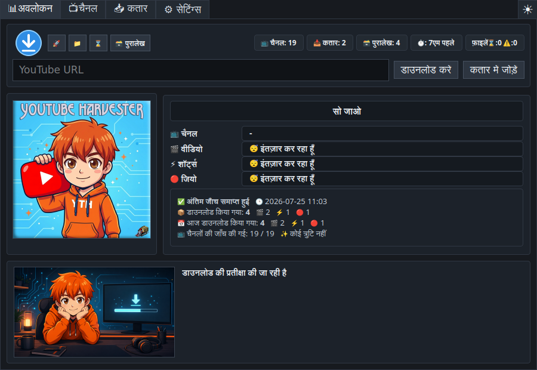
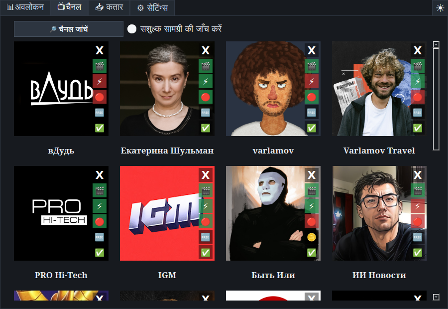
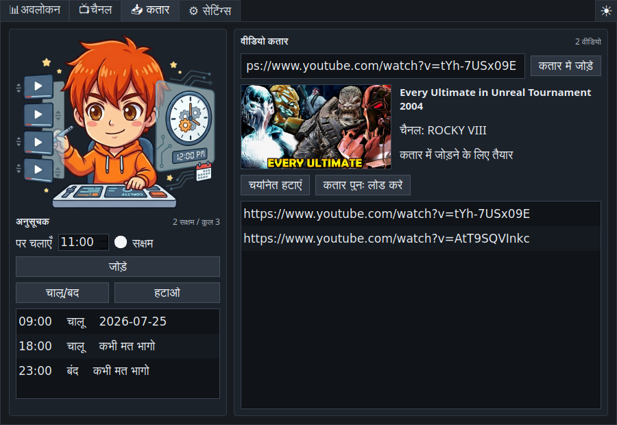
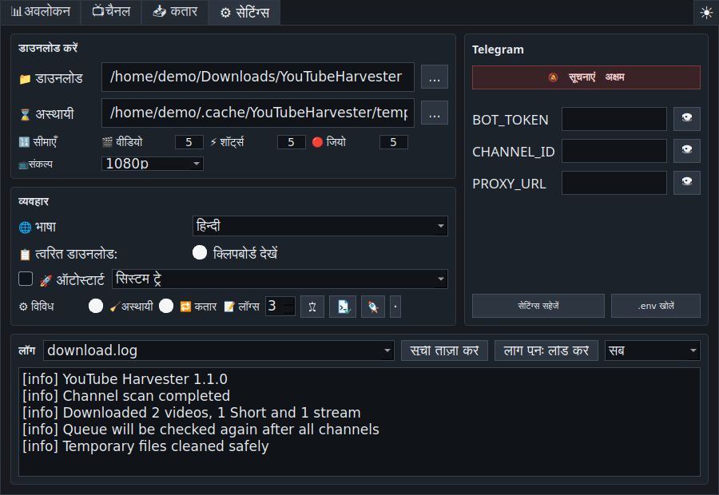

# YouTube Harvester 1.1.0

<p align="center">
  
</p>

<p align="center">
  <a href="README.md">🇺🇸 🇬🇧 English</a> ·
  <a href="README.ru.md">🇷🇺 Русский</a> ·
  <a href="README.uk.md">🇺🇦 Українська</a> ·
  <a href="README.fr.md">🇫🇷 Français</a> ·
  <a href="README.es.md">🇪🇸 Español</a> ·
  <a href="README.hi.md">🇮🇳 हिन्दी</a> ·
  <a href="README.zh.md">🇨🇳 中文</a> ·
  <a href="README.ar.md">🇸🇦 العربية</a>
</p>

<p align="center">
  Linux और Windows के लिए बहुभाषी YouTube डाउनलोडर — चैनल निगरानी, मैनुअल
  कतार, त्वरित डाउनलोड, समय-सारणी, संग्रह और वैकल्पिक Telegram प्रेषण के साथ।
</p>



## परिचय

**YouTube Harvester** चुने गए YouTube चैनलों की निगरानी करता है और `yt-dlp`
से नए वीडियो, Shorts और लाइव स्ट्रीम डाउनलोड करता है। इसमें अलग वीडियो लिंक
जोड़े जा सकते हैं, स्थानीय संग्रह रखा जा सकता है, रिपोर्ट देखी जा सकती है और
Telegram पर सूचनाएँ या फ़ाइलें भेजी जा सकती हैं।

संस्करण `1.1.0` Linux और Windows दोनों पर Python इंजन का उपयोग करता है। पुराना
Bash इंजन स्रोत में केवल निष्क्रिय विरासत कोड के रूप में रखा गया है।

## मुख्य सुविधाएँ

- चैनल प्रगति, मीडिया प्रकार, डाउनलोड चरण, गति, शेष समय, आकार, हाल की घटनाएँ
  और सत्र व दिन के योग वाला लाइव अवलोकन।
- मूल कैश की गई चैनल छवियों वाली कार्ड और वीडियो, Shorts तथा लाइव स्ट्रीम के
  लिए अलग स्विच।
- भुगतान सामग्री की वैकल्पिक जाँच: अज्ञात, members-only मिला, या जाँच में कोई
  members-only सामग्री नहीं मिली।
- अवलोकन टैब पर URL फ़ील्ड, तुरंत डाउनलोड और कतार में जोड़ने की क्रियाएँ।
- शीर्षक, चैनल और थंबनेल पूर्वावलोकन वाली वीडियो कतार; डुप्लिकेट/संग्रह जाँच,
  पुनः प्रयास और सभी चैनलों के बाद दूसरी कतार प्रक्रिया।
- क्लिपबोर्ड URL, मेटाडेटा, रिज़ॉल्यूशन, तुरंत डाउनलोड, कतार और सहेजी गई
  Telegram चेकबॉक्स वाली त्वरित डाउनलोड विंडो।
- बदलने योग्य ग्लोबल हॉटकी; डिफ़ॉल्ट `Ctrl+Shift+Alt+Y`।
- मान्य YouTube URL मिलने पर त्वरित डाउनलोड खोलने वाली क्लिपबोर्ड निगरानी।
- चुने हुए घंटों पर स्वचालित चलाने का समय-सारणी प्रबंधक।
- प्रकार, चैनल, शीर्षक, तारीख, YouTube लिंक, स्थानीय फ़ाइल, फ़ोल्डर और रिकॉर्ड
  हटाने वाला विस्तृत संग्रह।
- सभी, महत्वपूर्ण और त्रुटियाँ फ़िल्टर वाले लॉग।
- `yt-dlp` संस्करण जाँच और OS, X11/Wayland, ट्रे, हॉटकी, टूल, पथ, कैश, लिखने
  की अनुमति तथा डिस्क स्थान की डायग्नोस्टिक्स।
- डार्क, लाइट और सिस्टम थीम।
- केवल सिस्टम ट्रे, केवल टास्कबार या दोनों में शुरुआत।
- सुरक्षित रोक, संरक्षित अस्थायी सफ़ाई, Windows-सुरक्षित नाम और Windows लॉग व
  संग्रह में सही UTF-8।
- डिफ़ॉल्ट अंग्रेज़ी; रूसी, यूक्रेनी, फ़्रेंच, स्पेनी, हिन्दी, चीनी और अरबी भी
  उपलब्ध।

## स्क्रीनशॉट

| अवलोकन | चैनल |
| --- | --- |
|  |  |

| कतार और समय-सारणी | सेटिंग्स और लॉग |
| --- | --- |
|  |  |

## डाउनलोड

तैयार पैकेज
[GitHub Releases](https://github.com/LiberVixer/YouTubeHarvester/releases) पर
मिलते हैं।

Linux: `YouTubeHarvester_1.1.0_linux_all.deb`,
`YouTubeHarvester_1.1.0_source.tar.gz` और `SHA256SUMS-linux.txt`।

Windows: `YouTubeHarvester_1.1.0_windows_setup.exe`,
`YouTubeHarvester_1.1.0_windows_x64.msi`,
`YouTubeHarvester_1.1.0_windows_portable.zip` और `SHA256SUMS-windows.txt`।

Windows पैकेज में `yt-dlp`, `ffmpeg.exe`, `ffprobe.exe` और `deno.exe` शामिल हैं।

## Linux में स्थापना

```bash
sudo apt install ./YouTubeHarvester_1.1.0_linux_all.deb
yt-harvester
```

उपयोगकर्ता पथ:

- डेटा: `~/.local/share/yt-harvester`
- सेटिंग्स: `~/.config/yt-harvester`
- कैश: `~/.cache/yt-harvester`
- Telegram: `~/.config/yt-harvester/.env`
- अस्थायी फ़ाइलें: `~/temp/YTH`
- डाउनलोड: `~/Downloads/YouTubeHarvester`

## Windows में स्थापना

रिलीज़ से Setup EXE, MSI या portable ZIP चुनें। ये बिल्ड आत्मनिर्भर हैं; Python,
FFmpeg या Deno अलग से स्थापित करने की आवश्यकता नहीं है। ऑटोस्टार्ट
`HKCU\Software\Microsoft\Windows\CurrentVersion\Run` का उपयोग करता है।

## स्रोत से चलाना

Linux:

```bash
sudo apt install python3 python3-pyqt5 python3-pynput yt-dlp ffmpeg curl
sudo apt install wl-clipboard  # Wayland के लिए अनुशंसित
cp .env.example .env
./start_tray.sh
```

Windows:

```powershell
py -3 -m venv .venv
.\.venv\Scripts\python -m pip install -r requirements.txt
.\start_tray_windows.bat
```

कमज़ोर इंटरनेट के लिए
[ऑफ़लाइन Windows बिल्ड मार्गदर्शिका](docs/windows-offline-build.md) देखें।

## लॉन्च विकल्प

```bash
yt-harvester
yt-harvester --quick-download
yt-harvester --start-tray
yt-harvester --start-window
yt-harvester --start-both
```

`--quick-download` त्वरित विंडो खोलता है और अनुरोध पहले से चल रहे इंस्टेंस को
देता है। अन्य विकल्प ट्रे, टास्कबार या दोनों चुनते हैं। आंतरिक विकल्प:
`--run-yt-dlp ...` और `--run-script <script.py> ...`।

## त्वरित डाउनलोड, X11 और Wayland

Windows नेटिव ग्लोबल हॉटकी और Linux/X11 `pynput` का उपयोग करता है। Wayland
आमतौर पर सीधे ग्लोबल कुंजी पंजीकरण रोकता है, इसलिए ऐप Cinnamon/GNOME में
`yt-harvester --quick-download` चलाने वाला सिस्टम शॉर्टकट बना सकता है।
`wl-clipboard` स्थापित होने पर Wayland क्लिपबोर्ड `wl-paste` से पढ़ा जाता है।

## चैनल और कतार का क्रम

सक्रिय खंड क्रम से जाँचे जाते हैं और हर पूरे परिणाम के बाद छोटी रोक होती है।
विकल्प सक्रिय होने पर स्पष्ट चैनल जाँच के दौरान members-only खोजा जाता है।
सामान्य स्कैन में सदस्य वीडियो मिलने पर भी चैनल स्थिति अपडेट होती है और घटना
लाल त्रुटि के बिना महत्वपूर्ण सूची में दिखाई देती है।

कतार शुरुआत में और सभी चैनलों के बाद फिर से चलती है। डुप्लिकेट व संग्रहित
वीडियो छोड़ दिए जाते हैं; विफल लिंक को पुनः प्रयास के लिए लौटाया जा सकता है।

## Telegram

Telegram को पूरी तरह बंद किया जा सकता है। उपयोग के लिए इंटरफ़ेस या `.env`
भरें:

```bash
BOT_TOKEN=your-telegram-bot-token
CHANNEL_ID=your-telegram-channel-id
PROXY_URL=127.0.0.1:9050
```

प्रॉक्सी वैकल्पिक है। Telegram त्रुटि स्थानीय रूप से सहेजे गए वीडियो को नहीं
हटाती।

## रिलीज़ बनाना

```bash
packaging/build_release.sh 1.1.0 1.1.0
```

```powershell
powershell -ExecutionPolicy Bypass -File .\packaging\windows\build_release.ps1 `
  -Version 1.1.0 -MsiVersion 1.1.0
```

## ज़िम्मेदार उपयोग

YouTube Harvester, YouTube, Google, Telegram या `yt-dlp` से संबद्ध नहीं है।
केवल अपना, अनुमति प्राप्त, या निजी उपयोग के लिए कानूनी रूप से सहेजा जा सकने
वाला कंटेंट डाउनलोड करें।
[YouTube की शर्तों](https://www.youtube.com/t/terms), कॉपीराइट और स्थानीय
कानूनों का पालन करें। Telegram क्रेडेंशियल गोपनीय रखें।

बाहरी घटक: [`yt-dlp`](https://github.com/yt-dlp/yt-dlp), PyQt5/Qt,
FFmpeg/FFprobe, Deno, `curl`, Telegram Bot API और `pynput`; हर घटक का अपना
लाइसेंस है।

## धन्यवाद

Windows संस्करण की बीटा जाँच में अमूल्य सहायता के लिए Dmitry
**'Minion' Pogorilov** को विशेष धन्यवाद।

प्रोग्राम के लोगो में **Command & Conquer: Red Alert** का Harvester जोड़ा गया
है। 🙂

पूरा इतिहास [हिन्दी चेंजलॉग](CHANGELOG.hi.md) में है।
