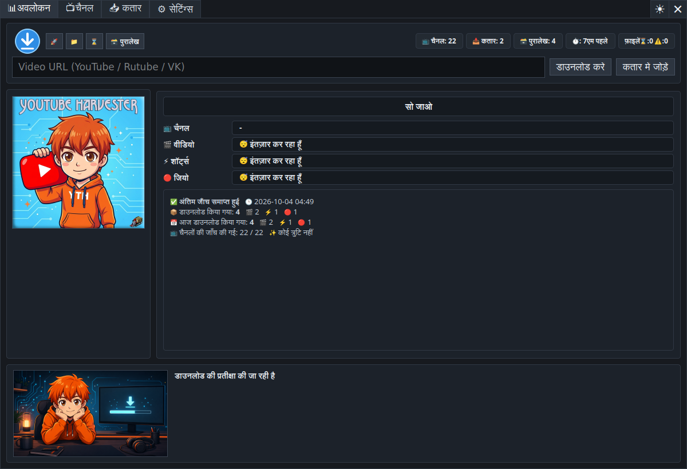
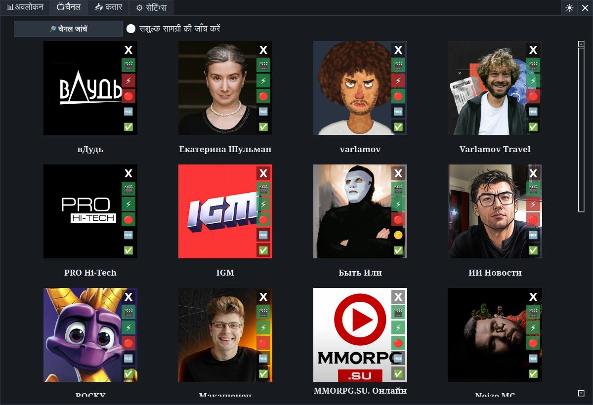
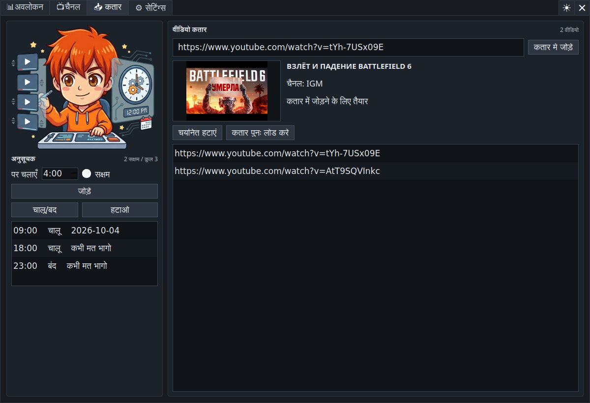
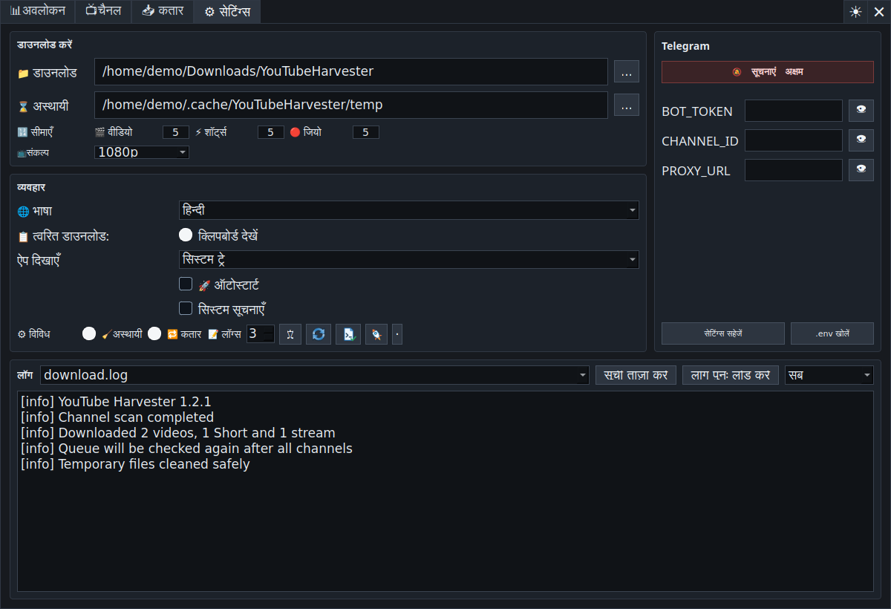
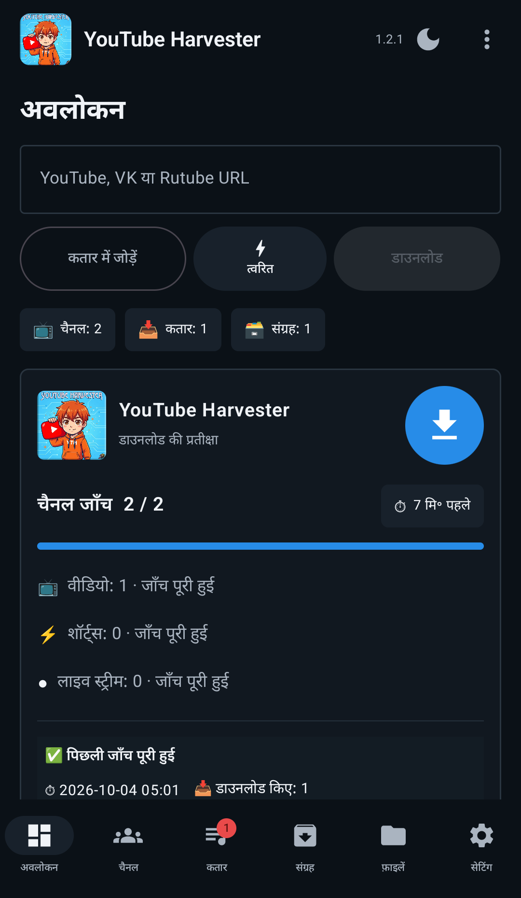
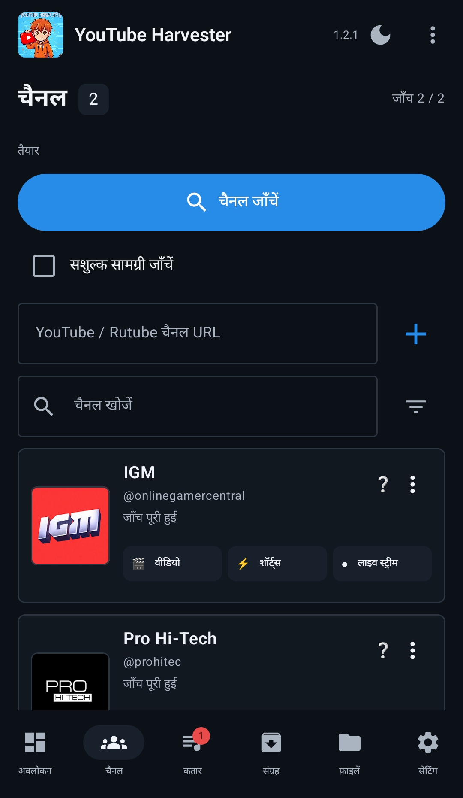
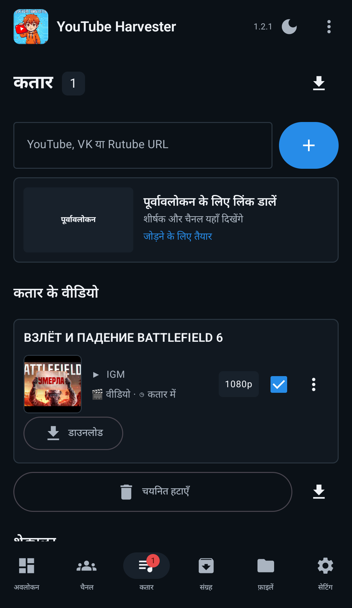
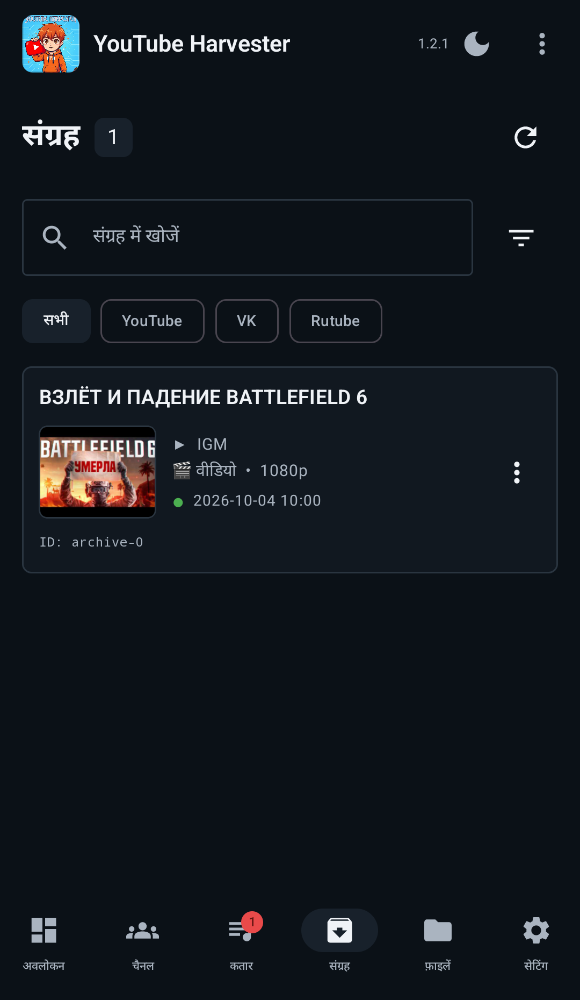
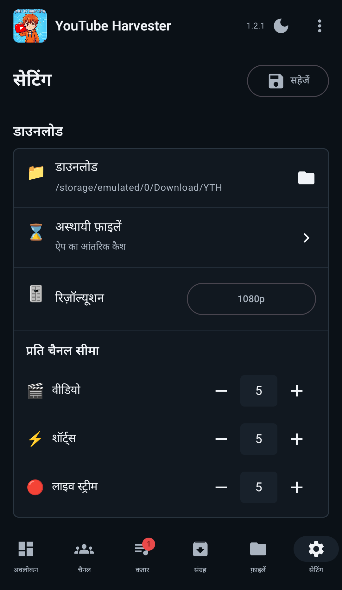

# YouTube Harvester 1.2.1

<p align="center">
  
</p>

<p align="center">
  <a href="README.md">🇺🇸 🇬🇧 English</a> ·
  <a href="README.ru.md">🇷🇺 Русский</a> ·
  <a href="README.uk.md">🇺🇦 Українська</a> ·
  <a href="README.be.md">🇧🇾 Беларуская</a> ·
  <a href="README.fr.md">🇫🇷 Français</a> ·
  <a href="README.es.md">🇪🇸 Español</a> ·
  <a href="README.hi.md">🇮🇳 हिन्दी</a> ·
  <a href="README.zh.md">🇨🇳 中文</a> ·
  <a href="README.ja.md">🇯🇵 日本語</a> ·
  <a href="README.ar.md">🇸🇦 العربية</a>
</p>

**Linux, Windows और Android** के लिए बहुभाषी डाउनलोडर: YouTube/Rutube चैनल निगरानी, अलग YouTube/Rutube/VK वीडियो, कतार, संग्रह, समय-सारणी और वैकल्पिक Telegram फ़ाइलें या सूचनाएँ।

## संस्करण 1.2.1

दस्तावेज़ अद्यतन: **2026-10-04**।

वर्तमान स्रोत और स्थानीय पैकेज **1.2.1** हैं, beta/prerelease के बिना। Android में `versionCode 120100`; आंतरिक debug बिल्ड में `-debug` रहता है। Windows को Linux के समान वर्तमान स्रोत से बनाया गया, जिसमें Rutube और बाधित डाउनलोड के बाद पुनर्प्राप्ति शामिल है।

**रिलीज़ की तैयारी है, प्रकाशन की घोषणा नहीं।** डेस्कटॉप इंस्टॉलर और चार परीक्षण APK स्थानीय रूप से बने हैं। सार्वजनिक Android स्वीकृति अधूरी है; परीक्षण APK में development प्रमाणपत्र है। beta हटाने से वे सार्वजनिक रिलीज़ नहीं बनते।

Linux और Windows समान Python/yt-dlp इंजन उपयोग करते हैं; पुराना Bash केवल बंद विरासत कोड है।

[संस्करण सत्यापन](docs/version-1.2.1-20261003.md) · [1.2.1 की तैयारी](docs/releases/1.2.1.md).

## डेस्कटॉप सुविधाएँ

- चैनल प्रगति, मीडिया प्रकार, डाउनलोड चरण, गति, शेष समय, आकार, हाल की घटनाएँ
  और सत्र व दिन के योग वाला लाइव अवलोकन।
- मूल कैश की गई चैनल छवियों वाली कार्ड और वीडियो, Shorts तथा लाइव स्ट्रीम के
  लिए अलग स्विच।
- भुगतान सामग्री की वैकल्पिक जाँच: अज्ञात, members-only मिला, या जाँच में कोई
  members-only सामग्री नहीं मिली।
- अवलोकन टैब पर URL फ़ील्ड, तुरंत डाउनलोड और कतार में जोड़ने की क्रियाएँ।
- शीर्षक, चैनल और थंबनेल पूर्वावलोकन वाली वीडियो कतार; डुप्लिकेट/संग्रह जाँच,
  पुनः प्रयास और सभी चैनलों के बाद दूसरी कतार प्रक्रिया।
- क्लिपबोर्ड URL, मेटाडेटा, रिज़ॉल्यूशन, कई ऑडियो व उपशीर्षक ट्रैक, तुरंत
  डाउनलोड, कतार और सहेजी गई Telegram चेकबॉक्स वाली त्वरित डाउनलोड विंडो।
- बदलने योग्य ग्लोबल हॉटकी; डिफ़ॉल्ट `Ctrl+Shift+Alt+Y`।
- समर्थित YouTube, Rutube या VK URL मिलने पर त्वरित डाउनलोड खोलने वाली
  क्लिपबोर्ड निगरानी।
- चुने हुए घंटों पर स्वचालित चलाने का समय-सारणी प्रबंधक।
- प्रकार, चैनल, शीर्षक, तारीख, स्रोत लिंक, गुणवत्ता व ट्रैक संस्करण, स्थानीय
  फ़ाइल, फ़ोल्डर और रिकॉर्ड हटाने वाला विस्तृत संग्रह।
- सभी, महत्वपूर्ण और त्रुटियाँ फ़िल्टर वाले लॉग।
- इंस्टॉल, पोर्टेबल और Linux पैकेज के लिए आधिकारिक GitHub Releases से सत्यापित
  एप्लिकेशन अपडेट।
- इंटरफ़ेस से सुरक्षित `yt-dlp` जाँच और अपडेट तथा OS, X11/Wayland, ट्रे, हॉटकी, टूल, पथ, कैश, लिखने
  की अनुमति तथा डिस्क स्थान की डायग्नोस्टिक्स।
- डार्क, लाइट और सिस्टम थीम।
- केवल सिस्टम ट्रे, केवल टास्कबार या दोनों में शुरुआत।
- सुरक्षित रोक, संरक्षित अस्थायी सफ़ाई, Windows-सुरक्षित नाम और Windows लॉग व
  संग्रह में सही UTF-8।
- डिफ़ॉल्ट अंग्रेज़ी; रूसी, यूक्रेनी, बेलारूसी, फ़्रेंच, स्पेनी, हिन्दी, चीनी,
  जापानी और अरबी भी उपलब्ध।

## स्रोत और कार्य क्रम

- **YouTube चैनल:** वीडियो, Shorts और लाइव स्ट्रीम के अलग स्विच/सीमाएँ; handle/channel/user/custom पते।
- **Rutube चैनल:** `/channel/ID/` और `/u/name/`, वीडियो/Shorts लिंक सहित। उपनाम ID में बदलकर डुप्लिकेट रोके जाते हैं; नाम और चित्र कैश होते हैं।
- **Rutube शो:** `/metainfo/tv/ID/`, अपना शीर्षक/पोस्टर, केवल वीडियो; नवीनतम N प्रविष्टियाँ, नई से पुरानी।
- **अलग वीडियो:** YouTube, Rutube और VK/VK Video, मैनुअल फ़ील्ड, कतार या त्वरित डाउनलोड से। VK चैनल निगरानी और मनमानी Rutube प्लेलिस्ट समर्थित नहीं हैं।

Rutube लाइव और भुगतान-सामग्री जाँच बंद है। YouTube भुगतान पहचान केवल उपलब्धता बताती है; प्रतिबंध नहीं हटाती और निजी वीडियो डाउनलोड की गारंटी नहीं देती। चैनल मेनू हाल की प्रविष्टियों को बिना डाउनलोड किए संसाधित चिह्नित कर सकता है।

पूरा चक्र: मैनुअल कतार, सक्षम चैनल अनुभागों के क्रमिक डाउनलोड, फिर कतार। संग्रहित और डुप्लिकेट खोजें छोड़ी जाती हैं। चैनल टैब अनुभागों की जाँच करता है; पूरा चक्र अवलोकन या समय-सारणी से चलता है। संग्रह गुणवत्ता/ट्रैक के भिन्न रूप रखता है।

डेस्कटॉप डाउनलोड रोकने से अगला रन अब नहीं रुकता। सुरक्षित अस्थायी सफ़ाई और पुनः प्रयास कायम हैं; सक्रिय डाउनलोड के दौरान अस्थायी फ़ाइलें न हटाएँ। स्रोत/VPN/प्रॉक्सी समस्या में पहले कनेक्शन और लॉग देखें। क्षेत्र, खाते और प्रोटोकॉल की सीमाएँ लागू रहती हैं।

## Android

**Android 8.0+ (API 26)** के लिए मूल Kotlin/Jetpack Compose ऐप; ABI `arm64-v8a`, `armeabi-v7a`, `x86_64`, `x86`।

- अवलोकन, चैनल, कतार, संग्रह, सेटिंग्स और डाउनलोड फ़ोल्डर; दस भाषाएँ, डार्क/लाइट/सिस्टम थीम और अरबी RTL।
- समान स्रोत श्रेणियाँ, Rutube चैनल/शो सहित; सीमाएँ, हाल की प्रविष्टियों का चिह्नांकन, समय-सारणी, मेटाडेटा और चित्र।
- दर्ज URL का तत्काल डाउनलोड; अवलोकन का त्वरित बटन स्पष्ट टैप पर ही क्लिपबोर्ड पढ़ता है। साझा करना विकल्प खोलता है। शॉर्टकट अवलोकन खोलता है; वैकल्पिक क्लिपबोर्ड निगरानी केवल अग्रभूमि ऐप में।
- रिज़ॉल्यूशन, कई ऑडियो/उपशीर्षक ट्रैक, स्थायी कार्य, रोकें/जारी रखें/रद्द/पुनः प्रयास, सूचनाएँ और foreground-service। जारी करना वही कार्य और आंशिक फ़ाइलें रखता है; बाइट स्तर पर जारी होना स्रोत पर निर्भर है।
- WorkManager पुनर्प्राप्ति, रिपोर्ट/दैनिक योग, रीबूट, MediaStore/SAF, संग्रह फ़ाइलें, लॉग/निदान। Android के बलपूर्वक रोकने के बाद ऐप फिर खोलें; निर्माता के बैटरी प्रतिबंध पृष्ठभूमि प्रभावित कर सकते हैं।
- Android Keystore सुरक्षित Telegram विवरण। पासवर्ड-सुरक्षित `.ythbackup` रिकॉर्ड/सेटिंग्स ले जाता है, **वीडियो या अस्थायी फ़ाइलें नहीं**। आयात को खाली डेटाबेस चाहिए; स्थानांतरित फ़ाइलों के फ़ोल्डर सत्यापित कर पुनः जोड़ें।
- APK अपडेट SHA-256, पैकेज, बड़ा versionCode और स्थापित प्रमाणपत्र जाँचकर Android इंस्टॉलर खोलता है। `yt-dlp` **ऐप के साथ** अपडेट होता है, अलग इंजन प्रतिस्थापन से नहीं।

**Android पर VK:** अलग VK/VK Video डाउनलोड समर्थित हैं; सार्वजनिक VK डाउनलोड LDPlayer पर 2026-09-14 को सत्यापित हुआ। VK चैनल निगरानी नहीं है। निजी या प्रतिबंधित वीडियो अनुपलब्ध हो सकते हैं।

[Android मार्गदर्शिका](android/README.md) · [डेटा स्थानांतरण](android/DATA-TRANSFER.ru.md).

## Android रिलीज़ स्थिति

प्रकाशन से पहले: स्थायी हस्ताक्षर/स्वतंत्र कुंजी बैकअप, संबंधित मूल runtime स्रोत/लाइसेंस/सुरक्षा समीक्षा, ठीक अंतिम हस्ताक्षरित उम्मीदवार पर माइग्रेशन; ARM, पुराना समर्थित Android, Android 15+ boot/resume, 16 KB पृष्ठ और TalkBack जाँच। फिर अंतिम APK और पैकेज सत्यापन।

**प्रमाणपत्र बदलने के लिए परीक्षण ऐप अनइंस्टॉल न करें।** अलग QA पैकेज में एन्क्रिप्टेड स्थानांतरण जाँचा गया है; अंतिम सार्वजनिक उम्मीदवार की स्वीकृति नहीं।

[रिलीज़ तैयारी](android/RELEASE-READINESS.ru.md).

## स्क्रीनशॉट

| अवलोकन | चैनल |
| --- | --- |
|  |  |

| कतार और समय-सारणी | सेटिंग्स और लॉग |
| --- | --- |
|  |  |

### Android

Android 1.2.1, डार्क थीम। प्रदर्शन डेटा।

| अवलोकन | चैनल |
| --- | --- |
|  |  |

| कतार | संग्रह |
| --- | --- |
|  |  |

**सेटिंग्स**



[स्क्रीनशॉट सूची और स्रोत](docs/screenshots/README.md).

## डाउनलोड

स्थानीय डेस्कटॉप फ़ाइलें: `dist/release/`। प्रकाशित होने पर डाउनलोड [GitHub Releases](https://github.com/LiberVixer/YouTubeHarvester/releases) में मिलेंगे; यह README नहीं कहता कि 1.2.1 पहले ही प्रकाशित है।

| प्लेटफ़ॉर्म | फ़ाइलें |
| --- | --- |
| Linux | `YouTubeHarvester_1.2.1_linux_all.deb`, `YouTubeHarvester_1.2.1_source.tar.gz`, `SHA256SUMS-linux.txt` |
| Windows x64 | `YouTubeHarvester_1.2.1_windows_setup.exe`, `YouTubeHarvester_1.2.1_windows_x64.msi`, `YouTubeHarvester_1.2.1_windows_portable.zip`, `SHA256SUMS-windows.txt` |

निजी परीक्षण APK: `android/YouTubeHarvester-1.2.1-<ABI>.apk`, **सार्वजनिक रिलीज़ फ़ाइलें नहीं**। Android प्रकाशन को ऐप/runtime स्रोत, BUILD-INFO और SHA256SUMS भी चाहिए।

## Linux में स्थापना

```bash
sudo apt install ./YouTubeHarvester_1.2.1_linux_all.deb
yt-harvester
```

उपयोगकर्ता पथ:

- डेटा: `~/.local/share/yt-harvester`
- सेटिंग्स: `~/.config/yt-harvester`
- कैश: `~/.cache/yt-harvester`
- Telegram: `~/.config/yt-harvester/.env`
- अस्थायी फ़ाइलें: `~/temp/YTH`
- डाउनलोड: `~/Downloads/YouTubeHarvester`

`.deb` वितरण के Python/Qt/yt-dlp/FFmpeg/curl उपयोग करता है, चुपचाप अपडेट नहीं करता। वास्तविक संस्करण विकास/Windows से अलग हो सकते हैं। Deno सुझाया गया है, शामिल नहीं; पूर्ण YouTube समर्थन के लिए संगत JavaScript runtime दें।

## Windows में स्थापना

x64 Setup EXE/MSI, या portable ZIP निकालकर `YouTubeHarvester.exe` चलाएँ। Python, yt-dlp, FFmpeg/FFprobe और Deno शामिल हैं। डेटा/कैश: `%LOCALAPPDATA%\YouTubeHarvester`; सेटिंग्स: `%APPDATA%\YouTubeHarvester`; अस्थायी: `%TEMP%\YTH`। स्वतः शुरू: उपयोगकर्ता कुंजी `HKCU\Software\Microsoft\Windows\CurrentVersion\Run`।

## Android स्थापना और अपडेट

अधिकृत परीक्षण के लिए सही ABI और उसी प्रमाणपत्र का अपडेट चुनें; अनइंस्टॉल या डेटा साफ़ न करें। केवल विश्वसनीय इंस्टॉल स्रोत को अनुमति दें, ज़रूरत पर सूचनाएँ और फ़ोल्डर चुनें। डिफ़ॉल्ट `Download/YTH` या SAF फ़ोल्डर। अलग हस्ताक्षर का APK परीक्षण इंस्टॉल पर नहीं चढ़ सकता।

## स्रोत से चलाना

Linux उपलब्ध `.venv` उपयोग करता है; `YTD_PYTHON` अन्य इंटरप्रेटर चुनता है। निश्चित वातावरण Python 3.12 पर जाँचे गए। FFmpeg/FFprobe और JavaScript runtime बाहरी हैं; नीचे का स्क्रिप्ट हैश जाँचकर Deno/FFmpeg लाता है।

टूल अनुपस्थित हों तभी लाएँ: स्क्रिप्ट मौजूदा फ़ोल्डर नहीं लिखता। अपनी `.env` सुरक्षित रखें; Telegram विवरण ऐप या अपनी फ़ाइल में भरें। फ़ाइल प्रकाशित न करें।

Linux:

```bash
sudo apt install python3 python3-venv python3-pyqt5 python3-pynput python3-dbus ffmpeg curl
python3 -m venv .venv
.venv/bin/python -m pip install -r requirements-linux-lock.txt
.venv/bin/python scripts/fetch_desktop_tools.py --platform linux --output tools/linux
cp -n .env.example .env
./start_tray.sh
```

Windows स्रोत को भी FFmpeg/FFprobe और Deno चाहिए; बिल्डर निश्चित स्थानीय टूल उपयोग करता है या डाउनलोड करके जाँचता है।

Windows:

```powershell
py -3.12 -m venv .venv
.\.venv\Scripts\python -m pip install -r requirements-windows-lock.txt
.\.venv\Scripts\python scripts/fetch_desktop_tools.py --platform windows --output tools/windows
.\start_tray_windows.bat
```

[स्रोत से चलाना Windows (offline)](docs/windows-offline-build.md).

## लॉन्च विकल्प

```bash
yt-harvester
yt-harvester --quick-download
yt-harvester --show-main
yt-harvester --start-tray
yt-harvester --start-window
yt-harvester --start-both
```

`--quick-download` त्वरित विंडो खोलता है और अनुरोध पहले से चल रहे इंस्टेंस को
देता है। `--show-main` उस इंस्टेंस की मुख्य विंडो दिखाता है। अन्य विकल्प ट्रे,
टास्कबार या दोनों चुनते हैं। आंतरिक विकल्प:
`--run-yt-dlp ...` और `--run-script <script.py> ...`।

## त्वरित डाउनलोड, X11 और Wayland

Windows नेटिव ग्लोबल हॉटकी और Linux/X11 `pynput` का उपयोग करता है। Wayland
आमतौर पर सीधे ग्लोबल कुंजी पंजीकरण रोकता है, इसलिए ऐप Cinnamon/GNOME में
`yt-harvester --quick-download` चलाने वाला सिस्टम शॉर्टकट बना सकता है।
`wl-clipboard` स्थापित होने पर Wayland क्लिपबोर्ड `wl-paste` से पढ़ा जाता है।

## Telegram

Telegram को पूरी तरह बंद किया जा सकता है। उपयोग के लिए इंटरफ़ेस या `.env`
भरें:

```bash
BOT_TOKEN=your-telegram-bot-token
CHANNEL_ID=your-telegram-channel-id
PROXY_URL=127.0.0.1:9050
```

प्रॉक्सी वैकल्पिक है। Telegram त्रुटि स्थानीय रूप से सहेजे गए वीडियो को नहीं
हटाती।

## निश्चित घटक

ये परियोजना के जाँचे हुए संस्करण हैं; हर इंस्टॉल या नवीनतम upstream की गारंटी नहीं। डेस्कटॉप निर्भरता: `requirements-linux-lock.txt`, `requirements-windows-lock.txt`। Android: `android/runtime.properties`, `android/gradle/verification-metadata.xml`।

| घटक | डेस्कटॉप विकास / Windows | Android |
| --- | --- | --- |
| yt-dlp | 2026.08.19 | 2026.08.19 |
| FFmpeg / FFprobe | 9.0.2 | 7.1.1 |
| Deno / QuickJS | Deno 2.9.7 | QuickJS 2026-06-04 |
| PyQt5 / Compose BOM | PyQt5 5.15.11 | Compose 2026.09.00 |
| Qt runtime | Linux 5.15.19 / Windows 5.15.2 | - |
| Room / WorkManager | - | 2.8.5 / 2.12.0 |
| Coil | - | 3.6.3 |
| PyInstaller / AGP / Gradle | PyInstaller 6.22.3 | AGP 9.4.1 / Gradle 9.8.0 |
| Kotlin Compose compiler / KSP | - | 2.4.20 / 2.3.12 |

Android में upstream Python 3.12.11, OpenSSL 3.5.2 और FFmpeg 7.1.1 कायम हैं; संगत पुनर्निर्माण/संबंधित स्रोत समीक्षा बाकी। QuickJS 2026-06-04 और WebP/SharpYUV 1.6.0 चार ABI के लिए 16 KB संरेखण पर पुनर्निर्मित हैं। स्थिर जाँच 16 KB डिवाइस परीक्षण की जगह नहीं है।

[घटक अद्यतन](docs/component-update-20261003.md) · [मूल घटक पुनर्निर्माण](android/native/README.md).

## रिलीज़ बनाना

डेस्कटॉप टैग `v*`; Android `android-v<versionName>`, अलग workflow। सार्वजनिक हस्ताक्षर को स्वीकृत स्थायी प्रमाणपत्र और सत्यापित संबंधित runtime स्रोत चाहिए। कुंजियाँ, पासवर्ड, टोकन और बिना हस्ताक्षर/निजी APK प्रकाशित न करें।

Linux:

```bash
packaging/build_release.sh 1.2.1 1.2.1
```

Windows:

```powershell
powershell -ExecutionPolicy Bypass -File .\packaging\windows\build_release.ps1 `
  -Version 1.2.1 -MsiVersion 1.2.1
```

Android (JDK 17, Android SDK, Gradle Wrapper):

```bash
cd android
./gradlew testDebugUnitTest assembleDebug
python3 -m unittest discover -s scripts -p 'test_*.py' -v
```

[Android प्रकाशन और हस्ताक्षर](android/RELEASING.md)

## जाँच और सीमाएँ

नवीनतम स्थानीय जाँच: **89 डेस्कटॉप Python**, **39 Android Python**, **149 Android JVM** परीक्षण; 50 Android स्क्रीनशॉट सफल। संस्करण संरेखण में **80 Windows परीक्षण** (दो POSIX छोड़े) और **36 चयनित LDPlayer परीक्षण**, Android 14/API 34 x86_64, भी सफल हुए।

डेस्कटॉप टूल और वास्तविक स्थानीय H.264/AAC डाउनलोड/remux जाँचे गए। चार APK में मैनिफ़ेस्ट/प्रमाणपत्र/ZIP और लागू 64-बिट संरेखण सही। ARM, हर डिवाइस की पृष्ठभूमि और नए Windows इंस्टॉलर का इंस्टॉल/अनइंस्टॉल इन जाँचों से सिद्ध नहीं। दस्तावेज़ अपडेट इंस्टॉल की पुनर्बिल्ड/प्रकाशन नहीं है।

[Android परीक्षण योजना](android/TEST-PLAN.ru.md).

## लाइसेंस और ज़िम्मेदार उपयोग

मालिक की स्वीकृति से **Android मॉड्यूल GPL-3.0-only** है: [LICENSE](android/LICENSE), [NOTICE](android/NOTICE), [निर्णय](android/legal/README.md)। डेस्कटॉप/तीसरे पक्ष लाइसेंस नहीं बदलते। सार्वजनिक Android को पूरा संबंधित runtime स्रोत पैकेज अभी चाहिए।

YouTube, Google, Rutube, VK, Telegram या yt-dlp से संबद्ध नहीं। केवल अधिकृत सामग्री डाउनलोड करें, स्रोत शर्तों और कानून का पालन करें। विवरण और बैकअप पासवर्ड निजी रखें।

## धन्यवाद

Windows संस्करण की बीटा जाँच में अमूल्य सहायता के लिए Dmitry
**'Minion' Pororiliy** को विशेष धन्यवाद।

प्रोग्राम के लोगो में **Command & Conquer: Red Alert** का Harvester जोड़ा गया
है। 🙂

पूरा इतिहास [हिन्दी चेंजलॉग](CHANGELOG.hi.md) में है।
