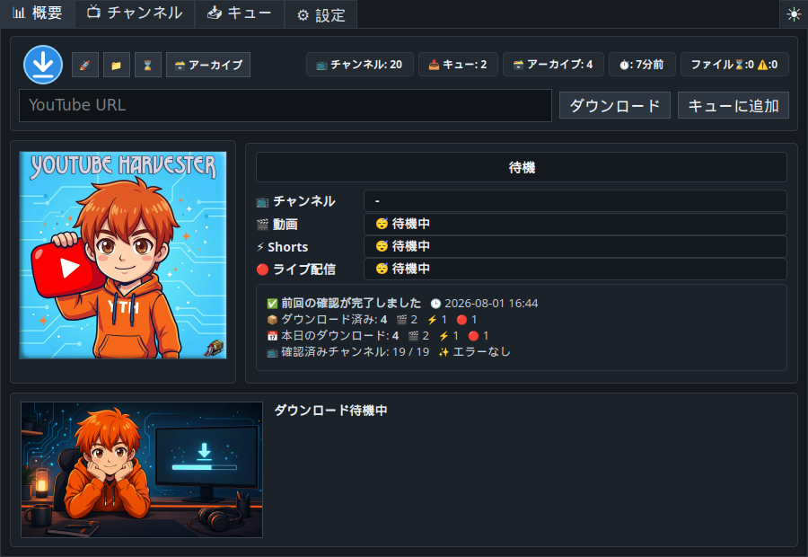
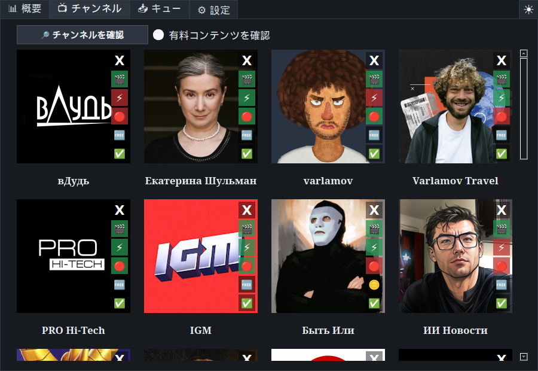
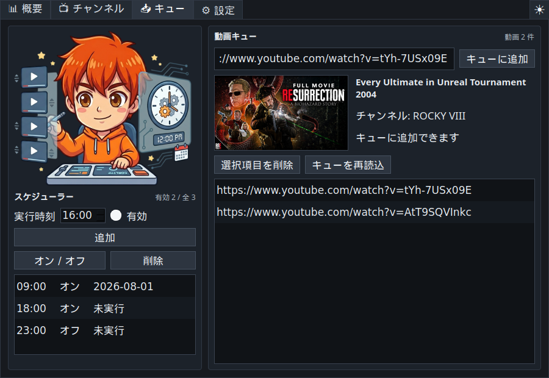
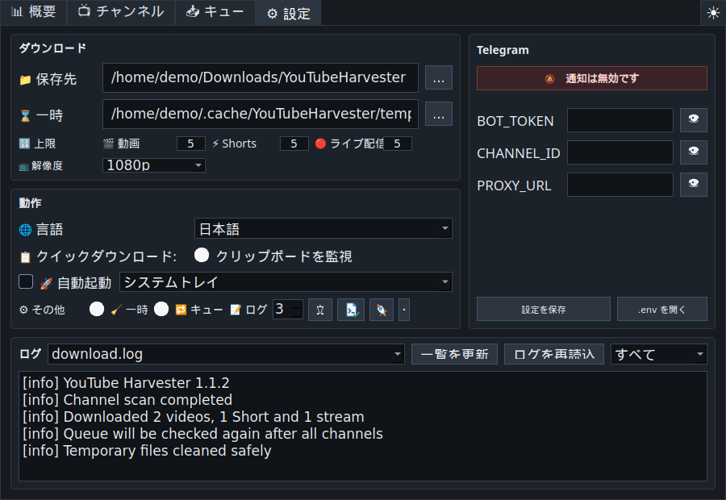

# YouTube Harvester 1.1.2

<p align="center">
  
</p>

<p align="center">
  <a href="README.md">🇺🇸 🇬🇧 English</a> ·
  <a href="README.ru.md">🇷🇺 Русский</a> ·
  <a href="README.uk.md">🇺🇦 Українська</a> ·
  <a href="README.fr.md">🇫🇷 Français</a> ·
  <a href="README.es.md">🇪🇸 Español</a> ·
  <a href="README.hi.md">🇮🇳 हिन्दी</a> ·
  <a href="README.zh.md">🇨🇳 中文</a> ·
  <a href="README.ja.md">🇯🇵 日本語</a> ·
  <a href="README.ar.md">🇸🇦 العربية</a>
</p>

<p align="center">
  チャンネル監視、手動キュー、クイックダウンロード、スケジュール、
  アーカイブ、任意の Telegram 送信に対応した Linux / Windows 用の
  多言語 YouTube ダウンローダーです。
</p>

> **UPD 2:** クイックダウンロードで複数の音声トラックと字幕トラックを
> 1 本の動画に埋め込めるようになりました。アーカイブは画質とトラック構成ごとに
> 別の版として管理し、一部の字幕取得に失敗してもダウンロードを継続します。
> 日本語インターフェースも追加されました。



## 概要

**YouTube Harvester** は、登録した YouTube チャンネルを監視し、`yt-dlp` を
使って新しい動画、Shorts、ライブ配信をダウンロードします。個別の動画 URL にも
対応し、ローカルアーカイブ、ダウンロードレポート、Telegram への通知やファイル
送信を利用できます。

バージョン `1.1.2` は Linux と Windows の両方で Python ダウンローダーを
使用します。旧 Bash エンジンは、無効化されたレガシーコードとしてのみソースに
残されています。

## 主な機能

- チャンネル進捗、メディア種別、処理段階、速度、残り時間、サイズ、最近の
  イベント、セッションと当日の合計を表示するライブ概要。
- 元のチャンネル画像をキャッシュしたチャンネルカードと、動画、Shorts、
  ライブ配信ごとの個別スイッチ。
- 有料コンテンツの任意チェック。状態は未確認、members-only 発見、チェック時に
  members-only なしの 3 種類です。
- 「概要」タブの URL 欄から、即時ダウンロードまたはキューへの追加。
- タイトル、チャンネル、サムネイルのプレビュー、重複・アーカイブ確認、再試行、
  全チャンネル確認後の再処理に対応した動画キュー。
- クリップボード URL、メタデータプレビュー、解像度、複数音声、複数字幕、
  即時ダウンロード、キュー追加、保存される Telegram 設定を備えた
  クイックダウンロード画面。
- 設定可能なグローバルホットキー。既定値は `Ctrl+Shift+Alt+Y` です。
- 有効な YouTube URL を検出するとクイックダウンロードを開く、任意の
  クリップボード監視。
- 指定した時刻に自動実行するスケジューラー。
- 種別、チャンネル、タイトル、日時、YouTube リンク、ローカルファイル、保存先、
  レコード削除を備えたダウンロードアーカイブ。
- 「すべて」「重要」「エラー」で絞り込めるログビューアー。
- `yt-dlp` のバージョン確認と、OS、X11/Wayland、トレイ、ホットキー、ツール、
  パス、キャッシュ、書き込み権限、空き容量の診断。
- ダーク、ライト、システムテーマ。
- システムトレイのみ、タスクバーのみ、トレイとタスクバーの両方という起動方式。
- 安全な停止、保護された一時ファイル削除、Windows 対応ファイル名、Windows の
  ログとアーカイブでの UTF-8 処理。
- 英語を既定とし、ロシア語、ウクライナ語、フランス語、スペイン語、ヒンディー語、
  中国語、日本語、アラビア語に対応。

## スクリーンショット

| 概要 | チャンネル |
| --- | --- |
|  |  |

| キューとスケジュール | 設定とログ |
| --- | --- |
|  |  |

## ダウンロード

すぐに使えるパッケージは
[GitHub Releases](https://github.com/LiberVixer/YouTubeHarvester/releases)
で公開されます。

Linux:

- `YouTubeHarvester_1.1.2_linux_all.deb`
- `YouTubeHarvester_1.1.2_source.tar.gz`
- `SHA256SUMS-linux.txt`

Windows:

- `YouTubeHarvester_1.1.2_windows_setup.exe` - 通常のインストーラー。
- `YouTubeHarvester_1.1.2_windows_x64.msi` - x64 MSI パッケージ。
- `YouTubeHarvester_1.1.2_windows_portable.zip` - ポータブル版。
- `SHA256SUMS-windows.txt`

Windows パッケージには `yt-dlp`、`ffmpeg.exe`、`ffprobe.exe`、`deno.exe` が
同梱されています。

## Linux へのインストール

```bash
sudo apt install ./YouTubeHarvester_1.1.2_linux_all.deb
```

アプリケーションメニューから起動するか、次を実行します。

```bash
yt-harvester
```

`.deb` パッケージは、ユーザーごとの標準パスを使用します。

- データ: `~/.local/share/yt-harvester`
- 設定: `~/.config/yt-harvester`
- キャッシュ: `~/.cache/yt-harvester`
- Telegram 設定: `~/.config/yt-harvester/.env`
- 既定の一時ディレクトリ: `~/temp/YTH`
- 既定のダウンロード先: `~/Downloads/YouTubeHarvester`

## Windows へのインストール

リリースから Setup EXE、MSI、またはポータブル ZIP を選んでください。
インストール版とポータブル版は自己完結しているため、Python、FFmpeg、Deno を
別途インストールする必要はありません。

自動起動には現在のユーザーのレジストリキーを使用します。

```text
HKCU\Software\Microsoft\Windows\CurrentVersion\Run
```

## ソースからの実行

Linux:

```bash
sudo apt install python3 python3-pyqt5 python3-pynput yt-dlp ffmpeg curl
# Wayland でのクリップボード監視には推奨:
sudo apt install wl-clipboard
cp .env.example .env
./start_tray.sh
```

Windows:

```powershell
py -3 -m venv .venv
.\.venv\Scripts\python -m pip install -r requirements.txt
.\start_tray_windows.bat
```

ビルド環境でインターネット接続が安定しない場合は、
[Windows オフラインビルドガイド](docs/windows-offline-build.md)を参照してください。

## 起動オプション

```bash
yt-harvester
yt-harvester --quick-download
yt-harvester --start-tray
yt-harvester --start-window
yt-harvester --start-both
```

- `--quick-download`: クイックダウンロードを開きます。すでに別のインスタンスが
  起動している場合は、そちらへ要求を渡します。
- `--start-tray`: タスクバーにウィンドウを出さず、システムトレイで起動します。
- `--start-window`: 通常のタスクバーウィンドウとして起動します。
- `--start-both`: トレイとタスクバーの両方を有効にします。

パッケージ内部で使うオプション:

- `--run-yt-dlp ...`
- `--run-script <script.py> ...`

メンテナンス用ヘルパー:

```bash
python3 scripts/check_channel_sections.py --channel <url> [--timeout 45]
python3 scripts/mark_channel_archived.py --channel <url> --archive yt_archive.txt \
  [--videos-limit 5] [--shorts-limit 5] [--streams-limit 5]
python3 scripts/migrate_archive_details.py --archive yt_archive.txt \
  --details archive_details.jsonl --scan-dir <downloads> [--include-missing]
```

## クイックダウンロード、X11、Wayland

Windows ではネイティブのグローバルホットキーを使用します。Linux/X11 では
`pynput` を使用します。Wayland は通常、アプリによるグローバルキーの直接登録を
制限するため、YouTube Harvester は `yt-harvester --quick-download` を実行する
Cinnamon/GNOME のシステムショートカットを作成できます。

クイックダウンロードは、トレイメニューと「概要」タブからいつでも開けます。
クリップボード監視は Windows/X11 の通常のクリップボードを使用し、Wayland では
`wl-clipboard` が導入済みの場合に `wl-paste` を使用します。

## チャンネルとキューの処理

有効なチャンネルセクションを順番に確認し、完了したセクションの結果が見えるよう
短い間隔を置きます。有料コンテンツの探索は、有効にした明示的なチャンネル確認時
だけ実行します。通常のダウンロード確認中に members-only 動画が見つかった場合も、
チャンネル状態を更新し、アクセス情報を重要イベントとして穏やかに記録します。

キューは処理開始時と、すべてのチャンネル確認後の 2 回処理されます。すでに
アーカイブ済みの動画と重複エントリはスキップされ、失敗した項目は後で再試行できます。

## Telegram

Telegram 送信は完全に無効化できます。利用する場合は「設定」または `.env` に
次を入力します。

```bash
BOT_TOKEN=your-telegram-bot-token
CHANNEL_ID=your-telegram-channel-id
PROXY_URL=127.0.0.1:9050
```

`PROXY_URL` は任意です。Telegram 送信に失敗しても、正常に保存されたローカル動画は
削除されません。

## リリースのビルド

Linux 用成果物:

```bash
packaging/build_release.sh 1.1.2 1.1.2
```

Windows 上で Windows 用成果物を作成:

```powershell
powershell -ExecutionPolicy Bypass -File .\packaging\windows\build_release.ps1 `
  -Version 1.1.2 -MsiVersion 1.1.2
```

GitHub Actions は `v*` に一致するタグから Linux と Windows の成果物を作成します。

## 適切な利用について

YouTube Harvester は YouTube、Google、Telegram、`yt-dlp` と提携していません。
自分が所有するもの、許可を得たもの、または個人利用目的で合法的に保存できるもの
だけをダウンロードしてください。
[YouTube 利用規約](https://www.youtube.com/t/terms)、著作権法、お住まいの国の
法律を守り、Telegram の認証情報を公開しないでください。

外部コンポーネントとして
[`yt-dlp`](https://github.com/yt-dlp/yt-dlp)、PyQt5/Qt、FFmpeg/FFprobe、
Deno、`curl`、Telegram Bot API、`pynput` を使用します。それぞれに固有の
ライセンスと利用条件が適用されます。

## 謝辞

Windows 版のベータテストで多大なご協力をいただいた Dmitry
**'Minion' Pororiliy** 氏に心より感謝します。

プログラムのロゴに **Command & Conquer: Red Alert** の Harvester が
追加されました。🙂

完全な更新履歴は[日本語の変更履歴](CHANGELOG.ja.md)をご覧ください。
