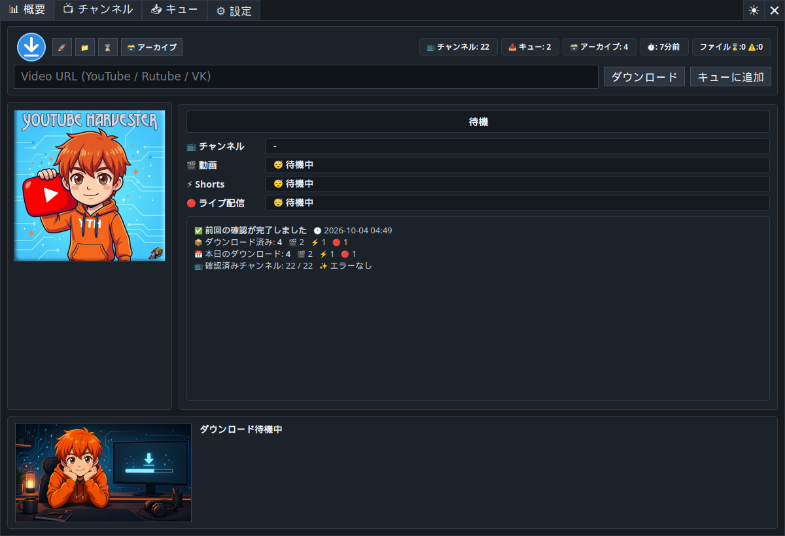
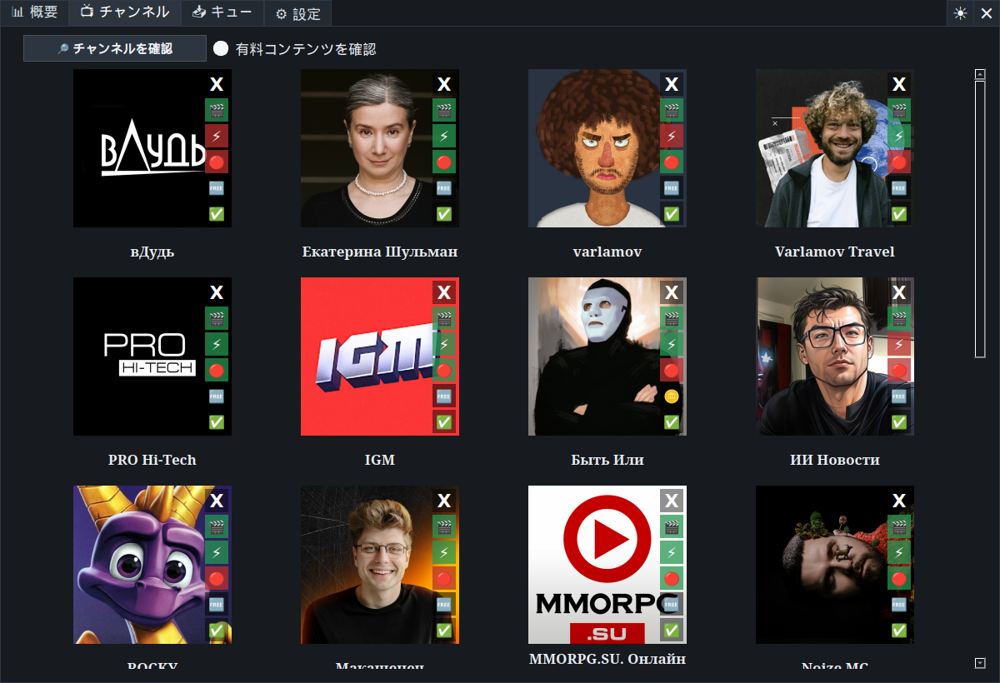
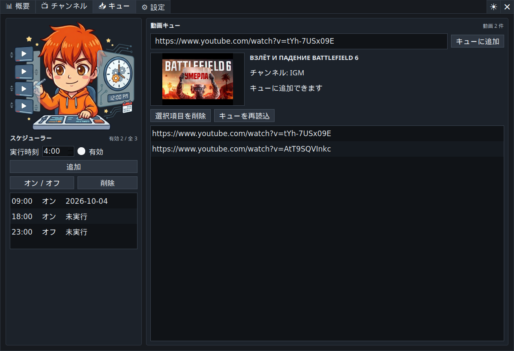
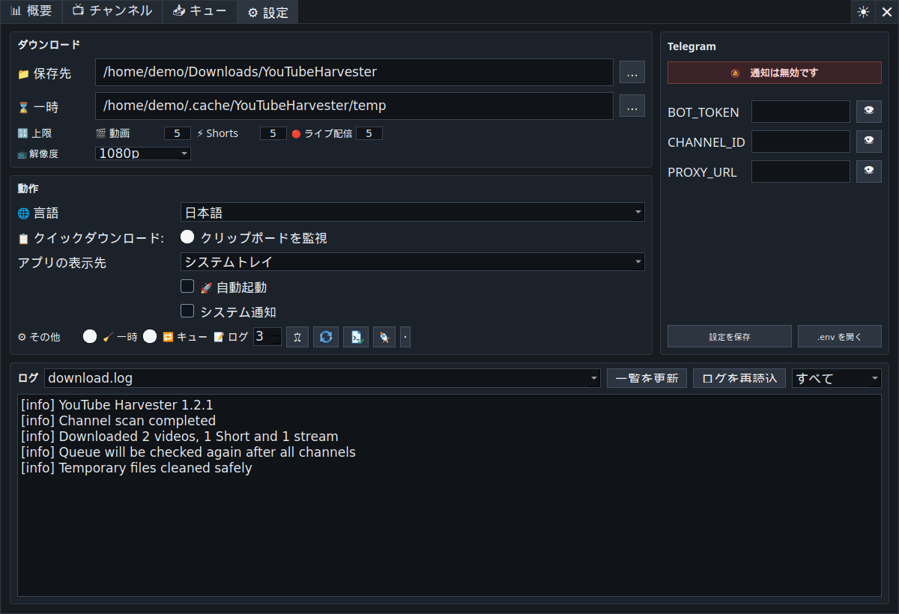
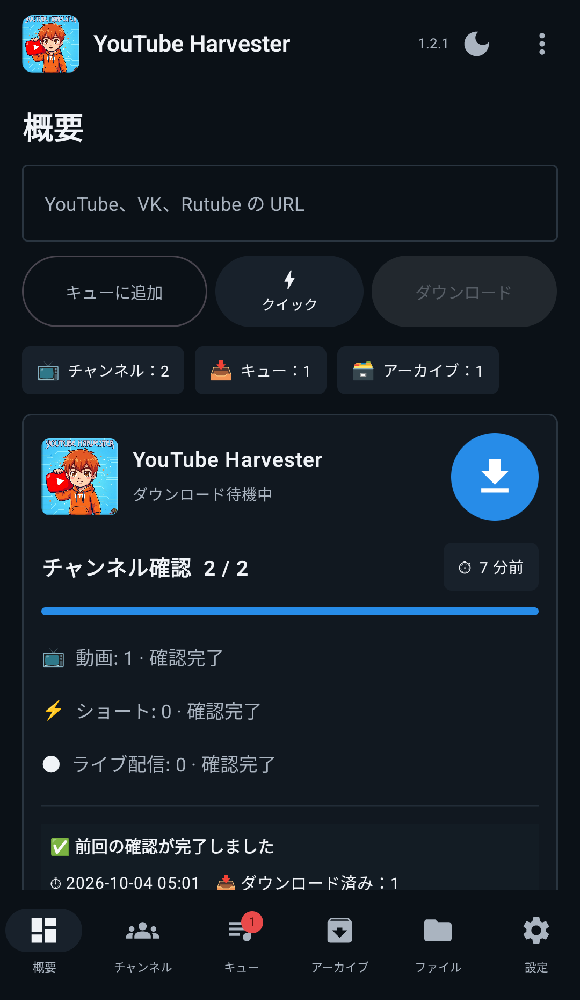
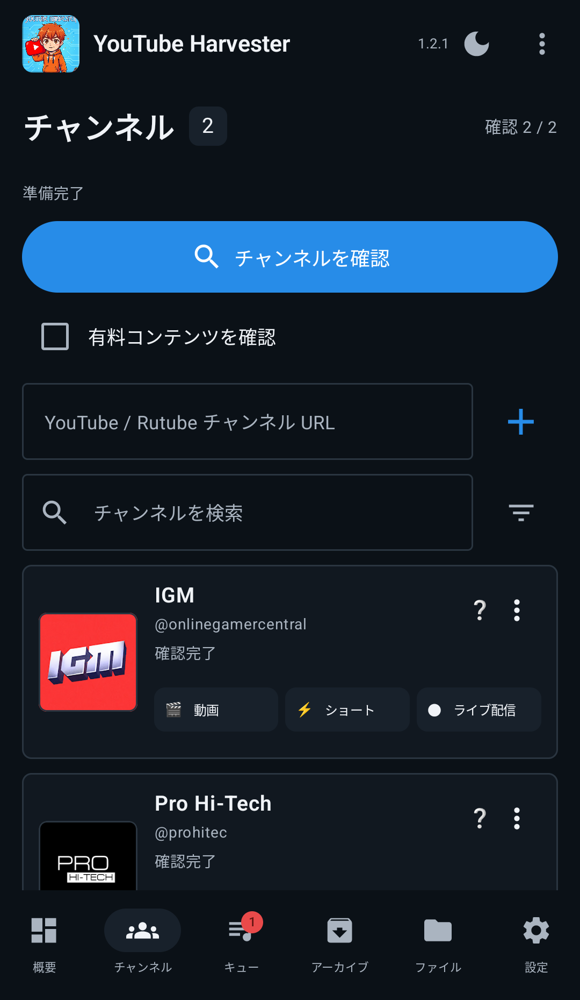
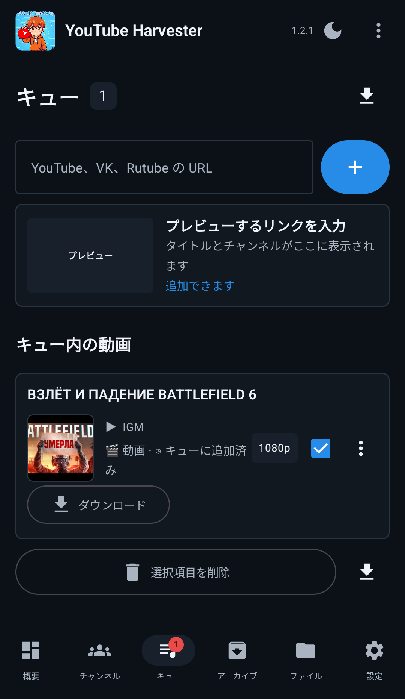
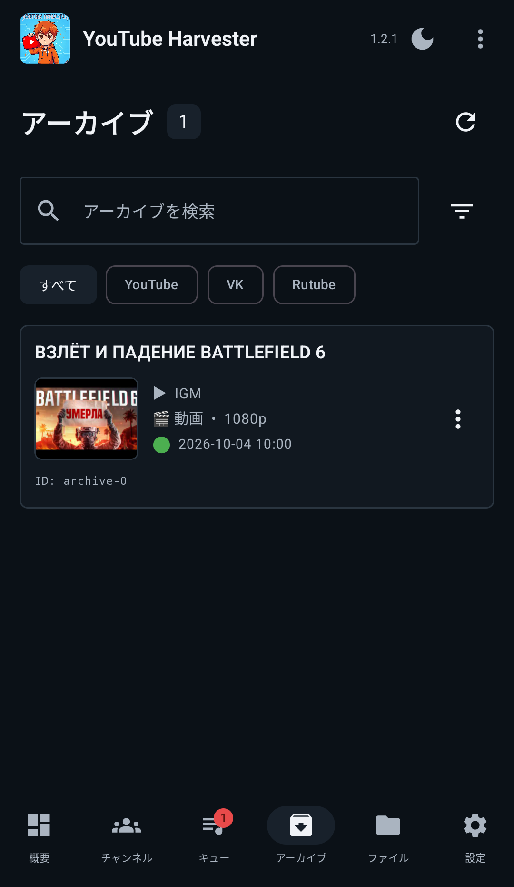
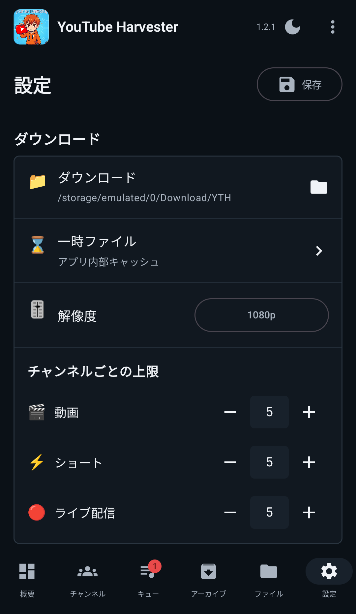

# YouTube Harvester 1.2.1

<p align="center">
  
</p>

<p align="center">
  <a href="README.md">🇺🇸 🇬🇧 English</a> ·
  <a href="README.ru.md">🇷🇺 Русский</a> ·
  <a href="README.uk.md">🇺🇦 Українська</a> ·
  <a href="README.be.md">🇧🇾 Беларуская</a> ·
  <a href="README.fr.md">🇫🇷 Français</a> ·
  <a href="README.es.md">🇪🇸 Español</a> ·
  <a href="README.hi.md">🇮🇳 हिन्दी</a> ·
  <a href="README.zh.md">🇨🇳 中文</a> ·
  <a href="README.ja.md">🇯🇵 日本語</a> ·
  <a href="README.ar.md">🇸🇦 العربية</a>
</p>

**Linux、Windows、Android** 向けの多言語ダウンロードアプリ。YouTube/Rutube チャンネル監視、単体の YouTube/Rutube/VK 動画、キュー、アーカイブ、予約実行、任意の Telegram 送信に対応します。

## バージョン 1.2.1

文書更新：**2026-10-05**。

現在のソースとローカル配布物は **1.2.1** で、beta/prerelease 表記はありません。Android は `versionCode 120100`、内部デバッグ版は `-debug` を保持します。Windows は Linux と同じ最新デスクトップソースから再ビルドされ、Rutube と中断後の復旧修正を含みます。

**Linux、Windows、Android 向け安定版 1.2.1。** PC パッケージと四つの APK を beta/prerelease 表記なしで公開します。公開 APK は恒久証明書で署名されています。

Linux と Windows は共通の Python/yt-dlp エンジンを使用します。旧 Bash は無効な歴史的コードとしてのみ残ります。

[バージョン検証記録](docs/version-1.2.1-20261003.md) · [1.2.1 公開準備](docs/releases/1.2.1.md).

## デスクトップの機能

- チャンネル進捗、メディア種別、処理段階、速度、残り時間、サイズ、最近の
  イベント、セッションと当日の合計を表示するライブ概要。
- 元のチャンネル画像をキャッシュしたチャンネルカードと、動画、Shorts、
  ライブ配信ごとの個別スイッチ。
- 有料コンテンツの任意チェック。状態は未確認、members-only 発見、チェック時に
  members-only なしの 3 種類です。
- 「概要」タブの URL 欄から、即時ダウンロードまたはキューへの追加。
- タイトル、チャンネル、サムネイルのプレビュー、重複・アーカイブ確認、再試行、
  全チャンネル確認後の再処理に対応した動画キュー。
- クリップボード URL、メタデータプレビュー、解像度、複数音声、複数字幕、
  即時ダウンロード、キュー追加、保存される Telegram 設定を備えた
  クイックダウンロード画面。
- 設定可能なグローバルホットキー。既定値は `Ctrl+Shift+Alt+Y` です。
- 対応する YouTube、Rutube、VK の URL を検出するとクイックダウンロードを
  開く、任意のクリップボード監視。
- 指定した時刻に自動実行するスケジューラー。
- 種別、チャンネル、タイトル、日時、ソースリンク、ローカルファイル、保存先、
  レコード削除を備えたダウンロードアーカイブ。
- 「すべて」「重要」「エラー」で絞り込めるログビューアー。
- インストール版、ポータブル版、Linux パッケージで利用できる、GitHub 公式
  Release からの検証済みアプリ更新。
- 画面からの安全な `yt-dlp` 確認・更新と、OS、X11/Wayland、トレイ、ホットキー、ツール、
  パス、キャッシュ、書き込み権限、空き容量の診断。
- ダーク、ライト、システムテーマ。
- システムトレイのみ、タスクバーのみ、トレイとタスクバーの両方という起動方式。
- 安全な停止、保護された一時ファイル削除、Windows 対応ファイル名、Windows の
  ログとアーカイブでの UTF-8 処理。
- 英語を既定とし、ロシア語、ウクライナ語、ベラルーシ語、フランス語、
  スペイン語、ヒンディー語、中国語、日本語、アラビア語に対応。

## 対応ソースと処理順序

- **YouTube チャンネル：** 動画、Shorts、ライブを個別に有効化・制限。handle/channel/user/custom URL に対応。
- **Rutube チャンネル：** `/channel/ID/` と `/u/name/`、動画/Shorts ページも対応。別名を ID に解決して重複防止、名前と画像をキャッシュ。
- **Rutube 番組：** `/metainfo/tv/ID/`、独自のタイトルとポスター、動画のみ。最新 N 件を新しい順に選択。
- **単体動画：** YouTube、Rutube、VK/VK Video の URL を手動入力、キュー、クイックダウンロードで処理。VK チャンネル監視、任意の Rutube プレイリストは非対応。

Rutube のライブ走査と有料検出は無効です。YouTube の有料検出は利用可否を報告するだけで、アクセス制限を回避せず、制限付き動画の取得を保証しません。チャンネルメニューで最近の項目をダウンロードせず処理済みにできます。

収集は手動キュー、各有効セクションの順次ダウンロード、再度キューの順です。アーカイブ済み・重複項目を省略します。チャンネルタブのチェックはセクションの検証で、収集全体は概要か予約から開始します。アーカイブは画質・トラック別の組み合わせを保持します。

PC で停止しても次の実行を妨げません。安全な一時ファイル清掃と再試行を保持しています。実行中に一時ファイルを手動削除しないでください。ソース/VPN/プロキシ障害時は接続とログを確認してください。地域・アカウント・プロトコルの制約は残ります。

## Android

**Android 8.0+（API 26）** 向けネイティブ Kotlin/Jetpack Compose。ABI：`arm64-v8a`、`armeabi-v7a`、`x86_64`、`x86`。

- 概要、チャンネル、キュー、アーカイブ、設定とダウンロードフォルダー。十言語、ダーク/ライト/システムテーマ、アラビア語 RTL。
- 同じソース分類、Rutube チャンネル・番組、上限、最近の項目のマーク、予約、メタデータと画像。
- 入力 URL を即時ダウンロード。概要のクイックボタンは明示的に押した場合だけクリップボードを読みます。共有はメディア選択、ショートカットは概要を開きます。任意のクリップボード監視はアプリが前面のときだけです。
- 解像度、複数音声・字幕、永続ジョブ、一時停止/再開/キャンセル/再試行、通知と foreground-service。再開は同じジョブ・途中ファイルを保持し、バイト単位継続はソース次第です。
- WorkManager 復旧、検査報告/日次集計、再起動復旧、MediaStore/SAF、保存ファイル、ログ/診断。Android 強制停止後は開き直してください。メーカーの省電力制限がバックグラウンドに影響する場合があります。
- Telegram 認証情報を Android Keystore で保護。パスワード暗号化 `.ythbackup` は記録と設定を移しますが、**動画と一時ファイルは含みません**。空の DB にインポートし、移動したファイルは検証付きでフォルダーを再関連付けします。
- APK 更新は SHA-256、パッケージ、上位 versionCode、既存証明書を検証してシステムインストーラーを開きます。`yt-dlp` は **アプリと一緒に更新**し、単独で置き換えません。

**Android の VK：** 単体の VK/VK Video を取得できます。2026-09-14 に LDPlayer で公開 VK 動画の実ダウンロードを確認しました。VK チャンネル監視はありません。非公開・制限付き動画は取得できない場合があります。

[Android 開発文書](android/README.md) · [データ移行手順](android/DATA-TRANSFER.ru.md).

## Android の公開状況

所有者が Android 1.2.1 の公開を承認しました。対応ソース、元の通知と APK ハッシュは[最終レビュー](android/legal/FINAL-SOURCE-REVIEW-20261005.md)に記録されています。自動テストの範囲と制限は記録に残しており、全 Android 端末の検証は行っていません。

**証明書変更のためテストアプリを削除しないでください。** 暗号化移行は隔離 QA パッケージで検証済みですが、最終公開候補の受け入れの代わりにはなりません。

[公開準備状況](android/RELEASE-READINESS.ru.md).

## スクリーンショット

| 概要 | チャンネル |
| --- | --- |
|  |  |

| キューとスケジュール | 設定とログ |
| --- | --- |
|  |  |

### Android

Android 1.2.1、ダークテーマ。デモ用データ。

| 概要 | チャンネル |
| --- | --- |
|  |  |

| キュー | アーカイブ |
| --- | --- |
|  |  |

**設定**



[画像一覧と撮影情報](docs/screenshots/README.md).

## ダウンロード

全形式は [1.2.1](https://github.com/LiberVixer/YouTubeHarvester/releases/tag/v1.2.1) にあります。完全な runtime ソースは [Android リリース](https://github.com/LiberVixer/YouTubeHarvester/releases/tag/android-v1.2.1)にあります。

| 環境 | ファイル |
| --- | --- |
| Linux | `YouTubeHarvester_1.2.1_linux_all.deb`, `YouTubeHarvester_1.2.1_source.tar.gz`, `SHA256SUMS-linux.txt` |
| Windows x64 | `YouTubeHarvester_1.2.1_windows_setup.exe`, `YouTubeHarvester_1.2.1_windows_x64.msi`, `YouTubeHarvester_1.2.1_windows_portable.zip`, `SHA256SUMS-windows.txt` |

公開 APK：`YouTubeHarvester-1.2.1-<ABI>-release.apk`。ABI は `arm64-v8a`、`armeabi-v7a`、`x86`、`x86_64`。ソース、元の通知、BUILD-INFO、SOURCE-REVIEW、SHA256SUMS を提供します。ローカルテスト APK は公開ファイルの代わりにはなりません。

## Linux へのインストール

```bash
sudo apt install ./YouTubeHarvester_1.2.1_linux_all.deb
```

アプリケーションメニューから起動するか、次を実行します。

```bash
yt-harvester
```

`.deb` パッケージは、ユーザーごとの標準パスを使用します。

- データ: `~/.local/share/yt-harvester`
- 設定: `~/.config/yt-harvester`
- キャッシュ: `~/.cache/yt-harvester`
- Telegram 設定: `~/.config/yt-harvester/.env`
- 既定の一時ディレクトリ: `~/temp/YTH`
- 既定のダウンロード先: `~/Downloads/YouTubeHarvester`

`.deb` はディストリビューションの Python/Qt/yt-dlp/FFmpeg/curl を使い、黙って更新しません。実際の版は開発/Windows と異なる場合があります。Deno は推奨で未同梱。完全な YouTube 対応には互換 JavaScript runtime が必要です。

## Windows へのインストール

x64 Setup EXE/MSI、または portable ZIP を展開して `YouTubeHarvester.exe` を起動。Python、yt-dlp、FFmpeg/FFprobe、Deno は同梱済み。データ/キャッシュ：`%LOCALAPPDATA%\YouTubeHarvester`、設定：`%APPDATA%\YouTubeHarvester`、一時：`%TEMP%\YTH`。自動起動は現ユーザーの `HKCU\Software\Microsoft\Windows\CurrentVersion\Run` を使います。

## Android のインストールと更新

許可されたテストでは ABI に合う APK を同じ証明書で更新し、削除やデータ初期化をしないでください。信頼できるインストール元だけを許可し、必要に応じ通知と保存フォルダーを設定します。既定は `Download/YTH` または SAF フォルダーです。異なる署名の公開 APK は現在のテスト版を上書きできません。

## ソースからの実行

Linux は既存 `.venv` を優先し、`YTD_PYTHON` で別の処理系を選べます。固定環境は Python 3.12 で検証済みです。FFmpeg/FFprobe と JavaScript runtime は外部ツールで、次のスクリプトはハッシュ検証後に Deno/FFmpeg を取得します。

ツールがない場合のみ取得してください。スクリプトは既存フォルダーを上書きしません。既存 `.env` を保持し、Telegram 設定はアプリか自分のファイルに入力してください。そのファイルを公開しないでください。

Linux:

```bash
sudo apt install python3 python3-venv python3-pyqt5 python3-pynput python3-dbus ffmpeg curl
python3 -m venv .venv
.venv/bin/python -m pip install -r requirements-linux-lock.txt
.venv/bin/python scripts/fetch_desktop_tools.py --platform linux --output tools/linux
cp -n .env.example .env
./start_tray.sh
```

Windows のソース実行にも FFmpeg/FFprobe と Deno が必要です。ビルダーは固定ローカルツールか検証したダウンロードを使います。

Windows:

```powershell
py -3.12 -m venv .venv
.\.venv\Scripts\python -m pip install -r requirements-windows-lock.txt
.\.venv\Scripts\python scripts/fetch_desktop_tools.py --platform windows --output tools/windows
.\start_tray_windows.bat
```

[ソースからの実行 Windows (offline)](docs/windows-offline-build.md).

## 起動オプション

```bash
yt-harvester
yt-harvester --quick-download
yt-harvester --show-main
yt-harvester --start-tray
yt-harvester --start-window
yt-harvester --start-both
```

- `--quick-download`: クイックダウンロードを開きます。すでに別のインスタンスが
  起動している場合は、そちらへ要求を渡します。
- `--show-main`: 実行中のインスタンスのメインウィンドウを表示します。
- `--start-tray`: タスクバーにウィンドウを出さず、システムトレイで起動します。
- `--start-window`: 通常のタスクバーウィンドウとして起動します。
- `--start-both`: トレイとタスクバーの両方を有効にします。

パッケージ内部で使うオプション:

- `--run-yt-dlp ...`
- `--run-script <script.py> ...`

メンテナンス用ヘルパー:

```bash
python3 scripts/check_channel_sections.py --channel <url> [--timeout 45]
python3 scripts/mark_channel_archived.py --channel <url> --archive yt_archive.txt \
  [--videos-limit 5] [--shorts-limit 5] [--streams-limit 5]
python3 scripts/migrate_archive_details.py --archive yt_archive.txt \
  --details archive_details.jsonl --scan-dir <downloads> [--include-missing]
```

## クイックダウンロード、X11、Wayland

Windows ではネイティブのグローバルホットキーを使用します。Linux/X11 では
`pynput` を使用します。Wayland は通常、アプリによるグローバルキーの直接登録を
制限するため、YouTube Harvester は `yt-harvester --quick-download` を実行する
Cinnamon/GNOME のシステムショートカットを作成できます。

クイックダウンロードは、トレイメニューと「概要」タブからいつでも開けます。
クリップボード監視は Windows/X11 の通常のクリップボードを使用し、Wayland では
`wl-clipboard` が導入済みの場合に `wl-paste` を使用します。

## Telegram

Telegram 送信は完全に無効化できます。利用する場合は「設定」または `.env` に
次を入力します。

```bash
BOT_TOKEN=your-telegram-bot-token
CHANNEL_ID=your-telegram-channel-id
PROXY_URL=127.0.0.1:9050
```

`PROXY_URL` は任意です。Telegram 送信に失敗しても、正常に保存されたローカル動画は
削除されません。

## 固定コンポーネント

プロジェクトで審査した版であり、全インストールの一致や上流の最新版を保証しません。PC 依存関係：`requirements-linux-lock.txt`、`requirements-windows-lock.txt`。Android 版/ハッシュ：`android/runtime.properties`、`android/gradle/verification-metadata.xml`。

| コンポーネント | PC 開発 / Windows | Android |
| --- | --- | --- |
| yt-dlp | 2026.08.19 | 2026.08.19 |
| FFmpeg / FFprobe | 9.0.2 | 7.1.1 |
| Deno / QuickJS | Deno 2.9.7 | QuickJS 2026-06-04 |
| PyQt5 / Compose BOM | PyQt5 5.15.11 | Compose 2026.09.00 |
| Qt runtime | Linux 5.15.19 / Windows 5.15.2 | - |
| Room / WorkManager | - | 2.8.5 / 2.12.0 |
| Coil | - | 3.6.3 |
| PyInstaller / AGP / Gradle | PyInstaller 6.22.3 | AGP 9.4.1 / Gradle 9.8.0 |
| Kotlin Compose compiler / KSP | - | 2.4.20 / 2.3.12 |

Android は上流 Python 3.12.11、OpenSSL 3.5.2、FFmpeg 7.1.1 を保持し、互換再ビルド・対応ソース審査は未完了です。QuickJS 2026-06-04 と WebP/SharpYUV 1.6.0 は四 ABI、16 KB 配置で再構築しました。静的検査は 16 KB 実機の代わりになりません。

[コンポーネント更新記録](docs/component-update-20261003.md) · [ネイティブ再構築手順](android/native/README.md).

## リリースのビルド

PC タグは `v*`、Android は別 workflow の `android-v<versionName>`。公開署名には承認された恒久証明書と審査済み対応 runtime ソースが必要です。鍵・パスワード・トークン・未署名/非公開テスト APK を公開しないでください。

Linux:

```bash
packaging/build_release.sh 1.2.1 1.2.1
```

Windows:

```powershell
powershell -ExecutionPolicy Bypass -File .\packaging\windows\build_release.ps1 `
  -Version 1.2.1 -MsiVersion 1.2.1
```

Android (JDK 17, Android SDK, Gradle Wrapper):

```bash
cd android
./gradlew testDebugUnitTest assembleDebug
python3 -m unittest discover -s scripts -p 'test_*.py' -v
```

[Android 公開・署名規則](android/RELEASING.md)

## 検証と制限

最新ローカル検査：**PC Python 89 件**、**Android Python 39 件**、**Android JVM 149 件**、Android 50 画面の撮影成功。版統一時には **Windows 80 件**（POSIX 二件省略）と **選択 LDPlayer 36 件**、Android 14/API 34 x86_64、も通過しました。

PC ツールと実際のローカル H.264/AAC ダウンロード/remux を確認。四 APK のマニフェスト/証明書/ZIP、対象 64 ビット配置検査も通過。ただし ARM、全機種のバックグラウンド、新 Windows インストーラーの導入/削除は証明していません。文書更新は既存コピーの再ビルドや公開ではありません。

[Android テスト計画](android/TEST-PLAN.ru.md).

## ライセンスと適切な利用

所有者が **Android モジュールの GPL-3.0-only** を承認済み：[LICENSE](android/LICENSE)、[NOTICE](android/NOTICE)、[決定記録](android/legal/README.md)。PC や第三者のライセンスは変更しません。公開 Android には完全な対応 runtime ソース一式が必要です。

YouTube、Google、Rutube、VK、Telegram、yt-dlp との提携はありません。取得権限のあるメディアだけを扱い、サービス条件と法令を守ってください。認証情報とバックアップのパスワードを公開しないでください。

## 謝辞

Windows 版のベータテストで多大なご協力をいただいた Dmitry
**'Minion' Pororiliy** 氏に心より感謝します。

プログラムのロゴに **Command & Conquer: Red Alert** の Harvester が
追加されました。🙂

完全な更新履歴は[日本語の変更履歴](CHANGELOG.ja.md)をご覧ください。
