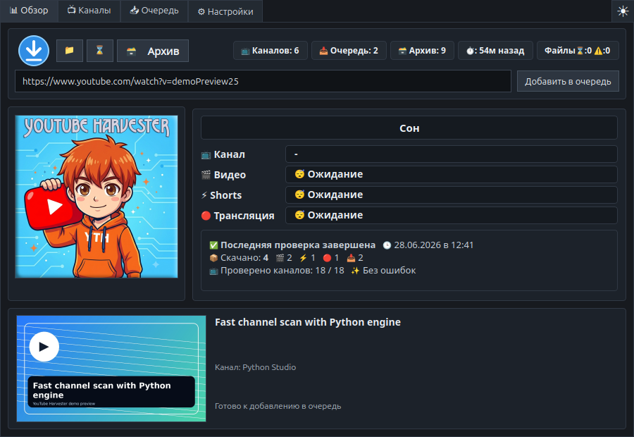
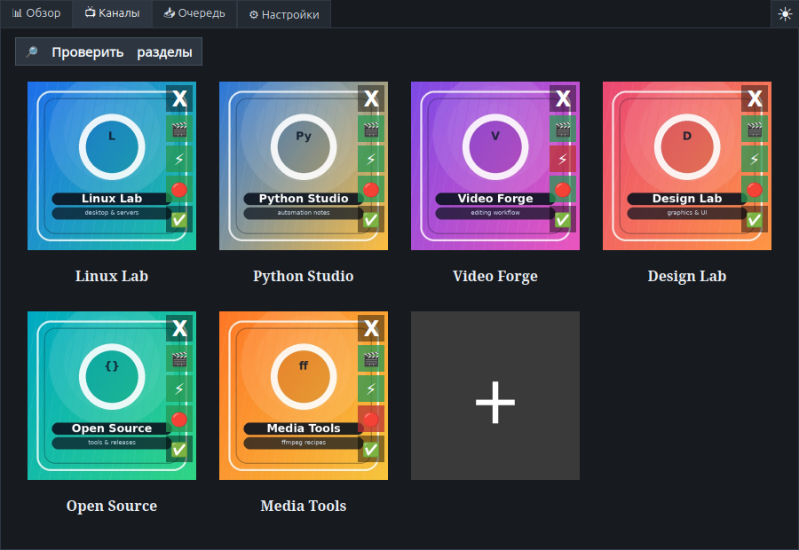
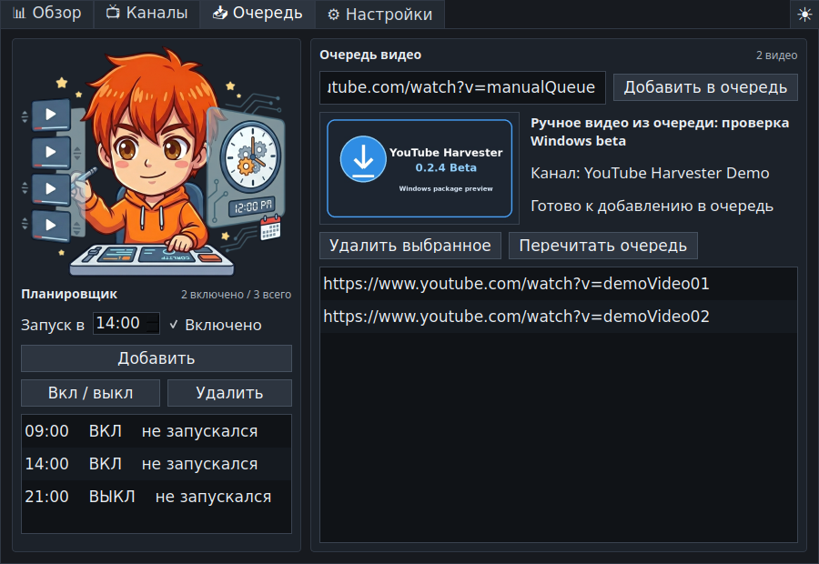

# YouTube Harvester

> 🇷🇺 [Русская версия ниже](#русский) · 🇬🇧 [English version](#english) · [Changelog](CHANGELOG.md)

<p align="center">
  
</p>

<p align="center">
  A Linux tray downloader for YouTube channels, manual video queues, schedules, and Telegram delivery,
  with an experimental Windows launch path through the Python engine.
  <br>
  <a href="#english">English</a> · <a href="#русский">Русский</a>
</p>



## English

**YouTube Harvester** is a compact PyQt5 desktop app for Linux Mint, Ubuntu, and similar systems. It sits in the system tray, watches selected YouTube channels, downloads new videos through `yt-dlp`, keeps a manual queue, and can publish downloaded items to a Telegram channel. A Windows source launch path is being prepared through the experimental Python downloader engine.

### Highlights

- Tray-first app: open the main window from the tray icon or tray menu.
- Channel grid with cached channel images and per-channel toggles for videos, Shorts, and live broadcasts.
- Manual queue: paste a YouTube video URL, preview title/thumbnail, and download it with the same rules as the regular workflow.
- Built-in scheduler and queue view in one tab.
- Live overview with status, counters, current channel, current media type, and video thumbnail.
- Soft stop button: finishes safely instead of killing the downloader mid-step.
- Download engine selector: stable Bash engine by default, experimental Python engine for portability testing.
- Windows preparation: source launcher, EXE build script, Windows user-data paths, Current User registry autostart, and system theme detection.
- Dark, light, and system theme modes.
- `.deb` package support for Linux Mint and Ubuntu-like distributions.

### Screenshots

| Channels | Queue & Scheduler |
| --- | --- |
|  |  |

### Install From Deb

Download the latest package from [GitHub Releases](https://github.com/LiberVixer/YouTubeHarvester/releases) or use the package from `dist/`:

```bash
sudo apt install ./yt-harvester_0.2.2~beta_all.deb
```

After installation, configure Telegram delivery:

```bash
nano ~/.config/yt-harvester/.env
```

Fill these values:

```bash
BOT_TOKEN=your-telegram-bot-token
CHANNEL_ID=your-telegram-channel-id
```

Then start **YouTube Harvester** from the Internet menu or run:

```bash
yt-harvester
```

### Run From Source

Linux:

```bash
sudo apt install python3 python3-pyqt5 yt-dlp curl bash coreutils findutils grep sed
cp .env.example .env
nano .env
./start_tray.sh
```

Windows preview:

```powershell
py -3 -m venv .venv
.\.venv\Scripts\python -m pip install -r requirements.txt
.\start_tray_windows.bat
```

Windows uses the Python downloader engine only. The Bash engine remains the default and recommended path on Linux.

For a Windows machine without internet access, see [Offline Windows Build](docs/windows-offline-build.md).

### Build Windows Packages

Run this on Windows:

```powershell
powershell -ExecutionPolicy Bypass -File .\packaging\windows\build_release.ps1
```

The release files will be created in `dist\release`:

- `YouTubeHarvester_0.2.2-beta_windows_setup.exe`
- `YouTubeHarvester_0.2.2-beta_windows_x64.msi`
- `YouTubeHarvester_0.2.2-beta_windows_portable.zip`

The Windows autostart checkbox writes the Current User registry key:

```text
HKCU\Software\Microsoft\Windows\CurrentVersion\Run
```

### Channel Rules

Each channel card has three small toggles:

- `🎬` videos
- `📱` Shorts
- `🔴` streams

Green means enabled, red means disabled. Rules are saved separately from `channels.txt`, so the channel list stays clean and easy to edit.

### User Data

Installed package data is stored outside `/opt`:

- data: `~/.local/share/yt-harvester`
- config: `~/.config/yt-harvester`
- cache: `~/.cache/yt-harvester`

Source-tree runs use the current project directory by default.

### Build Linux Release Files

```bash
packaging/build_release.sh 0.2.2~beta 0.2.2-beta
```

The release files will be written to `dist/release`:

- `YouTubeHarvester_0.2.2-beta_linux_all.deb`
- `YouTubeHarvester_0.2.2-beta_source.tar.gz`

### Responsible Use

YouTube Harvester is not affiliated with YouTube, Google, Telegram, or the yt-dlp project. It is a local desktop wrapper around external tools.

Before using it, make sure that you:

- download only content you own, content you have permission to download, or content that you may lawfully save for personal use;
- follow the [YouTube Terms of Service](https://www.youtube.com/t/terms), copyright law, and the laws of your jurisdiction;
- do not use the app to bypass access restrictions, redistribute copyrighted content, sell downloaded media, or automate abusive scraping;
- understand that Telegram delivery sends video titles, links, and possibly files to the configured Telegram channel;
- keep Telegram tokens private.

### Third-Party Components

YouTube Harvester uses external components that keep their own licenses and documentation:

- [`yt-dlp`](https://github.com/yt-dlp/yt-dlp) for reading YouTube metadata and downloading media. Its license is published in the [yt-dlp LICENSE file](https://github.com/yt-dlp/yt-dlp/blob/master/LICENSE).
- `PyQt5` / `Qt` for the desktop interface.
- `curl` and the [Telegram Bot API](https://core.telegram.org/bots/api) for Telegram notifications in the Bash engine and SOCKS proxy mode.
- `bash`, GNU `coreutils`, `findutils`, `grep`, and `sed` for the Linux Bash downloader script.

The Python downloader engine is experimental. The Bash engine remains the default and recommended path on Linux until the Python engine has been tested on the same scenarios.

This README is a practical notice, not legal advice. If you are unsure whether a download is allowed, do not download it.

---

## Русский

**YouTube Harvester** — небольшая программа для Linux Mint, Ubuntu и похожих систем. Она живёт в трее, следит за выбранными YouTube-каналами, скачивает новые ролики через `yt-dlp`, умеет работать с ручной очередью и отправлять найденные видео в Telegram-канал. Запуск на Windows готовится через экспериментальный Python-движок.

### Возможности

- Работа из трея: окно открывается по иконке или из меню трея.
- Красивая сетка каналов с кешированными картинками.
- Для каждого канала можно отдельно включать и выключать скачивание Видео, Shorts и Трансляция.
- Ручная очередь: вставил ссылку на YouTube-видео, увидел название/обложку, добавил в очередь.
- Планировщик и очередь объединены в одной вкладке.
- Вкладка обзора показывает статус, счётчики, текущий канал, тип поиска/скачивания и заставку видео.
- Кнопка остановки завершает скачивание мягко, без грубого убийства процесса.
- Выбор движка скачивания: стабильный Bash по умолчанию и экспериментальный Python для тестов переносимости.
- Подготовка к Windows: запуск из исходников, сборка EXE, Windows-пути данных, автозапуск через реестр Current User и определение системной темы.
- Ночной, дневной и системный режим темы.
- Готовая сборка `.deb` для Linux Mint и Ubuntu-подобных систем.

### Скриншоты

| Каналы | Очередь и планировщик |
| --- | --- |
|  |  |

### Установка Deb

Скачайте пакет из [GitHub Releases](https://github.com/LiberVixer/YouTubeHarvester/releases) или используйте файл из `dist/`:

```bash
sudo apt install ./yt-harvester_0.2.2~beta_all.deb
```

После установки заполните настройки Telegram:

```bash
nano ~/.config/yt-harvester/.env
```

Нужно указать:

```bash
BOT_TOKEN=your-telegram-bot-token
CHANNEL_ID=your-telegram-channel-id
```

После этого запустите **YouTube Harvester** из раздела Internet/Интернет или командой:

```bash
yt-harvester
```

### Запуск Из Исходников

Linux:

```bash
sudo apt install python3 python3-pyqt5 yt-dlp curl bash coreutils findutils grep sed
cp .env.example .env
nano .env
./start_tray.sh
```

Windows preview:

```powershell
py -3 -m venv .venv
.\.venv\Scripts\python -m pip install -r requirements.txt
.\start_tray_windows.bat
```

На Windows используется только Python-движок скачивания. На Linux стабильным и рекомендуемым путём остаётся Bash-движок.

Для Windows-машины без интернета см. [Offline Windows Build](docs/windows-offline-build.md).

### Сборка Windows-Пакетов

Запускать на Windows:

```powershell
powershell -ExecutionPolicy Bypass -File .\packaging\windows\build_release.ps1
```

Файлы появятся в `dist\release`:

- `YouTubeHarvester_0.2.2-beta_windows_setup.exe`
- `YouTubeHarvester_0.2.2-beta_windows_x64.msi`
- `YouTubeHarvester_0.2.2-beta_windows_portable.zip`

Галочка автозапуска на Windows пишет запись в реестр текущего пользователя:

```text
HKCU\Software\Microsoft\Windows\CurrentVersion\Run
```

### Настройки Каналов

На каждой карточке канала есть три маленькие кнопки:

- `🎬` видео
- `📱` Shorts
- `🔴` Трансляция

Зелёная подложка значит “скачивать”, красная — “не скачивать”. Эти настройки хранятся отдельно от `channels.txt`, поэтому список каналов остаётся простым и чистым.

### Где Хранятся Данные

После установки `.deb` пользовательские данные лежат не в `/opt`, а здесь:

- данные: `~/.local/share/yt-harvester`
- настройки: `~/.config/yt-harvester`
- кеш: `~/.cache/yt-harvester`

При запуске прямо из папки проекта программа по умолчанию использует текущую директорию.

### Сборка Linux-Файлов Релиза

```bash
packaging/build_release.sh 0.2.2~beta 0.2.2-beta
```

Файлы появятся в `dist/release`:

- `YouTubeHarvester_0.2.2-beta_linux_all.deb`
- `YouTubeHarvester_0.2.2-beta_source.tar.gz`

### Ответственное Использование

YouTube Harvester не связан с YouTube, Google, Telegram или проектом yt-dlp. Это локальная графическая оболочка вокруг внешних инструментов.

Перед использованием убедитесь, что вы:

- скачиваете только свои материалы, материалы с разрешения правообладателя или то, что законно сохранять для личного использования;
- соблюдаете [Условия использования YouTube](https://www.youtube.com/t/terms), авторское право и законы своей страны;
- не используете программу для обхода ограничений доступа, пиратского распространения, продажи скачанных материалов или агрессивного автоматического сбора данных;
- понимаете, что Telegram-доставка отправляет названия, ссылки и, возможно, файлы в выбранный Telegram-канал;
- храните Telegram-токены в секрете.

### Внешние Компоненты

YouTube Harvester использует внешние компоненты, у каждого из которых есть своя лицензия и документация:

- [`yt-dlp`](https://github.com/yt-dlp/yt-dlp) читает данные YouTube и скачивает медиафайлы. Его лицензия опубликована в [LICENSE проекта yt-dlp](https://github.com/yt-dlp/yt-dlp/blob/master/LICENSE).
- `PyQt5` / `Qt` отвечает за графический интерфейс.
- `curl` и [Telegram Bot API](https://core.telegram.org/bots/api) используются для Telegram-уведомлений в Bash-движке и режиме SOCKS-прокси.
- `bash`, GNU `coreutils`, `findutils`, `grep` и `sed` используются в Linux Bash-скрипте скачивания.

Python-движок скачивания пока экспериментальный. Для обычного использования на Linux по умолчанию остаётся Bash-движок, пока Python-режим не будет проверен на тех же сценариях.

Этот раздел — практическое предупреждение, а не юридическая консультация. Если вы не уверены, что скачивание разрешено, не скачивайте этот материал.
