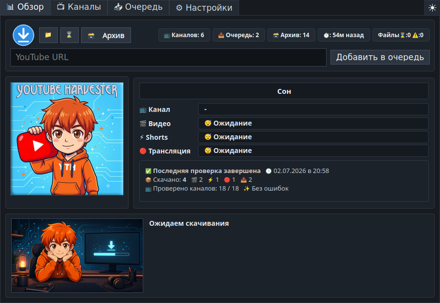
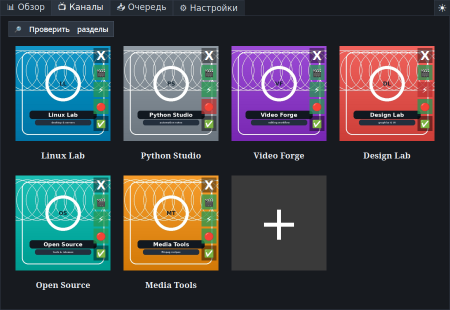
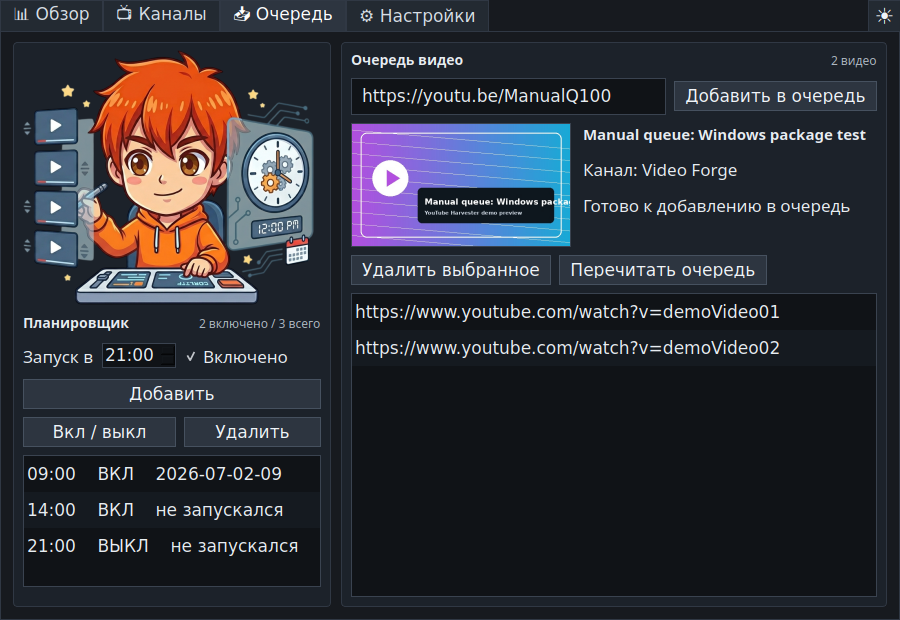
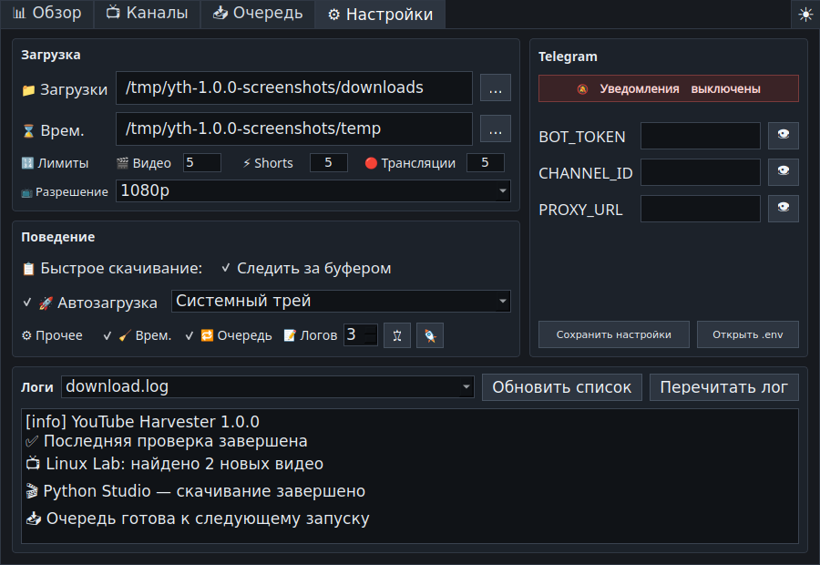

# YouTube Harvester 1.0.0

> Русский интерфейсный загрузчик YouTube-каналов с очередью, быстрым скачиванием,
> архивом, расписанием и Telegram-уведомлениями.

<p align="center">
  
</p>

<p align="center">
  <a href="#русский">Русский</a> · <a href="#english">English</a> ·
  <a href="CHANGELOG.md">Changelog</a> ·
  <a href="https://github.com/LiberVixer/YouTubeHarvester/releases">Releases</a>
</p>



## Русский

**YouTube Harvester** — настольная программа для Linux и Windows, которая
следит за выбранными YouTube-каналами, скачивает новые видео через `yt-dlp`,
ведёт очередь ручных ссылок, хранит архив скачиваний и может отправлять
уведомления или файлы в Telegram.

Версия `1.0.0` использует один основной Python-движок скачивания на Linux и
Windows. Устаревший Bash-движок оставлен в репозитории только как legacy-код и
не выбирается в интерфейсе.

Отдельное спасибо Дмитрию **'Minion'** Погорилову за неоценимую помощь в
бета-тестировании Windows-версии.

### Возможности

- Обзор в реальном времени: состояние программы, проверенные каналы, текущий
  канал, видео/Shorts/трансляции, прогресс и последние события.
- Список каналов с обложками и отдельными переключателями для `Видео`,
  `Shorts` и `Трансляции`.
- Ручная очередь YouTube-ссылок с предпросмотром названия, канала и обложки.
- Быстрое скачивание из буфера обмена: отдельное компактное окно, выбор
  разрешения, кнопки `Скачать немедленно`, `В очередь` и Telegram-чекбокс.
- Глобальная горячая клавиша быстрого скачивания: по умолчанию
  `Ctrl+Shift+Alt+Y`.
- Наблюдение за буфером обмена: если появляется YouTube-ссылка, программа
  открывает окно быстрого скачивания.
- Планировщик запусков по времени.
- Архив скачиваний с поиском, открытием видео на YouTube, открытием файла или
  папки и удалением записей.
- Telegram-настройки в интерфейсе: `BOT_TOKEN`, `CHANNEL_ID`, `PROXY_URL`,
  проверка включения уведомлений и сохранение в `.env`.
- Выбор итогового разрешения: `480p`, `720p`, `1080p`, `1440p`, `2160p` или
  лучшее доступное.
- Темы: тёмная, светлая и системная.
- Режим запуска окна: только системный трей, только панель задач, либо оба
  режима.
- Мягкая остановка скачивания: программа завершает текущий безопасный шаг, а
  не обрывает процесс посреди записи файла.
- Защита от кракозябр в Windows-логах и архиве.
- Windows-сборка включает `ffmpeg.exe`, `ffprobe.exe` и `deno.exe`.
- Linux `.deb` интегрируется в меню приложений и хранит данные в стандартных
  пользовательских папках.

### Скриншоты

| Обзор | Каналы |
| --- | --- |
|  |  |

| Очередь и планировщик | Настройки и логи |
| --- | --- |
|  |  |

### Установка Linux

Скачайте `.deb` из
[GitHub Releases](https://github.com/LiberVixer/YouTubeHarvester/releases):

```bash
sudo apt install ./YouTubeHarvester_1.0.0_linux_all.deb
```

После установки программа доступна из меню приложений или командой:

```bash
yt-harvester
```

Пользовательские файлы после установки `.deb`:

- данные: `~/.local/share/yt-harvester`
- настройки: `~/.config/yt-harvester`
- кэш: `~/.cache/yt-harvester`
- Telegram `.env`: `~/.config/yt-harvester/.env`
- временная папка по умолчанию: `~/temp/YTH`
- папка скачиваний по умолчанию: `~/Downloads/YouTubeHarvester`

### Установка Windows

В релизе публикуются три варианта:

- `YouTubeHarvester_1.0.0_windows_setup.exe` — обычный установщик.
- `YouTubeHarvester_1.0.0_windows_x64.msi` — MSI для Windows x64.
- `YouTubeHarvester_1.0.0_windows_portable.zip` — portable-версия без установки.

Windows-сборка самодостаточна: внутри уже есть `yt-dlp`, `ffmpeg.exe`,
`ffprobe.exe` и `deno.exe`. Для автозагрузки используется ключ текущего
пользователя:

```text
HKCU\Software\Microsoft\Windows\CurrentVersion\Run
```

### Запуск из исходников

Linux:

```bash
sudo apt install python3 python3-pyqt5 python3-pynput yt-dlp curl
cp .env.example .env
nano .env
./start_tray.sh
```

Windows:

```powershell
py -3 -m venv .venv
.\.venv\Scripts\python -m pip install -r requirements.txt
.\start_tray_windows.bat
```

Для офлайн-сборки Windows см.
[docs/windows-offline-build.md](docs/windows-offline-build.md).

### Ключи запуска

Основная команда:

```bash
yt-harvester
```

Поддерживаемые пользовательские ключи:

- `--quick-download` — открыть окно быстрого скачивания. Если приложение уже
  запущено, запрос передаётся в существующий экземпляр.
- `--start-tray` — стартовать только в системном трее.
- `--start-window` — стартовать как обычное окно на панели задач.
- `--start-both` — стартовать и в трее, и на панели задач.

Служебные ключи packaged-сборки:

- `--run-yt-dlp ...` — внутренний запуск bundled `yt-dlp` в Windows/PyInstaller.
- `--run-script <script.py> ...` — внутренний запуск helper-скриптов из
  bundled-сборки.

Helper-скрипты для диагностики и обслуживания:

```bash
python3 scripts/check_channel_sections.py --channel <url> [--timeout 45]
python3 scripts/mark_channel_archived.py --channel <url> --archive yt_archive.txt \
  [--videos-limit 5] [--shorts-limit 5] [--streams-limit 5]
python3 scripts/migrate_archive_details.py --archive yt_archive.txt \
  --details archive_details.jsonl --scan-dir <downloads> [--include-missing]
```

### Горячие клавиши и Wayland

На Windows используется native global hotkey. На Linux/X11 глобальный хоткей
работает через `pynput`. Wayland обычно запрещает приложениям перехватывать
глобальные клавиши напрямую, поэтому YouTube Harvester поддерживает системную
пользовательскую команду для Cinnamon/GNOME Wayland: она запускает
`yt-harvester --quick-download`.

Если окружение не даёт установить глобальный хоткей, быстрый запуск всё равно
доступен из меню трея, кнопкой в интерфейсе и через отслеживание буфера обмена.

### Telegram

Telegram-настройки можно заполнить в интерфейсе или в `.env`:

```bash
BOT_TOKEN=your-telegram-bot-token
CHANNEL_ID=your-telegram-channel-id
PROXY_URL=127.0.0.1:9050
```

`PROXY_URL` необязателен. Если включена отправка файлов в Telegram и Telegram
временно недоступен, локальное сохранение видео не блокируется.

### Сборка релиза

Linux-артефакты:

```bash
packaging/build_release.sh 1.0.0 1.0.0
```

Windows-артефакты собираются на Windows:

```powershell
powershell -ExecutionPolicy Bypass -File .\packaging\windows\build_release.ps1 `
  -Version 1.0.0 -MsiVersion 1.0.0
```

GitHub Actions также собирает Linux и Windows артефакты при пуше тега `v*`.

### Ответственное использование

YouTube Harvester не связан с YouTube, Google, Telegram или проектом `yt-dlp`.
Это локальная оболочка вокруг внешних инструментов.

Используйте программу только для материалов, которые вы имеете право скачивать:
собственные видео, видео с разрешения правообладателя или контент, который
законно сохранять для личного использования. Соблюдайте
[Условия использования YouTube](https://www.youtube.com/t/terms), авторское
право и законы вашей страны.

Храните Telegram-токены в секрете. Не используйте программу для обхода
ограничений доступа, пиратского распространения, продажи скачанных материалов
или агрессивного автоматического сбора данных.

### Внешние компоненты

- [`yt-dlp`](https://github.com/yt-dlp/yt-dlp) — чтение YouTube-метаданных и
  скачивание медиа.
- `PyQt5` / `Qt` — графический интерфейс.
- `ffmpeg` и `ffprobe` — объединение, проверка и обработка медиа.
- `Deno` — JavaScript runtime для случаев, когда YouTube требует JS-обработку.
- `curl` и [Telegram Bot API](https://core.telegram.org/bots/api) —
  Telegram-уведомления.
- `pynput` — глобальный хоткей в Linux/X11.

## English

**YouTube Harvester** is a desktop YouTube downloader for Linux and Windows. It
watches selected channels, downloads new videos through `yt-dlp`, manages a
manual queue, keeps a local archive, supports scheduled runs, and can send
notifications or files to Telegram.

Version `1.0.0` uses the Python downloader engine on both Linux and Windows. The
legacy Bash engine is kept only as reference code.

Special thanks to Dmitry **'Minion'** Pogorilov for invaluable help with Windows
beta testing.

### Main Features

- Tray-first PyQt5 desktop UI.
- Live overview with current channel, media type, progress, events, and preview.
- Channel cards with separate toggles for Videos, Shorts, and live streams.
- Manual queue with metadata and thumbnail preview.
- Quick Download window with clipboard URL detection, resolution selector,
  immediate download, queue add, and Telegram checkbox.
- Default quick-download hotkey: `Ctrl+Shift+Alt+Y`.
- Clipboard watcher for YouTube URLs.
- Scheduler, archive browser, log viewer, and safe stop.
- Telegram settings in the UI and `.env`.
- Dark, light, and system theme modes.
- Windows packages bundle `ffmpeg`, `ffprobe`, and `deno`.
- Linux `.deb` package with standard user data paths.

### Launch Options

```bash
yt-harvester
yt-harvester --quick-download
yt-harvester --start-tray
yt-harvester --start-window
yt-harvester --start-both
```

Internal packaged-build options:

- `--run-yt-dlp ...`
- `--run-script <script.py> ...`

### Release Assets

- `YouTubeHarvester_1.0.0_linux_all.deb`
- `YouTubeHarvester_1.0.0_source.tar.gz`
- `YouTubeHarvester_1.0.0_windows_setup.exe`
- `YouTubeHarvester_1.0.0_windows_x64.msi`
- `YouTubeHarvester_1.0.0_windows_portable.zip`
- `SHA256SUMS-linux.txt`
- `SHA256SUMS-windows.txt`

### Responsible Use

YouTube Harvester is not affiliated with YouTube, Google, Telegram, or `yt-dlp`.
Use it only for videos you own, videos you have permission to download, or
content that you may lawfully save for personal use. Keep Telegram tokens
private.
