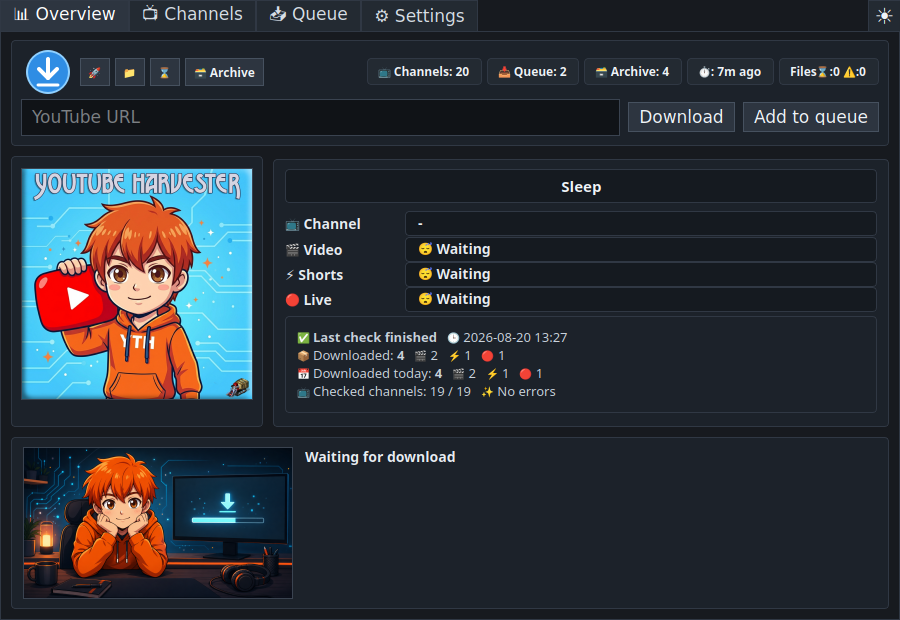
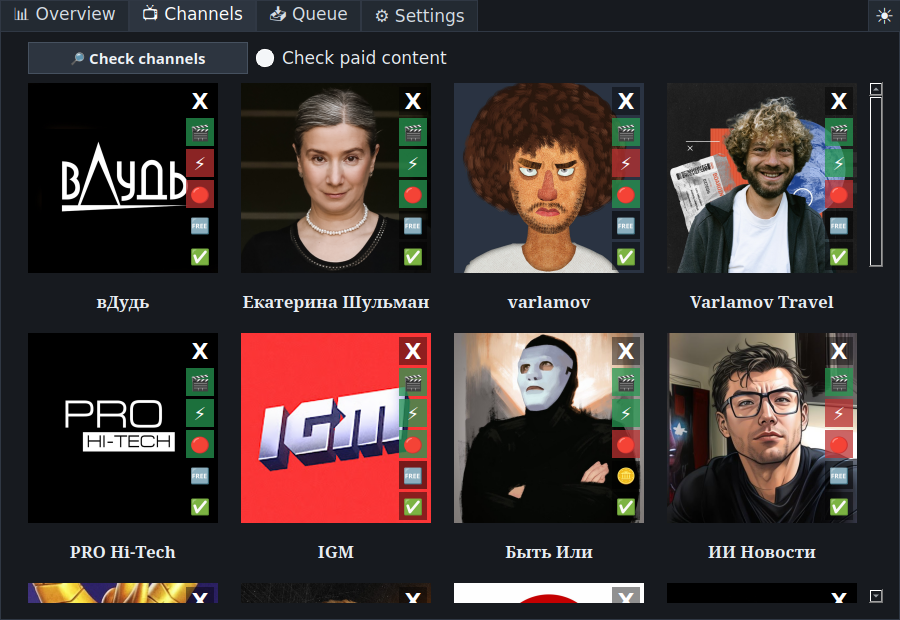
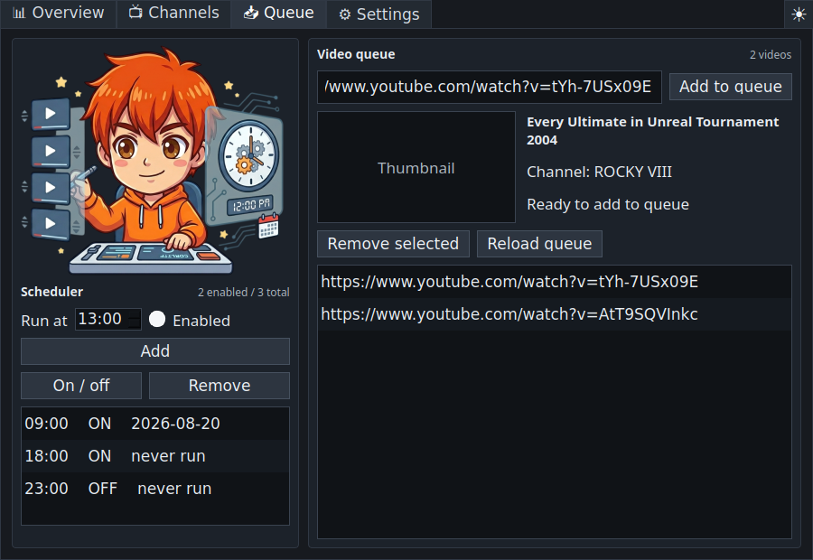
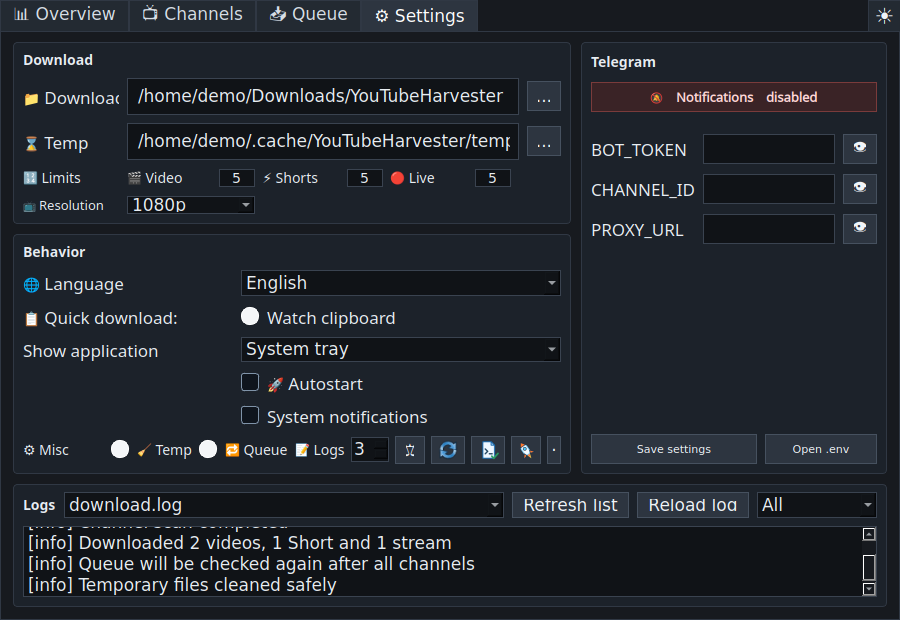

# YouTube Harvester 1.1.0

<p align="center">
  
</p>

<p align="center">
  <a href="README.md">🇺🇸 🇬🇧 English</a> ·
  <a href="README.ru.md">🇷🇺 Русский</a> ·
  <a href="README.uk.md">🇺🇦 Українська</a> ·
  <a href="README.fr.md">🇫🇷 Français</a> ·
  <a href="README.es.md">🇪🇸 Español</a> ·
  <a href="README.hi.md">🇮🇳 हिन्दी</a> ·
  <a href="README.zh.md">🇨🇳 中文</a> ·
  <a href="README.ar.md">🇸🇦 العربية</a>
</p>

<p align="center">
  A multilingual desktop YouTube downloader for Linux and Windows, with channel
  monitoring, a manual queue, quick downloads, scheduling, an archive, and
  optional Telegram delivery.
</p>



## What It Does

**YouTube Harvester** watches selected YouTube channels and downloads new
Videos, Shorts, and live streams through `yt-dlp`. It also accepts individual
video links, keeps a searchable local archive, reports what was downloaded,
and can send notifications or files to Telegram.

Version `1.1.0` uses the Python downloader on both Linux and Windows. The old
Bash engine remains in the source tree only as disabled legacy code.

## Main Features

- Live overview with channel progress, current media type, download stage,
  speed, ETA, size, recent events, session totals, and daily totals.
- Channel cards with original cached channel artwork and independent switches
  for Videos, Shorts, and live streams.
- Optional paid-content scan with three states: unknown, members-only content
  found, or no members-only content found during the check.
- Manual URL field on the Overview tab with immediate download and queue
  actions.
- Video queue with title, channel, thumbnail preview, duplicate/archive checks,
  retry support, and a second queue pass after all channels are scanned.
- Quick Download window with clipboard URL detection, metadata preview,
  resolution selection, immediate download, queue action, and a persistent
  Telegram checkbox.
- Configurable global quick-download hotkey. The default is
  `Ctrl+Shift+Alt+Y`.
- Optional clipboard watcher that opens Quick Download when a valid YouTube URL
  appears.
- Scheduler for automatic runs at selected hours.
- Download archive with type, channel, title, date, YouTube link, local file,
  containing folder, and record deletion.
- Log viewer with All, Important, and Errors filters.
- Built-in `yt-dlp` version check and a diagnostics report for the OS, display
  session, tray, hotkey, tools, paths, cache, write access, and free disk space.
- Dark, light, and system themes.
- Startup modes: system tray only, taskbar only, or tray and taskbar together.
- Safe stop, guarded temporary-file cleanup, Windows-safe filenames, and UTF-8
  handling for Windows logs and archive data.
- English by default, with Russian, Ukrainian, French, Spanish, Hindi, Chinese,
  and Arabic interfaces.

## Screenshots

| Overview | Channels |
| --- | --- |
|  |  |

| Queue and scheduler | Settings and logs |
| --- | --- |
|  |  |

## Downloads

Ready-to-use packages are published on
[GitHub Releases](https://github.com/LiberVixer/YouTubeHarvester/releases).

Linux:

- `YouTubeHarvester_1.1.0_linux_all.deb`
- `YouTubeHarvester_1.1.0_source.tar.gz`
- `SHA256SUMS-linux.txt`

Windows:

- `YouTubeHarvester_1.1.0_windows_setup.exe` — standard installer.
- `YouTubeHarvester_1.1.0_windows_x64.msi` — x64 MSI package.
- `YouTubeHarvester_1.1.0_windows_portable.zip` — portable build.
- `SHA256SUMS-windows.txt`

The Windows packages bundle `yt-dlp`, `ffmpeg.exe`, `ffprobe.exe`, and
`deno.exe`.

## Install on Linux

```bash
sudo apt install ./YouTubeHarvester_1.1.0_linux_all.deb
```

Start it from the application menu or run:

```bash
yt-harvester
```

The `.deb` package uses standard per-user locations:

- data: `~/.local/share/yt-harvester`
- settings: `~/.config/yt-harvester`
- cache: `~/.cache/yt-harvester`
- Telegram configuration: `~/.config/yt-harvester/.env`
- default temporary directory: `~/temp/YTH`
- default download directory: `~/Downloads/YouTubeHarvester`

## Install on Windows

Choose the Setup EXE, MSI, or portable ZIP from the release. The installed and
portable builds are self-contained; no separate Python, FFmpeg, or Deno setup
is required.

Autostart uses the current user's registry key:

```text
HKCU\Software\Microsoft\Windows\CurrentVersion\Run
```

## Run from Source

Linux:

```bash
sudo apt install python3 python3-pyqt5 python3-pynput yt-dlp ffmpeg curl
# Recommended for Wayland clipboard monitoring:
sudo apt install wl-clipboard
cp .env.example .env
./start_tray.sh
```

Windows:

```powershell
py -3 -m venv .venv
.\.venv\Scripts\python -m pip install -r requirements.txt
.\start_tray_windows.bat
```

See [the offline Windows build guide](docs/windows-offline-build.md) when the
build machine has no reliable Internet access.

## Launch Options

```bash
yt-harvester
yt-harvester --quick-download
yt-harvester --start-tray
yt-harvester --start-window
yt-harvester --start-both
```

- `--quick-download` opens Quick Download. If another instance is already
  running, the request is handed to that instance.
- `--start-tray` starts in the system tray without a taskbar window.
- `--start-window` starts as a normal taskbar window.
- `--start-both` enables both tray and taskbar presence.

Internal packaged-build options:

- `--run-yt-dlp ...`
- `--run-script <script.py> ...`

Maintenance helpers:

```bash
python3 scripts/check_channel_sections.py --channel <url> [--timeout 45]
python3 scripts/mark_channel_archived.py --channel <url> --archive yt_archive.txt \
  [--videos-limit 5] [--shorts-limit 5] [--streams-limit 5]
python3 scripts/migrate_archive_details.py --archive yt_archive.txt \
  --details archive_details.jsonl --scan-dir <downloads> [--include-missing]
```

## Quick Download, X11, and Wayland

Windows uses a native global hotkey. Linux/X11 uses `pynput`. Wayland normally
blocks applications from registering global keys directly, so YouTube
Harvester can create a Cinnamon/GNOME system shortcut that runs
`yt-harvester --quick-download`.

Quick Download is always available from the tray menu and the Overview tab.
Clipboard monitoring works through the regular clipboard on Windows/X11 and
through `wl-paste` on Wayland when `wl-clipboard` is installed.

## Channel and Queue Workflow

The application checks enabled channel sections in order and pauses briefly
after each completed section so its result remains visible. Paid-content
probing is performed only during an explicit channel check when enabled. If a
members-only video is encountered during a normal download scan, the channel
status is still updated and the inaccessible item is reported calmly as an
important event.

The queue is processed at the start of a run and again after every channel has
been checked. Already archived videos and duplicate queue entries are skipped.
A failed queue item can be returned for a later retry.

## Telegram

Telegram delivery can be turned off completely. When enabled, configure it in
Settings or in `.env`:

```bash
BOT_TOKEN=your-telegram-bot-token
CHANNEL_ID=your-telegram-channel-id
PROXY_URL=127.0.0.1:9050
```

`PROXY_URL` is optional. A Telegram failure never removes a successfully saved
local video.

## Building a Release

Linux artifacts:

```bash
packaging/build_release.sh 1.1.0 1.1.0
```

Windows artifacts, from Windows:

```powershell
powershell -ExecutionPolicy Bypass -File .\packaging\windows\build_release.ps1 `
  -Version 1.1.0 -MsiVersion 1.1.0
```

GitHub Actions builds Linux and Windows artifacts for tags matching `v*`.

## Responsible Use

YouTube Harvester is not affiliated with YouTube, Google, Telegram, or
`yt-dlp`. Download only material you own, have permission to download, or may
lawfully save for personal use. Follow the
[YouTube Terms of Service](https://www.youtube.com/t/terms), copyright law, and
the laws of your country. Keep Telegram credentials private.

External components include
[`yt-dlp`](https://github.com/yt-dlp/yt-dlp), PyQt5/Qt, FFmpeg/FFprobe, Deno,
`curl`, Telegram Bot API, and `pynput`. Each component is distributed under its
own license and terms.

## Thanks

Special thanks to Dmitry **'Minion' Pororiliy** for invaluable help beta-testing
the Windows version.

A Harvester from **Command & Conquer: Red Alert** has been added to the program
logo. 🙂

See the [English changelog](CHANGELOG.md) for the complete release history.
