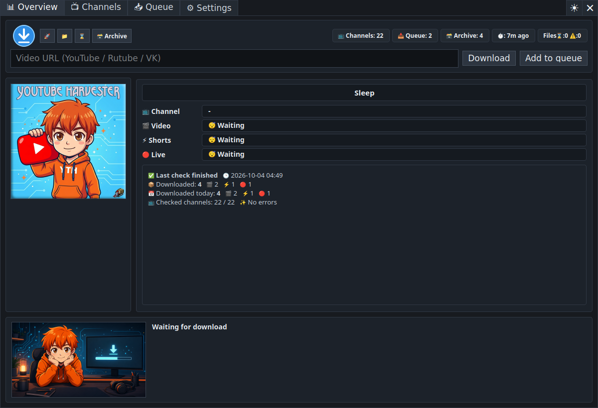
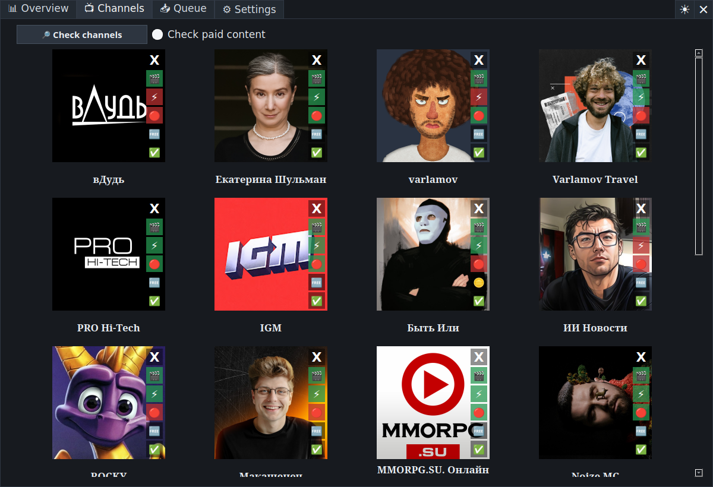
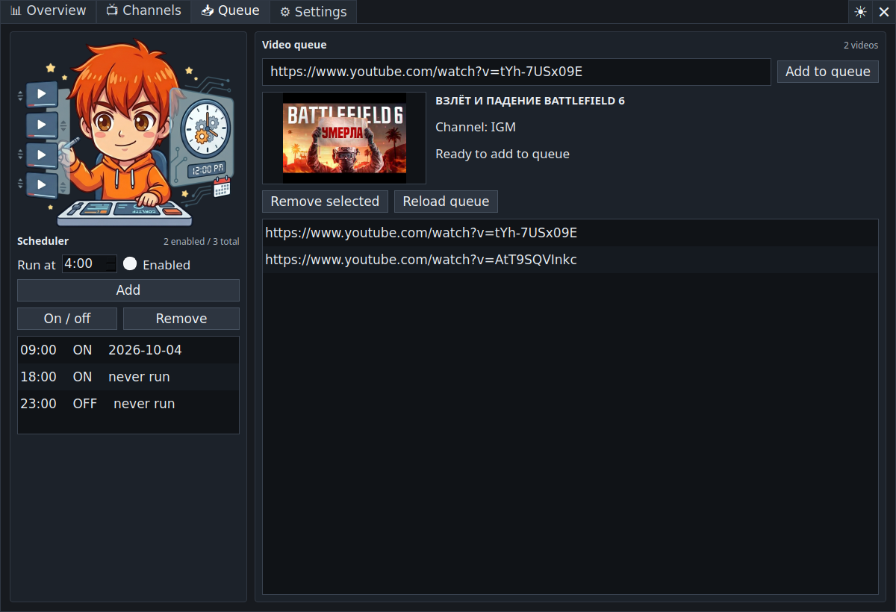
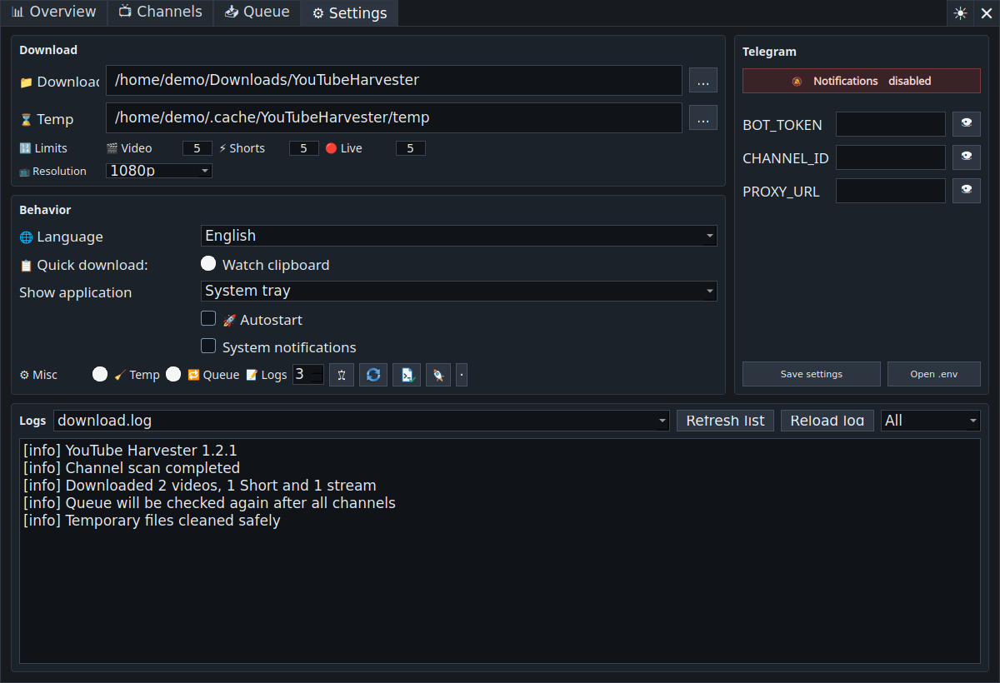
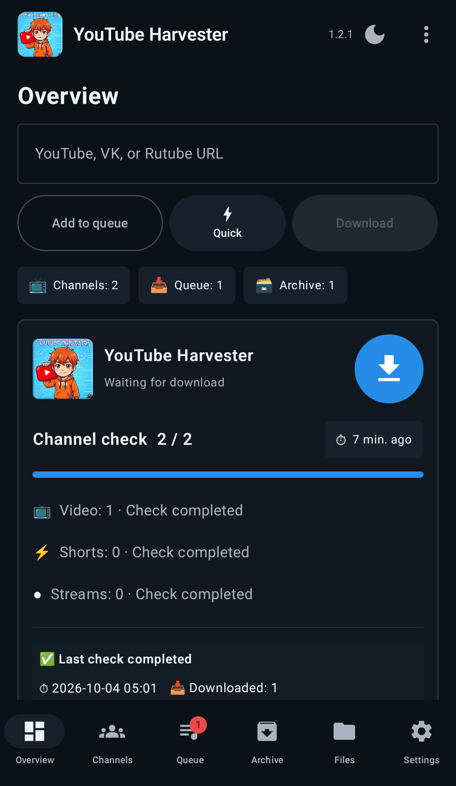
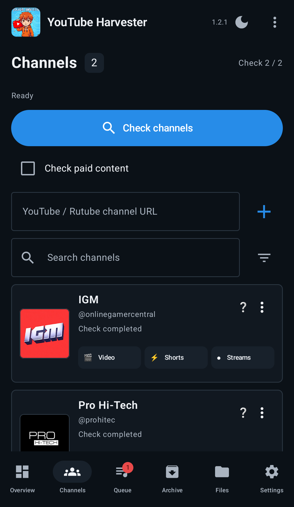
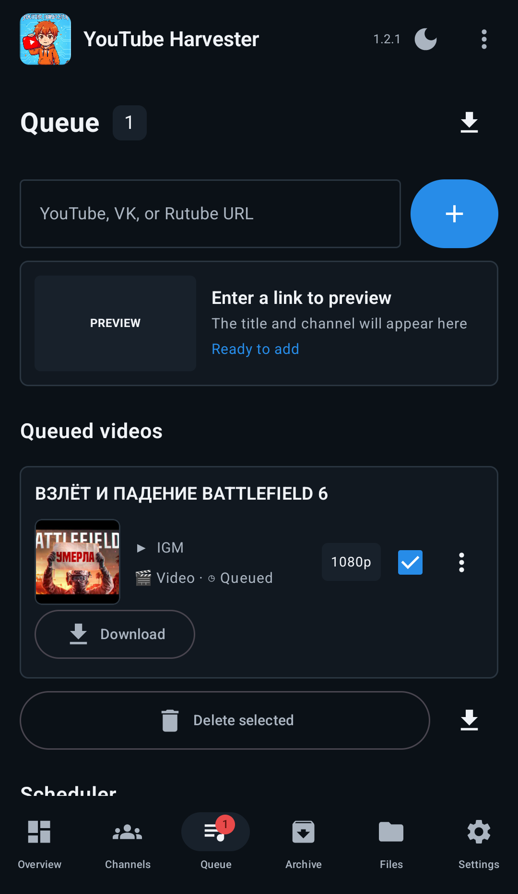
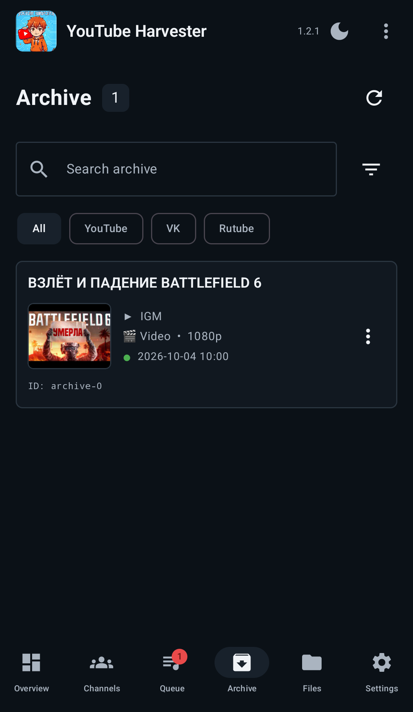
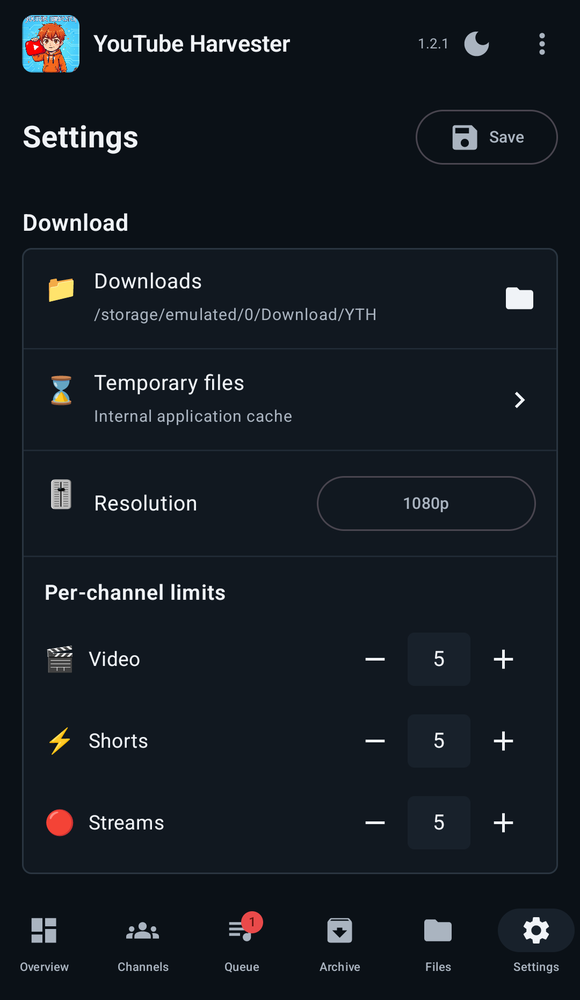

# YouTube Harvester 1.2.1

<p align="center">
  
</p>

<p align="center">
  <a href="README.md">🇺🇸 🇬🇧 English</a> ·
  <a href="README.ru.md">🇷🇺 Русский</a> ·
  <a href="README.uk.md">🇺🇦 Українська</a> ·
  <a href="README.be.md">🇧🇾 Беларуская</a> ·
  <a href="README.fr.md">🇫🇷 Français</a> ·
  <a href="README.es.md">🇪🇸 Español</a> ·
  <a href="README.hi.md">🇮🇳 हिन्दी</a> ·
  <a href="README.zh.md">🇨🇳 中文</a> ·
  <a href="README.ja.md">🇯🇵 日本語</a> ·
  <a href="README.ar.md">🇸🇦 العربية</a>
</p>

A multilingual downloader for **Linux, Windows, and Android**. Monitor YouTube and Rutube channels, download individual YouTube/Rutube/VK videos, manage a queue and archive, schedule checks, and optionally deliver files or notifications to Telegram.

## Version 1.2.1

Documentation updated: **2026-10-04**.

Current source and local packages use **1.2.1** without beta/prerelease labels. Android uses `versionCode 120100`; internal debug builds retain `-debug`. Windows was rebuilt from the same current desktop sources as Linux, including Rutube support and recovery after interrupted downloads.

**Release preparation, not a publication announcement.** Desktop installers and four Android tester APKs have been built locally. Public Android release acceptance is not complete; existing tester APKs retain the development certificate. A version number without beta does not make those APKs public release builds.

Linux and Windows share the Python/yt-dlp downloader; the old Bash engine is disabled legacy source only.

[Version verification](docs/version-1.2.1-20261003.md) · [1.2.1 preparation notes](docs/releases/1.2.1.md).

## Desktop Features

- Live overview with channel progress, current media type, download stage,
  speed, ETA, size, recent events, session totals, and daily totals.
- Channel cards with original cached channel artwork and independent switches
  for Videos, Shorts, and live streams.
- Optional paid-content scan with three states: unknown, members-only content
  found, or no members-only content found during the check.
- Manual URL field on the Overview tab with immediate download and queue
  actions.
- Video queue with title, channel, thumbnail preview, duplicate/archive checks,
  retry support, and a second queue pass after all channels are scanned.
- Quick Download window with clipboard URL detection, metadata preview,
  resolution selection, multiple audio and subtitle tracks, immediate download,
  queue action, and a persistent Telegram checkbox.
- Configurable global quick-download hotkey. The default is
  `Ctrl+Shift+Alt+Y`.
- Optional clipboard watcher that opens Quick Download when a supported
  YouTube, Rutube, or VK URL appears.
- Scheduler for automatic runs at selected hours.
- Download archive with type, channel, title, date, source link, local file,
  quality/track variants, containing folder, and record deletion.
- Log viewer with All, Important, and Errors filters.
- Verified application updates from official GitHub Releases for installed,
  portable, and Linux package builds.
- Built-in safe `yt-dlp` check and updater, plus a diagnostics report for the OS, display
  session, tray, hotkey, tools, paths, cache, write access, and free disk space.
- Dark, light, and system themes.
- Startup modes: system tray only, taskbar only, or tray and taskbar together.
- Safe stop, guarded temporary-file cleanup, Windows-safe filenames, and UTF-8
  handling for Windows logs and archive data.
- English by default, with Russian, Ukrainian, Belarusian, French, Spanish,
  Hindi, Chinese, Japanese, and Arabic interfaces.

## Sources and Processing

- **YouTube channels:** Videos, Shorts, and streams, with separate switches and per-section limits. Supported channel forms include handles and channel/user/custom URLs.
- **Rutube channels:** `/channel/ID/` and `/u/name/`, including Videos/Shorts links. Aliases are resolved to avoid duplicates; names and artwork are cached.
- **Rutube shows:** `/metainfo/tv/ID/`, with the show's own title/poster and Videos only. The latest N items are selected from newest to oldest.
- **Individual videos:** YouTube, Rutube, and VK/VK Video links in the manual field, queue, and quick-download workflow. VK channel monitoring and arbitrary Rutube playlists are not supported.

Rutube stream scanning and paid-content probing are disabled. Paid-content detection is YouTube-specific: it reports availability, does not bypass access restrictions, and does not guarantee that inaccessible media can be downloaded. Channel menus can mark recent items as already handled without downloading them.

A harvest processes the manual queue, then enabled channel sections with sequential downloads, then checks the queue again. Archived/duplicate discoveries are skipped. The Channels check validates sections; a harvest starts from Overview or the scheduler. Archive variants retain quality and track choices.

Stopping a desktop download no longer blocks the next run. Protected temporary-file cleanup and retry handling remain enabled; do not manually delete temporary files while a download is active. If a provider, VPN, or proxy fails, check the connection and logs before treating it as an application failure. Region/account restrictions and source-protocol limits still apply.

## Android

Native Kotlin/Jetpack Compose application for **Android 8.0+ (API 26)**. Four ABI builds: `arm64-v8a`, `armeabi-v7a`, `x86_64`, `x86`.

- Overview, Channels, Queue, Archive, and Settings, plus a download-folder action; ten interface languages, dark/light/system themes, and Arabic RTL.
- The same supported source categories, including Rutube channels and shows; section limits, recent-item marking, scheduled harvests, metadata and thumbnail previews.
- Immediate URL download; the Overview Quick button reads a supported clipboard link only on an explicit tap. Share opens media options. The launcher shortcut opens Overview; optional clipboard monitoring is limited to the foreground app.
- Resolution and multiple audio/subtitle choices, persistent jobs, pause/resume/cancel/retry, progress notifications, and foreground-service downloads. Resume retains the same job and partial files; byte-level continuation depends on the source.
- WorkManager-owned harvest recovery, queue/check reports and daily totals, reboot recovery, MediaStore/SAF storage, archive file access, logs and diagnostics. After Android force-stop, reopen the app; OEM battery restrictions can affect background work.
- Optional Telegram with Android Keystore-protected credentials. Password-protected `.ythbackup` export/import transfers records/settings, **not videos or temporary files**. Import requires an empty destination database; moved files need verified folder relinking.
- APK updates verify SHA-256, package, higher version code and installed certificate before opening the Android installer. Android's bundled `yt-dlp` is updated **with the app**, not by downloading a replacement engine separately.

**VK on Android:** individual VK/VK Video downloads are supported; a public VK download was verified on LDPlayer on 2026-09-14. VK channel monitoring is not implemented. Private or restricted videos may be unavailable.

[Android developer guide](android/README.md) · [Data transfer instructions](android/DATA-TRANSFER.ru.md).

## Android Release Status

Before public distribution: finish the permanent-key/independent-backup checks, complete the matching native runtime source/license bundle and security review, accept migration in the exact signed candidate, and test ARM devices, older supported Android, Android 15+ boot/resume, 16 KB pages, and TalkBack. Then verify final signed APKs and release packaging.

Do **not uninstall an existing tester app** to switch certificates. Encrypted migration has been tested in an isolated QA package, but this does not replace acceptance of the final public candidate.

[Release readiness](android/RELEASE-READINESS.ru.md).

## Screenshots

| Overview | Channels |
| --- | --- |
|  |  |

| Queue and scheduler | Settings and logs |
| --- | --- |
|  |  |

### Android

Android 1.2.1, dark theme. Demonstration data.

| Overview | Channels |
| --- | --- |
|  |  |

| Queue | Archive |
| --- | --- |
|  |  |

**Settings**



[Screenshot catalog and capture provenance](docs/screenshots/README.md).

## Downloads

Locally prepared desktop artifacts are under `dist/release/`. Public downloads, when published, belong in [GitHub Releases](https://github.com/LiberVixer/YouTubeHarvester/releases); this README does not claim that 1.2.1 has already been published.

| Platform | Files |
| --- | --- |
| Linux | `YouTubeHarvester_1.2.1_linux_all.deb`, `YouTubeHarvester_1.2.1_source.tar.gz`, `SHA256SUMS-linux.txt` |
| Windows x64 | `YouTubeHarvester_1.2.1_windows_setup.exe`, `YouTubeHarvester_1.2.1_windows_x64.msi`, `YouTubeHarvester_1.2.1_windows_portable.zip`, `SHA256SUMS-windows.txt` |

Private tester APKs: `android/YouTubeHarvester-1.2.1-<ABI>.apk`. They are **not public release artifacts**. Public Android packaging also requires application/runtime sources, BUILD-INFO and SHA256SUMS.

## Install on Linux

```bash
sudo apt install ./YouTubeHarvester_1.2.1_linux_all.deb
```

Start it from the application menu or run:

```bash
yt-harvester
```

The `.deb` package uses standard per-user locations:

- data: `~/.local/share/yt-harvester`
- settings: `~/.config/yt-harvester`
- cache: `~/.cache/yt-harvester`
- Telegram configuration: `~/.config/yt-harvester/.env`
- default temporary directory: `~/temp/YTH`
- default download directory: `~/Downloads/YouTubeHarvester`

The `.deb` uses distribution Python/Qt/yt-dlp/FFmpeg/curl packages and does not silently upgrade them. Its actual component versions can therefore differ from the pinned development and Windows builds. Deno is suggested, not bundled; supply a compatible JavaScript runtime for full YouTube support.

## Install on Windows

Use the x64 Setup EXE or MSI, or extract the portable ZIP and launch `YouTubeHarvester.exe`. Python, yt-dlp, FFmpeg/FFprobe, and Deno are bundled; no separate installation is required. Defaults: data/cache under `%LOCALAPPDATA%\YouTubeHarvester`, settings under `%APPDATA%\YouTubeHarvester`, temporary files under `%TEMP%\YTH`. Autostart uses the current user's registry key `HKCU\Software\Microsoft\Windows\CurrentVersion\Run`.

## Android Installation and Updates

For authorized testers, choose the APK matching the device ABI and update with the same signing certificate, without uninstalling or clearing app data. Allow the Android installer only for the trusted installation source; grant notifications and select the destination folder when needed. Downloads default to `Download/YTH`, or a folder selected through SAF. A differently signed public APK cannot overwrite the current tester installation.

## Run from Source

Linux source runs use `.venv` when present; `YTD_PYTHON` selects another interpreter. The locked desktop environments were verified with Python 3.12. FFmpeg/FFprobe and a JavaScript runtime are external tools on Linux; prepared Deno/FFmpeg tools can be fetched with the checksum-verifying helper below.

Fetch the tools only when absent: the helper refuses existing target directories. Keep your existing `.env`; enter real Telegram settings through the app or edit your own file. Never publish that file.

Linux:

```bash
sudo apt install python3 python3-venv python3-pyqt5 python3-pynput python3-dbus ffmpeg curl
python3 -m venv .venv
.venv/bin/python -m pip install -r requirements-linux-lock.txt
.venv/bin/python scripts/fetch_desktop_tools.py --platform linux --output tools/linux
cp -n .env.example .env
./start_tray.sh
```

Windows source runs also need FFmpeg/FFprobe and Deno. The release builder can use the pinned local tools or download and verify them.

Windows:

```powershell
py -3.12 -m venv .venv
.\.venv\Scripts\python -m pip install -r requirements-windows-lock.txt
.\.venv\Scripts\python scripts/fetch_desktop_tools.py --platform windows --output tools/windows
.\start_tray_windows.bat
```

[Run from Source Windows (offline)](docs/windows-offline-build.md).

## Launch Options

```bash
yt-harvester
yt-harvester --quick-download
yt-harvester --show-main
yt-harvester --start-tray
yt-harvester --start-window
yt-harvester --start-both
```

- `--quick-download` opens Quick Download. If another instance is already
  running, the request is handed to that instance.
- `--show-main` opens or raises the main window of the running instance.
- `--start-tray` starts in the system tray without a taskbar window.
- `--start-window` starts as a normal taskbar window.
- `--start-both` enables both tray and taskbar presence.

Internal packaged-build options:

- `--run-yt-dlp ...`
- `--run-script <script.py> ...`

Maintenance helpers:

```bash
python3 scripts/check_channel_sections.py --channel <url> [--timeout 45]
python3 scripts/mark_channel_archived.py --channel <url> --archive yt_archive.txt \
  [--videos-limit 5] [--shorts-limit 5] [--streams-limit 5]
python3 scripts/migrate_archive_details.py --archive yt_archive.txt \
  --details archive_details.jsonl --scan-dir <downloads> [--include-missing]
```

## Quick Download, X11, and Wayland

Windows uses a native global hotkey. Linux/X11 uses `pynput`. Wayland normally
blocks applications from registering global keys directly, so YouTube
Harvester can create a Cinnamon/GNOME system shortcut that runs
`yt-harvester --quick-download`.

Quick Download is always available from the tray menu and the Overview tab.
Clipboard monitoring works through the regular clipboard on Windows/X11 and
through `wl-paste` on Wayland when `wl-clipboard` is installed.

## Telegram

Telegram delivery can be turned off completely. When enabled, configure it in
Settings or in `.env`:

```bash
BOT_TOKEN=your-telegram-bot-token
CHANNEL_ID=your-telegram-channel-id
PROXY_URL=127.0.0.1:9050
```

`PROXY_URL` is optional. A Telegram failure never removes a successfully saved
local video.

## Pinned Components

These are the project's reviewed pins, not a claim that every installed copy uses them or that they are the newest upstream releases. Desktop dependency graphs are in `requirements-linux-lock.txt` and `requirements-windows-lock.txt`. Android pins/hashes are in `android/runtime.properties` and `android/gradle/verification-metadata.xml`.

| Component | Desktop development / Windows | Android |
| --- | --- | --- |
| yt-dlp | 2026.08.19 | 2026.08.19 |
| FFmpeg / FFprobe | 9.0.2 | 7.1.1 |
| Deno / QuickJS | Deno 2.9.7 | QuickJS 2026-06-04 |
| PyQt5 / Compose BOM | PyQt5 5.15.11 | Compose 2026.09.00 |
| Qt runtime | Linux 5.15.19 / Windows 5.15.2 | - |
| Room / WorkManager | - | 2.8.5 / 2.12.0 |
| Coil | - | 3.6.3 |
| PyInstaller / AGP / Gradle | PyInstaller 6.22.3 | AGP 9.4.1 / Gradle 9.8.0 |
| Kotlin Compose compiler / KSP | - | 2.4.20 / 2.3.12 |

Android retains the upstream Python 3.12.11, OpenSSL 3.5.2, and FFmpeg 7.1.1 runtime; compatible rebuilds and corresponding-source review remain pending. QuickJS 2026-06-04 and WebP/SharpYUV 1.6.0 were rebuilt for all four ABIs with 16 KB alignment. Static alignment checks do not replace testing on a 16 KB device.

[Component update record](docs/component-update-20261003.md) · [Native rebuild instructions](android/native/README.md).

## Building a Release

Desktop tags use `v*`; Android release tags use `android-v<versionName>` and a separate workflow. Android release signing requires the approved permanent certificate and a reviewed matching runtime-source bundle. Never put keys, passwords, tokens, or unsigned/private tester APKs into public artifacts.

Linux:

```bash
packaging/build_release.sh 1.2.1 1.2.1
```

Windows:

```powershell
powershell -ExecutionPolicy Bypass -File .\packaging\windows\build_release.ps1 `
  -Version 1.2.1 -MsiVersion 1.2.1
```

Android (JDK 17, Android SDK, Gradle Wrapper):

```bash
cd android
./gradlew testDebugUnitTest assembleDebug
python3 -m unittest discover -s scripts -p 'test_*.py' -v
```

[Android release and signing policy](android/RELEASING.md)

## Verification and Limits

Latest local checks: **89 desktop Python tests**, **39 Android Python tests**, **149 Android JVM tests**, and successful capture of 50 Android screenshots. The version-alignment pass also completed **80 Windows tests** (two POSIX-only skips) and **36 selected LDPlayer device tests** on Android 14/API 34 x86_64.

Desktop tools and a real local H.264/AAC download/remux were verified. Four Android APKs passed manifest/certificate/ZIP checks and applicable 64-bit native alignment checks. ARM execution, all-device background behavior, and installation/uninstallation of the new Windows installers are not established by these passes. Fresh documentation is not a rebuild or publication of installed copies.

[Android test plan](android/TEST-PLAN.ru.md).

## Licensing and Responsible Use

The **Android application module is GPL-3.0-only**, as approved by the owner; see [LICENSE](android/LICENSE), [NOTICE](android/NOTICE), and [the licensing record](android/legal/README.md). This does not change desktop or third-party licensing. Each bundled component retains its own license; the complete corresponding-source runtime bundle is still a public Android release requirement.

The application is not affiliated with YouTube, Google, Rutube, VK, Telegram, or yt-dlp. Use only media you are entitled to download and respect source-service terms and applicable law. Keep credentials and backup passwords private.

## Thanks

Special thanks to Dmitry **'Minion' Pororiliy** for invaluable help beta-testing
the Windows version.

A Harvester from **Command & Conquer: Red Alert** has been added to the program
logo. 🙂

See the [English changelog](CHANGELOG.md) for the complete release history.
