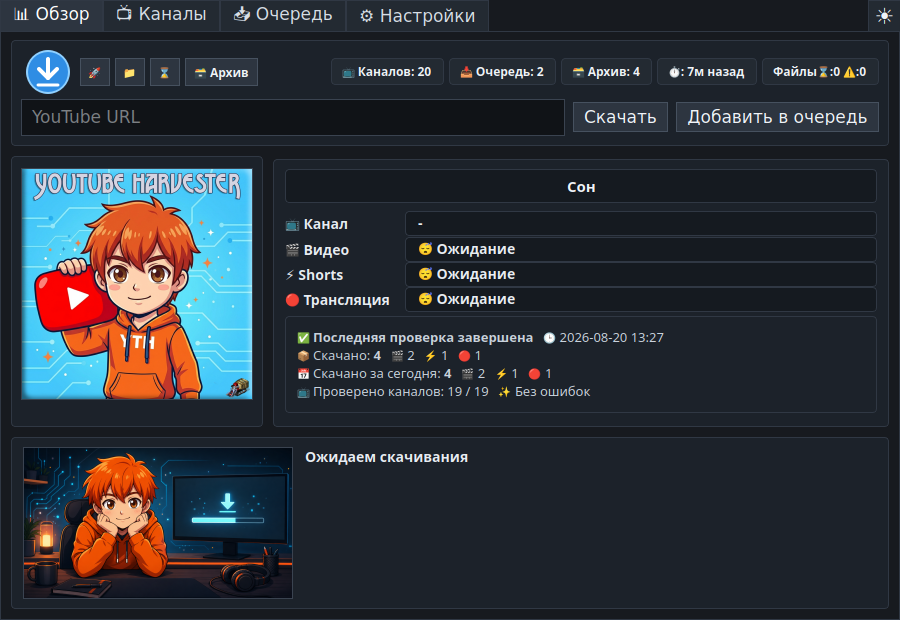
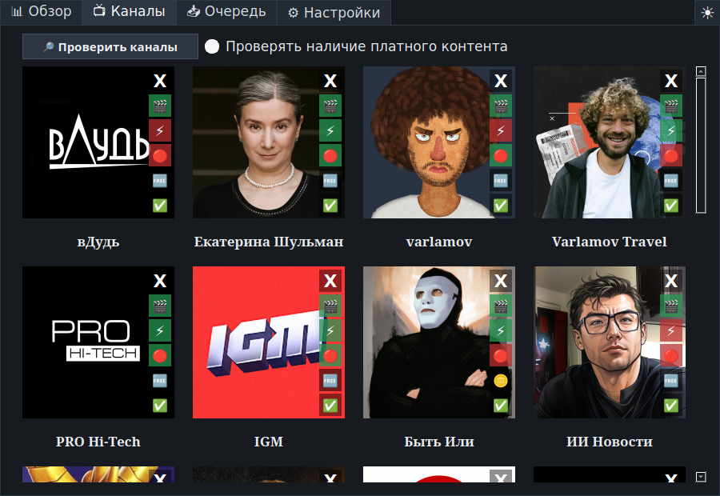
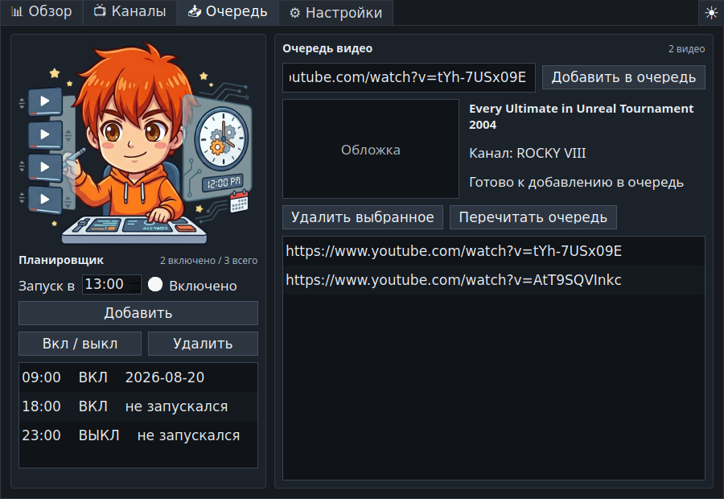
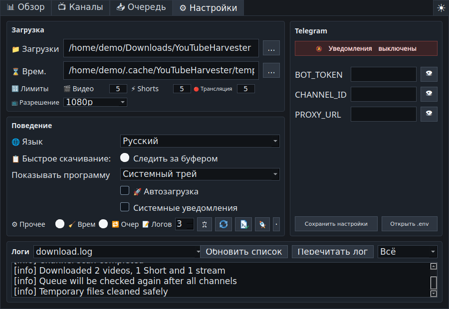

# YouTube Harvester 1.2.0 Beta

<p align="center">
  
</p>

<p align="center">
  <a href="README.md">🇺🇸 🇬🇧 English</a> ·
  <a href="README.ru.md">🇷🇺 Русский</a> ·
  <a href="README.uk.md">🇺🇦 Українська</a> ·
  <a href="README.be.md">🇧🇾 Беларуская</a> ·
  <a href="README.fr.md">🇫🇷 Français</a> ·
  <a href="README.es.md">🇪🇸 Español</a> ·
  <a href="README.hi.md">🇮🇳 हिन्दी</a> ·
  <a href="README.zh.md">🇨🇳 中文</a> ·
  <a href="README.ja.md">🇯🇵 日本語</a> ·
  <a href="README.ar.md">🇸🇦 العربية</a>
</p>

<p align="center">
  Мультиязычная программа для скачивания YouTube на Linux и Windows: слежение
  за каналами, ручная очередь, быстрое скачивание, расписание, архив и
  необязательная отправка в Telegram.
</p>

> **UPD 2:** Быстрое скачивание теперь объединяет несколько аудиодорожек и
> субтитров в одном видео. Архив различает варианты по качеству и дорожкам,
> ошибки отдельных субтитров не отменяют скачивание, добавлена полная японская
> локализация.

> **UPD 3:** В версии 1.1.3 добавлено проверенное обновление программы из
> официальных релизов GitHub, полная белорусская локализация и документация,
> а встроенный загрузчик обновлён до `yt-dlp 2026.08.19` с более надёжным
> восстановлением после временных ошибок YouTube HTTP 403.

> **UPD 4 (Beta):** Версия 1.2.0 Beta добавляет необязательное скачивание
> отдельных видео с YouTube, Rutube и VK через Обзор, Быстрое скачивание,
> слежение за буфером, очередь и архив. Учёт источника вместе с ID исключает
> пересечения записей разных сервисов, а обновлённые закреплённые компоненты
> делают сборки Windows и Linux воспроизводимее. Это предварительная версия
> для тестирования.



## Что делает программа

**YouTube Harvester** следит за выбранными YouTube-каналами и скачивает новые
Видео, Shorts и Трансляции через `yt-dlp`. В программу можно добавлять отдельные
ссылки, вести локальный архив, смотреть отчёты о скачанном и отправлять
уведомления или файлы в Telegram.

Версия `1.2.0-beta` использует Python-движок на Linux и Windows. Старый Bash-движок
оставлен в исходниках только как отключённый устаревший код.

## Основные возможности

- Живой экран обзора: прогресс каналов, текущий тип контента, этап скачивания,
  скорость, оставшееся время, размер, последние события, итоги сеанса и дня.
- Карточки каналов с оригинальными сохранёнными обложками и отдельными
  переключателями Видео, Shorts и Трансляций.
- Необязательная проверка платного контента с тремя состояниями: неизвестно,
  встречалось members-only или при проверке members-only не найдено.
- Поле ручной ссылки на вкладке «Обзор» с кнопками немедленного скачивания и
  добавления в очередь.
- Очередь с предпросмотром названия, канала и обложки, проверкой дублей и
  архива, повтором неудачных ссылок и дополнительной обработкой после проверки
  всех каналов.
- Окно быстрого скачивания: ссылка из буфера, предпросмотр метаданных, выбор
  разрешения, нескольких аудиодорожек и субтитров, немедленное скачивание,
  очередь и сохраняющийся чекбокс Telegram.
- Настраиваемая глобальная горячая клавиша. По умолчанию
  `Ctrl+Shift+Alt+Y`.
- Слежение за буфером обмена с открытием окна быстрого скачивания при появлении
  поддерживаемой ссылки YouTube, Rutube или VK.
- Планировщик автоматических запусков по часам.
- Подробный архив с типом, каналом, названием, датой, ссылкой на источник,
  вариантами качества и дорожек, локальным файлом, папкой и удалением записи.
- Просмотр логов с фильтрами «Всё», «Важное» и «Ошибки».
- Проверенное обновление самой программы из официальных релизов GitHub для
  установленной, портативной и Linux-версии.
- Безопасная проверка и обновление `yt-dlp` из интерфейса, диагностика ОС, X11/Wayland, трея, горячей
  клавиши, инструментов, путей, кэша, прав записи и свободного места.
- Тёмная, светлая и системная темы.
- Три режима запуска: только системный трей, только панель задач или оба.
- Мягкая остановка, защищённая очистка временной папки, безопасные имена файлов
  и корректный UTF-8 в Windows-логах и архиве.
- Английский интерфейс по умолчанию; также доступны русский, украинский,
  белорусский, французский, испанский, хинди, китайский, японский и арабский.

## Скриншоты

| Обзор | Каналы |
| --- | --- |
|  |  |

| Очередь и планировщик | Настройки и логи |
| --- | --- |
|  |  |

## Готовые сборки

Файлы публикуются в
[GitHub Releases](https://github.com/LiberVixer/YouTubeHarvester/releases).

Linux:

- `YouTubeHarvester_1.2.0-beta_linux_all.deb`
- `YouTubeHarvester_1.2.0-beta_source.tar.gz`
- `SHA256SUMS-linux.txt`

Windows:

- `YouTubeHarvester_1.2.0-beta_windows_setup.exe` — обычный установщик.
- `YouTubeHarvester_1.2.0-beta_windows_x64.msi` — пакет MSI x64.
- `YouTubeHarvester_1.2.0-beta_windows_portable.zip` — portable-версия.
- `SHA256SUMS-windows.txt`

В Windows-сборки уже входят `yt-dlp`, `ffmpeg.exe`, `ffprobe.exe` и `deno.exe`.

## Установка в Linux

```bash
sudo apt install ./YouTubeHarvester_1.2.0-beta_linux_all.deb
```

После установки запустите программу из меню приложений или командой:

```bash
yt-harvester
```

Пользовательские файлы `.deb`-сборки:

- данные: `~/.local/share/yt-harvester`
- настройки: `~/.config/yt-harvester`
- кэш: `~/.cache/yt-harvester`
- Telegram: `~/.config/yt-harvester/.env`
- временная папка: `~/temp/YTH`
- папка загрузок: `~/Downloads/YouTubeHarvester`

## Установка в Windows

Выберите Setup EXE, MSI или portable ZIP на странице релиза. Установленная и
portable-версии самодостаточны: отдельно ставить Python, FFmpeg или Deno не
нужно.

Для автозагрузки используется ключ текущего пользователя:

```text
HKCU\Software\Microsoft\Windows\CurrentVersion\Run
```

## Запуск из исходников

Linux:

```bash
sudo apt install python3 python3-pyqt5 python3-pynput yt-dlp ffmpeg curl
# Для слежения за буфером в Wayland рекомендуется:
sudo apt install wl-clipboard
cp .env.example .env
./start_tray.sh
```

Windows:

```powershell
py -3 -m venv .venv
.\.venv\Scripts\python -m pip install -r requirements.txt
.\start_tray_windows.bat
```

Для компьютера без стабильного интернета используйте
[инструкцию офлайн-сборки Windows](docs/windows-offline-D-Git.md).

## Ключи запуска

```bash
yt-harvester
yt-harvester --quick-download
yt-harvester --show-main
yt-harvester --start-tray
yt-harvester --start-window
yt-harvester --start-both
```

- `--quick-download` открывает быстрое скачивание и передаёт запрос уже
  запущенному экземпляру программы.
- `--show-main` открывает или поднимает главное окно запущенного экземпляра.
- `--start-tray` запускает программу только в системном трее.
- `--start-window` запускает обычное окно на панели задач.
- `--start-both` включает одновременно трей и панель задач.

Служебные параметры packaged-сборки: `--run-yt-dlp ...` и
`--run-script <script.py> ...`.

Скрипты обслуживания:

```bash
python3 scripts/check_channel_sections.py --channel <url> [--timeout 45]
python3 scripts/mark_channel_archived.py --channel <url> --archive yt_archive.txt \
  [--videos-limit 5] [--shorts-limit 5] [--streams-limit 5]
python3 scripts/migrate_archive_details.py --archive yt_archive.txt \
  --details archive_details.jsonl --scan-dir <downloads> [--include-missing]
```

## Быстрое скачивание, X11 и Wayland

В Windows используется нативная глобальная горячая клавиша. В Linux/X11 она
работает через `pynput`. Wayland обычно запрещает приложениям напрямую
перехватывать глобальные клавиши, поэтому программа умеет создать системную
комбинацию Cinnamon/GNOME для команды `yt-harvester --quick-download`.

Быстрое скачивание всегда доступно из меню трея и вкладки «Обзор». Слежение за
буфером работает напрямую в Windows/X11, а в Wayland — через `wl-paste` после
установки `wl-clipboard`.

## Проверка каналов и очередь

В текущей версии исходников для ПК можно добавлять каналы Rutube по ссылкам
`https://rutube.ru/channel/ID/` и `https://rutube.ru/u/имя/`, в том числе ссылки
на их разделы Видео и Shorts. Именной адрес приводится к ID канала для защиты от
дублей. Название и аватар сохраняются; работают лимиты, расписание, архив и
«Пометить последние…» без скачивания. Проверка трансляций и платного контента
Rutube пока не поддерживается: соответствующие кнопки отключены. Отдельные
ролики Rutube по-прежнему работают в очереди и быстром скачивании.
Android-порт эти изменения не затрагивают.

Программа по очереди проверяет включённые разделы канала и после каждого
завершённого раздела делает короткую паузу, чтобы результат был виден.
Members-only проверяется при явной проверке каналов, если включён соответствующий
чекбокс. Если закрытое видео встретилось при обычном скачивании, статус канала
всё равно обновляется, а событие показывается спокойно в важных сообщениях.

Очередь обрабатывается в начале запуска и ещё раз после проверки всех каналов.
Ссылки, уже находящиеся в архиве, и дубли пропускаются. Неудачную ссылку можно
вернуть в очередь для следующей попытки.

## Telegram

Telegram можно полностью отключить. При включении заполните настройки в
интерфейсе или `.env`:

```bash
BOT_TOKEN=your-telegram-bot-token
CHANNEL_ID=your-telegram-channel-id
PROXY_URL=127.0.0.1:9050
```

`PROXY_URL` необязателен. Ошибка Telegram не удаляет успешно сохранённое
локальное видео.

## Сборка релиза

Linux:

```bash
packaging/build_release.sh 1.2.0~beta1 1.2.0-beta
```

Windows:

```powershell
powershell -ExecutionPolicy Bypass -File .\packaging\windows\build_release.ps1 `
  -Version 1.2.0-beta -MsiVersion 1.2.0
```

GitHub Actions собирает Linux- и Windows-артефакты для тегов `v*`.

## Ответственное использование

YouTube Harvester не связан с YouTube, Google, Telegram или `yt-dlp`.
Скачивайте только собственные материалы, видео с разрешения правообладателя или
контент, который разрешено законно сохранять для личного использования.
Соблюдайте [Условия использования YouTube](https://www.youtube.com/t/terms),
авторское право и законы своей страны. Не раскрывайте Telegram-токены.

Внешние компоненты: [`yt-dlp`](https://github.com/yt-dlp/yt-dlp), PyQt5/Qt,
FFmpeg/FFprobe, Deno, `curl`, Telegram Bot API и `pynput`. У каждого компонента
собственная лицензия и условия использования.

## Благодарность

Отдельное спасибо Дмитрию **'Minion' Погорилому** за неоценимую помощь в
бета-тестировании Windows-версии.

На логотип программы добавлен Харвестер из **Command & Conquer: Red Alert**. 🙂

Полная история версий находится в [русском changelog](CHANGELOG.ru.md).
