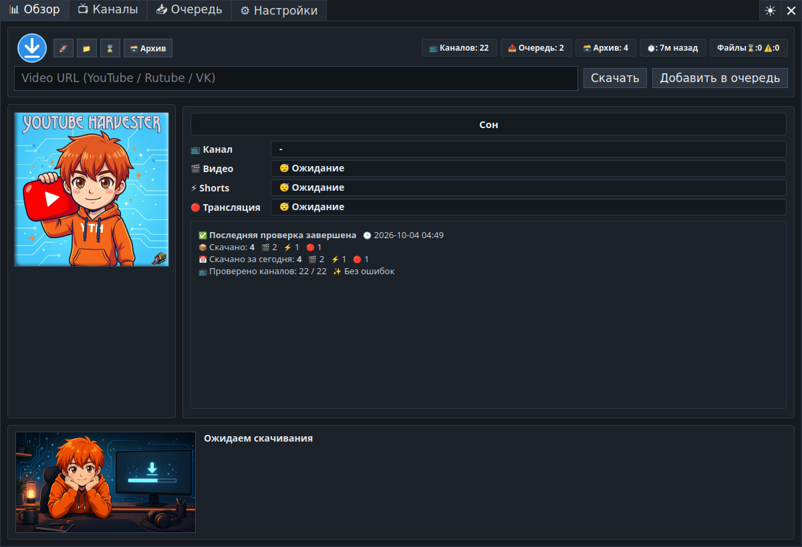
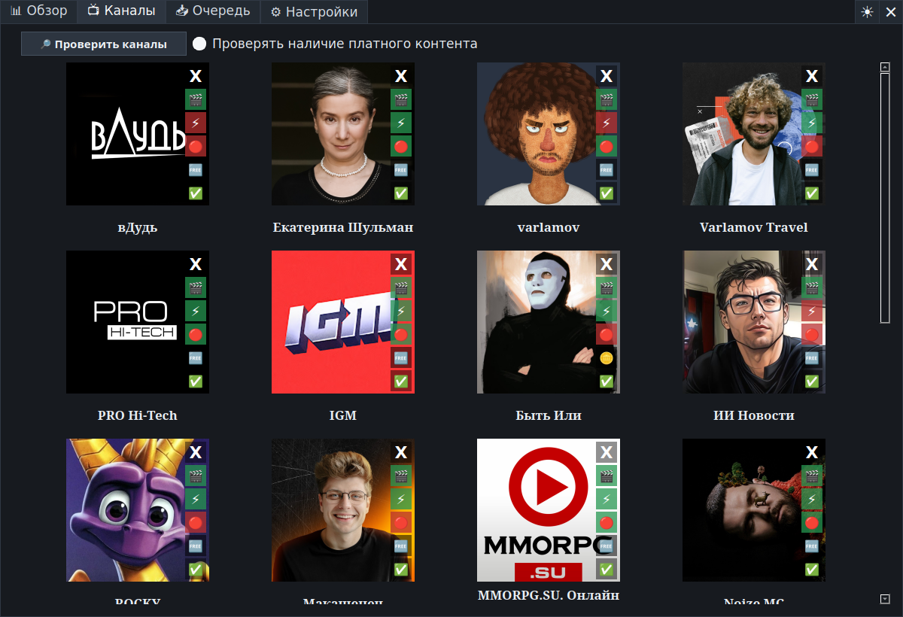
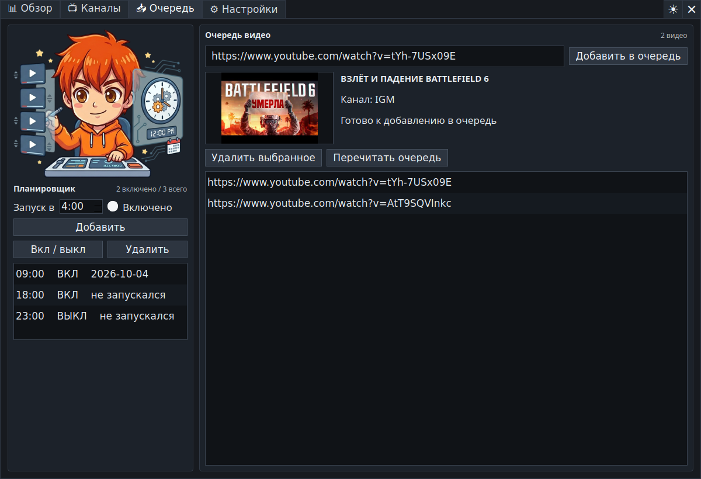
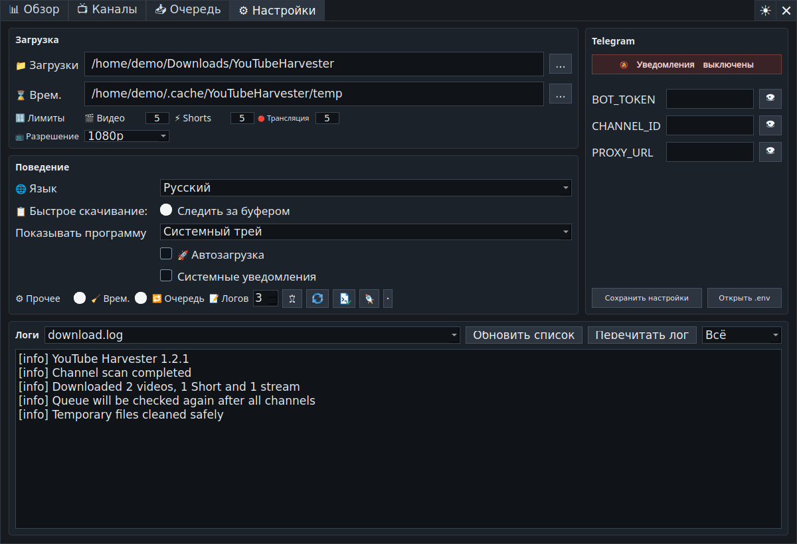
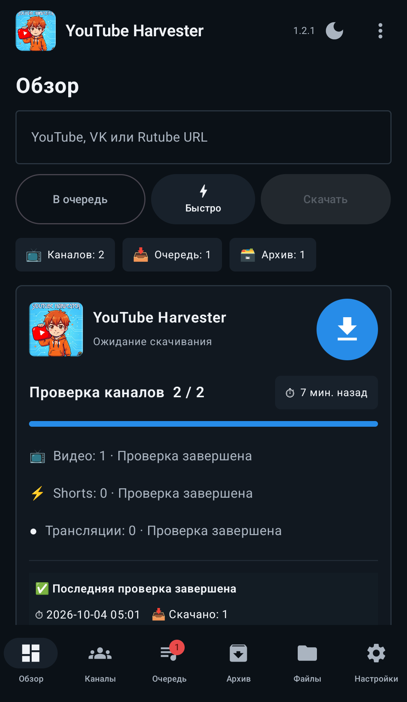
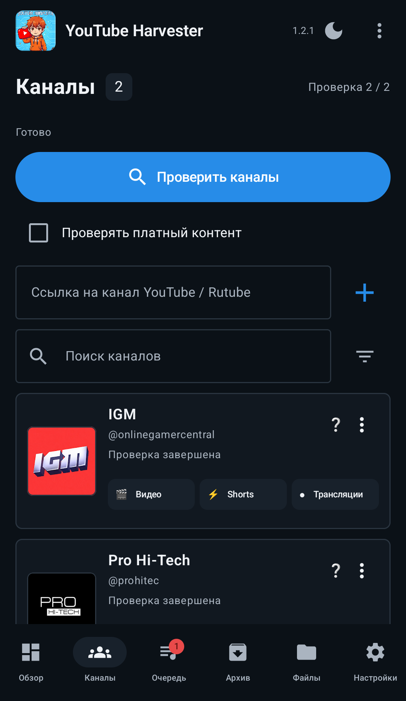
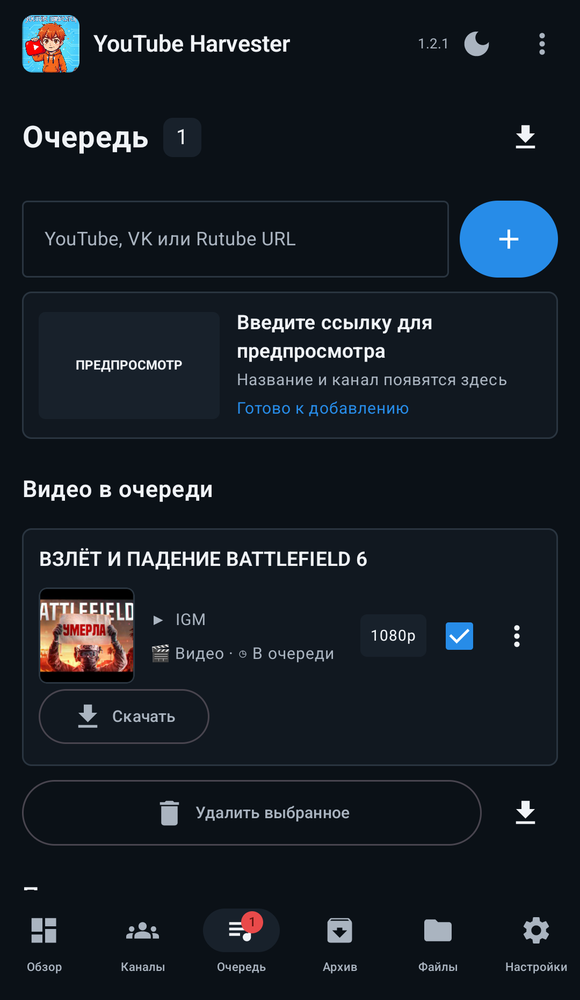
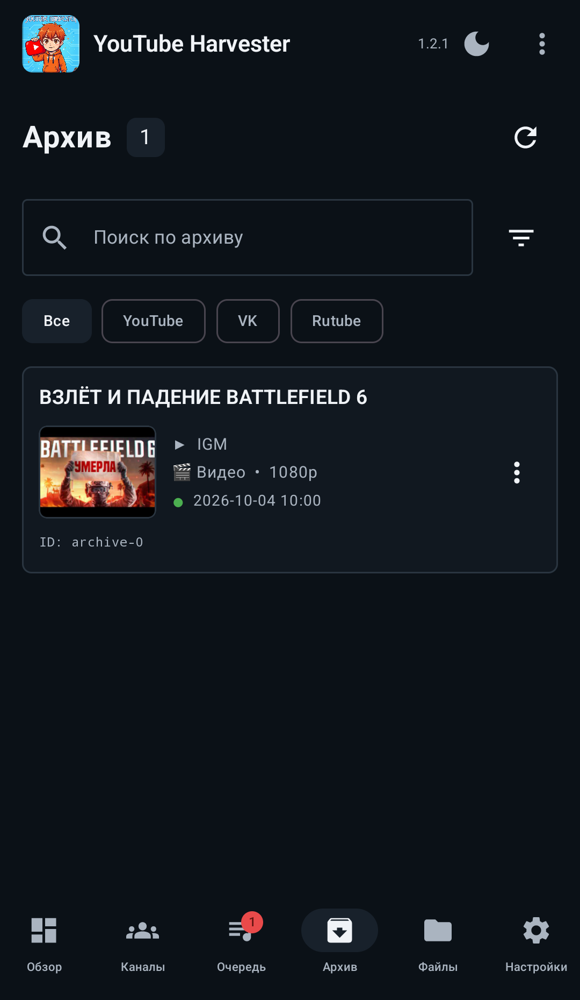
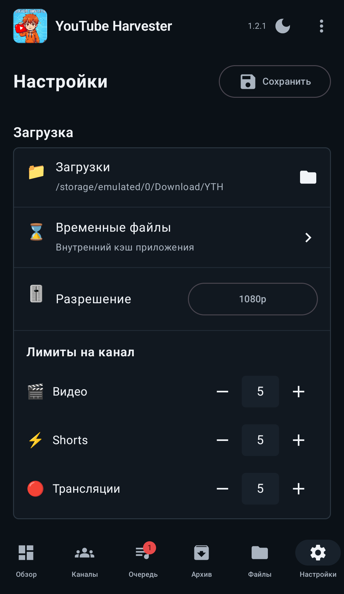

# YouTube Harvester 1.2.1

<p align="center">
  
</p>

<p align="center">
  <a href="README.md">🇺🇸 🇬🇧 English</a> ·
  <a href="README.ru.md">🇷🇺 Русский</a> ·
  <a href="README.uk.md">🇺🇦 Українська</a> ·
  <a href="README.be.md">🇧🇾 Беларуская</a> ·
  <a href="README.fr.md">🇫🇷 Français</a> ·
  <a href="README.es.md">🇪🇸 Español</a> ·
  <a href="README.hi.md">🇮🇳 हिन्दी</a> ·
  <a href="README.zh.md">🇨🇳 中文</a> ·
  <a href="README.ja.md">🇯🇵 日本語</a> ·
  <a href="README.ar.md">🇸🇦 العربية</a>
</p>

Мультиязычная программа для **Linux, Windows и Android**: слежение за каналами YouTube и Rutube, скачивание отдельных роликов YouTube/Rutube/VK, очередь, архив, расписание и необязательная отправка файлов или уведомлений в Telegram.

## Версия 1.2.1

Документация обновлена: **2026-10-05**.

Текущие исходники и локальные сборки используют **1.2.1** без пометок beta/prerelease. В Android установлен `versionCode 120100`; внутренние debug-сборки сохраняют `-debug`. Windows пересобран из тех же актуальных десктопных исходников, что и Linux, включая поддержку Rutube и восстановление после прерывания скачиваний.

**Стабильный релиз 1.2.1 для Linux, Windows и Android.** Пакеты ПК и четыре Android APK доступны без beta/prerelease. Публичные APK подписаны постоянным релизным сертификатом.

Linux и Windows используют общий Python/yt-dlp-движок; старый Bash-движок оставлен только как отключённый устаревший код.

[Проверка версии](docs/version-1.2.1-20261003.md) · [Подготовка 1.2.1](docs/releases/1.2.1.md).

## Возможности версии для ПК

- Живой экран обзора: прогресс каналов, текущий тип контента, этап скачивания,
  скорость, оставшееся время, размер, последние события, итоги сеанса и дня.
- Карточки каналов с оригинальными сохранёнными обложками и отдельными
  переключателями Видео, Shorts и Трансляций.
- Необязательная проверка платного контента с тремя состояниями: неизвестно,
  встречалось members-only или при проверке members-only не найдено.
- Поле ручной ссылки на вкладке «Обзор» с кнопками немедленного скачивания и
  добавления в очередь.
- Очередь с предпросмотром названия, канала и обложки, проверкой дублей и
  архива, повтором неудачных ссылок и дополнительной обработкой после проверки
  всех каналов.
- Окно быстрого скачивания: ссылка из буфера, предпросмотр метаданных, выбор
  разрешения, нескольких аудиодорожек и субтитров, немедленное скачивание,
  очередь и сохраняющийся чекбокс Telegram.
- Настраиваемая глобальная горячая клавиша. По умолчанию
  `Ctrl+Shift+Alt+Y`.
- Слежение за буфером обмена с открытием окна быстрого скачивания при появлении
  поддерживаемой ссылки YouTube, Rutube или VK.
- Планировщик автоматических запусков по часам.
- Подробный архив с типом, каналом, названием, датой, ссылкой на источник,
  вариантами качества и дорожек, локальным файлом, папкой и удалением записи.
- Просмотр логов с фильтрами «Всё», «Важное» и «Ошибки».
- Проверенное обновление самой программы из официальных релизов GitHub для
  установленной, портативной и Linux-версии.
- Безопасная проверка и обновление `yt-dlp` из интерфейса, диагностика ОС, X11/Wayland, трея, горячей
  клавиши, инструментов, путей, кэша, прав записи и свободного места.
- Тёмная, светлая и системная темы.
- Три режима запуска: только системный трей, только панель задач или оба.
- Мягкая остановка, защищённая очистка временной папки, безопасные имена файлов
  и корректный UTF-8 в Windows-логах и архиве.
- Английский интерфейс по умолчанию; также доступны русский, украинский,
  белорусский, французский, испанский, хинди, китайский, японский и арабский.

## Источники и порядок работы

- **Каналы YouTube:** Видео, Shorts и Трансляции, с отдельными переключателями и лимитами. Поддерживаются адреса с handle, ID канала, user и custom URL.
- **Каналы Rutube:** `/channel/ID/` и `/u/name/`, включая ссылки на Видео/Shorts. Именные адреса приводятся к ID для защиты от дублей; название и обложка кэшируются.
- **Шоу Rutube:** `/metainfo/tv/ID/`, с собственным названием и постером, только Видео. Последние N записей выбираются от новых к старым.
- **Отдельные ролики:** ссылки YouTube, Rutube и VK/VK Video в ручном поле, очереди и быстром скачивании. Слежение за каналами VK и произвольные плейлисты Rutube не поддерживаются.

Проверка трансляций и платного контента Rutube отключена. Обнаружение платного контента относится к YouTube: оно сообщает о доступности, не обходит ограничения и не гарантирует скачивание закрытого видео. Меню канала позволяет пометить последние записи обработанными без скачивания.

Полный цикл сначала обрабатывает ручную очередь, затем включённые разделы каналов с последовательным скачиванием, после чего повторно проверяет очередь. Архивные записи и дубли пропускаются. Проверка на вкладке «Каналы» проверяет разделы; полный цикл запускается из «Обзора» или по расписанию. Варианты архива сохраняют выбранное качество и дорожки.

Остановка десктопного скачивания больше не блокирует новый запуск. Сохранены защищённая очистка временной папки и обработка повторов; не удаляйте temp вручную во время активного скачивания. При ошибке источника, VPN или прокси сначала проверьте соединение и логи. Ограничения региона, аккаунта и протокола источника остаются.

## Android

Нативное приложение Kotlin/Jetpack Compose для **Android 8.0+ (API 26)**. Четыре ABI: `arm64-v8a`, `armeabi-v7a`, `x86_64`, `x86`.

- Обзор, Каналы, Очередь, Архив и Настройки, а также переход в папку загрузок; десять языков, тёмная/светлая/системная темы и арабская RTL-раскладка.
- Те же категории источников, включая каналы и шоу Rutube; лимиты разделов, отметка последних записей, расписание, метаданные и обложки.
- Немедленное скачивание введённой ссылки; кнопка «Быстро» в Обзоре читает поддерживаемую ссылку из буфера только при явном нажатии. «Поделиться» открывает выбор параметров. Ярлык открывает Обзор; необязательное слежение за буфером работает только в открытом приложении.
- Выбор разрешения, нескольких аудиодорожек и субтитров; сохраняемые задания, пауза/продолжение/отмена/повтор, уведомления прогресса и foreground-service. Продолжение сохраняет то же задание и частичные файлы; докачка по байтам зависит от источника.
- Восстановление цикла через WorkManager, отчёты проверок и дневные итоги, восстановление после перезагрузки, MediaStore/SAF, доступ к файлам архива, логи и диагностика. После принудительной остановки Android приложение нужно открыть; ограничения батареи производителя могут влиять на фоновые задачи.
- Необязательный Telegram с защитой реквизитов через Android Keystore. Зашифрованный паролем `.ythbackup` переносит записи и настройки, **но не видео и temp**. Импорт требует пустой базы; перенесённые файлы требуют проверенной перепривязки папок.
- Обновление APK проверяет SHA-256, пакет, больший versionCode и установленный сертификат перед системным установщиком. Встроенный `yt-dlp` Android обновляется **вместе с приложением**, а не отдельной заменой движка.

**VK в Android:** скачивание отдельных роликов VK/VK Video поддерживается; реальная загрузка публичного VK-видео проверена на LDPlayer 2026-09-14. Слежения за каналами VK нет. Закрытые или ограниченные ролики могут быть недоступны.

[Документация Android](android/README.md) · [Инструкция переноса](android/DATA-TRANSFER.ru.md).

## Статус релиза Android

Владелец проекта одобрил публикацию Android 1.2.1. Соответствующие исходники, оригинальные лицензии и хеши точных APK зафиксированы в [итоговом аудите](android/legal/FINAL-SOURCE-REVIEW-20261005.md). Покрытие автоматических проверок устройств и его ограничения сохранены в отчётах; не каждое устройство Android было протестировано.

**Не удаляйте установленную тестовую версию** ради смены сертификата. Зашифрованный перенос проверен в отдельном QA-пакете, но это не заменяет приёмку финального публичного кандидата.

[Готовность релиза](android/RELEASE-READINESS.ru.md).

## Скриншоты

| Обзор | Каналы |
| --- | --- |
|  |  |

| Очередь и планировщик | Настройки и логи |
| --- | --- |
|  |  |

### Android

Android 1.2.1, тёмная тема. Демонстрационные данные.

| Обзор | Каналы |
| --- | --- |
|  |  |

| Очередь | Архив |
| --- | --- |
|  |  |

**Настройки**



[Каталог скриншотов и происхождение снимков](docs/screenshots/README.md).

## Готовые сборки

Все варианты доступны в [релизе 1.2.1](https://github.com/LiberVixer/YouTubeHarvester/releases/tag/v1.2.1). Полный исходный комплект runtime находится в [релизе Android](https://github.com/LiberVixer/YouTubeHarvester/releases/tag/android-v1.2.1).

| Платформа | Файлы |
| --- | --- |
| Linux | `YouTubeHarvester_1.2.1_linux_all.deb`, `YouTubeHarvester_1.2.1_source.tar.gz`, `SHA256SUMS-linux.txt` |
| Windows x64 | `YouTubeHarvester_1.2.1_windows_setup.exe`, `YouTubeHarvester_1.2.1_windows_x64.msi`, `YouTubeHarvester_1.2.1_windows_portable.zip`, `SHA256SUMS-windows.txt` |

Публичные APK: `YouTubeHarvester-1.2.1-<ABI>-release.apk` для `arm64-v8a`, `armeabi-v7a`, `x86`, `x86_64`. Доступны исходники, оригинальные лицензии, BUILD-INFO, SOURCE-REVIEW и SHA256SUMS. Локальные тестовые APK не заменяют релизные файлы.

## Установка в Linux

```bash
sudo apt install ./YouTubeHarvester_1.2.1_linux_all.deb
```

После установки запустите программу из меню приложений или командой:

```bash
yt-harvester
```

Пользовательские файлы `.deb`-сборки:

- данные: `~/.local/share/yt-harvester`
- настройки: `~/.config/yt-harvester`
- кэш: `~/.cache/yt-harvester`
- Telegram: `~/.config/yt-harvester/.env`
- временная папка: `~/temp/YTH`
- папка загрузок: `~/Downloads/YouTubeHarvester`

Пакет `.deb` использует Python/Qt/yt-dlp/FFmpeg/curl из дистрибутива и не обновляет их скрытно. Фактические версии поэтому могут отличаться от закреплённых окружений разработки и Windows. Deno рекомендован, но не встроен; для полной поддержки YouTube нужен совместимый JavaScript runtime.

## Установка в Windows

Используйте x64 Setup EXE или MSI либо распакуйте portable ZIP и запустите `YouTubeHarvester.exe`. Python, yt-dlp, FFmpeg/FFprobe и Deno встроены, отдельная установка не нужна. По умолчанию: данные/кэш в `%LOCALAPPDATA%\YouTubeHarvester`, настройки в `%APPDATA%\YouTubeHarvester`, temp в `%TEMP%\YTH`. Автозагрузка использует ключ текущего пользователя `HKCU\Software\Microsoft\Windows\CurrentVersion\Run`.

## Установка и обновление Android

Для согласованного тестирования выберите APK под ABI устройства и обновляйте с тем же сертификатом, без удаления приложения и очистки данных. Разрешайте установку только доверенному источнику; при необходимости выдайте уведомления и выберите папку назначения. По умолчанию используется `Download/YTH` либо папка через SAF. Публичный APK с другой подписью не может перезаписать текущую тестовую установку.

## Запуск из исходников

Запуск Linux из исходников использует `.venv`, если она есть; `YTD_PYTHON` выбирает другой интерпретатор. Закреплённые десктопные окружения проверены с Python 3.12. FFmpeg/FFprobe и JavaScript runtime в Linux являются внешними инструментами; подготовленные Deno/FFmpeg можно получить скриптом ниже с проверкой контрольных сумм.

Получайте инструменты только при их отсутствии: скрипт отказывается перезаписывать существующие папки. Сохраняйте свою `.env`; реальные настройки Telegram вводите в приложении или своём файле. Не публикуйте этот файл.

Linux:

```bash
sudo apt install python3 python3-venv python3-pyqt5 python3-pynput python3-dbus ffmpeg curl
python3 -m venv .venv
.venv/bin/python -m pip install -r requirements-linux-lock.txt
.venv/bin/python scripts/fetch_desktop_tools.py --platform linux --output tools/linux
cp -n .env.example .env
./start_tray.sh
```

Для запуска Windows из исходников также нужны FFmpeg/FFprobe и Deno. Сборщик использует закреплённые локальные инструменты либо скачивает и проверяет их.

Windows:

```powershell
py -3.12 -m venv .venv
.\.venv\Scripts\python -m pip install -r requirements-windows-lock.txt
.\.venv\Scripts\python scripts/fetch_desktop_tools.py --platform windows --output tools/windows
.\start_tray_windows.bat
```

[Запуск из исходников Windows (offline)](docs/windows-offline-build.md).

## Ключи запуска

```bash
yt-harvester
yt-harvester --quick-download
yt-harvester --show-main
yt-harvester --start-tray
yt-harvester --start-window
yt-harvester --start-both
```

- `--quick-download` открывает быстрое скачивание и передаёт запрос уже
  запущенному экземпляру программы.
- `--show-main` открывает или поднимает главное окно запущенного экземпляра.
- `--start-tray` запускает программу только в системном трее.
- `--start-window` запускает обычное окно на панели задач.
- `--start-both` включает одновременно трей и панель задач.

Служебные параметры packaged-сборки: `--run-yt-dlp ...` и
`--run-script <script.py> ...`.

Скрипты обслуживания:

```bash
python3 scripts/check_channel_sections.py --channel <url> [--timeout 45]
python3 scripts/mark_channel_archived.py --channel <url> --archive yt_archive.txt \
  [--videos-limit 5] [--shorts-limit 5] [--streams-limit 5]
python3 scripts/migrate_archive_details.py --archive yt_archive.txt \
  --details archive_details.jsonl --scan-dir <downloads> [--include-missing]
```

## Быстрое скачивание, X11 и Wayland

В Windows используется нативная глобальная горячая клавиша. В Linux/X11 она
работает через `pynput`. Wayland обычно запрещает приложениям напрямую
перехватывать глобальные клавиши, поэтому программа умеет создать системную
комбинацию Cinnamon/GNOME для команды `yt-harvester --quick-download`.

Быстрое скачивание всегда доступно из меню трея и вкладки «Обзор». Слежение за
буфером работает напрямую в Windows/X11, а в Wayland — через `wl-paste` после
установки `wl-clipboard`.

## Telegram

Telegram можно полностью отключить. При включении заполните настройки в
интерфейсе или `.env`:

```bash
BOT_TOKEN=your-telegram-bot-token
CHANNEL_ID=your-telegram-channel-id
PROXY_URL=127.0.0.1:9050
```

`PROXY_URL` необязателен. Ошибка Telegram не удаляет успешно сохранённое
локальное видео.

## Закреплённые компоненты

Это проверенные версии проекта, а не обещание, что каждая установленная копия использует их или что они самые новые у разработчиков. Полные десктопные зависимости: `requirements-linux-lock.txt` и `requirements-windows-lock.txt`. Версии/хеши Android: `android/runtime.properties` и `android/gradle/verification-metadata.xml`.

| Компонент | Разработка ПК / Windows | Android |
| --- | --- | --- |
| yt-dlp | 2026.08.19 | 2026.08.19 |
| FFmpeg / FFprobe | 9.0.2 | 7.1.1 |
| Deno / QuickJS | Deno 2.9.7 | QuickJS 2026-06-04 |
| PyQt5 / Compose BOM | PyQt5 5.15.11 | Compose 2026.09.00 |
| Qt runtime | Linux 5.15.19 / Windows 5.15.2 | - |
| Room / WorkManager | - | 2.8.5 / 2.12.0 |
| Coil | - | 3.6.3 |
| PyInstaller / AGP / Gradle | PyInstaller 6.22.3 | AGP 9.4.1 / Gradle 9.8.0 |
| Kotlin Compose compiler / KSP | - | 2.4.20 / 2.3.12 |

Android сохраняет upstream-runtime Python 3.12.11, OpenSSL 3.5.2 и FFmpeg 7.1.1; совместимые пересборки и проверка соответствующих исходников ещё нужны. QuickJS 2026-06-04 и WebP/SharpYUV 1.6.0 пересобраны для четырёх ABI с выравниванием 16 КБ. Статическая проверка выравнивания не заменяет запуск на 16-КБ устройстве.

[Ведомость обновления компонентов](docs/component-update-20261003.md) · [Инструкции пересборки native](android/native/README.md).

## Сборка релиза

Десктопные теги имеют вид `v*`; Android использует `android-v<versionName>` и отдельный workflow. Публичная подпись Android требует утверждённый постоянный сертификат и проверенный соответствующий исходный комплект runtime. Ключи, пароли, токены и неподписанные/приватные тестовые APK нельзя включать в публичные файлы.

Linux:

```bash
packaging/build_release.sh 1.2.1 1.2.1
```

Windows:

```powershell
powershell -ExecutionPolicy Bypass -File .\packaging\windows\build_release.ps1 `
  -Version 1.2.1 -MsiVersion 1.2.1
```

Android (JDK 17, Android SDK, Gradle Wrapper):

```bash
cd android
./gradlew testDebugUnitTest assembleDebug
python3 -m unittest discover -s scripts -p 'test_*.py' -v
```

[Правила релиза и подписи Android](android/RELEASING.md)

## Проверки и ограничения

Последние локальные проверки: **89 десктопных Python-тестов**, **39 Android Python-тестов**, **149 Android JVM-тестов** и успешная съёмка 50 Android-скриншотов. При выравнивании версии также прошли **80 Windows-тестов** (два POSIX-теста штатно пропущены) и **36 выбранных LDPlayer-тестов** на Android 14/API 34 x86_64.

Проверены инструменты ПК и реальное скачивание/ремультиплексирование локального H.264/AAC. Четыре Android APK прошли проверки манифеста, сертификата, ZIP и применимого 64-битного выравнивания. Эти прогоны не подтверждают работу на ARM, фоновую работу на всех устройствах или установку/удаление новых Windows-установщиков. Обновление документации не является пересборкой или публикацией установленных копий.

[План тестов Android](android/TEST-PLAN.ru.md).

## Лицензии и ответственное использование

**Android-модуль лицензирован GPL-3.0-only** по утверждению владельца: [LICENSE](android/LICENSE), [NOTICE](android/NOTICE), [решение о лицензии](android/legal/README.md). Это не меняет лицензии десктопной программы и сторонних компонентов. У встроенных компонентов собственные лицензии; полный соответствующий исходный комплект runtime остаётся обязательным для публичного Android-релиза.

Программа не связана с YouTube, Google, Rutube, VK, Telegram или yt-dlp. Скачивайте только контент, на который у вас есть право, соблюдайте условия источника и применимые законы. Не раскрывайте реквизиты и пароли резервных копий.

## Благодарность

Отдельное спасибо Дмитрию **'Minion' Погорилому** за неоценимую помощь в
бета-тестировании Windows-версии.

На логотип программы добавлен Харвестер из **Command & Conquer: Red Alert**. 🙂

Полная история версий находится в [русском changelog](CHANGELOG.ru.md).
