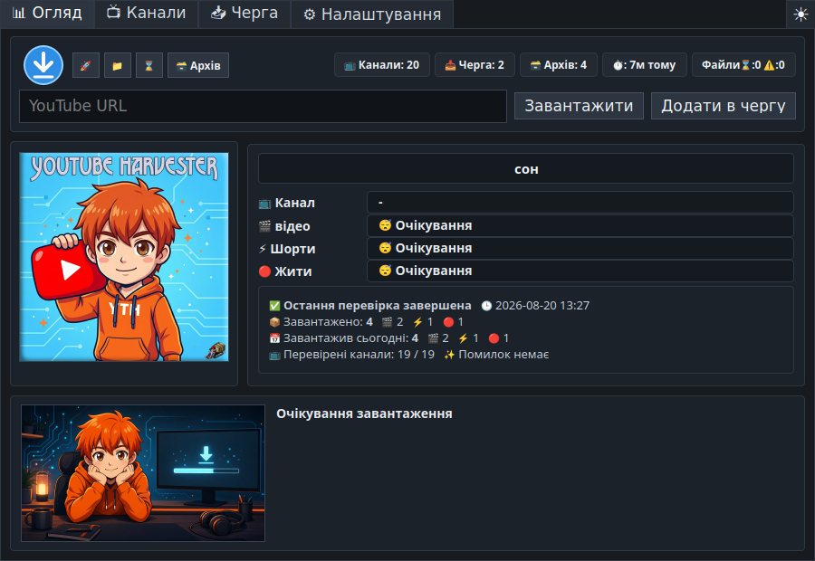
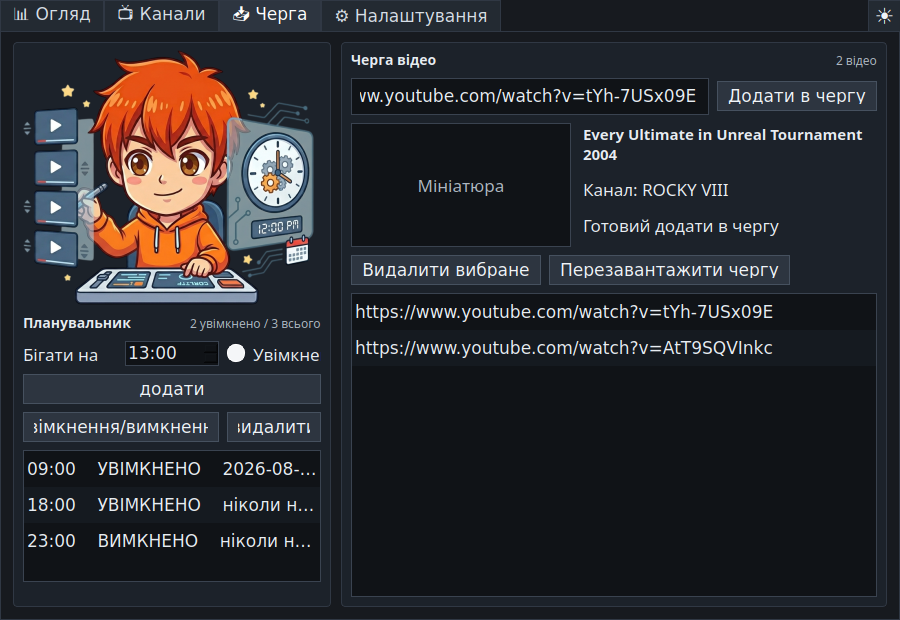
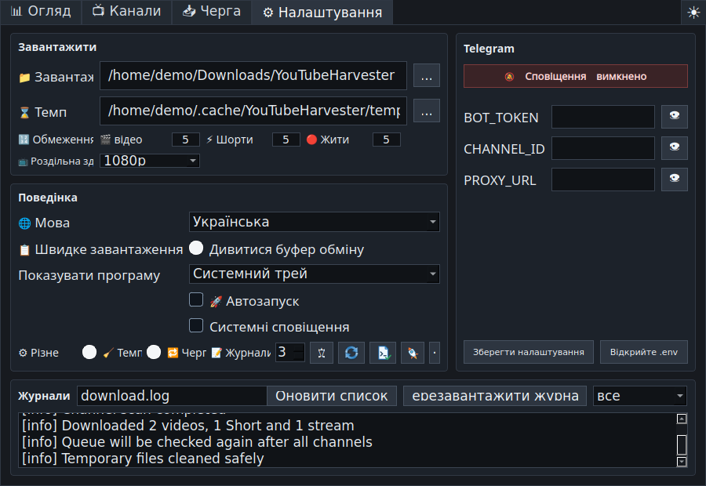

# YouTube Harvester 1.1.0

<p align="center">
  
</p>

<p align="center">
  <a href="README.md">🇺🇸 🇬🇧 English</a> ·
  <a href="README.ru.md">🇷🇺 Русский</a> ·
  <a href="README.uk.md">🇺🇦 Українська</a> ·
  <a href="README.fr.md">🇫🇷 Français</a> ·
  <a href="README.es.md">🇪🇸 Español</a> ·
  <a href="README.hi.md">🇮🇳 हिन्दी</a> ·
  <a href="README.zh.md">🇨🇳 中文</a> ·
  <a href="README.ar.md">🇸🇦 العربية</a>
</p>

<p align="center">
  Багатомовна програма для завантаження YouTube у Linux і Windows: стеження за
  каналами, ручна черга, швидке завантаження, розклад, архів і необов'язкове
  надсилання до Telegram.
</p>



## Що робить програма

**YouTube Harvester** стежить за вибраними YouTube-каналами та завантажує нові
Відео, Shorts і Трансляції через `yt-dlp`. До програми можна додавати окремі
посилання, вести локальний архів, переглядати звіти та надсилати сповіщення або
файли до Telegram.

Версія `1.1.0` використовує Python-рушій у Linux і Windows. Старий Bash-рушій
залишено у вихідному коді лише як вимкнений застарілий компонент.

## Основні можливості

- Живий огляд прогресу каналів, типу медіа, етапу завантаження, швидкості,
  залишкового часу, розміру, останніх подій та підсумків сеансу й дня.
- Картки каналів з оригінальними кешованими обкладинками та окремими
  перемикачами для Відео, Shorts і Трансляцій.
- Необов'язкова перевірка платного контенту зі станами: невідомо, знайдено
  members-only або під час перевірки members-only не знайдено.
- Ручне поле URL на вкладці «Огляд» із негайним завантаженням і додаванням до
  черги.
- Черга з попереднім переглядом назви, каналу й обкладинки, перевіркою дублів та
  архіву, повтором невдалих посилань і другою обробкою після всіх каналів.
- Вікно швидкого завантаження з URL із буфера, метаданими, вибором роздільності,
  негайним завантаженням, чергою та збереженим прапорцем Telegram.
- Налаштовувана глобальна гаряча клавіша, типово `Ctrl+Shift+Alt+Y`.
- Стеження за буфером обміну та відкриття швидкого завантаження для коректного
  YouTube URL.
- Планувальник автоматичних запусків за годинами.
- Докладний архів із типом, каналом, назвою, датою, посиланням YouTube,
  локальним файлом, папкою та видаленням записів.
- Журнали з фільтрами «Усе», «Важливе» та «Помилки».
- Перевірка версії `yt-dlp` і діагностика ОС, X11/Wayland, трея, гарячої
  клавіші, інструментів, шляхів, кешу, доступу до запису та вільного місця.
- Темна, світла й системна теми.
- Запуск лише в системному треї, лише на панелі завдань або в обох місцях.
- М'яка зупинка, захищене очищення тимчасових файлів, безпечні імена Windows і
  коректний UTF-8 у журналах та архіві.
- Англійська мова типово; також доступні російська, українська, французька,
  іспанська, гінді, китайська та арабська.

## Знімки екрана

| Огляд | Канали |
| --- | --- |
|  |  |

| Черга і планувальник | Налаштування й журнали |
| --- | --- |
|  |  |

## Готові збірки

Файли публікуються в
[GitHub Releases](https://github.com/LiberVixer/YouTubeHarvester/releases).

Linux: `YouTubeHarvester_1.1.0_linux_all.deb`,
`YouTubeHarvester_1.1.0_source.tar.gz` і `SHA256SUMS-linux.txt`.

Windows: `YouTubeHarvester_1.1.0_windows_setup.exe`,
`YouTubeHarvester_1.1.0_windows_x64.msi`,
`YouTubeHarvester_1.1.0_windows_portable.zip` і `SHA256SUMS-windows.txt`.

Windows-збірки вже містять `yt-dlp`, `ffmpeg.exe`, `ffprobe.exe` і `deno.exe`.

## Встановлення в Linux

```bash
sudo apt install ./YouTubeHarvester_1.1.0_linux_all.deb
yt-harvester
```

Папки користувача:

- дані: `~/.local/share/yt-harvester`
- налаштування: `~/.config/yt-harvester`
- кеш: `~/.cache/yt-harvester`
- Telegram: `~/.config/yt-harvester/.env`
- тимчасові файли: `~/temp/YTH`
- завантаження: `~/Downloads/YouTubeHarvester`

## Встановлення у Windows

Оберіть Setup EXE, MSI або portable ZIP на сторінці релізу. Ці збірки
самодостатні, тому окремо встановлювати Python, FFmpeg чи Deno не потрібно.
Автозапуск зберігається в
`HKCU\Software\Microsoft\Windows\CurrentVersion\Run`.

## Запуск із вихідного коду

Linux:

```bash
sudo apt install python3 python3-pyqt5 python3-pynput yt-dlp ffmpeg curl
sudo apt install wl-clipboard  # рекомендовано для буфера у Wayland
cp .env.example .env
./start_tray.sh
```

Windows:

```powershell
py -3 -m venv .venv
.\.venv\Scripts\python -m pip install -r requirements.txt
.\start_tray_windows.bat
```

Для нестабільного з'єднання дивіться
[офлайн-інструкцію Windows](docs/windows-offline-build.md).

## Параметри запуску

```bash
yt-harvester
yt-harvester --quick-download
yt-harvester --start-tray
yt-harvester --start-window
yt-harvester --start-both
```

`--quick-download` відкриває швидке завантаження й передає запит уже запущеному
екземпляру. Інші параметри вибирають трей, панель завдань або обидва режими.
Службові параметри збірки: `--run-yt-dlp ...` і
`--run-script <script.py> ...`.

## Швидке завантаження, X11 і Wayland

Windows використовує системну глобальну клавішу, Linux/X11 — `pynput`.
Wayland зазвичай блокує пряме перехоплення клавіш, тому програма може створити
системну комбінацію Cinnamon/GNOME для `yt-harvester --quick-download`.
Стеження за буфером у Wayland працює через `wl-paste` з пакета `wl-clipboard`.

## Перевірка каналів і черга

Увімкнені розділи перевіряються послідовно з короткою паузою після завершеного
розділу. Members-only шукається під час явної перевірки каналів, якщо прапорець
увімкнено. Якщо закрите відео трапиться у звичайному скануванні, статус каналу
також оновиться, а подія потрапить до важливих без червоної помилки.

Черга обробляється на початку запуску й повторно після всіх каналів. Дублі та
вже архівовані відео пропускаються; невдале посилання можна повернути в чергу.

## Telegram

Telegram можна вимкнути. Для надсилання заповніть інтерфейс або `.env`:

```bash
BOT_TOKEN=your-telegram-bot-token
CHANNEL_ID=your-telegram-channel-id
PROXY_URL=127.0.0.1:9050
```

Проксі необов'язковий. Помилка Telegram не видаляє збережене локальне відео.

## Збирання релізу

```bash
packaging/build_release.sh 1.1.0 1.1.0
```

```powershell
powershell -ExecutionPolicy Bypass -File .\packaging\windows\build_release.ps1 `
  -Version 1.1.0 -MsiVersion 1.1.0
```

## Відповідальне використання

YouTube Harvester не пов'язаний із YouTube, Google, Telegram або `yt-dlp`.
Завантажуйте лише власні матеріали, контент із дозволом правовласника або те,
що законно зберігати для особистого використання. Дотримуйтеся
[Умов YouTube](https://www.youtube.com/t/terms), авторського права та законів
своєї країни. Не розголошуйте дані Telegram.

Зовнішні компоненти: [`yt-dlp`](https://github.com/yt-dlp/yt-dlp), PyQt5/Qt,
FFmpeg/FFprobe, Deno, `curl`, Telegram Bot API та `pynput`; кожен має власну
ліцензію.

## Подяка

Окрема подяка Дмитру **'Minion' Погорілому** за неоціненну допомогу в
бета-тестуванні Windows-версії.

На логотип програми додано Харвестер із **Command & Conquer: Red Alert**. 🙂

Повна історія є в [українському changelog](CHANGELOG.uk.md).
