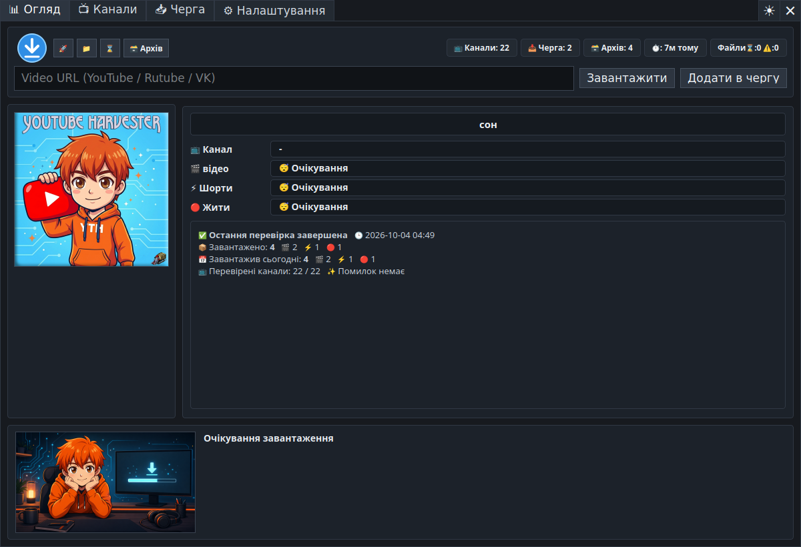
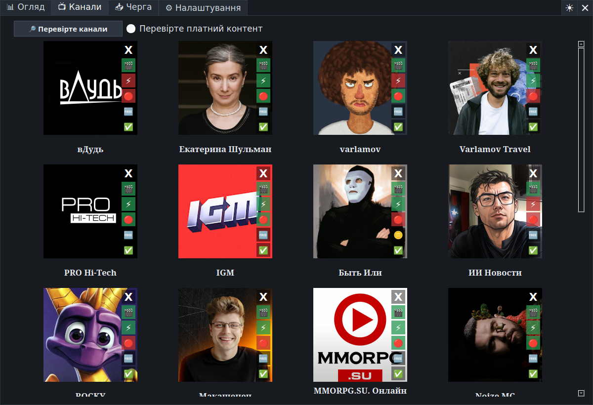
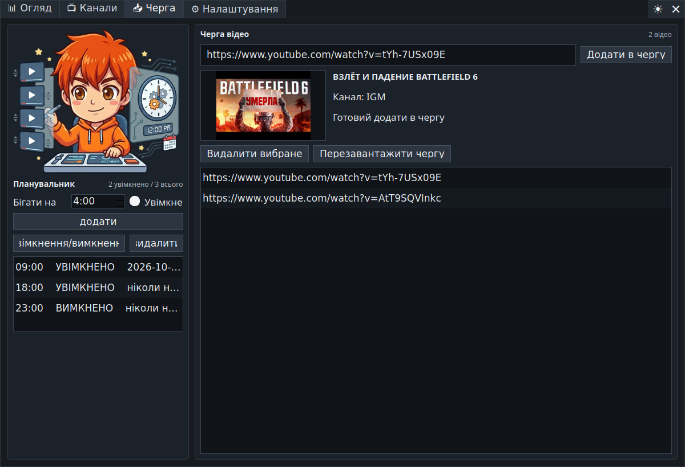
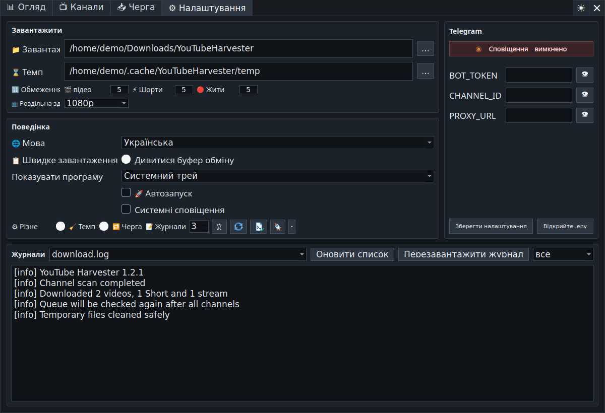
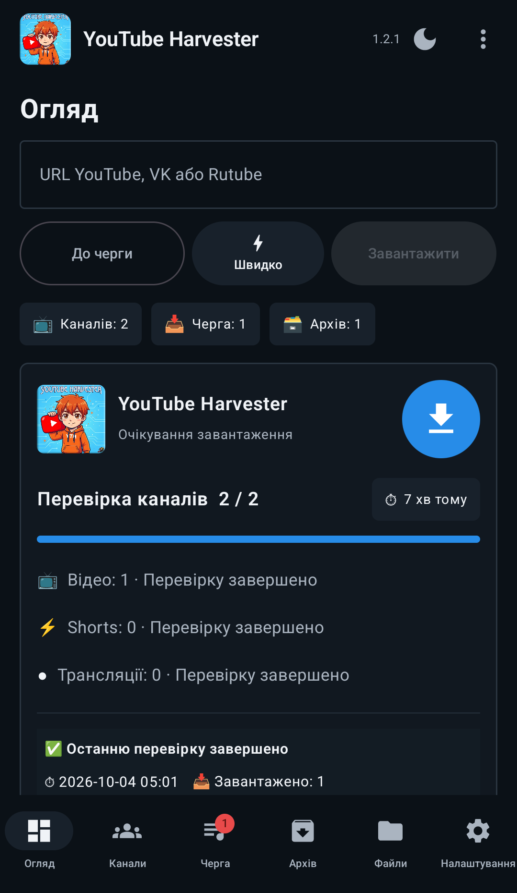
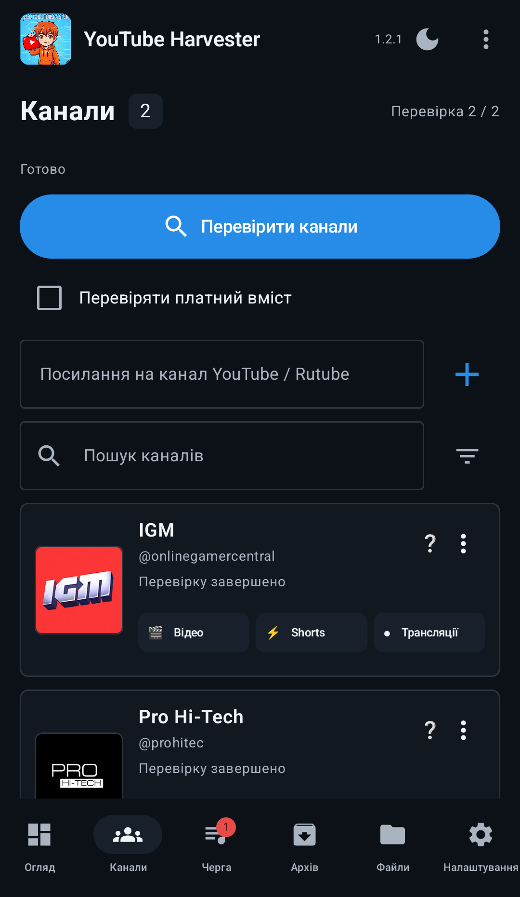
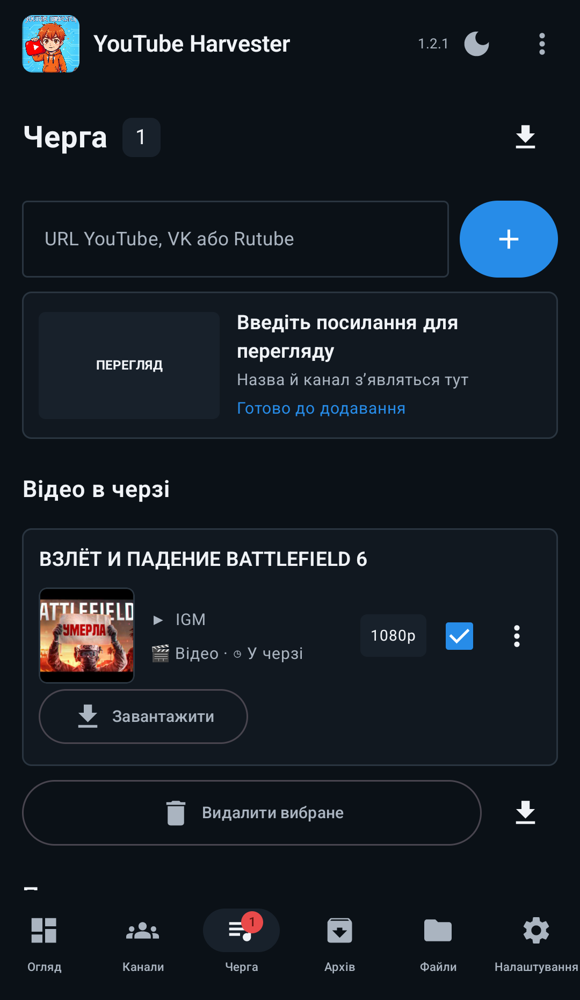
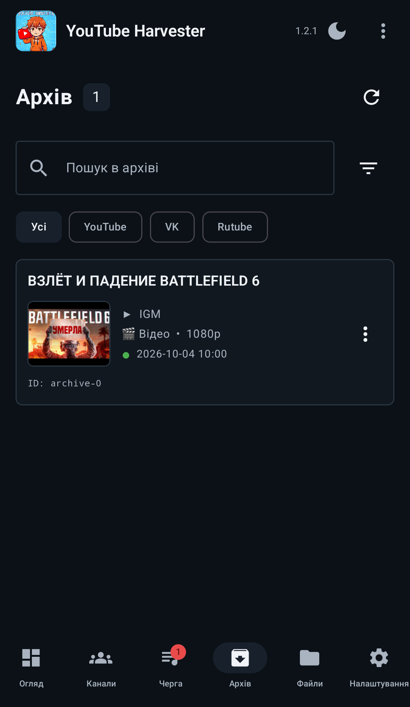
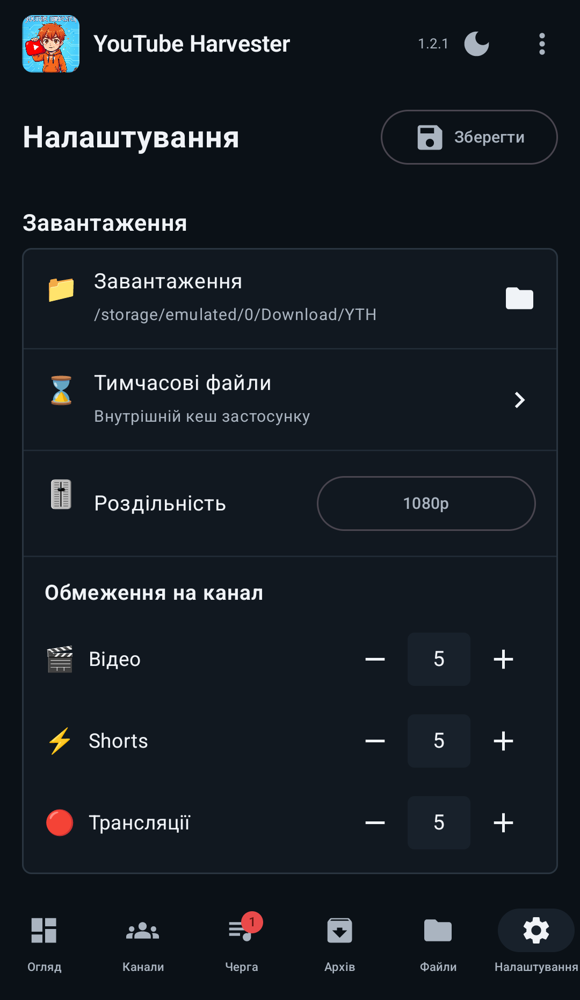

# YouTube Harvester 1.2.1

<p align="center">
  
</p>

<p align="center">
  <a href="README.md">🇺🇸 🇬🇧 English</a> ·
  <a href="README.ru.md">🇷🇺 Русский</a> ·
  <a href="README.uk.md">🇺🇦 Українська</a> ·
  <a href="README.be.md">🇧🇾 Беларуская</a> ·
  <a href="README.fr.md">🇫🇷 Français</a> ·
  <a href="README.es.md">🇪🇸 Español</a> ·
  <a href="README.hi.md">🇮🇳 हिन्दी</a> ·
  <a href="README.zh.md">🇨🇳 中文</a> ·
  <a href="README.ja.md">🇯🇵 日本語</a> ·
  <a href="README.ar.md">🇸🇦 العربية</a>
</p>

Багатомовна програма для **Linux, Windows і Android**: стеження за каналами YouTube та Rutube, завантаження окремих відео YouTube/Rutube/VK, черга, архів, розклад і необов'язкове надсилання файлів або сповіщень у Telegram.

## Версія 1.2.1

Документацію оновлено: **2026-10-05**.

Поточні джерела й локальні збірки мають **1.2.1** без beta/prerelease. Android: `versionCode 120100`; внутрішні debug-збірки зберігають `-debug`. Windows перебудовано з тих самих актуальних джерел для ПК, що й Linux, з підтримкою Rutube та відновленням після перерваних завантажень.

**Стабільний реліз 1.2.1 для Linux, Windows та Android.** Пакети ПК і чотири APK доступні без beta/prerelease. Публічні APK підписані постійним релізним сертифікатом.

Linux і Windows використовують спільний Python/yt-dlp-рушій; старий Bash залишено лише як вимкнений застарілий код.

[Перевірка версії](docs/version-1.2.1-20261003.md) · [Підготовка 1.2.1](docs/releases/1.2.1.md).

## Можливості версії для ПК

- Живий огляд прогресу каналів, типу медіа, етапу завантаження, швидкості,
  залишкового часу, розміру, останніх подій та підсумків сеансу й дня.
- Картки каналів з оригінальними кешованими обкладинками та окремими
  перемикачами для Відео, Shorts і Трансляцій.
- Необов'язкова перевірка платного контенту зі станами: невідомо, знайдено
  members-only або під час перевірки members-only не знайдено.
- Ручне поле URL на вкладці «Огляд» із негайним завантаженням і додаванням до
  черги.
- Черга з попереднім переглядом назви, каналу й обкладинки, перевіркою дублів та
  архіву, повтором невдалих посилань і другою обробкою після всіх каналів.
- Вікно швидкого завантаження з URL із буфера, метаданими, вибором роздільності,
  кількох аудіодоріжок і субтитрів, негайним завантаженням, чергою та збереженим
  прапорцем Telegram.
- Налаштовувана глобальна гаряча клавіша, типово `Ctrl+Shift+Alt+Y`.
- Стеження за буфером обміну та відкриття швидкого завантаження для
  підтримуваного URL YouTube, Rutube або VK.
- Планувальник автоматичних запусків за годинами.
- Докладний архів із типом, каналом, назвою, датою, посиланням на джерело,
  варіантами якості й доріжок, локальним файлом, папкою та видаленням записів.
- Журнали з фільтрами «Усе», «Важливе» та «Помилки».
- Перевірене оновлення самої програми з офіційних релізів GitHub для
  встановленої, портативної та Linux-версії.
- Безпечна перевірка й оновлення `yt-dlp` з інтерфейсу, діагностика ОС, X11/Wayland, трея, гарячої
  клавіші, інструментів, шляхів, кешу, доступу до запису та вільного місця.
- Темна, світла й системна теми.
- Запуск лише в системному треї, лише на панелі завдань або в обох місцях.
- М'яка зупинка, захищене очищення тимчасових файлів, безпечні імена Windows і
  коректний UTF-8 у журналах та архіві.
- Англійська мова типово; також доступні російська, українська, білоруська,
  французька, іспанська, гінді, китайська, японська та арабська.

## Джерела та порядок роботи

- **Канали YouTube:** Відео, Shorts і Трансляції з окремими перемикачами та лімітами; адреси handle, channel, user та custom URL.
- **Канали Rutube:** `/channel/ID/` і `/u/name/`, зокрема посилання на Відео/Shorts. Іменні адреси приводяться до ID проти дублів; назви й обкладинки кешуються.
- **Шоу Rutube:** `/metainfo/tv/ID/`, власна назва й постер, лише Відео; останні N записів від нових до старих.
- **Окремі відео:** YouTube, Rutube та VK/VK Video у ручному полі, черзі й швидкому завантаженні. Канали VK та довільні плейлисти Rutube не підтримуються.

Перевірка трансляцій і платного контенту Rutube вимкнена. Виявлення платного контенту стосується YouTube: повідомляє про доступність, не обходить обмеження та не гарантує завантаження закритого відео. Меню каналу дозволяє позначити останні записи обробленими без завантаження.

Повний цикл: ручна черга, увімкнені розділи каналів із послідовним завантаженням, повторна перевірка черги. Архівні записи й дублікати пропускаються. Перевірка у «Каналах» перевіряє розділи; повний цикл запускається з «Огляду» або за розкладом. Архів зберігає варіанти якості й доріжок.

Зупинка завантаження на ПК більше не блокує новий запуск. Збережено захищене очищення temp і повтори; не видаляйте тимчасові файли під час роботи. При збоях джерела, VPN чи проксі спочатку перевірте з'єднання та логи. Обмеження регіону, облікового запису й протоколу залишаються.

## Android

Нативний Kotlin/Jetpack Compose для **Android 8.0+ (API 26)**. ABI: `arm64-v8a`, `armeabi-v7a`, `x86_64`, `x86`.

- Огляд, Канали, Черга, Архів, Налаштування та відкриття папки завантажень; десять мов, темна/світла/системна теми, арабська RTL.
- Ті самі категорії джерел, зокрема канали й шоу Rutube; ліміти, позначення останніх записів, розклад, метадані та обкладинки.
- Негайне завантаження введеного URL; «Швидко» в Огляді читає підтримуване посилання з буфера лише за явним натисканням. «Поділитися» відкриває параметри. Ярлик відкриває Огляд; необов'язкове стеження за буфером працює лише у відкритій програмі.
- Роздільність, кілька аудіодоріжок і субтитрів, збережені завдання, пауза/продовження/скасування/повтор, сповіщення та foreground-service. Продовження зберігає завдання й часткові файли; докачування байтів залежить від джерела.
- WorkManager відновлює цикл; звіти, денні підсумки, відновлення після перезавантаження, MediaStore/SAF, файли архіву, логи та діагностика. Після примусової зупинки Android відкрийте програму; обмеження батареї виробника можуть впливати на фон.
- Telegram із захистом реквізитів Android Keystore. Захищений паролем `.ythbackup` переносить записи/налаштування, **не відео й temp**. Імпорт потребує порожньої бази; файли треба перевірено переприв'язати до папок.
- Оновлення APK перевіряє SHA-256, пакет, більший versionCode і встановлений сертифікат перед системним інсталятором. Вбудований `yt-dlp` оновлюється **разом із програмою**, не окремою заміною.

**VK в Android:** окремі відео VK/VK Video підтримуються; реальне завантаження публічного VK-відео перевірено на LDPlayer 2026-09-14. Стеження за каналами VK немає. Закриті чи обмежені відео можуть бути недоступні.

[Документація Android](android/README.md) · [Інструкція переносу](android/DATA-TRANSFER.ru.md).

## Статус релізу Android

Власник проєкту схвалив публікацію Android 1.2.1. Відповідні джерела, оригінальні ліцензії та хеші APK наведені в [підсумковому аудиті](android/legal/FINAL-SOURCE-REVIEW-20261005.md). Обсяг автоматичних перевірок пристроїв і його обмеження збережено у звітах; не кожен пристрій Android було перевірено.

**Не видаляйте встановлену тестову версію** для зміни сертифіката. Зашифрований перенос перевірений в окремому QA-пакеті, не у фінальному публічному кандидатові.

[Готовність релізу](android/RELEASE-READINESS.ru.md).

## Знімки екрана

| Огляд | Канали |
| --- | --- |
|  |  |

| Черга і планувальник | Налаштування й журнали |
| --- | --- |
|  |  |

### Android

Android 1.2.1, темна тема. Демонстраційні дані.

| Огляд | Канали |
| --- | --- |
|  |  |

| Черга | Архів |
| --- | --- |
|  |  |

**Налаштування**



[Каталог і походження знімків](docs/screenshots/README.md).

## Готові збірки

Усі варіанти доступні в [релізі 1.2.1](https://github.com/LiberVixer/YouTubeHarvester/releases/tag/v1.2.1). Повні джерела runtime містить [реліз Android](https://github.com/LiberVixer/YouTubeHarvester/releases/tag/android-v1.2.1).

| Платформа | Файли |
| --- | --- |
| Linux | `YouTubeHarvester_1.2.1_linux_all.deb`, `YouTubeHarvester_1.2.1_source.tar.gz`, `SHA256SUMS-linux.txt` |
| Windows x64 | `YouTubeHarvester_1.2.1_windows_setup.exe`, `YouTubeHarvester_1.2.1_windows_x64.msi`, `YouTubeHarvester_1.2.1_windows_portable.zip`, `SHA256SUMS-windows.txt` |

Публічні APK: `YouTubeHarvester-1.2.1-<ABI>-release.apk` для `arm64-v8a`, `armeabi-v7a`, `x86`, `x86_64`. Доступні джерела, оригінальні ліцензії, BUILD-INFO, SOURCE-REVIEW і SHA256SUMS. Локальні тестові APK не замінюють релізні файли.

## Встановлення в Linux

```bash
sudo apt install ./YouTubeHarvester_1.2.1_linux_all.deb
yt-harvester
```

Папки користувача:

- дані: `~/.local/share/yt-harvester`
- налаштування: `~/.config/yt-harvester`
- кеш: `~/.cache/yt-harvester`
- Telegram: `~/.config/yt-harvester/.env`
- тимчасові файли: `~/temp/YTH`
- завантаження: `~/Downloads/YouTubeHarvester`

`.deb` використовує Python/Qt/yt-dlp/FFmpeg/curl дистрибутива й не оновлює їх приховано. Версії можуть відрізнятися від середовищ розробки та Windows. Deno рекомендовано, не вбудовано; для повної підтримки YouTube потрібен сумісний JavaScript runtime.

## Встановлення у Windows

Використовуйте x64 Setup EXE або MSI, або розпакуйте portable ZIP і запустіть `YouTubeHarvester.exe`. Python, yt-dlp, FFmpeg/FFprobe та Deno вбудовані. Дані/кеш: `%LOCALAPPDATA%\YouTubeHarvester`; налаштування: `%APPDATA%\YouTubeHarvester`; temp: `%TEMP%\YTH`. Автозапуск: ключ поточного користувача `HKCU\Software\Microsoft\Windows\CurrentVersion\Run`.

## Встановлення й оновлення Android

Для погодженого тестування виберіть APK під ABI пристрою та оновлюйте з тим самим сертифікатом, без видалення чи очищення даних. Дозволяйте встановлення лише довіреному джерелу; за потреби надайте сповіщення й виберіть папку. Типово `Download/YTH` або папка SAF. APK з іншим підписом не перезапише поточну тестову програму.

## Запуск із вихідного коду

Linux використовує наявне `.venv`; `YTD_PYTHON` вибирає інший інтерпретатор. Закріплені середовища перевірені з Python 3.12. FFmpeg/FFprobe та JavaScript runtime є зовнішніми; скрипт нижче отримує підготовлені Deno/FFmpeg із перевіркою хешів.

Отримуйте інструменти лише за їх відсутності: скрипт відмовляється перезаписувати папки. Зберігайте власну `.env`; налаштуйте Telegram у програмі або своєму файлі. Не публікуйте цей файл.

Linux:

```bash
sudo apt install python3 python3-venv python3-pyqt5 python3-pynput python3-dbus ffmpeg curl
python3 -m venv .venv
.venv/bin/python -m pip install -r requirements-linux-lock.txt
.venv/bin/python scripts/fetch_desktop_tools.py --platform linux --output tools/linux
cp -n .env.example .env
./start_tray.sh
```

Джерелам Windows також потрібні FFmpeg/FFprobe й Deno; збирач використовує закріплені локальні інструменти або завантажує та перевіряє їх.

Windows:

```powershell
py -3.12 -m venv .venv
.\.venv\Scripts\python -m pip install -r requirements-windows-lock.txt
.\.venv\Scripts\python scripts/fetch_desktop_tools.py --platform windows --output tools/windows
.\start_tray_windows.bat
```

[Запуск із вихідного коду Windows (offline)](docs/windows-offline-build.md).

## Параметри запуску

```bash
yt-harvester
yt-harvester --quick-download
yt-harvester --show-main
yt-harvester --start-tray
yt-harvester --start-window
yt-harvester --start-both
```

`--quick-download` відкриває швидке завантаження й передає запит уже запущеному
екземпляру. `--show-main` показує його головне вікно. Інші параметри вибирають
трей, панель завдань або обидва режими.
Службові параметри збірки: `--run-yt-dlp ...` і
`--run-script <script.py> ...`.

## Швидке завантаження, X11 і Wayland

Windows використовує системну глобальну клавішу, Linux/X11 — `pynput`.
Wayland зазвичай блокує пряме перехоплення клавіш, тому програма може створити
системну комбінацію Cinnamon/GNOME для `yt-harvester --quick-download`.
Стеження за буфером у Wayland працює через `wl-paste` з пакета `wl-clipboard`.

## Telegram

Telegram можна вимкнути. Для надсилання заповніть інтерфейс або `.env`:

```bash
BOT_TOKEN=your-telegram-bot-token
CHANNEL_ID=your-telegram-channel-id
PROXY_URL=127.0.0.1:9050
```

Проксі необов'язковий. Помилка Telegram не видаляє збережене локальне відео.

## Закріплені компоненти

Це перевірені версії проєкту, не гарантія для кожної встановленої копії та не твердження про найновіші upstream-релізи. Залежності ПК: `requirements-linux-lock.txt`, `requirements-windows-lock.txt`. Версії/хеші Android: `android/runtime.properties`, `android/gradle/verification-metadata.xml`.

| Компонент | Розробка ПК / Windows | Android |
| --- | --- | --- |
| yt-dlp | 2026.08.19 | 2026.08.19 |
| FFmpeg / FFprobe | 9.0.2 | 7.1.1 |
| Deno / QuickJS | Deno 2.9.7 | QuickJS 2026-06-04 |
| PyQt5 / Compose BOM | PyQt5 5.15.11 | Compose 2026.09.00 |
| Qt runtime | Linux 5.15.19 / Windows 5.15.2 | - |
| Room / WorkManager | - | 2.8.5 / 2.12.0 |
| Coil | - | 3.6.3 |
| PyInstaller / AGP / Gradle | PyInstaller 6.22.3 | AGP 9.4.1 / Gradle 9.8.0 |
| Kotlin Compose compiler / KSP | - | 2.4.20 / 2.3.12 |

Android зберігає upstream Python 3.12.11, OpenSSL 3.5.2 і FFmpeg 7.1.1; сумісні перебудови й перевірка відповідних джерел ще потрібні. QuickJS 2026-06-04 і WebP/SharpYUV 1.6.0 перебудовані для чотирьох ABI з вирівнюванням 16 КБ. Статична перевірка не замінює 16-КБ пристрій.

[Оновлення компонентів](docs/component-update-20261003.md) · [Перебудова native](android/native/README.md).

## Збирання релізу

Теги ПК: `v*`; Android: `android-v<versionName>`, окремий workflow. Публічний підпис Android потребує затвердженого постійного сертифіката та перевірених відповідних джерел runtime. Не включайте ключі, паролі, токени та непідписані/приватні тестові APK у публічні файли.

Linux:

```bash
packaging/build_release.sh 1.2.1 1.2.1
```

Windows:

```powershell
powershell -ExecutionPolicy Bypass -File .\packaging\windows\build_release.ps1 `
  -Version 1.2.1 -MsiVersion 1.2.1
```

Android (JDK 17, Android SDK, Gradle Wrapper):

```bash
cd android
./gradlew testDebugUnitTest assembleDebug
python3 -m unittest discover -s scripts -p 'test_*.py' -v
```

[Правила релізу й підпису Android](android/RELEASING.md)

## Перевірки та обмеження

Останні локальні перевірки: **89 Python-тестів ПК**, **39 Python-тестів Android**, **149 JVM-тестів Android**, успішна зйомка 50 Android-екранів. При вирівнюванні версії також пройшли **80 Windows-тестів** (два POSIX пропущені) та **36 вибраних LDPlayer-тестів**, Android 14/API 34 x86_64.

Перевірені інструменти ПК та реальне локальне H.264/AAC завантаження/ремультиплексування. Чотири Android APK пройшли перевірки маніфесту/сертифіката/ZIP і відповідного 64-бітного вирівнювання. ARM, фон на всіх пристроях і встановлення/видалення нових Windows-інсталяторів цими прогонами не підтверджені. Оновлення документації не є перебудовою чи публікацією встановлених копій.

[План тестів Android](android/TEST-PLAN.ru.md).

## Ліцензії та відповідальне використання

**Android-модуль: GPL-3.0-only**, затверджено власником: [LICENSE](android/LICENSE), [NOTICE](android/NOTICE), [рішення](android/legal/README.md). Це не змінює ліцензій ПК чи сторонніх компонентів. Повний відповідний вихідний комплект runtime обов'язковий для публічного Android-релізу.

Програма не пов'язана з YouTube, Google, Rutube, VK, Telegram або yt-dlp. Завантажуйте лише дозволений вам контент, дотримуйтеся умов джерела й законів. Не розкривайте реквізити та паролі копій.

## Подяка

Окрема подяка Дмитру **'Minion' Погорілому** за неоціненну допомогу в
бета-тестуванні Windows-версії.

На логотип програми додано Харвестер із **Command & Conquer: Red Alert**. 🙂

Повна історія є в [українському changelog](CHANGELOG.uk.md).
