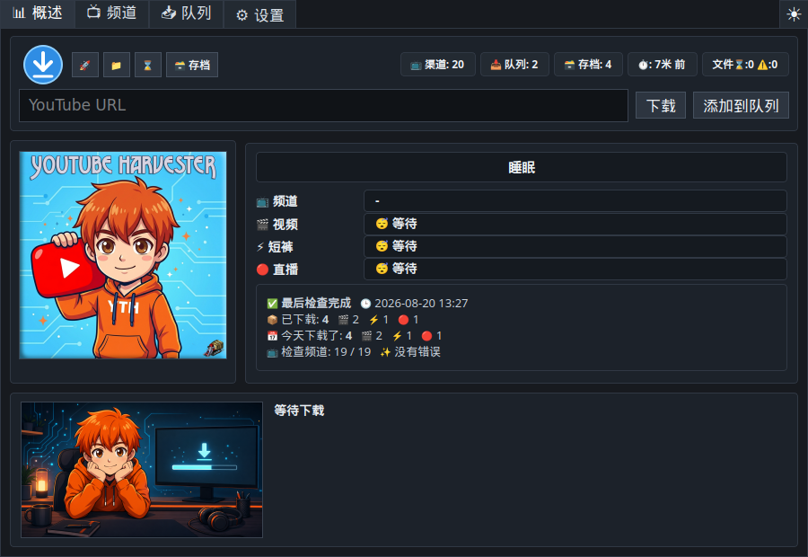
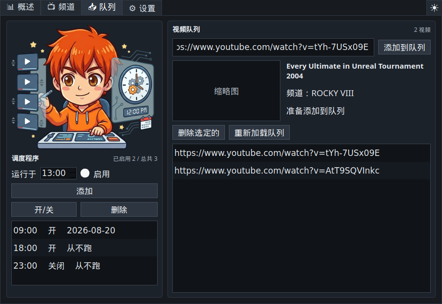
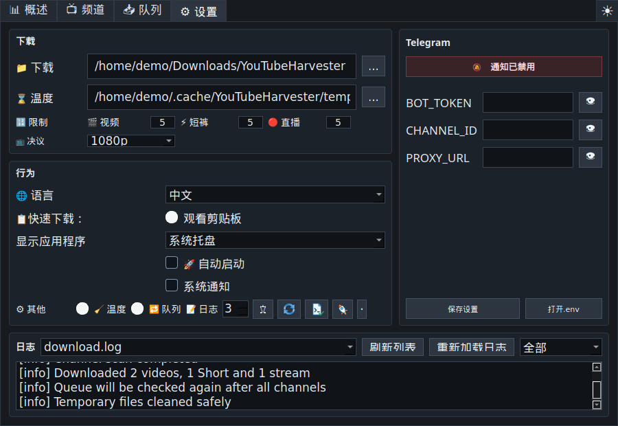

# YouTube Harvester 1.1.0

<p align="center">
  
</p>

<p align="center">
  <a href="README.md">🇺🇸 🇬🇧 English</a> ·
  <a href="README.ru.md">🇷🇺 Русский</a> ·
  <a href="README.uk.md">🇺🇦 Українська</a> ·
  <a href="README.fr.md">🇫🇷 Français</a> ·
  <a href="README.es.md">🇪🇸 Español</a> ·
  <a href="README.hi.md">🇮🇳 हिन्दी</a> ·
  <a href="README.zh.md">🇨🇳 中文</a> ·
  <a href="README.ar.md">🇸🇦 العربية</a>
</p>

<p align="center">
  面向 Linux 和 Windows 的多语言 YouTube 下载器，支持频道监控、手动队列、
  快速下载、定时任务、下载档案以及可选的 Telegram 发送功能。
</p>



## 软件简介

**YouTube Harvester** 会监控选定的 YouTube 频道，并通过 `yt-dlp` 下载新的
普通视频、Shorts 和直播。它也能处理单独的视频链接、维护本地下载档案、显示
下载报告，并向 Telegram 发送通知或文件。

版本 `1.1.0` 在 Linux 和 Windows 上统一使用 Python 下载引擎。旧 Bash 引擎
仅作为已禁用的历史代码保留在源码中。

## 主要功能

- 实时概览频道进度、媒体类型、下载阶段、速度、剩余时间、大小、最近事件以及
  本次和当日统计。
- 使用原始缓存频道图片的频道卡片，并可分别开关普通视频、Shorts 和直播。
- 可选付费内容检查，状态包括未知、发现 members-only、检查时未发现
  members-only。
- 概览页提供 URL 输入框，可立即下载或加入队列。
- 视频队列提供标题、频道与缩略图预览，检查重复和档案记录，支持失败重试，并在
  所有频道检查完成后再次处理。
- 快速下载窗口支持读取剪贴板 URL、预览元数据、选择分辨率、立即下载、加入队列
  以及持久化的 Telegram 复选框。
- 可配置全局快捷键，默认是 `Ctrl+Shift+Alt+Y`。
- 可选剪贴板监控，发现有效 YouTube URL 时自动打开快速下载。
- 按小时设置自动运行的计划任务。
- 详细下载档案包含类型、频道、标题、日期、YouTube 链接、本地文件、所在文件夹
  和删除记录功能。
- 日志支持“全部”“重要”和“错误”筛选。
- 内置 `yt-dlp` 版本检查，并可诊断系统、X11/Wayland、托盘、快捷键、工具、
  路径、缓存、写入权限和磁盘空间。
- 深色、浅色和跟随系统三种主题。
- 可选择仅系统托盘、仅任务栏或托盘与任务栏同时显示。
- 安全停止、受保护的临时目录清理、Windows 安全文件名，以及 Windows 日志和
  档案的 UTF-8 处理。
- 默认英语界面，同时支持俄语、乌克兰语、法语、西班牙语、印地语、中文和阿拉伯语。

## 截图

| 概览 | 频道 |
| --- | --- |
|  |  |

| 队列与计划任务 | 设置与日志 |
| --- | --- |
|  |  |

## 下载文件

安装包发布在
[GitHub Releases](https://github.com/LiberVixer/YouTubeHarvester/releases)。

Linux：`YouTubeHarvester_1.1.0_linux_all.deb`、
`YouTubeHarvester_1.1.0_source.tar.gz` 和 `SHA256SUMS-linux.txt`。

Windows：`YouTubeHarvester_1.1.0_windows_setup.exe`、
`YouTubeHarvester_1.1.0_windows_x64.msi`、
`YouTubeHarvester_1.1.0_windows_portable.zip` 和 `SHA256SUMS-windows.txt`。

Windows 版本已经包含 `yt-dlp`、`ffmpeg.exe`、`ffprobe.exe` 和 `deno.exe`。

## Linux 安装

```bash
sudo apt install ./YouTubeHarvester_1.1.0_linux_all.deb
yt-harvester
```

用户目录：

- 数据：`~/.local/share/yt-harvester`
- 设置：`~/.config/yt-harvester`
- 缓存：`~/.cache/yt-harvester`
- Telegram：`~/.config/yt-harvester/.env`
- 临时目录：`~/temp/YTH`
- 下载目录：`~/Downloads/YouTubeHarvester`

## Windows 安装

从发布页选择 Setup EXE、MSI 或便携 ZIP。这些版本均可独立运行，不需要另外安装
Python、FFmpeg 或 Deno。自动启动使用
`HKCU\Software\Microsoft\Windows\CurrentVersion\Run`。

## 从源码运行

Linux：

```bash
sudo apt install python3 python3-pyqt5 python3-pynput yt-dlp ffmpeg curl
sudo apt install wl-clipboard  # Wayland 推荐安装
cp .env.example .env
./start_tray.sh
```

Windows：

```powershell
py -3 -m venv .venv
.\.venv\Scripts\python -m pip install -r requirements.txt
.\start_tray_windows.bat
```

网络不稳定时请参考 [Windows 离线构建指南](docs/windows-offline-build.md)。

## 启动参数

```bash
yt-harvester
yt-harvester --quick-download
yt-harvester --start-tray
yt-harvester --start-window
yt-harvester --start-both
```

`--quick-download` 打开快速下载，并将请求交给已经运行的实例。其他参数用于选择
托盘、任务栏或两者同时显示。内部参数为 `--run-yt-dlp ...` 和
`--run-script <script.py> ...`。

## 快速下载、X11 与 Wayland

Windows 使用原生全局快捷键，Linux/X11 使用 `pynput`。Wayland 通常不允许应用
直接注册全局按键，因此程序可以创建运行 `yt-harvester --quick-download` 的
Cinnamon/GNOME 系统快捷键。安装 `wl-clipboard` 后，Wayland 剪贴板通过
`wl-paste` 读取。

## 频道与队列流程

启用的频道分区会按顺序检查，每个结果完成后短暂停留。只有在启用选项并主动检查
频道时才会搜索 members-only。普通扫描中如果遇到会员视频，频道状态仍会更新，
并以重要事件显示，而不会出现红色错误。

队列在运行开始时处理，并在全部频道完成后再次处理。重复链接和已归档视频会跳过；
失败项目可以返回队列重试。

## Telegram

Telegram 可以完全关闭。需要使用时请在界面或 `.env` 中配置：

```bash
BOT_TOKEN=your-telegram-bot-token
CHANNEL_ID=your-telegram-channel-id
PROXY_URL=127.0.0.1:9050
```

代理是可选项。Telegram 发送失败不会删除已经保存在本地的视频。

## 构建发布版本

```bash
packaging/build_release.sh 1.1.0 1.1.0
```

```powershell
powershell -ExecutionPolicy Bypass -File .\packaging\windows\build_release.ps1 `
  -Version 1.1.0 -MsiVersion 1.1.0
```

## 负责任地使用

YouTube Harvester 与 YouTube、Google、Telegram 或 `yt-dlp` 没有隶属关系。
请仅下载您拥有、已获得许可或可合法保存供个人使用的内容。请遵守
[YouTube 服务条款](https://www.youtube.com/t/terms)、版权法和当地法律，并
妥善保管 Telegram 凭据。

外部组件包括 [`yt-dlp`](https://github.com/yt-dlp/yt-dlp)、PyQt5/Qt、
FFmpeg/FFprobe、Deno、`curl`、Telegram Bot API 和 `pynput`，各自采用独立
许可证。

## 致谢

特别感谢 Dmitry **'Minion' Pororiliy** 对 Windows 版本测试提供的宝贵帮助。

程序标志中加入了 **Command & Conquer: Red Alert** 的 Harvester。🙂

完整历史请查看[中文更新日志](CHANGELOG.zh.md)。
