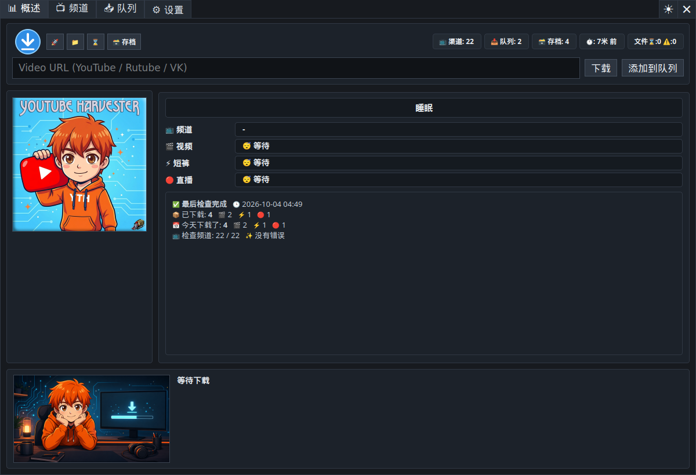
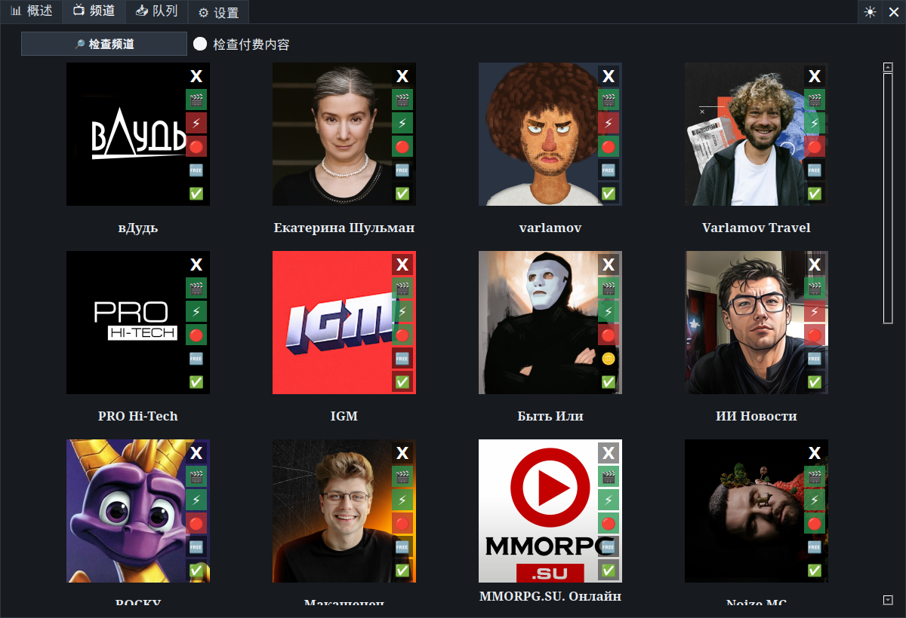
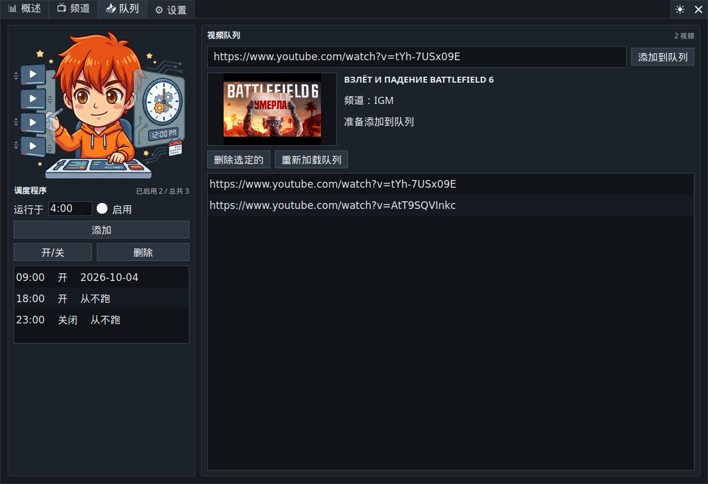
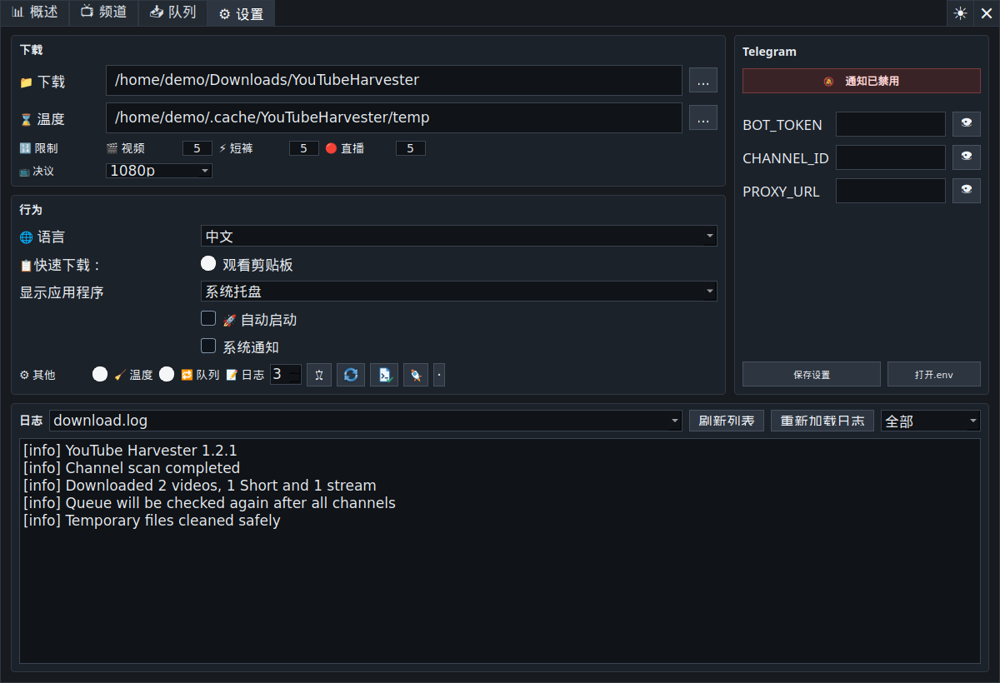
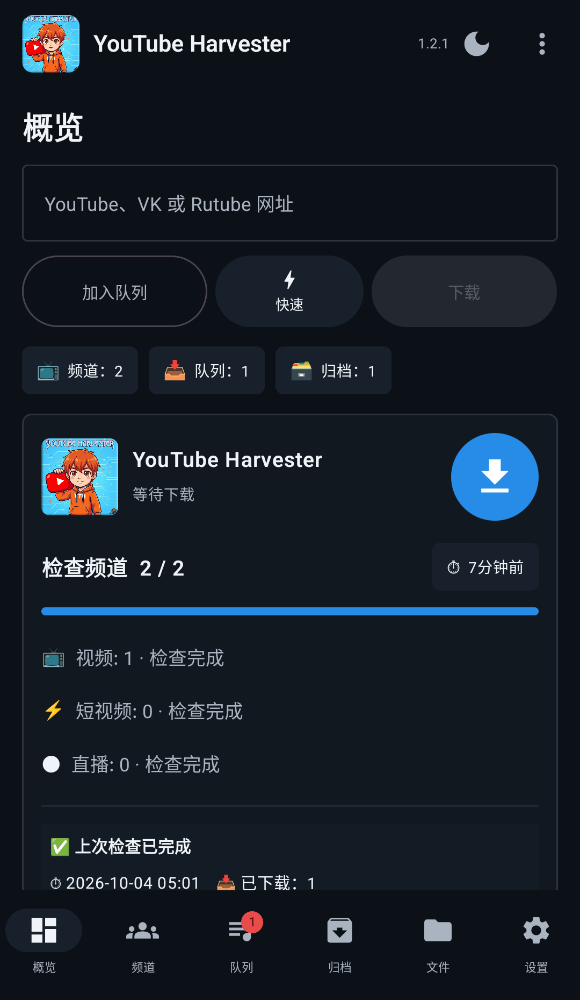
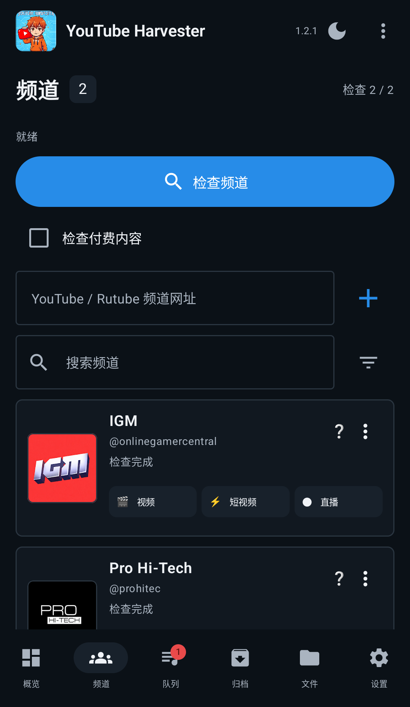
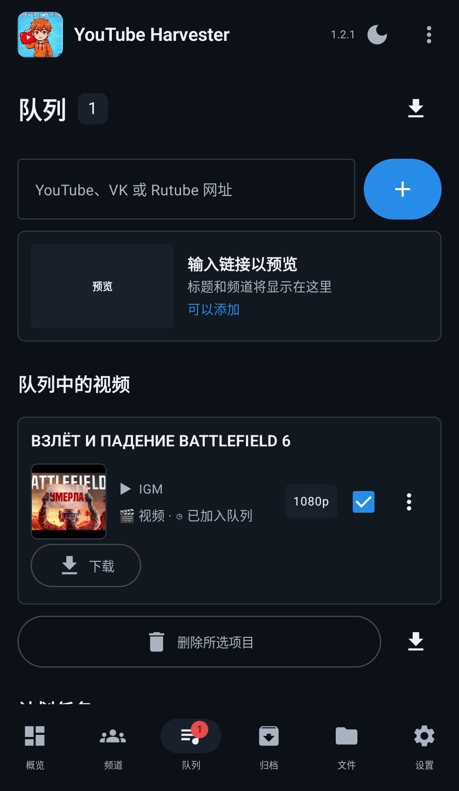
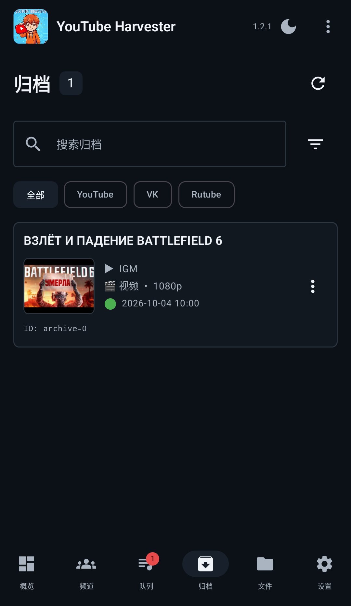
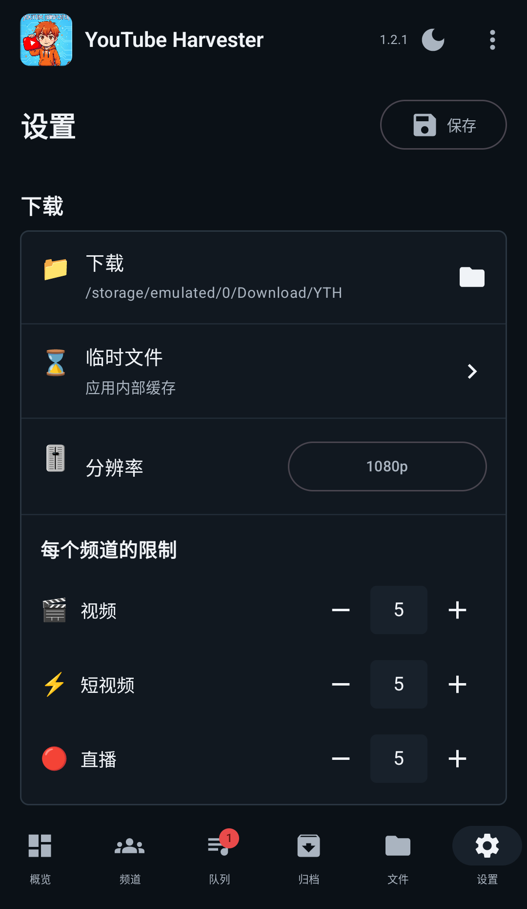

# YouTube Harvester 1.2.1

<p align="center">
  
</p>

<p align="center">
  <a href="README.md">🇺🇸 🇬🇧 English</a> ·
  <a href="README.ru.md">🇷🇺 Русский</a> ·
  <a href="README.uk.md">🇺🇦 Українська</a> ·
  <a href="README.be.md">🇧🇾 Беларуская</a> ·
  <a href="README.fr.md">🇫🇷 Français</a> ·
  <a href="README.es.md">🇪🇸 Español</a> ·
  <a href="README.hi.md">🇮🇳 हिन्दी</a> ·
  <a href="README.zh.md">🇨🇳 中文</a> ·
  <a href="README.ja.md">🇯🇵 日本語</a> ·
  <a href="README.ar.md">🇸🇦 العربية</a>
</p>

适用于 **Linux、Windows 和 Android** 的多语言下载工具：监控 YouTube/Rutube 频道，下载单个 YouTube/Rutube/VK 视频，管理队列、归档、计划任务，并可选发送文件或通知到 Telegram。

## 1.2.1 版本

文档更新：**2026-10-04**。

当前源码与本地软件包均为 **1.2.1**，不含 beta/prerelease 标记。Android 使用 `versionCode 120100`；内部调试构建保留 `-debug`。Windows 已从与 Linux 相同的最新桌面源码重新构建，包含 Rutube 和中断后恢复修复。

**这是发布准备，不是已发布公告。** 桌面安装包和四种测试 APK 已在本地生成。Android 公开发布验收尚未完成，测试 APK 仍使用开发证书。去掉 beta 不代表它们已成为公开发行版。

Linux 与 Windows 共用 Python/yt-dlp 下载引擎；旧 Bash 仅作为已禁用历史代码保留。

[版本验证记录](docs/version-1.2.1-20261003.md) · [1.2.1 发布准备](docs/releases/1.2.1.md).

## 桌面功能

- 实时概览频道进度、媒体类型、下载阶段、速度、剩余时间、大小、最近事件以及
  本次和当日统计。
- 使用原始缓存频道图片的频道卡片，并可分别开关普通视频、Shorts 和直播。
- 可选付费内容检查，状态包括未知、发现 members-only、检查时未发现
  members-only。
- 概览页提供 URL 输入框，可立即下载或加入队列。
- 视频队列提供标题、频道与缩略图预览，检查重复和档案记录，支持失败重试，并在
  所有频道检查完成后再次处理。
- 快速下载窗口支持读取剪贴板 URL、预览元数据、选择分辨率、多条音轨和字幕轨、
  立即下载、加入队列以及持久化的 Telegram 复选框。
- 可配置全局快捷键，默认是 `Ctrl+Shift+Alt+Y`。
- 可选剪贴板监控，发现支持的 YouTube、Rutube 或 VK URL 时自动打开快速下载。
- 按小时设置自动运行的计划任务。
- 详细下载档案包含类型、频道、标题、日期、来源链接、画质与轨道版本、本地
  文件、所在文件夹和删除记录功能。
- 日志支持“全部”“重要”和“错误”筛选。
- 安装版、便携版和 Linux 软件包均可从 GitHub 官方 Release 获取并校验应用更新。
- 可在界面中安全检查并更新 `yt-dlp`，并可诊断系统、X11/Wayland、托盘、快捷键、工具、
  路径、缓存、写入权限和磁盘空间。
- 深色、浅色和跟随系统三种主题。
- 可选择仅系统托盘、仅任务栏或托盘与任务栏同时显示。
- 安全停止、受保护的临时目录清理、Windows 安全文件名，以及 Windows 日志和
  档案的 UTF-8 处理。
- 默认英语界面，同时支持俄语、乌克兰语、白俄罗斯语、法语、西班牙语、印地语、
  中文、日语和阿拉伯语。

## 来源与处理流程

- **YouTube 频道：** 视频、Shorts、直播分别启用和限量；支持 handle、channel、user、自定义频道地址。
- **Rutube 频道：** `/channel/ID/`、`/u/name/`，包括视频/Shorts 分页。别名解析为 ID 防止重复；缓存名称和图片。
- **Rutube 节目：** `/metainfo/tv/ID/`，独立标题/海报，仅视频；按新到旧选择最近 N 项。
- **单个视频：** YouTube、Rutube、VK/VK Video，通过手动输入、队列或快速下载。不支持监控 VK 频道或任意 Rutube 播放列表。

Rutube 直播扫描和付费检测已禁用。YouTube 付费检测只报告可访问状态，不绕过权限，也不保证能下载受限视频。频道菜单可将最近项目标记为已处理而不下载。

完整流程先处理手动队列，再逐个扫描已启用频道分区并下载，最后再次处理队列。跳过已归档及重复项目。频道页的检查用于验证分区；完整下载流程由概览或计划任务启动。归档保留不同画质及音轨组合。

停止桌面下载不再阻止下次启动。保留安全临时文件清理和重试；下载中不要手动删除临时文件。来源、VPN、代理出错时先检查连接和日志。地区、账号及来源协议限制仍适用。

## Android

原生 Kotlin/Jetpack Compose 应用，要求 **Android 8.0+（API 26）**；ABI：`arm64-v8a`、`armeabi-v7a`、`x86_64`、`x86`。

- 概览、频道、队列、归档、设置及下载文件夹入口；十种语言，深色/浅色/系统主题，阿拉伯语 RTL。
- 相同来源类别，包括 Rutube 频道与节目；分区限量、最近项目标记、计划任务、元数据与图片。
- 直接下载输入 URL；概览快速按钮仅在明确点击时读取剪贴板链接。分享打开媒体选项，快捷方式打开概览；可选剪贴板监控仅在应用前台运行。
- 分辨率、多音轨/字幕、持久任务、暂停/继续/取消/重试、进度通知及前台服务。继续保留同一任务及部分文件；能否按字节续传取决于来源。
- WorkManager 流程恢复、检查报告/每日统计、重启恢复、MediaStore/SAF、归档文件、日志/诊断。Android 强制停止后需重新打开；厂商省电限制可能影响后台任务。
- Telegram 凭据通过 Android Keystore 保护。密码加密 `.ythbackup` 转移记录/设置，**不包括视频与临时文件**。导入要求目标数据库为空；移动的文件需验证后重新关联文件夹。
- APK 更新在系统安装器前验证 SHA-256、包名、更高 versionCode 和已安装证书。内置 `yt-dlp` **随应用更新**，不单独下载替换引擎。

**Android 上的 VK：** 支持单个 VK/VK Video 下载；2026-09-14 已在 LDPlayer 验证真实公开 VK 视频下载。不支持 VK 频道监控。私有或受限视频可能无法获取。

[Android 开发文档](android/README.md) · [数据迁移说明](android/DATA-TRANSFER.ru.md).

## Android 发布状态

公开分发前需完成：永久签名及独立密钥备份、完整对应原生 runtime 源码/许可证/安全审查、准确签名候选包的迁移验收，以及 ARM、旧版受支持 Android、Android 15+ boot/resume、16 KB 页设备和 TalkBack 测试。随后验证最终 APK 与发布包。

**不要为更换证书卸载测试应用。** 加密迁移已在隔离 QA 包测试，不能代替最终公开候选包验收。

[发布准备状态](android/RELEASE-READINESS.ru.md).

## 截图

| 概览 | 频道 |
| --- | --- |
|  |  |

| 队列与计划任务 | 设置与日志 |
| --- | --- |
|  |  |

### Android

Android 1.2.1，深色主题。演示数据。

| 概览 | 频道 |
| --- | --- |
|  |  |

| 队列 | 归档 |
| --- | --- |
|  |  |

**设置**



[截图目录与来源](docs/screenshots/README.md).

## 下载文件

本地准备的桌面文件位于 `dist/release/`。公开发布后可从 [GitHub Releases](https://github.com/LiberVixer/YouTubeHarvester/releases) 下载；本 README 不声称 1.2.1 已公开发布。

| 平台 | 文件 |
| --- | --- |
| Linux | `YouTubeHarvester_1.2.1_linux_all.deb`, `YouTubeHarvester_1.2.1_source.tar.gz`, `SHA256SUMS-linux.txt` |
| Windows x64 | `YouTubeHarvester_1.2.1_windows_setup.exe`, `YouTubeHarvester_1.2.1_windows_x64.msi`, `YouTubeHarvester_1.2.1_windows_portable.zip`, `SHA256SUMS-windows.txt` |

私有测试 APK：`android/YouTubeHarvester-1.2.1-<ABI>.apk`，**并非公开发行文件**。Android 公开打包还需应用/runtime 源码、BUILD-INFO 和 SHA256SUMS。

## Linux 安装

```bash
sudo apt install ./YouTubeHarvester_1.2.1_linux_all.deb
yt-harvester
```

用户目录：

- 数据：`~/.local/share/yt-harvester`
- 设置：`~/.config/yt-harvester`
- 缓存：`~/.cache/yt-harvester`
- Telegram：`~/.config/yt-harvester/.env`
- 临时目录：`~/temp/YTH`
- 下载目录：`~/Downloads/YouTubeHarvester`

`.deb` 使用发行版 Python/Qt/yt-dlp/FFmpeg/curl，不暗中升级。版本可能不同于开发/Windows 锁定环境。Deno 为建议依赖，未内置；完整 YouTube 支持需兼容 JavaScript runtime。

## Windows 安装

使用 x64 Setup EXE/MSI，或解压便携 ZIP 后启动 `YouTubeHarvester.exe`。已包含 Python、yt-dlp、FFmpeg/FFprobe、Deno。数据/缓存：`%LOCALAPPDATA%\YouTubeHarvester`；设置：`%APPDATA%\YouTubeHarvester`；临时文件：`%TEMP%\YTH`。自动启动使用当前用户键 `HKCU\Software\Microsoft\Windows\CurrentVersion\Run`。

## Android 安装与更新

授权测试者请选择匹配 ABI、相同证书的 APK 更新，不卸载或清除数据。只允许可信来源安装，按需授予通知权限并选择目录。默认 `Download/YTH`，或 SAF 目录。不同签名的公开 APK 无法覆盖当前测试安装。

## 从源码运行

Linux 优先使用已有 `.venv`；`YTD_PYTHON` 可选择其他解释器。锁定环境已在 Python 3.12 验证。FFmpeg/FFprobe 和 JavaScript runtime 为外部工具；下列脚本验证哈希后获取 Deno/FFmpeg。

仅在工具缺失时获取：脚本拒绝覆盖已有目录。保留现有 `.env`，在应用或自己的文件中填写 Telegram 设置，不要公开该文件。

Linux:

```bash
sudo apt install python3 python3-venv python3-pyqt5 python3-pynput python3-dbus ffmpeg curl
python3 -m venv .venv
.venv/bin/python -m pip install -r requirements-linux-lock.txt
.venv/bin/python scripts/fetch_desktop_tools.py --platform linux --output tools/linux
cp -n .env.example .env
./start_tray.sh
```

Windows 源码运行也需 FFmpeg/FFprobe 与 Deno；构建器使用固定本地工具或下载验证。

Windows:

```powershell
py -3.12 -m venv .venv
.\.venv\Scripts\python -m pip install -r requirements-windows-lock.txt
.\.venv\Scripts\python scripts/fetch_desktop_tools.py --platform windows --output tools/windows
.\start_tray_windows.bat
```

[从源码运行 Windows (offline)](docs/windows-offline-build.md).

## 启动参数

```bash
yt-harvester
yt-harvester --quick-download
yt-harvester --show-main
yt-harvester --start-tray
yt-harvester --start-window
yt-harvester --start-both
```

`--quick-download` 打开快速下载，并将请求交给已经运行的实例。`--show-main`
显示该实例的主窗口。其他参数用于选择托盘、任务栏或两者同时显示。内部参数为 `--run-yt-dlp ...` 和
`--run-script <script.py> ...`。

## 快速下载、X11 与 Wayland

Windows 使用原生全局快捷键，Linux/X11 使用 `pynput`。Wayland 通常不允许应用
直接注册全局按键，因此程序可以创建运行 `yt-harvester --quick-download` 的
Cinnamon/GNOME 系统快捷键。安装 `wl-clipboard` 后，Wayland 剪贴板通过
`wl-paste` 读取。

## Telegram

Telegram 可以完全关闭。需要使用时请在界面或 `.env` 中配置：

```bash
BOT_TOKEN=your-telegram-bot-token
CHANNEL_ID=your-telegram-channel-id
PROXY_URL=127.0.0.1:9050
```

代理是可选项。Telegram 发送失败不会删除已经保存在本地的视频。

## 固定组件版本

这是项目已审查的版本，不保证所有安装副本相同，也不声称是上游最新版本。桌面依赖：`requirements-linux-lock.txt`、`requirements-windows-lock.txt`。Android 版本/哈希：`android/runtime.properties`、`android/gradle/verification-metadata.xml`。

| 组件 | 桌面开发 / Windows | Android |
| --- | --- | --- |
| yt-dlp | 2026.08.19 | 2026.08.19 |
| FFmpeg / FFprobe | 9.0.2 | 7.1.1 |
| Deno / QuickJS | Deno 2.9.7 | QuickJS 2026-06-04 |
| PyQt5 / Compose BOM | PyQt5 5.15.11 | Compose 2026.09.00 |
| Qt runtime | Linux 5.15.19 / Windows 5.15.2 | - |
| Room / WorkManager | - | 2.8.5 / 2.12.0 |
| Coil | - | 3.6.3 |
| PyInstaller / AGP / Gradle | PyInstaller 6.22.3 | AGP 9.4.1 / Gradle 9.8.0 |
| Kotlin Compose compiler / KSP | - | 2.4.20 / 2.3.12 |

Android 保留上游 Python 3.12.11、OpenSSL 3.5.2、FFmpeg 7.1.1；兼容重建及对应源码审查仍待完成。QuickJS 2026-06-04、WebP/SharpYUV 1.6.0 已为四个 ABI 重建并采用 16 KB 对齐。静态检查不能代替 16 KB 设备测试。

[组件更新记录](docs/component-update-20261003.md) · [原生组件重建说明](android/native/README.md).

## 构建发布版本

桌面标签 `v*`；Android 标签 `android-v<versionName>`，使用独立 workflow。公开 Android 签名要求已批准永久证书及审查过的对应 runtime 源码。不要公开密钥、密码、token、未签名或私有测试 APK。

Linux:

```bash
packaging/build_release.sh 1.2.1 1.2.1
```

Windows:

```powershell
powershell -ExecutionPolicy Bypass -File .\packaging\windows\build_release.ps1 `
  -Version 1.2.1 -MsiVersion 1.2.1
```

Android (JDK 17, Android SDK, Gradle Wrapper):

```bash
cd android
./gradlew testDebugUnitTest assembleDebug
python3 -m unittest discover -s scripts -p 'test_*.py' -v
```

[Android 发布与签名规则](android/RELEASING.md)

## 验证与限制

最近本地检查：**89 项桌面 Python**、**39 项 Android Python**、**149 项 Android JVM** 测试，以及 50 张 Android 截图成功捕获。版本统一时还通过 **80 项 Windows 测试**（跳过两项 POSIX）及 **36 项精选 LDPlayer 测试**，Android 14/API 34 x86_64。

桌面工具及真实本地 H.264/AAC 下载/remux 已验证。四种 APK 通过清单/证书/ZIP 及适用 64 位原生对齐检查。这不证明 ARM、所有设备后台行为或新 Windows 安装器的安装/卸载。文档更新不等于重新构建或发布已安装副本。

[Android 测试计划](android/TEST-PLAN.ru.md).

## 许可证与合理使用

所有者已批准 **Android 模块 GPL-3.0-only**：[LICENSE](android/LICENSE)、[NOTICE](android/NOTICE)、[许可记录](android/legal/README.md)。桌面及第三方许可证不变。公开 Android 发行仍必须提供完整对应 runtime 源码。

本项目与 YouTube、Google、Rutube、VK、Telegram、yt-dlp 无隶属关系。仅下载有权获取的内容，遵守来源服务条款和适用法律。保护凭据及备份密码。

## 致谢

特别感谢 Dmitry **'Minion' Pororiliy** 对 Windows 版本测试提供的宝贵帮助。

程序标志中加入了 **Command & Conquer: Red Alert** 的 Harvester。🙂

完整历史请查看[中文更新日志](CHANGELOG.zh.md)。
